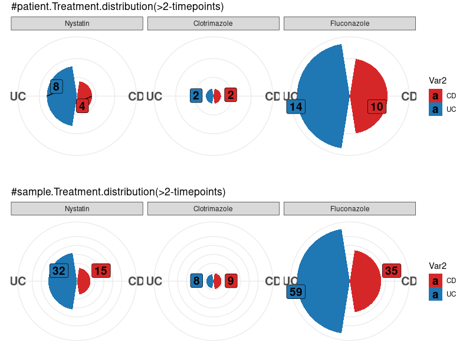
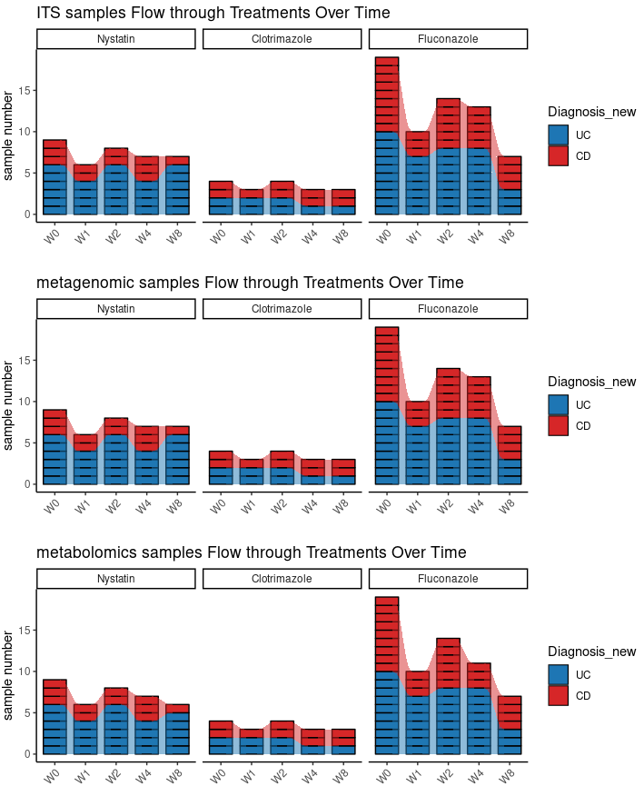
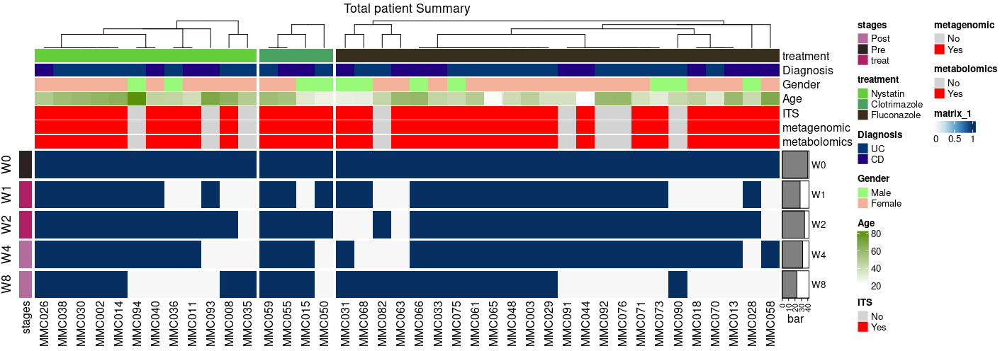

# 1.1.Microbiome and Metabolome Data Integration and Processing

## 1.1.1 **Fungal Abundance (ITS) Processing**

Fungal abundance was assessed using ITS sequencing data from multiple sources. The datasets were merged by aligning taxonomic features and ensuring consistency in sample IDs. Low-abundance features were filtered out, and taxa were harmonized across versions by filling missing values with zeros. Sample metadata were standardized to maintain consistency across different patient cohorts. The final processed ITS dataset integrates fungal community composition across multiple time points, facilitating downstream comparative analyses.

~~~R
ReadCap.20241115_final2 <- mcreadRDS("/mnt/d/xiangyu.ubuntu/workshop/MMC/Aidan_info/v2/ReadCap.210241118.rds")
rownames(ReadCap.20241115_final2) <- ReadCap.20241115_final2$Omics_samples_Names

MMC.v1.ITS.counts <- readr::read_tsv("/mnt/d/xiangyu.ubuntu/workshop/MMC/ITS/its-table.tsv")
MMC.v1.ITS.counts <- as.data.frame(MMC.v1.ITS.counts)
rownames(MMC.v1.ITS.counts) <- MMC.v1.ITS.counts[,1]
MMC.v1.ITS.counts <- MMC.v1.ITS.counts[,-1]
MMC.v2.ITS.counts <- read.csv("/mnt/d/xiangyu.ubuntu/projects/IL23.projects.ITS_16S/Iliev-OM-16746_2024_07_01/aTNF_ASV_Table.csv")
rownames(MMC.v2.ITS.counts) <- MMC.v2.ITS.counts$X
MMC.v2.ITS.counts1 <- MMC.v2.ITS.counts[,c(grep("MMC",colnames(MMC.v2.ITS.counts),value=TRUE))]
MMC.v2.ITS.counts1 <- MMC.v2.ITS.counts1[rowSums(MMC.v2.ITS.counts1)>0,]
v1.spe <- setdiff(rownames(MMC.v1.ITS.counts),rownames(MMC.v2.ITS.counts1))
MMC.v2.ITS.counts1.tmp <- MMC.v2.ITS.counts1[v1.spe,]
rownames(MMC.v2.ITS.counts1.tmp) <- v1.spe
MMC.v2.ITS.counts1.tmp[is.na(MMC.v2.ITS.counts1.tmp)] <- 0
v2.spe <- setdiff(rownames(MMC.v2.ITS.counts1),rownames(MMC.v1.ITS.counts))
MMC.v1.ITS.counts.tmp <- MMC.v1.ITS.counts[v2.spe,]
rownames(MMC.v1.ITS.counts.tmp) <- v2.spe
MMC.v1.ITS.counts.tmp[is.na(MMC.v1.ITS.counts.tmp)] <- 0
MMC.v1.ITS.counts2 <- rbind(MMC.v1.ITS.counts,MMC.v1.ITS.counts.tmp)
MMC.v2.ITS.counts2 <- rbind(MMC.v2.ITS.counts1,MMC.v2.ITS.counts1.tmp)
both <- intersect(rownames(MMC.v1.ITS.counts2),rownames(MMC.v2.ITS.counts2))
MMC.ITS.counts <- as.data.frame(cbind(MMC.v1.ITS.counts2[both,],MMC.v2.ITS.counts2[both,]))
colnames(MMC.ITS.counts) <- gsub("MMC017","MMC002",colnames(MMC.ITS.counts))
colnames(MMC.ITS.counts) <- gsub("MMC025","MMC018",colnames(MMC.ITS.counts))
colnames(MMC.ITS.counts) <- gsub("MMC037","MMC036",colnames(MMC.ITS.counts))
colnames(MMC.ITS.counts) <- gsub("MMC045","MMC044",colnames(MMC.ITS.counts))
colnames(MMC.ITS.counts) <- gsub("MMC049","MMC059",colnames(MMC.ITS.counts))
colnames(MMC.ITS.counts) <- gsub("MMC042","MMC015",colnames(MMC.ITS.counts))
ITS.samples <- strsplit(colnames(MMC.ITS.counts),split="W")
ITS.samples_info_ <- lapply(1:length(ITS.samples),function(x) {
    tmp <- data.frame(ITS_names=colnames(MMC.ITS.counts)[x],patient=ITS.samples[[x]][1],time=paste0("W",ITS.samples[[x]][2]))
    return(tmp)
    })
ITS.samples_info <- do.call(rbind,ITS.samples_info_)
ITS.samples_info$time <- gsub("F","",ITS.samples_info$time)
ITS.samples_info$sample <- gsub("F","",ITS.samples_info$ITS_names)
rownames(ITS.samples_info) <- ITS.samples_info$ITS_names
setdiff(ITS.samples_info$patient,ReadCap.20241115_final2$Omics_patient_Names)
setdiff(ITS.samples_info$sample,ReadCap.20241115_final2$Omics_samples_Names)

patient_info <- ReadCap.20241115_final2[!duplicated(ReadCap.20241115_final2$Omics_patient_Names),]
rownames(patient_info) <- patient_info$Omics_patient_Names
ITS.samples_info1 <- as.data.frame(cbind(ITS.samples_info,patient_info[as.character(ITS.samples_info$patient),c("treatment","Diagnosis_new")]))
patientInfo <- mcreadRDS("/mnt/d/xiangyu.ubuntu/workshop/MMC/Aidan_info/v2/patientInfo.210241118.rds")
rownames(patientInfo) <- patientInfo$Omics_patient_Names
ITS.samples_info1 <- as.data.frame(cbind(ITS.samples_info1,patientInfo[as.character(ITS.samples_info1$patient),c("group","group.v2","max.DAI.dates","status")]))
ITS.samples_info1 <- as.data.frame(cbind(ITS.samples_info1,ReadCap.20241115_final2[as.character(ITS.samples_info$sample),
    c("DAI","UC.score.v2","CD.score.raw","stooling.frequency.scores","stooling.frequency","blood.stools.scores",
    "Mucosal.Appearance","Physician.rating","liquid.stooling.scores","abdominal.pain","general.wellbeing","Abdominal.mass")]))
rownames(ITS.samples_info1) <- rownames(ITS.samples_info)
ITS.samples_info1 <- ITS.samples_info1[!is.na(ITS.samples_info1$treatment),]
mcsaveRDS(ITS.samples_info1,"/mnt/d/xiangyu.ubuntu/workshop/MMC/sample_info/final_Res/ITS.samples_info1.v2.rds")

MMC.ITS.counts1 <- MMC.ITS.counts[,rownames(ITS.samples_info1)]
mcsaveRDS(MMC.ITS.counts1,"/mnt/d/xiangyu.ubuntu/workshop/MMC/sample_info/final_Res/MMC.ITS.counts.v3.rds")

MMC.ITS.taxa.v1 <- readr::read_tsv("/mnt/d/xiangyu.ubuntu/workshop/MMC/ITS/its_taxa.tsv")
MMC.ITS.taxa.v1 <- as.data.frame(MMC.ITS.taxa.v1)
rownames(MMC.ITS.taxa.v1) <- MMC.ITS.taxa.v1[,1]
MMC.ITS.taxa.v1 <- MMC.ITS.taxa.v1[,-1]
MMC.ITS.taxa.v1$Kingdom <- gsub("k__","",MMC.ITS.taxa.v1$Kingdom)
MMC.ITS.taxa.v1$Phylum <- gsub("p__","",MMC.ITS.taxa.v1$Phylum)
MMC.ITS.taxa.v1$Class <- gsub("c__","",MMC.ITS.taxa.v1$Class)
MMC.ITS.taxa.v1$Order <- gsub("o__","",MMC.ITS.taxa.v1$Order)
MMC.ITS.taxa.v1$Family <- gsub("f__","",MMC.ITS.taxa.v1$Family)
MMC.ITS.taxa.v1$Genus <- gsub("g__","",MMC.ITS.taxa.v1$Genus)
MMC.ITS.taxa.v1$Species <- gsub("s__","",MMC.ITS.taxa.v1$Species)
MMC.ITS.taxa.v2 <- MMC.v2.ITS.counts[,c("Kingdom","Phylum","Class","Order","Family","Genus","Species")]
MMC.ITS.taxa.v2$Kingdom <- gsub("k__","",MMC.ITS.taxa.v2$Kingdom)
MMC.ITS.taxa.v2$Phylum <- gsub("p__","",MMC.ITS.taxa.v2$Phylum)
MMC.ITS.taxa.v2$Class <- gsub("c__","",MMC.ITS.taxa.v2$Class)
MMC.ITS.taxa.v2$Order <- gsub("o__","",MMC.ITS.taxa.v2$Order)
MMC.ITS.taxa.v2$Family <- gsub("f__","",MMC.ITS.taxa.v2$Family)
MMC.ITS.taxa.v2$Genus <- gsub("g__","",MMC.ITS.taxa.v2$Genus)
MMC.ITS.taxa.v2$Species <- gsub("s__","",MMC.ITS.taxa.v2$Species)
MMC.ITS.taxa.v2$Species <- paste0(MMC.ITS.taxa.v2$Genus," ",MMC.ITS.taxa.v2$Species)
MMC.ITS.taxa.v2$Species <- gsub("NA NA","NA",MMC.ITS.taxa.v2$Species)
colnames(MMC.ITS.taxa.v1)
colnames(MMC.ITS.taxa.v2)
v1.spe <- setdiff(rownames(MMC.ITS.taxa.v1),rownames(MMC.ITS.taxa.v2))
MMC.ITS.taxa.v2.tmp <- MMC.ITS.taxa.v2[v1.spe,]
rownames(MMC.ITS.taxa.v2.tmp) <- v1.spe
v2.spe <- setdiff(rownames(MMC.ITS.taxa.v2),rownames(MMC.ITS.taxa.v1))
MMC.ITS.taxa.v1.tmp <- MMC.ITS.taxa.v1[v2.spe,]
rownames(MMC.ITS.taxa.v1.tmp) <- v2.spe
MMC.ITS.taxa.v1_1 <- rbind(MMC.ITS.taxa.v1,MMC.ITS.taxa.v1.tmp)
MMC.ITS.taxa.v2_1 <- rbind(MMC.ITS.taxa.v2,MMC.ITS.taxa.v2.tmp)
length(setdiff(rownames(MMC.ITS.taxa.v2_1),rownames(MMC.ITS.taxa.v1_1)))
length(setdiff(rownames(MMC.ITS.taxa.v1_1),rownames(MMC.ITS.taxa.v2_1)))
both <- intersect(rownames(MMC.ITS.taxa.v1_1),rownames(MMC.ITS.taxa.v2_1))
MMC.ITS.taxa <- as.data.frame(rbind(MMC.ITS.taxa.v1_1[both,],MMC.ITS.taxa.v2_1[both,]))
length(setdiff(rownames(MMC.ITS.counts1),rownames(MMC.ITS.taxa)))
length(setdiff(rownames(MMC.ITS.taxa),rownames(MMC.ITS.counts1)))
MMC.ITS.taxa1 <- MMC.ITS.taxa[rownames(MMC.ITS.counts1),]
mcsaveRDS(MMC.ITS.taxa1,"/mnt/d/xiangyu.ubuntu/workshop/MMC/sample_info/final_Res/MMC.ITS.taxa1.v2.rds")
~~~

## 1.1.2. **Bacterial Abundance (Metagenomics) Processing**

Bacterial abundance data were obtained from metagenomic sequencing, specifically taxonomic profiling files. Taxonomic classifications were standardized by removing redundant annotations and ensuring uniformity across different taxonomic levels (kingdom to species). Sample names were corrected for consistency, and patient metadata, including clinical parameters, were linked to the metagenomic profiles. The processed bacterial abundance dataset provides a comprehensive overview of the gut microbiome composition and its variations across conditions.

~~~R
metagenomic_data <- read.csv("/mnt/d/xiangyu.ubuntu/workshop/MMC/metagenomics/metagenomics/combined_results/joined_taxonomic_profile.tsv",sep="\t",header=FALSE)
colnames(metagenomic_data) <- as.character(metagenomic_data[2,])
metagenomic_data1 <- metagenomic_data[-c(1,2),]
colnames(metagenomic_data1) <- gsub("_Metagenomic_09062022","",colnames(metagenomic_data1))
colnames(metagenomic_data1) <- gsub("MMC017","MMC002",colnames(metagenomic_data1))
colnames(metagenomic_data1) <- gsub("MMC025","MMC018",colnames(metagenomic_data1))
colnames(metagenomic_data1) <- gsub("MMC037","MMC036",colnames(metagenomic_data1))
colnames(metagenomic_data1) <- gsub("MMC045","MMC044",colnames(metagenomic_data1))
colnames(metagenomic_data1) <- gsub("MMC049","MMC059",colnames(metagenomic_data1))
colnames(metagenomic_data1) <- gsub("MMC042","MMC015",colnames(metagenomic_data1))
rownames(metagenomic_data1) <- metagenomic_data1[,1]
metagenomic_data1 <- metagenomic_data1[,-1]
metagenomic.samples <- strsplit(colnames(metagenomic_data1),split="W")
metagenomic.samples_info_ <- lapply(1:length(metagenomic.samples),function(x) {
    tmp <- data.frame(metagenomic_names=colnames(metagenomic_data1)[x],patient=metagenomic.samples[[x]][1],time=paste0("W",metagenomic.samples[[x]][2]))
    return(tmp)
    })
metagenomic.samples_info <- do.call(rbind,metagenomic.samples_info_)
metagenomic.samples_info$sample <- gsub("F","",metagenomic.samples_info$metagenomic_names)
rownames(metagenomic.samples_info) <- metagenomic.samples_info$metagenomic_names
setdiff(metagenomic.samples_info$patient,ReadCap.20241115_final2$Omics_patient_Names)
setdiff(metagenomic.samples_info$sample,ReadCap.20241115_final2$Omics_samples_Names)

patient_info <- ReadCap.20241115_final2[!duplicated(ReadCap.20241115_final2$Omics_patient_Names),]
rownames(patient_info) <- patient_info$Omics_patient_Names
metagenomic.samples_info1 <- as.data.frame(cbind(metagenomic.samples_info,patient_info[as.character(metagenomic.samples_info$patient),c("treatment","Diagnosis_new")]))
patientInfo <- mcreadRDS("/mnt/d/xiangyu.ubuntu/workshop/MMC/Aidan_info/v2/patientInfo.210241118.rds")
rownames(patientInfo) <- patientInfo$Omics_patient_Names
metagenomic.samples_info1 <- as.data.frame(cbind(metagenomic.samples_info1,patientInfo[as.character(metagenomic.samples_info1$patient),c("group","group.v2","max.DAI.dates","status")]))
metagenomic.samples_info1 <- as.data.frame(cbind(metagenomic.samples_info1,ReadCap.20241115_final2[as.character(metagenomic.samples_info$sample),
    c("DAI","UC.score.v2","CD.score.raw","stooling.frequency.scores","stooling.frequency","blood.stools.scores",
    "Mucosal.Appearance","Physician.rating","liquid.stooling.scores","abdominal.pain","general.wellbeing","Abdominal.mass")]))
rownames(metagenomic.samples_info1) <- rownames(metagenomic.samples_info)
metagenomic.samples_info1$time <- gsub("F","",metagenomic.samples_info1$time)
mcsaveRDS(metagenomic.samples_info1,"/mnt/d/xiangyu.ubuntu/workshop/MMC/sample_info/final_Res/metagenomic.samples_info1.v2.rds")

metagenomic_data11 <- metagenomic_data1[,rownames(metagenomic.samples_info1)]
metagenomic_data12 <- as.data.frame(t(apply(metagenomic_data11,1,as.numeric)))
colnames(metagenomic_data12) <- colnames(metagenomic_data11)
mcsaveRDS(metagenomic_data12,"/mnt/d/xiangyu.ubuntu/workshop/MMC/sample_info/final_Res/metagenomic_data1.v2.rds")

tax_table.bacteria.names <- read.csv("/mnt/d/xiangyu.ubuntu/programme/tcma_code/taxonomy/tables/tax_table.bacteria.names.txt",sep="\t")
tax_table.bacteria.names$species <- gsub(" ","_",tax_table.bacteria.names$species)
names <- unique(c(tax_table.bacteria.names$superkingdom,tax_table.bacteria.names$phylum,tax_table.bacteria.names$class,tax_table.bacteria.names$order,
    tax_table.bacteria.names$family,tax_table.bacteria.names$genus,tax_table.bacteria.names$species))
rownames(metagenomic_data11)[grep("Actinobacteria",rownames(metagenomic_data11),value=FALSE)]
rownames(metagenomic_data11)[grep("Coriobacteriia",rownames(metagenomic_data11),value=FALSE)]
all.taxo <- gsub("k__","",rownames(metagenomic_data11))
all.taxo <- gsub("p__","",all.taxo)
all.taxo <- gsub("c__","",all.taxo)
all.taxo <- gsub("o__","",all.taxo)
all.taxo <- gsub("f__","",all.taxo)
all.taxo <- gsub("g__","",all.taxo)
all.taxo <- gsub("s__","",all.taxo)
all.taxo <- strsplit(all.taxo,split="[|]")
taxa_all_ <- lapply(1:length(all.taxo),function(x) {
    tmp <- all.taxo[[x]][all.taxo[[x]] %in% names]
    if (length(tmp)==0) {
        taxa_tmp <- data.frame(Kingdom="NA",Phylum="NA",Class="NA",Order="NA",Family="NA",Genus="NA",Species="NA")
        } else {
        taxa_tmp <- data.frame(Kingdom=tmp[tmp %in% tax_table.bacteria.names$superkingdom])
        if (length(unique(tmp[tmp %in% tax_table.bacteria.names$phylum]))>0) {taxa_tmp$Phylum <- unique(tmp[tmp %in% tax_table.bacteria.names$phylum])} else {taxa_tmp$Phylum <- "NA"}
        if (length(unique(tmp[tmp %in% tax_table.bacteria.names$class]))>0) {
            if (length(unique(tmp[tmp %in% tax_table.bacteria.names$class]))>1) {taxa_tmp$Class <- setdiff(tmp[tmp %in% tax_table.bacteria.names$class],c("Actinobacteria"))} else {taxa_tmp$Class <- "NA"}
            } else {taxa_tmp$Class <- "NA"}
        if (length(tmp[tmp %in% tax_table.bacteria.names$order])>0) {taxa_tmp$Order <- tmp[tmp %in% tax_table.bacteria.names$order]} else {taxa_tmp$Order <- "NA"}
        if (length(tmp[tmp %in% tax_table.bacteria.names$family])>0) {taxa_tmp$Family <- tmp[tmp %in% tax_table.bacteria.names$family]} else {taxa_tmp$Family <- "NA"}
        if (length(tmp[tmp %in% tax_table.bacteria.names$genus])>0) {taxa_tmp$Genus <- tmp[tmp %in% tax_table.bacteria.names$genus]} else {taxa_tmp$Genus <- "NA"}
        if (length(tmp[tmp %in% tax_table.bacteria.names$species])>0) {taxa_tmp$Species <- tmp[tmp %in% tax_table.bacteria.names$species]} else {taxa_tmp$Species <- "NA"}
        }
    # message(x)
    return(taxa_tmp)
    })
taxa_all <- do.call(rbind,taxa_all_)
taxa <- do.call(rbind,taxa_all)
taxa <- as.data.frame(t(taxa))
rownames(taxa) <- rownames(metagenomic_data11)
taxa <- taxa[rownames(metagenomic_data11),c("Kingdom","Phylum","Class","Order","Family","Genus","Species")]
taxa[taxa$Genus=="NA","Genus"] <- unlist(lapply(strsplit(taxa[taxa$Genus=="NA","Species"],split="_"),function(x) {return(x[1])}))
taxa[taxa$Species=="NA","Species"] <- paste0(taxa[taxa$Species=="NA","Genus"],".spp")
unique(rownames(taxa[grep("Faecalibacterium_prausnitzii",taxa$Species,value=FALSE),]))
mcsaveRDS(taxa,"/mnt/d/xiangyu.ubuntu/workshop/MMC/sample_info/final_Res/MMC.metagenomic.taxa.v2.rds")
~~~

## 1.3 **Metabolomic Data Processing**

Non-targeted metabolomic data were integrated by aligning metabolite annotations with external databases such as HMDB, KEGG, and CHEBI. Sample names were standardized, and metabolite intensities were curated to remove duplicates and ensure consistency across samples. Metabolite features were annotated using ion mass-to-charge ratios (m/z) and chemical properties. The processed metabolomic dataset enables the exploration of host-microbiome metabolic interactions and biomarker discovery.

~~~R
ReadCap.20241115_final2 <- mcreadRDS("/mnt/d/xiangyu.ubuntu/workshop/MMC/Aidan_info/v2/ReadCap.210241118.rds")
rownames(ReadCap.20241115_final2) <- ReadCap.20241115_final2$Omics_samples_Names
require(rJava)
require(xlsx)
metabolomics_sample.info <- read.xlsx("/mnt/d/xiangyu.ubuntu/workshop/MMC/Metabolomics/202404234_E00000296_ResonantVeranda_7k_intcutoff_NORM_samplesonly_dash__v20221005__DATA CURATED.xlsx", sheetName = "samples")
metabolomics_sample.info1 <- metabolomics_sample.info[!duplicated(metabolomics_sample.info$dsSampleCode),]
rownames(metabolomics_sample.info1) <- metabolomics_sample.info1$dsSampleCode
metabolomics_sample.info1 <- subset(metabolomics_sample.info1,dsUser1!="pSS")
metabolomics_sample.info1$new_sample <- gsub("MMC02_17","MMC002",metabolomics_sample.info1$dsSampleCode)
metabolomics_sample.info1$new_sample <- gsub("MMC036_037","MMC036",metabolomics_sample.info1$new_sample)
metabolomics_sample.info1$new_sample <- gsub("MMC042_015","MMC015",metabolomics_sample.info1$new_sample)
metabolomics_sample.info1$new_sample <- gsub("MMC044_020","MMC044",metabolomics_sample.info1$new_sample)
metabolomics_sample.info1$new_sample <- gsub("MMC049_059","MMC059",metabolomics_sample.info1$new_sample)
metabolomics_sample.info1$new_sample <- gsub("MMC050_23","MMC050",metabolomics_sample.info1$new_sample)
metabolomics_sample.info1$new_sample <- gsub("MMC025","MMC018",metabolomics_sample.info1$new_sample)
metabolomics.samples <- strsplit(metabolomics_sample.info1$new_sample,split="W")
metabolomics.samples_info_ <- lapply(1:length(metabolomics.samples),function(x) {
    tmp <- data.frame(metabolomics_names=metabolomics_sample.info1$new_sample[x],patient=metabolomics.samples[[x]][1],time=paste0("W",metabolomics.samples[[x]][2]))
    return(tmp)
    })
metabolomics.samples_info <- do.call(rbind,metabolomics.samples_info_)
metabolomics.samples_info$sample <- metabolomics.samples_info$metabolomics_names
rownames(metabolomics.samples_info) <- metabolomics.samples_info$metabolomics_names
setdiff(metabolomics.samples_info$patient,ReadCap.20241115_final2$Omics_patient_Names)
setdiff(metabolomics.samples_info$sample,ReadCap.20241115_final2$Omics_samples_Names)

patient_info <- ReadCap.20241115_final2[!duplicated(ReadCap.20241115_final2$Omics_patient_Names),]
rownames(patient_info) <- patient_info$Omics_patient_Names
metabolomics.samples_info1 <- as.data.frame(cbind(metabolomics.samples_info,patient_info[as.character(metabolomics.samples_info$patient),c("treatment","Diagnosis_new")]))
patientInfo <- mcreadRDS("/mnt/d/xiangyu.ubuntu/workshop/MMC/Aidan_info/v2/patientInfo.210241118.rds")
rownames(patientInfo) <- patientInfo$Omics_patient_Names
metabolomics.samples_info1 <- as.data.frame(cbind(metabolomics.samples_info1,patientInfo[as.character(metabolomics.samples_info1$patient),c("group","group.v2","max.DAI.dates","status")]))
metabolomics.samples_info1 <- as.data.frame(cbind(metabolomics.samples_info1,ReadCap.20241115_final2[as.character(metabolomics.samples_info$sample),
    c("DAI","UC.score.v2","CD.score.raw","stooling.frequency.scores","stooling.frequency","blood.stools.scores",
    "Mucosal.Appearance","Physician.rating","liquid.stooling.scores","abdominal.pain","general.wellbeing","Abdominal.mass")]))
rownames(metabolomics.samples_info1) <- rownames(metabolomics.samples_info)
mcsaveRDS(metabolomics.samples_info1,"/mnt/d/xiangyu.ubuntu/workshop/MMC/sample_info/final_Res/metabolomics.samples_info1.v3.rds")

metabolomics_counts <- read.csv("/mnt/d/xiangyu.ubuntu/workshop/MMC/Metabolomics/ion_matrix.csv")
metabolomics_counts1 <- metabolomics_counts[-c(1),]
sample_names <- metabolomics_counts1[metabolomics_counts1$X!="","X.1"]
names(sample_names) <- metabolomics_counts1[metabolomics_counts1$X!="","X"]
sample_names2 <- as.character(as.numeric(metabolomics_counts1[metabolomics_counts1$X!="","X.1"])+1)
names(sample_names2) <- names(sample_names)

metabolomics_counts2_ <- lapply(1:length(names(sample_names)),function(x) {
    tmp <- c(sample_names2[names(sample_names)[x]],sample_names[names(sample_names)[x]])
    tmp.c <- metabolomics_counts1[metabolomics_counts1$X.1 %in% tmp,]
    tmp.c1 <- as.data.frame(t(colSums(tmp.c[,4:ncol(tmp.c)])))
    return(tmp.c1)
    })
metabolomics_counts2 <- do.call(rbind,metabolomics_counts2_)
rownames(metabolomics_counts2) <- names(sample_names)
metabolomics_counts2 <- as.data.frame(t(metabolomics_counts2))
rownames(metabolomics_counts2) <- gsub("X","",rownames(metabolomics_counts2))
rownames(metabolomics_counts2) <- as.character(metabolomics_counts[1,4:ncol(metabolomics_counts)])

colnames(metabolomics_counts2) <- gsub("MMC02_17","MMC002",colnames(metabolomics_counts2))
colnames(metabolomics_counts2) <- gsub("MMC036_037","MMC036",colnames(metabolomics_counts2))
colnames(metabolomics_counts2) <- gsub("MMC042_015","MMC015",colnames(metabolomics_counts2))
colnames(metabolomics_counts2) <- gsub("MMC044_020","MMC044",colnames(metabolomics_counts2))
colnames(metabolomics_counts2) <- gsub("MMC049_059","MMC059",colnames(metabolomics_counts2))
colnames(metabolomics_counts2) <- gsub("MMC050_23","MMC050",colnames(metabolomics_counts2))
colnames(metabolomics_counts2) <- gsub("MMC025","MMC018",colnames(metabolomics_counts2))
setdiff(colnames(metabolomics_counts2),rownames(metabolomics.samples_info1))
setdiff(rownames(metabolomics.samples_info1),colnames(metabolomics_counts2))
metabolomics_counts2 <- metabolomics_counts2[,rownames(metabolomics.samples_info1)]

metabolomics_annotation <- read.csv("/mnt/d/xiangyu.ubuntu/workshop/MMC/Metabolomics/annotation.csv")
metabolomics_annotation$CompoundName.v2 <- toupper(metabolomics_annotation$CompoundName)
CompoundName.v2 <- unique(metabolomics_annotation$CompoundName.v2)
All.trasnfer.anno_ <- lapply(1:length(CompoundName.v2),function(x) {
    tmp <- metabolomics_annotation[metabolomics_annotation$CompoundName.v2==CompoundName.v2[x],]
    HMDB_ID=grep("HMDB",tmp$CompoundID,value=TRUE)
    if (length(HMDB_ID)==0) {HMDB_ID=NA}
    KEGG_ID=setdiff(grep("C",tmp$CompoundID,value=TRUE),grep("CHEBI",tmp$CompoundID,value=TRUE))
    if (length(KEGG_ID)==0) {KEGG_ID=NA}
    CHEBI_ID=grep("CHEBI",tmp$CompoundID,value=TRUE)
    if (length(CHEBI_ID)==0) {CHEBI_ID=NA}
    if (length(HMDB_ID)>1) {HMDB_ID=tmp[1,"CompoundID"]}
    if (length(KEGG_ID)>1) {KEGG_ID=tmp[1,"CompoundID"]}
    if (length(CHEBI_ID)>1) {CHEBI_ID=tmp[1,"CompoundID"]}
    tmp1 <- data.frame(ionMz=tmp$ionMz[1],MzDelta=tmp$MzDelta[1],Mod=tmp$Mod[1],Formula=tmp$Formula[1],CompoundName.v2=tmp$CompoundName.v2[1],KEGG_ID=KEGG_ID,HMDB_ID=HMDB_ID,CHEBI_ID=CHEBI_ID)
    message(x)
    return(tmp1)
    })
All.trasnfer.anno <- do.call(rbind,All.trasnfer.anno_)
rownames(All.trasnfer.anno) <- All.trasnfer.anno$CompoundName.v2
metabolomics_counts3 <- metabolomics_counts2[as.character(All.trasnfer.anno$ionMz),]
rownames(metabolomics_counts3) <- rownames(All.trasnfer.anno)
mcsaveRDS(metabolomics_counts3,"/mnt/d/xiangyu.ubuntu/workshop/MMC/sample_info/final_Res/metabolomics_counts.v3.rds")
mcsaveRDS(All.trasnfer.anno,"/mnt/d/xiangyu.ubuntu/workshop/MMC/sample_info/final_Res/All.trasnfer.anno.v3.rds")
~~~

# 1.2 . sample number summary

## 1.2.1. Package Loading and Parallelization Setup

To facilitate efficient data processing and visualization, a range of bioinformatics and statistical libraries are loaded, including **miaViz, Seurat, DESeq2, Maaslin2, ALDEx2**, and visualization libraries like **ggplot2, ComplexHeatmap, and cowplot**. Additionally, **parallel computing** is enabled using the **future** package, allocating **15 workers** to maximize computational efficiency.

~~~R
suppressPackageStartupMessages({
    library(miaViz)
    library(scater)
    library(ggplot2)
    library(cowplot)
    library(trqwe)
    library(BuenColors)
    library(dplyr)
    library(vegan)
    library(ComplexHeatmap)
    library(circlize)
    library(ggplotify)
    library(cowplot)
    library(bluster)
    library(mia)
    library(NbClust)
    library(dendextend)
    library(ALDEx2)
    library(Maaslin2)
    library(MicrobiomeStat)
    library(DESeq2)
    library(mikropml)
    library(MLeval)
    library(caret) 
    library(patchwork)
    library(ggpubr)
    library(Seurat)
    library(magrittr)
})
source("/mnt/d/xiangyu.ubuntu/code/log-summery/MyBestFunction_scRNA.R.v4.R")
library(future)
library(future.apply)
options(future.globals.maxSize = 60 * 1024^3)
plan("multicore", workers = 15)
plan()

~~~

## 1.2.2. Sample Selection and Preprocessing

Patient microbiome and clinical metadata are loaded from an RDS file (`ReadCap.20241115_v2`). Samples are **filtered based on the presence of disease activity index (DAI)**, and those with at least **two longitudinal time points** are retained. The dataset is further **cleaned and curated**, ensuring:

- **Consistent patient IDs across different omics layers** (ITS, metagenomics, metabolomics).
- **Correction of disease labels**, where “MC” is relabeled as **CD (Crohn’s Disease)**.
- **Harmonization of sample metadata**, linking each sample with its associated time points.

~~~R
ReadCap.20241115_v2 <- mcreadRDS("/mnt/d/xiangyu.ubuntu/workshop/MMC/Aidan_info/v2/ReadCap.210241118.v2.rds")
sample_info_total5 <- ReadCap.20241115_v2[!is.na(ReadCap.20241115_v2$DAI),]
sample_total <- as.data.frame(table(sample_info_total5$Omics_patient_Names,sample_info_total5$time))
sample_total.tmp <- sample_total[sample_total$Freq>0,]
two_timepoints <- names(table(sample_total.tmp$Var1))[table(sample_total.tmp$Var1)>1]
sample_info_total2 <- sample_info_total5[sample_info_total5$Omics_patient_Names %in% two_timepoints,]
sort(unique(sample_info_total2[sample_info_total2$ITS!="Yes",]$Omics_patient_Names))
~~~

## 1.2.3. Treatment Distribution Visualization

A **polar bar chart** is generated to depict the **distribution of treatment groups (Nystatin, Clotrimazole, Fluconazole)** across different disease diagnoses (UC, CD).

- The dataset is aggregated at both **sample level** and **unique patient level** to compare sample-wise and patient-wise distributions.
- The visualization uses **ggplot2** and **geom_bar** with **facet_wrap** to distinguish between different treatment groups.

~~~R
sample_info_total4 <- sample_info_total2
sample_info_total4$Diagnosis_new[sample_info_total4$Diagnosis_new=="MC"] <- "CD"
pal <- c(jdb_palette("corona"),jdb_palette(c("lawhoops")))
library(ggrepel)
color <- pal[c(1,2)]
names(color) <- c("UC","CD")
sample_total <- as.data.frame(table(sample_info_total4$Omics_patient_Names,sample_info_total4$time))
sample_total.tmp <- sample_total[sample_total$Freq>0,]
two_timepoints <- names(table(sample_total.tmp$Var1))[table(sample_total.tmp$Var1)>1]
sample_info_total5 <- sample_info_total4[sample_info_total4$Omics_patient_Names %in% two_timepoints,]
sample_sum <- as.data.frame(table(sample_info_total5$treatment,sample_info_total5$Diagnosis_new))
sample_sum$Var1 <- factor(sample_sum$Var1,levels=c("Nystatin","Clotrimazole","Fluconazole"))
p3 <- ggplot(sample_sum, aes(x=Var2, y=Freq, fill=Var2)) +geom_bar(stat="identity") +theme_bw() +coord_polar()+labs(x = "", y = "", title = "#sample.Treatment.distribution(>2-timepoints)") +
theme(axis.text.y = element_blank()) +theme(axis.ticks = element_blank()) +theme(panel.border = element_blank()) + theme(axis.text.x=element_text(size=15,face="bold"))+
geom_label_repel(aes(x = Var2, y = Freq, label = Freq),size=5, vjust=0.5,fontface="bold")+scale_fill_manual(values = color)+facet_wrap(~Var1)
patient_uniq <- sample_info_total5[!duplicated(sample_info_total5$Omics_patient_Names),]
sample_sum <- as.data.frame(table(patient_uniq$treatment,patient_uniq$Diagnosis_new))
sample_sum$Var1 <- factor(sample_sum$Var1,levels=c("Nystatin","Clotrimazole","Fluconazole"))
p4 <- ggplot(sample_sum, aes(x=Var2, y=Freq, fill=Var2)) +geom_bar(stat="identity") +theme_bw() +coord_polar()+labs(x = "", y = "", title = "#patient.Treatment.distribution(>2-timepoints)") +
theme(axis.text.y = element_blank()) +theme(axis.ticks = element_blank()) +theme(panel.border = element_blank()) + theme(axis.text.x=element_text(size=15,face="bold"))+
geom_label_repel(aes(x = Var2, y = Freq, label = Freq),size=5, vjust=0.5,fontface="bold")+scale_fill_manual(values = color)+facet_wrap(~Var1)
plot <- plot_grid(p4,p3,nrow=2)
ggsave("/mnt/d/xiangyu.ubuntu/projects/MMC/Figures/figures_making/S1.1.summary.svg", plot=plot,width = 6, height = 4,dpi=300)
~~~

## 1.2.4. Longitudinal Sample Flow Analysis

To analyze the **progression of microbiome samples over time**, an **alluvial plot (sankey plot)** is created using **ggalluvial** and **ggsankey**.

- This tracks the **longitudinal distribution of ITS, metagenomic, and metabolomic samples** over **weeks W0, W1, W2, W4, W8**.
- Patients are grouped by their **treatment regimen** (Nystatin, Clotrimazole, Fluconazole) and their **diagnosis (UC/CD)**.
- **Faceted plots** are generated for each omics dataset to highlight **time-dependent microbiome variations**.

~~~R
library(ggalluvial)
library(ggsankey)
sample_info_total4$time <- factor(sample_info_total4$time,levels=c("W0","W1","W2","W4","W8"))
Omics <- c("ITS","metagenomic","metabolomics")
sample_info_total4$treatment <- factor(sample_info_total4$treatment,levels=c("Nystatin","Clotrimazole","Fluconazole"))
All_plots <- lapply(1:length(Omics),function(type) {
    tmp <- sample_info_total4[sample_info_total4[[Omics[type]]]=="Yes",]
    mutiltime <- as.data.frame(table(tmp$time,tmp$Omics_patient_Names))
    tmp_patient <- tmp[!duplicated(tmp$Omics_patient_Names),]
    rownames(tmp_patient) <- tmp_patient$Omics_patient_Names
    mutiltime <- as.data.frame(cbind(mutiltime,tmp_patient[as.character(mutiltime$Var2),]))
    pal <- c(jdb_palette("corona"),jdb_palette(c("lawhoops")))
    mutiltime$Diagnosis_new <- factor(mutiltime$Diagnosis_new,levels=c("UC","CD"))
    mutiltime$Var2 <- as.character(mutiltime$Var2)
    o <- as.data.frame(mutiltime %>% group_by(Var1,Diagnosis_new,Var2) %>% dplyr::summarize(sum = sum(Freq, na.rm=TRUE)))
    tmp.Wall <- lapply(1:length(levels(o$Var1)),function(x) {
        tmp.W <- o[o$Var1==levels(o$Var1)[x],]
        tmp.W <- tmp.W[order(tmp.W$Diagnosis_new,tmp.W$sum,decreasing=TRUE),]
        return(tmp.W)
        })
    sample0 <- tmp.Wall[[1]]$Var2
    mutiltime$Omics_patient_Names <- factor(mutiltime$Omics_patient_Names,levels=sample0)
    mutiltime <- mutiltime[order(mutiltime$Var1,mutiltime$Diagnosis_new,mutiltime$Omics_patient_Names),]
    plot <- ggplot(mutiltime, aes(x = Var1, y = Freq, fill = Diagnosis_new, stratum = Omics_patient_Names, alluvium = Omics_patient_Names)) + geom_stratum(width = 0.75) + geom_flow(alpha = 0.5) + 
    theme_classic() + theme(axis.text.x  = element_text(angle=45, vjust=1,hjust = 1)) +scale_fill_manual(values = pal)+scale_color_manual(values = pal)+
    labs(x = '', y = 'sample number',title=paste0(Omics[type]," samples Flow through Treatments Over Time"))+facet_wrap(~treatment,ncol=3)
    return(plot)
    })
plot <- CombinePlots(c(All_plots),nrow=3)
ggsave("/mnt/d/xiangyu.ubuntu/projects/MMC/Figures/figures_making/S1.2.summary.svg", plot=plot,width = 6, height = 4,dpi=300)
~~~

## 1.2.5. Patient Cohort Heatmap Summary

A **heatmap is generated** using **ComplexHeatmap** to visualize **patient microbiome data across multiple time points**.

- **Sample time points are mapped** onto the **pre-treatment, treatment, and post-treatment phases**.
- Patients are clustered based on their treatment group and linked with clinical metadata, including:
  - **Disease Diagnosis (UC/CD)**
  - **Gender**
  - **Age**
  - **Omics Availability (ITS, Metagenomics, Metabolomics)**

**Heatmap Customization Includes:**

- **Hierarchical clustering of patients**, split by treatment groups.
- **Annotations for clinical and demographic features**.
- **Row annotations indicating sample stages (Pre-treatment, Treatment, Post-treatment).**

~~~R
ReadCap.20241115_v2 <- mcreadRDS("/mnt/d/xiangyu.ubuntu/workshop/MMC/Aidan_info/v2/ReadCap.210241118.v2.rds")
sample_info_total5 <- ReadCap.20241115_v2[!is.na(ReadCap.20241115_v2$DAI),]
sample_total <- as.data.frame(table(sample_info_total5$Omics_patient_Names,sample_info_total5$time))
sample_total.tmp <- sample_total[sample_total$Freq>0,]
two_timepoints <- names(table(sample_total.tmp$Var1))[table(sample_total.tmp$Var1)>1]
sample_info_total2 <- sample_info_total5[sample_info_total5$Omics_patient_Names %in% two_timepoints,]

library(ComplexHeatmap)
library(circlize)
library(BuenColors)
library(ggplotify)
library(cowplot)
sample_total <- as.data.frame(table(sample_info_total2$Omics_patient_Names,sample_info_total2$time))
sample_total_times <- reshape2::dcast(sample_total,Var2~Var1,value.var = "Freq")
rownames(sample_total_times) <- sample_total_times$Var2
sample_total_times <- as.matrix(sample_total_times[,-1])
patient_uniq <- sample_info_total2[!duplicated(sample_info_total2$Omics_patient_Names),]
rownames(patient_uniq) <- patient_uniq$Omics_patient_Names
patient_uniq$Diagnosis_new[patient_uniq$Diagnosis_new=="MC"] <- "CD"
patient_uniq$Gender[patient_uniq$Gender=="FEMALE"] <- "Female"
patient_uniq$Gender[patient_uniq$Gender=="female"] <- "Female"
patient_uniq$Gender[patient_uniq$Gender=="male"] <- "Male"
patient_uniq$Gender[patient_uniq$Gender=="MALE"] <- "Male"
patient_uniq$Race[patient_uniq$Race=="declined"] <- "Declined"
patient_uniq$Race[patient_uniq$Race=="Not listed; not hispanic/latino"] <- "Declined"
patient_uniq$Race[patient_uniq$Race=="other"] <- "Declined"
patient_uniq$Race[patient_uniq$Race=="white"] <- "White"
patient_uniq$Race[patient_uniq$Race=="WHITE"] <- "White"
patient_uniq$Diagnosis_new <- factor(patient_uniq$Diagnosis_new,levels=c("UC","CD"))
patient_uniq$Gender <- factor(patient_uniq$Gender,levels=c("Male","Female"))
patient_uniq$treatment <- factor(patient_uniq$treatment,levels=c("Nystatin","Clotrimazole","Fluconazole"))
stages <- data.frame(row.names=c("W0","W1","W2","W4","W8"),stages=c("Pre","treat","treat","Post","Post"))
ha = rowAnnotation(bar = anno_barplot(rowSums(sample_total_times), bar_width = 1))
aa <- colorRampPalette(jdb_palette("brewer_celsius"))(51)
col_fun3 = c(Yes = "red", No = "lightgrey")
bb <- colorRampPalette(jdb_palette("brewer_yes"))(101)[51:0]
col_fun2 = colorRamp2(seq(0,1, by = (1-0)/50), bb)
row_add = HeatmapAnnotation(treatment = patient_uniq$treatment,Diagnosis = patient_uniq$Diagnosis,group = patient_uniq$group,Gender = patient_uniq$Gender,Age = patient_uniq$Age,
    ITS = patient_uniq$ITS,metagenomic = patient_uniq$metagenomic,metabolomics = patient_uniq$metabolomics,
    col = list(ITS = col_fun3, metagenomic=col_fun3, metabolomics=col_fun3))
plot1 <- Heatmap(sample_total_times[rownames(stages),rownames(patient_uniq)], cluster_rows = FALSE, cluster_columns = TRUE, top_annotation = row_add, col = col_fun2, show_column_names = TRUE, 
    show_row_names = TRUE,column_title = paste0("Total patient Summary"),  row_names_max_width = max_text_width(rownames(sample_total_times), gp = gpar(fontsize = 20)), heatmap_legend_param = list(direction = "horizontal"), 
    column_split = patient_uniq$treatment, row_split = rownames(sample_total_times), cluster_column_slices = FALSE, column_dend_reorder = TRUE,row_names_gp = gpar(fontsize = c(10)),
    right_annotation =ha,left_annotation = rowAnnotation(stages = stages$stages))
draw(plot1, auto_adjust = TRUE, merge_legend = TRUE)
~~~

