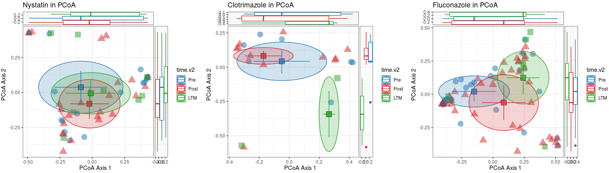
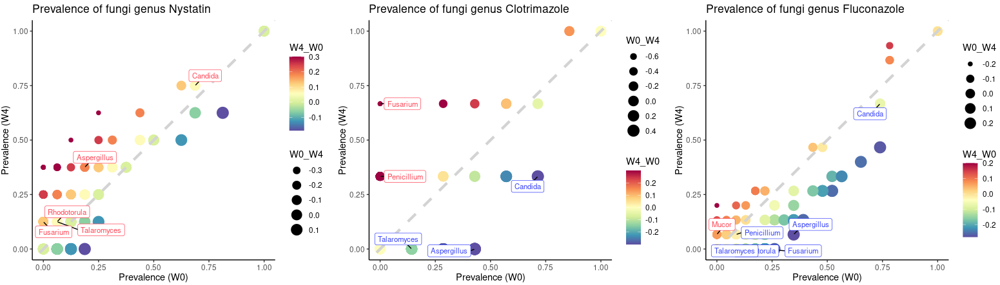
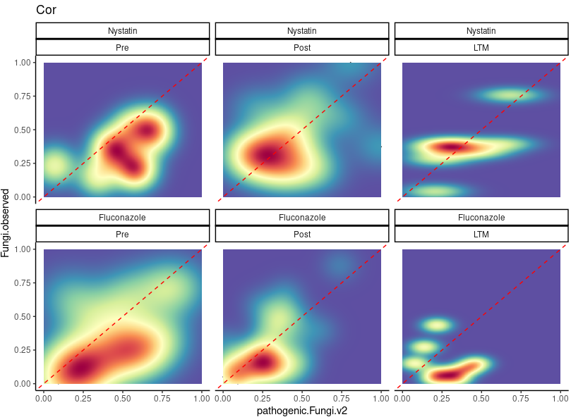
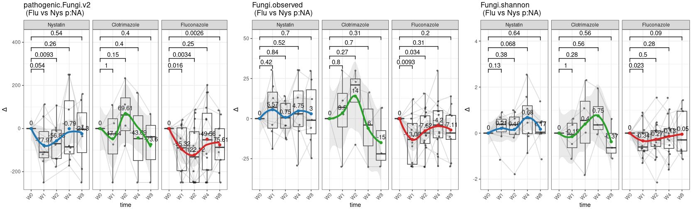
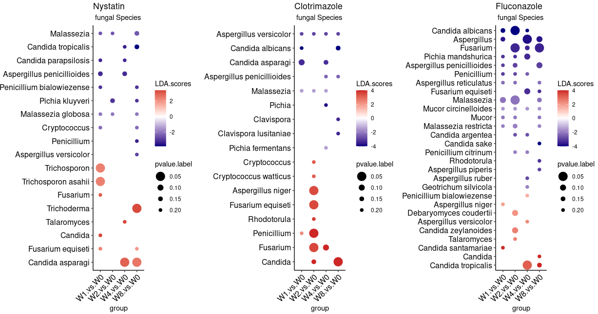
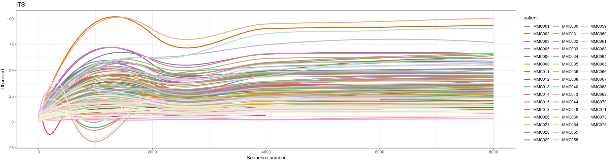
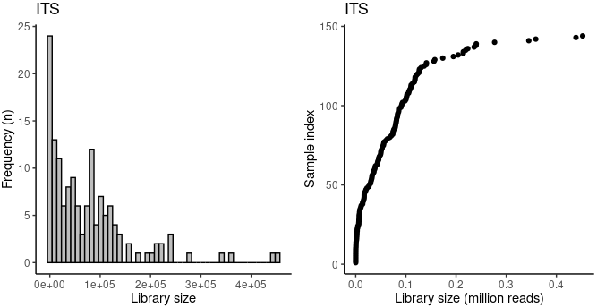
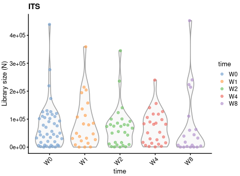
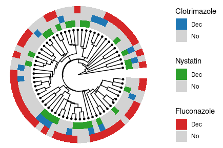

# 2.1 Main Figrue Fungal Analysis: Data Processing, Visualization, and Statistical Testing

## 2.1.1 Data Loading and Preprocessing

Fungal abundance data were extracted from **ITS sequencing** and included:

- **Raw count data (`MMC.ITS.counts`)** with sample-wise abundance values.
- **Taxonomic annotations (`MMC.ITS.taxa1`)** providing genus and species-level fungal classifications.
- **Sample metadata (`MMC.ITS.samples`)** with clinical and experimental conditions.

The data were **filtered and curated** by:

- Removing features with **zero total abundance** across samples.

- Filtering out **taxonomic uncertainty** (e.g., "Incertae sedis").

- Normalizing counts to 

  relative abundance

   and calculating various 

  alpha-diversity metrics

   such as:

  - **Shannon diversity**
  - **Simpson’s diversity**
  - **Inverse Simpson’s index**
  - **Richness (Observed OTUs)**
  - **Dominance index**

- Divergence from **median abundance** was estimated using **Bray-Curtis distance**.

~~~r
MMC.ITS.counts <- mcreadRDS("/mnt/d/xiangyu.ubuntu/workshop/MMC/sample_info/final_Res/MMC.ITS.counts.v3.rds")
MMC.ITS.taxa1 <- mcreadRDS("/mnt/d/xiangyu.ubuntu/workshop/MMC/sample_info/final_Res/MMC.ITS.taxa1.v2.rds")
MMC.ITS.samples <- mcreadRDS("/mnt/d/xiangyu.ubuntu/workshop/MMC/sample_info/final_Res/ITS.samples_info1.v2.rds")

library(microeco)
library(mecodev)
MMC.ITS.counts1 <- MMC.ITS.counts[rowSums(MMC.ITS.counts)>0,colSums(MMC.ITS.counts)>0]
MMC.ITS.taxa1 <- MMC.ITS.taxa1[!is.na(MMC.ITS.taxa1$Genus),]
if (length(grep("Incertae",MMC.ITS.taxa1$Genus,value=TRUE))>0){MMC.ITS.taxa1 <- MMC.ITS.taxa1[-grep("Incertae",MMC.ITS.taxa1$Genus,value=FALSE),]} else {MMC.ITS.taxa1 <- MMC.ITS.taxa1}
MMC.ITS.counts1 <- MMC.ITS.counts1[intersect(rownames(MMC.ITS.taxa1),rownames(MMC.ITS.counts1)),]
MMC.ITS.taxa11 <- MMC.ITS.taxa1[rownames(MMC.ITS.counts1),]
MMC.ITS.samples <- MMC.ITS.samples[colnames(MMC.ITS.counts1),]
Fungal.tse_taxa <- TreeSummarizedExperiment(assays =  SimpleList(counts = as.matrix(MMC.ITS.counts1)),colData = DataFrame(MMC.ITS.samples),rowData = DataFrame(MMC.ITS.taxa11))
Fungal.tse <- transformAssay(Fungal.tse_taxa, MARGIN = "samples", method = "relabundance")
Fungal.tse <- addPerCellQC(Fungal.tse)
Fungal.tse <- mia::estimateRichness(Fungal.tse, assay.type = "counts", index = "observed", name="observed")
Fungal.tse <- mia::estimateDiversity(Fungal.tse, assay.type = "counts",index = "coverage", name = "coverage")
Fungal.tse <- mia::estimateDiversity(Fungal.tse, assay.type = "counts",index = "gini_simpson", name = "gini_simpson")
Fungal.tse <- mia::estimateDiversity(Fungal.tse, assay.type = "counts",index = "inverse_simpson", name = "inverse_simpson")
Fungal.tse <- mia::estimateDiversity(Fungal.tse, assay.type = "counts",index = "log_modulo_skewness", name = "Rarity")
Fungal.tse <- mia::estimateDiversity(Fungal.tse, assay.type = "counts",index = "shannon", name = "shannon")
Fungal.tse <- estimateDominance(Fungal.tse, assay.type = "counts", index="relative", name = "Dominance")
Fungal.tse <- mia::estimateDivergence(Fungal.tse,assay.type = "counts",reference = "median",FUN = vegan::vegdist)
colData(Fungal.tse)$total_raw_counts <- colSums(assay(Fungal.tse, "counts"))
~~~

## 2.1.2. Principal Coordinates Analysis (PCoA) for Fungal Community Structure

A **Bray-Curtis distance-based PCoA** was performed to visualize **fungal community shifts across treatment and time points**.

- Data were filtered to **prevalent fungal species** and transformed into **relative abundance**.
- **Multidimensional scaling (MDS)** was computed, and samples were color-coded based on **time points**.
- Ellipses were drawn to indicate **median and variance (MAD)** for each time point.
- The PCoA results were **stratified by treatment groups (Nystatin, Clotrimazole, Fluconazole)**.

~~~R
library(ggside)
generate_ellipse <- function(median_x, mad_x, median_y, mad_y, n = 500, factor) {
  t <- seq(0, 2*pi, length.out = n)
  a <- mad_x * factor  # Semi-major axis length
  b <- mad_y * factor  # Semi-minor axis length
  x <- median_x + a * cos(t)
  y <- median_y + b * sin(t)
  return(data.frame(x = x, y = y))
}
treatment <- c("Nystatin", "Clotrimazole", "Fluconazole")
pal <- jdb_palette("corona")
ALL_PLOTS <- lapply(treatment, function(treat) {
    tse_tmp <- Fungal.tse[,which(Fungal.tse$treatment %in% c(treat))]
    tse_tmp <- tse_tmp[,which(tse_tmp$time %in%  c("W0","W1","W2","W4","W8"))]
    tse_tmp$time.v2 <- as.character(tse_tmp$time)
    tse_tmp$time.v2[tse_tmp$time.v2 %in% c("W0")] <- "Pre"
    tse_tmp$time.v2[tse_tmp$time.v2 %in% c("W1","W2","W4")] <- "Post"
    tse_tmp$time.v2[tse_tmp$time.v2 %in% c("W8")] <- "LTM"
    tse_tmp$time.v2 <- factor(tse_tmp$time.v2,levels=c("Pre","Post","LTM"))
    tse_tmp <- subsetByPrevalentFeatures(tse_tmp, rank = "Species", detection = 0.01, prevalence = 0.01)
    tse_tmp <- transformAssay(tse_tmp, assay.type = "counts", method = "relabundance")
    tse_tmp <- runMDS(tse_tmp, FUN = vegan::vegdist, method = "bray", assay.type = "relabundance", name = "MDS_bray")
    p <- plotReducedDim(tse_tmp, "MDS_bray", colour_by = "time.v2", point_size = 5)
    PcoA <- ggplot_build(p)$data[[1]]
    PcoA$time.v2 <- unique(tse_tmp$time.v2)[PcoA$group]
    sbg <- PcoA %>% dplyr::group_by(time.v2) %>% dplyr::summarise(median_x = median(x),mad_x = mad(x),median_y = median(y),mad_y = mad(y),.groups = 'drop')
    ellipse_data <- do.call(rbind, lapply(1:nrow(sbg), function(i) {
        df <- generate_ellipse(sbg$median_x[i], sbg$mad_x[i], sbg$median_y[i], sbg$mad_y[i], factor = 0.8)
        df$time.v2 <- sbg$time.v2[i]
        df
    }))
    p <- ggplot(PcoA, aes(x = x, y = y, color = time.v2)) +
    geom_point(aes(shape = time.v2, fill = time.v2), size = 5, alpha = 0.5) +
    geom_polygon(data = ellipse_data, aes(x = x, y = y, fill = time.v2), alpha = 0.2) +
    geom_errorbar(data = sbg, aes(x = median_x, y = median_y, ymin = median_y - 0.5 * mad_y, ymax = median_y + 0.5 * mad_y), width = 0) +
    geom_errorbarh(data = sbg, aes(x = median_x, y = median_y, xmin = median_x - 0.5 * mad_x, xmax = median_x + 0.5 * mad_x), height = 0) +
    geom_point(data = sbg, aes(x = median_x, y = median_y, fill = time.v2), color = "black", shape = 22, size = 5, alpha = 0.7, show.legend = FALSE) +
    theme_bw() + scale_fill_manual(values = pal) + scale_color_manual(values = pal) + labs(x = "PCoA Axis 1", y = "PCoA Axis 2", title = paste0(treat, " in PCoA")) +
    geom_xsideboxplot(orientation = "y") + geom_ysideboxplot(orientation = "x")
    message(treat)
    return(p)
})
plot <- CombinePlots(ALL_PLOTS,nrow=1)
ggsave("/mnt/d/xiangyu.ubuntu/projects/MMC/Figures/figures_making/v3/Fig1.1.Pcoa.svg", plot=plot,width = 15, height = 4,dpi=300)
~~~

## 2.1.3. Fungal Prevalence Dynamics Across Time Points

The prevalence of fungal taxa was computed at multiple taxonomic levels:

- **Phylum, Class, Order, Family, Genus, and Species**.
- Prevalence changes were calculated for **each treatment group at multiple time points (W0, W1, W2, W4, W8)**.
- Fungal species were classified as:
  - **W0-enriched** (baseline)
  - **W4-enriched** (post-treatment)
  - **No significant change**

~~~R
library(lefser)
pal <- c(jdb_palette("corona"),jdb_palette(c("lawhoops")),jdb_palette(c("brewer_spectra")))
Sel_type <- c("Genus","Species")
relativeAb_all_ <- future_lapply(1:length(Sel_type),function(x) {
    tse_tmp <- subsetByPrevalentFeatures(Fungal.tse,rank = Sel_type[x],detection = 0,prevalence = 0,as_relative = FALSE)
    se_total <- SummarizedExperiment(assays = list(counts = assays(tse_tmp)[["counts"]]),rowData = rowData(tse_tmp),colData = colData(tse_tmp))
    se_total <- relativeAb(se_total)
    relativeAb <- as.data.frame(assays(se_total)[["rel_abs"]])
    relativeAb <- log(relativeAb+1,2)
    relativeAb$names <- rownames(relativeAb)
    relativeAb$type <- Sel_type[x]
    return(relativeAb)
    })
relativeAb_all <- do.call(rbind,relativeAb_all_)
require(rJava)
require(xlsx)
pathogenic.Fungi_all <- read.xlsx("/mnt/d/xiangyu.ubuntu/projects/MMC/Human.associated.Fungi.xlsx", sheetName = "raw")
pathogenic.Fungi <- pathogenic.Fungi_all[pathogenic.Fungi_all$group=="Fungal Pathogens",]
unique(pathogenic.Fungi$names)
Genus <- unique(unlist(lapply(strsplit(unique(pathogenic.Fungi$names),split=" "),function(x) {x[1]})))
relabundance_sel.fungi1_ <- lapply(1:length(Genus),function(x) {
    relativeAb_Genus <- relativeAb_all[relativeAb_all$names %in% grep(Genus[x],relativeAb_all$names,value=TRUE),]
    return(relativeAb_Genus)
    })
relabundance_sel.fungi1 <- do.call(rbind,relabundance_sel.fungi1_)
relabundance_sel.fungi1 <- relabundance_sel.fungi1[-grep(" NA",relabundance_sel.fungi1$names,value=FALSE),]
pathogenic.Fungi2 <- pathogenic.Fungi_all[pathogenic.Fungi_all$group=="human gut associated",]
relabundance_sel.fungi2 <- relativeAb_all[relativeAb_all$names %in% setdiff(pathogenic.Fungi2$names,relabundance_sel.fungi1$names),]
relabundance_sel.fungi <- rbind(relabundance_sel.fungi1,relabundance_sel.fungi2)
unique(relabundance_sel.fungi$names)
Species <- relabundance_sel.fungi[relabundance_sel.fungi$type=="Species","names"]
dec_all <- mcreadRDS("/mnt/d/xiangyu.ubuntu/workshop/MMC/sample_info/final_Res/MMC.ITS.dec_all.lefser.All.v2.rds")
Genus <- intersect(Genus,dec_all$Names)
Species <- intersect(Species,dec_all$Names)

sel.time <- c("W0","W1","W2","W4","W8")
sel.treat <- c("Nystatin","Clotrimazole","Fluconazole")
Sel.type <- c("Phylum","Class","Order","Family","Genus","Species")
Prevalence_all_time_ <- future_lapply(1:length(sel.time),function(tmp) {
    tse_tmp <- Fungal.tse[,Fungal.tse$time==sel.time[tmp]]
    Prevalence_all_tmp_ <- future_lapply(1:length(Sel.type),function(i) {
        Prevalence_all_tmp_tmp_ <- lapply(1:length(sel.treat),function(x) {
            tse.tmp <- tse_tmp[,tse_tmp$treatment %in% sel.treat[x]]
            altExp(tse.tmp,Sel.type[i]) <- mergeFeaturesByRank(tse.tmp, Sel.type[i])
            Prevalence <- as.data.frame(getPrevalence(altExp(tse.tmp,Sel.type[i]), detection = 1/100, sort = FALSE,assay.type = "counts", as_relative = TRUE))
            colnames(Prevalence) <- "Prevalence"
            Prevalence$Fungi <- rownames(Prevalence)
            Prevalence$treatment <- sel.treat[x]
            return(Prevalence)
            })
        Prevalence_all_tmp_tmp <- do.call(rbind,Prevalence_all_tmp_tmp_)
        Prevalence_tmp <- reshape2::dcast(Prevalence_all_tmp_tmp,Fungi~treatment,value.var = "Prevalence")
        Prevalence_tmp$type <- Sel.type[i]
        return(Prevalence_tmp)
        })
    Prevalence_all_tmp <- do.call(rbind,Prevalence_all_tmp_)
    Prevalence_all_tmp$time <- sel.time[tmp]
    return(Prevalence_all_tmp)
    })
Prevalence_all_time <- do.call(rbind,Prevalence_all_time_)
color <- c("#ff4757", "lightgrey","#3742fa")
names(color) <- c("W4_enriched","No_Changed","W0_enriched")
index = c("Nystatin","Clotrimazole","Fluconazole")
All.plot0 <- lapply(1:length(index),function(x) {
    Prevalence_tmp <- Prevalence_all_time
    Prevalence_tmp <- Prevalence_tmp[,c("Fungi","time",index[x])]
    Prevalence <- reshape2::dcast(Prevalence_tmp,Fungi~time,value.var = index[x])
    Prevalence$W4_W0 <- Prevalence$W4-Prevalence$W0
    Prevalence$W0_W4 <- Prevalence$W0-Prevalence$W4
    Prevalence$W4_W0[Prevalence$W4_W0>0.3] <- 0.3
    Prevalence$W4_W0[Prevalence$W4_W0< -0.3] <- -0.3
    Prevalence$dynamic <- "No_Changed"
    Prevalence$dynamic[Prevalence$W4_W0 < -0.01] <- "W0_enriched"
    Prevalence$dynamic[Prevalence$W4_W0 > 0.01] <- "W4_enriched"
    Prevalence <- Prevalence[order(Prevalence$dynamic,decreasing=FALSE),]
    Prevalence1 <- Prevalence[Prevalence$dynamic!="No_Changed",]
    aa <- jdb_palette("brewer_spectra")[1:length(jdb_palette("brewer_spectra"))]
    p1 <- ggplot(Prevalence, aes(x=W0, y=W4, color=W4_W0,size=W0_W4)) + geom_point(alpha=1)+ scale_size(range = c(2, 6))+scale_colour_gradientn(colours = colorRampPalette(aa)(100))+
    theme_classic() +  ylab("Prevalence (W4)") + xlab("Prevalence (W0)")+ labs(title=paste0("Prevalence of fungi genus ",index[x]))+geom_abline(slope=1, intercept = 0,linetype=2,color="lightgrey",size=1.5)+
    ggnewscale::new_scale_color()+ggrepel::geom_label_repel(data = Prevalence1[Prevalence1$Fungi %in% Genus,], 
        aes(label = Fungi,color=dynamic), segment.color = 'black', show.legend = FALSE,size=3,max.overlaps=50,min.segment.length = unit(0.1, 'lines'))+ scale_color_manual(values=color)
    return(p1)
})
plot <- CombinePlots(c(All.plot0),ncol=3)
ggsave("/mnt/d/xiangyu.ubuntu/projects/MMC/Figures/figures_making/v3/Fig1.2.svg", plot=plot,width = 15, height = 4,dpi=300)
~~~

## 2.1.4. Pathogenic Fungal Enrichment and Treatment Response

A subset of **clinically relevant fungal pathogens** was analyzed, including **Candida, Aspergillus, Fusarium, Malassezia, Trichosporon, and Rhodotorula**.

- **Pathogenic fungal load** was quantified and compared across treatments.
- **Fungal richness and diversity indices** were correlated with pathogenic fungal abundance.
- The **proportion of gut-associated fungi** was compared between **Nystatin and Fluconazole-treated groups**.

~~~R
ITS.Info.global3 <- mcreadRDS("/mnt/d/xiangyu.ubuntu/workshop/MMC/sample_info/final_Res/MMC.All.features.Info.gloibal.rds")
tmp_projects2 <- mcreadRDS("/mnt/d/xiangyu.ubuntu/workshop/MMC/sample_info/final_Res/MMC.ITS.All.Info.gloibal.groups.rds")
tmp_projects2 <- tmp_projects2[,c("DAI","UC.score.v2","CD.score.raw","time","time.v2","treatment","patient")]
tmp_projects2 <- as.data.frame(cbind(tmp_projects2,ITS.Info.global3[rownames(tmp_projects2),c("Gut_asso_fungi","Fungi.observed","Fungi.shannon")]))

relabundance_total_Species <- relativeAb_all
aa <- jdb_palette("brewer_spectra")
treatment <- c("Nystatin","Clotrimazole","Fluconazole")
relabundance_all_ <- lapply(1:length(treatment),function(x) {
    tmp_projects <- MMC.ITS.samples[MMC.ITS.samples$treatment==treatment[x],]
    relabundance_tmp <- relabundance_total_Species[,rownames(tmp_projects)]
    relabundance <-  data.frame(W0=rowMeans(relabundance_tmp[,rownames(tmp_projects[tmp_projects$time=="W0",])]),
        W2=rowMeans(relabundance_tmp[,rownames(tmp_projects[tmp_projects$time=="W2",])]),
        W4=rowMeans(relabundance_tmp[,rownames(tmp_projects[tmp_projects$time=="W4",])]),
        W8=rowMeans(relabundance_tmp[,rownames(tmp_projects[tmp_projects$time=="W8",])]),
        group=treatment[x],
        names=relabundance_total_Species$names)
    relabundance$W2_W0 <- relabundance$W2-relabundance$W0
    relabundance$W4_W0 <- relabundance$W4-relabundance$W0
    return(relabundance)
    })
relabundance_all <- do.call(rbind,relabundance_all_)
relabundance_all_W2_W0 <- relabundance_all[relabundance_all$W2_W0<0,]

pathogenic.Fungi <- read.xlsx("/mnt/d/xiangyu.ubuntu/projects/MMC/Human.associated.Fungi.xlsx", sheetName = "raw")
pathogenic.Fungi <- pathogenic.Fungi[pathogenic.Fungi$group=="Fungal Pathogens",]
Genus <- unique(unlist(lapply(strsplit(unique(pathogenic.Fungi$names),split=" "),function(x) {x[1]})))
relabundance_sel.fungi1_ <- lapply(1:length(Genus),function(x) {
    relativeAb_Genus <- relativeAb_all[relativeAb_all$names %in% grep(Genus[x],relativeAb_all$names,value=TRUE),]
    return(relativeAb_Genus)
    })
relabundance_sel.fungi1 <- do.call(rbind,relabundance_sel.fungi1_)
relabundance_sel.fungi1 <- relabundance_sel.fungi1[-grep(" NA",relabundance_sel.fungi1$names,value=FALSE),]
pathogenic.Fungi.v2 <- unique(relabundance_sel.fungi1$names)
pathogenic.Fungi.v21 <- pathogenic.Fungi.v2[unlist(lapply(strsplit(pathogenic.Fungi.v2,split=" "),function(x) {x[2]})) %in% unlist(lapply(strsplit(unique(pathogenic.Fungi$names),split=" "),function(x) {x[2]}))]
pathogenic.Fungi.v2 <- setdiff(pathogenic.Fungi.v21,c("Beauveria", "Trichoderma", "Penicillium", "Geotrichum", "Kluyveromyces", "Pichia"))
pathogenic.Fungi.v2 <- intersect(pathogenic.Fungi.v2,relabundance_all_W2_W0$names)
relabundance_pathogenic.Fungi.v2 <- relativeAb_all[relativeAb_all$names %in% pathogenic.Fungi.v2,]
relabundance_tmp <- relabundance_pathogenic.Fungi.v2[,rownames(tmp_projects2)]
tmp_projects2$pathogenic.Fungi.v2 <- 100*colMeans(relabundance_tmp)[rownames(tmp_projects2)]

aa <- jdb_palette("brewer_spectra", type = "continuous")
ITS.Info.global4 <- tmp_projects2[tmp_projects2$treatment %in% c("Nystatin","Fluconazole"),]
ITS.Info.global4$treatment <- factor(ITS.Info.global4$treatment,levels=c("Nystatin","Fluconazole"))
ITS.Info.global4$Fungi.observed <- (ITS.Info.global4$Fungi.observed-min(ITS.Info.global4$Fungi.observed, na.rm = TRUE))/(max(ITS.Info.global4$Fungi.observed, na.rm = TRUE)-min(ITS.Info.global4$Fungi.observed, na.rm = TRUE))
ITS.Info.global4$Gut_asso_fungi <- (ITS.Info.global4$Gut_asso_fungi-min(ITS.Info.global4$Gut_asso_fungi, na.rm = TRUE))/(max(ITS.Info.global4$Gut_asso_fungi, na.rm = TRUE)-min(ITS.Info.global4$Gut_asso_fungi, na.rm = TRUE))
ITS.Info.global4$pathogenic.Fungi.v2 <- (ITS.Info.global4$pathogenic.Fungi.v2-min(ITS.Info.global4$pathogenic.Fungi.v2, na.rm = TRUE))/(max(ITS.Info.global4$pathogenic.Fungi.v2, na.rm = TRUE)-min(ITS.Info.global4$pathogenic.Fungi.v2, na.rm = TRUE))
ggplot(ITS.Info.global4, aes(x = pathogenic.Fungi.v2, y = Fungi.observed)) +  geom_point(alpha = 0.5, size = 0.1) +
stat_density_2d(geom = "tile", aes(fill = ..ndensity..), contour = FALSE, n = 500) + scale_fill_gradientn(colours = aa) +
facet_wrap(~treatment+time.v2, ncol = 3) +theme_classic() + labs(title = paste0("Cor"),x = "pathogenic.Fungi.v2",y = "Fungi.observed",fill = "Density") +theme(legend.position = "none")+
geom_abline(slope = 1, intercept = 0, linetype = "dashed", color = "red")
plot <- ggplot(ITS.Info.global4, aes(x = pathogenic.Fungi.v2, y = Fungi.observed)) +  geom_point(alpha = 0.5, size = 0.1) +
stat_density_2d(geom = "tile", aes(fill = ..ndensity..), contour = FALSE, n = 500) + scale_fill_gradientn(colours = aa) +
facet_wrap(~treatment+time.v2, ncol = 3) +theme_classic() + labs(title = paste0("Cor"),x = "pathogenic.Fungi.v2",y = "Fungi.observed",fill = "Density") +theme(legend.position = "none")
ggsave("/mnt/d/xiangyu.ubuntu/projects/MMC/Figures/figures_making/v3/Fig1.3.png", plot=plot,width = 8, height = 6,dpi=300)
~~~

## 2.1.5. Differential Abundance Analysis of Fungal Genera and Species

A **differential abundance analysis** (DAA) was conducted using **LEfSe (Linear Discriminant Analysis Effect Size)**.

- Fungal genera and species with **differential abundance** between time points and treatments were identified.
- Log-transformed relative abundances were used for visualization.
- Pathogenic and gut-associated fungi were specifically analyzed for their **prevalence and enrichment dynamics**.

~~~R

diease_Scores <- c("pathogenic.Fungi.v2","Fungi.observed","Fungi.shannon")
comb <- list(c("W0","W1"),c("W0","W2"),c("W0","W4"),c("W0","W8"))
pal <- jdb_palette("corona")[c(1,3,2)]
total_plots2 <- lapply(1:length(diease_Scores),function(dis) {
    df_paired <- tmp_projects2[!is.na(tmp_projects2$treatment),]
    df_paired <- df_paired[df_paired$time %in% c("W0","W1","W2","W4","W8"),]
    uniq_patient1 <- unique(df_paired$patient)
    df_paired1_ <- lapply(1:length(uniq_patient1),function(i) {
        tmp <- df_paired[df_paired$patient %in% uniq_patient1[i],]
        tmp[,"value"] <- tmp[,diease_Scores[dis]]-tmp[tmp$time=="W0",diease_Scores[dis]]
        if (diease_Scores[dis]=="pathogenic.Fungi.v2") {
            tmp$value[tmp$value > 250] <- 250
            tmp$value[tmp$value < -250] <- -250
        }
        if (diease_Scores[dis]=="Fungi.observed") {
            tmp$value[tmp$value > 30] <- 30
            tmp$value[tmp$value < -30] <- -30
        }
        return(tmp)
    })
    df_paired1 <- do.call(rbind,df_paired1_)
    df_paired1$treatment <- factor(df_paired1$treatment,levels=c("Nystatin","Clotrimazole","Fluconazole"))
    if (diease_Scores[dis]=="Fungi.observed") {test <- t.test_wrapper} else {test <- wilcox.test_wrapper}
    df_paired2 <- df_paired1
    df_paired2$time <- as.numeric(gsub("W","",df_paired2$time))
    loess_fit_1 <- loess(value ~ time, data = df_paired2[df_paired2$treatment == "Nystatin", ])
    loess_fit_2 <- loess(value ~ time, data = df_paired2[df_paired2$treatment == "Fluconazole", ])
    x_range <- seq(min(df_paired2$time), max(df_paired2$time), length.out = 100)
    pred_1 <- predict(loess_fit_1, newdata = data.frame(time = x_range))
    pred_2 <- predict(loess_fit_2, newdata = data.frame(time = x_range))
    ks_test_result <- formatC(ks.test(pred_1, pred_2)$p.value, format = "e", digits = 3)

    rss_1 <- sum((df_paired2[df_paired2$treatment == "Nystatin", "value"] - predict(loess_fit_1))^2)
    rss_2 <- sum((df_paired2[df_paired2$treatment == "Fluconazole", "value"] - predict(loess_fit_2))^2)
    n1 <- length(df_paired2[df_paired2$treatment == "Nystatin", "value"])  # Sample size group 1
    n2 <- length(df_paired2[df_paired2$treatment == "Fluconazole", "value"])  # Sample size group 2
    f_stat <- (rss_1 / (n1 - 2)) / (rss_2 / (n2 - 2))
    Ftestp_value <- pf(f_stat, df1 = n1 - 2, df2 = n2 - 2, lower.tail = FALSE)# Perform an F-test

    p1 <- ggplot(df_paired1, aes_string(x = "time", y = "value")) + 
        geom_line(aes(group=patient),size = 0.6,alpha=0.8,color="lightgrey") +
        geom_jitter(color="black",width = 0.1,alpha=0.5,size=1)+
        geom_boxplot(outlier.shape = NA,alpha=0)+
        theme_bw()+ scale_fill_manual(values = pal,guide="none")+scale_color_manual(values = pal,guide="none")+theme(axis.text.x  = element_text(angle=45, vjust=1,hjust = 1))+
        stat_summary(fun.y=mean, colour="black", geom="text", show_guide = FALSE,  vjust=-0.7, aes( label=round(..y.., digits=2)))+facet_wrap(~treatment,ncol=3)+
        labs(title=paste0(diease_Scores[dis],"\n (Flu vs Nys p:",Ftestp_value,")"),y = paste("Δ")) +NoLegend()+
        geom_signif(comparisons = comb,step_increase = 0.1,map_signif_level = FALSE,test = test)+
        geom_smooth(aes(group = 1, color = treatment), method = "loess", size = 1.5, se = TRUE,alpha=0.2)+
        stat_summary(fun = mean, geom = "point",aes(group = 1,color = treatment),size=2)
        # stat_summary(fun = median, geom = "line",aes(group = 1,color = treatment),size=1.5)
    plot <- plot_grid(p1,ncol=1)
    return(plot)
    })
plot <- CombinePlots(c(total_plots2),nrow=1)
ggsave("/mnt/d/xiangyu.ubuntu/projects/MMC/Figures/figures_making/v3/Fig1.4.svg", plot=plot,width = 12, height = 4,dpi=300)
~~~

## 2.1.6 Identification of Treatment-Responsive Fungal Species

Fungal species exhibiting **strong treatment responses** were identified using **LEfSe** and longitudinal analysis:

- **Significant species** were selected based on **LDA score and p-value thresholds**.
- A weighted mean ranking was computed for fungal species **most influenced by treatment**.
- The most **differentially abundant species** were visualized in a **bubble plot**, stratified by time points.

~~~R
library(lefser)
pal <- c(jdb_palette("corona"),jdb_palette(c("lawhoops")),jdb_palette(c("brewer_spectra")))
Sel_type <- c("Genus","Species")
relativeAb_all_ <- future_lapply(1:length(Sel_type),function(x) {
    tse_tmp <- subsetByPrevalentFeatures(Fungal.tse,rank = Sel_type[x],detection = 0,prevalence = 0,as_relative = FALSE)
    se_total <- SummarizedExperiment(assays = list(counts = assays(tse_tmp)[["counts"]]),rowData = rowData(tse_tmp),colData = colData(tse_tmp))
    se_total <- relativeAb(se_total)
    relativeAb <- as.data.frame(assays(se_total)[["rel_abs"]])
    relativeAb <- log(relativeAb+1,2)
    relativeAb$names <- rownames(relativeAb)
    relativeAb$type <- Sel_type[x]
    return(relativeAb)
    })
relativeAb_all <- do.call(rbind,relativeAb_all_)
require(rJava)
require(xlsx)
pathogenic.Fungi_all <- read.xlsx("/mnt/d/xiangyu.ubuntu/projects/MMC/Human.associated.Fungi.xlsx", sheetName = "raw")
unique(pathogenic.Fungi$names)
pathogenic.Fungi <- pathogenic.Fungi_all[pathogenic.Fungi_all$group=="Fungal Pathogens",]
Genus <- unique(unlist(lapply(strsplit(unique(pathogenic.Fungi$names),split=" "),function(x) {x[1]})))
relabundance_sel.fungi1_ <- lapply(1:length(Genus),function(x) {
    relativeAb_Genus <- relativeAb_all[relativeAb_all$names %in% grep(Genus[x],relativeAb_all$names,value=TRUE),]
    return(relativeAb_Genus)
    })
relabundance_sel.fungi1 <- do.call(rbind,relabundance_sel.fungi1_)
relabundance_sel.fungi1 <- relabundance_sel.fungi1[-grep(" NA",relabundance_sel.fungi1$names,value=FALSE),]
pathogenic.Fungi2 <- pathogenic.Fungi_all[pathogenic.Fungi_all$group=="human gut associated",]
relabundance_sel.fungi2 <- relativeAb_all[relativeAb_all$names %in% setdiff(pathogenic.Fungi2$names,relabundance_sel.fungi1$names),]
relabundance_sel.fungi <- relabundance_sel.fungi1
unique(relabundance_sel.fungi$names)

W1.lefser <- mcreadRDS("/mnt/d/xiangyu.ubuntu/workshop/MMC/sample_info/final_Res/MMC.ITS.DAA_all.W1.lefser.v2.rds")
W2.lefser <- mcreadRDS("/mnt/d/xiangyu.ubuntu/workshop/MMC/sample_info/final_Res/MMC.ITS.DAA_all.W2.lefser.v2.rds")
W4.lefser <- mcreadRDS("/mnt/d/xiangyu.ubuntu/workshop/MMC/sample_info/final_Res/MMC.ITS.DAA_all.W4.lefser.v2.rds")
W8.lefser <- mcreadRDS("/mnt/d/xiangyu.ubuntu/workshop/MMC/sample_info/final_Res/MMC.ITS.DAA_all.W8.lefser.v2.rds")
names(W1.lefser) <- c("Nystatin","Clotrimazole","Fluconazole")

All_plots <- lapply(1:length(W1.lefser),function(x) {
    W1.tmp_all <- W1.lefser[[x]][,c(1,2,3,6)]
    W2.tmp_all <- W2.lefser[[x]][,c(1,2,3,6)]
    W4.tmp_all <- W4.lefser[[x]][,c(1,2,3,6)]
    W8.tmp_all <- W8.lefser[[x]][,c(1,2,3,6)]
    colnames(W1.tmp_all) <- c("Names","LDA.scores","pvalue","type")
    colnames(W2.tmp_all) <- c("Names","LDA.scores","pvalue","type")
    colnames(W4.tmp_all) <- c("Names","LDA.scores","pvalue","type")
    colnames(W8.tmp_all) <- c("Names","LDA.scores","pvalue","type")
    W1.tmp_all$group <- "W1.vs.W0"
    W2.tmp_all$group <- "W2.vs.W0"
    W4.tmp_all$group <- "W4.vs.W0"
    W8.tmp_all$group <- "W8.vs.W0"
    tmp_all <- rbind(W1.tmp_all,W2.tmp_all)
    tmp_all <- rbind(tmp_all,W4.tmp_all)
    tmp_all <- rbind(tmp_all,W8.tmp_all)
    tmp_all <- tmp_all[tmp_all$Names %in% unique(relabundance_sel.fungi$names),]
    tmp_all$LDA.scores[tmp_all$LDA.scores > 4] <- 4
    tmp_all$LDA.scores[tmp_all$LDA.scores < -4] <- -4
    tmp_all <- tmp_all[tmp_all$pvalue <= 0.4,]
    tmp_all_c <- reshape2::dcast(tmp_all,Names~group,value.var = "LDA.scores")
    tmp_all_c[is.na(tmp_all_c)] <- 0

    tmp_all_c$weight.mean <- (tmp_all_c$W1.vs.W0+tmp_all_c$W2.vs.W0+tmp_all_c$W4.vs.W0+tmp_all_c$W8.vs.W0)/4
    sd <- rowSds(as.matrix(tmp_all_c[,c("W1.vs.W0","W2.vs.W0","W4.vs.W0","W8.vs.W0")]))
    sd[sd==0] <- 0.1
    tmp_all_c$weight <- tmp_all_c$weight.mean/sd
    tmp_all_c <- tmp_all_c[abs(tmp_all_c$weight)>=0.5,]
    tmp_all_c <- tmp_all_c[order(tmp_all_c$weight.mean,tmp_all_c$W1.vs.W0,tmp_all_c$W2.vs.W0,tmp_all_c$W4.vs.W0,tmp_all_c$W8.vs.W0),]
    o <- as.character(tmp_all_c$Names)
    tmp_all <- tmp_all[tmp_all$Names %in% o,]

    tmp_all_c[tmp_all_c$Names=="Candida albicans",]
    tmp_all_c[tmp_all_c$Names=="Alternaria metachromatica",]

    tmp_all$Names <- factor(tmp_all$Names,levels=o[length(o):1])
    tmp_all$pvalue.label <- 0.2
    tmp_all$pvalue.label[tmp_all$pvalue<=0.05] <- 0.05
    tmp_all$pvalue.label[tmp_all$pvalue>0.05 & tmp_all$pvalue<=0.1] <- 0.1
    tmp_all$pvalue.label[tmp_all$pvalue>0.1 & tmp_all$pvalue<=0.15] <- 0.15
    plot <- ggplot(tmp_all, aes_string(x="group", y="Names", size="pvalue.label", color="LDA.scores")) +
        geom_point() + scale_colour_gradient2(low = "navy",  mid = "white",  high = "firebrick3",  midpoint = 0,, name = "LDA.scores",guide=guide_colorbar(reverse=FALSE)) +
        ylab(NULL) + ggtitle(names(W1.lefser)[x]," fungal Species") + scale_size(range=c(6,2))+theme_classic()+
        theme(axis.text.x  = element_text(angle=45, vjust=1,hjust = 1,color = "black", size = 12),axis.text.y = element_text(color = "black", size = 12, face = "plain"))
    return(plot)
    })
plot <- CombinePlots(c(All_plots),ncol=3)
ggsave("/mnt/d/xiangyu.ubuntu/projects/MMC/Figures/figures_making/v3/Fig1.5.svg", plot=plot,width = 12, height = 7,dpi=300)
~~~

~~~R
LDA_fungi_all_ <- lapply(1:length(W1.lefser),function(x) {
    W1.tmp_all <- W1.lefser[[x]][,c(1,2,3,6)]
    W2.tmp_all <- W2.lefser[[x]][,c(1,2,3,6)]
    W4.tmp_all <- W4.lefser[[x]][,c(1,2,3,6)]
    W8.tmp_all <- W8.lefser[[x]][,c(1,2,3,6)]
    colnames(W1.tmp_all) <- c("Names","LDA.scores","pvalue","type")
    colnames(W2.tmp_all) <- c("Names","LDA.scores","pvalue","type")
    colnames(W4.tmp_all) <- c("Names","LDA.scores","pvalue","type")
    colnames(W8.tmp_all) <- c("Names","LDA.scores","pvalue","type")
    W1.tmp_all$group <- "W1.vs.W0"
    W2.tmp_all$group <- "W2.vs.W0"
    W4.tmp_all$group <- "W4.vs.W0"
    W8.tmp_all$group <- "W8.vs.W0"
    tmp_all <- rbind(W1.tmp_all,W2.tmp_all)
    tmp_all <- rbind(tmp_all,W4.tmp_all)
    tmp_all <- rbind(tmp_all,W8.tmp_all)
    tmp_all1 <- tmp_all[tmp_all$Names %in% unique(relabundance_sel.fungi$names),]
    tmp_all1$LDA.scores[tmp_all1$LDA.scores > 4] <- 4
    tmp_all1$LDA.scores[tmp_all1$LDA.scores < -4] <- -4
    tmp_all1 <- tmp_all1[tmp_all1$pvalue <= 0.4,]

    tmp_all_c <- reshape2::dcast(tmp_all1,Names~group,value.var = "LDA.scores")
    tmp_all_c[is.na(tmp_all_c)] <- 0
    tmp_all_c$weight.mean <- (tmp_all_c$W1.vs.W0+tmp_all_c$W2.vs.W0+tmp_all_c$W4.vs.W0+tmp_all_c$W8.vs.W0)/4
    sd <- rowSds(as.matrix(tmp_all_c[,c("W1.vs.W0","W2.vs.W0","W4.vs.W0","W8.vs.W0")]))
    sd[sd==0] <- 0.1
    tmp_all_c$weight <- tmp_all_c$weight.mean/sd
    tmp_all_c <- tmp_all_c[abs(tmp_all_c$weight)>=0.5,]
    tmp_all_c <- tmp_all_c[order(tmp_all_c$weight.mean,tmp_all_c$W1.vs.W0,tmp_all_c$W2.vs.W0,tmp_all_c$W4.vs.W0,tmp_all_c$W8.vs.W0),]

    tmp_all2 <- tmp_all[tmp_all$Names %in% unique(relabundance_sel.fungi$names),]
    tmp_all2 <- tmp_all2[tmp_all2$pvalue <= 0.4,]
    o <- as.character(tmp_all_c$Names)
    tmp_all2 <- tmp_all2[tmp_all2$Names %in% o,]
    tmp_all2$treatment <- names(W1.lefser)[x]
    tmp_all2
    })
LDA_fungi_all <- do.call(rbind,LDA_fungi_all_)
write.csv(LDA_fungi_all,"/mnt/d/xiangyu.ubuntu/projects/MMC/Figures/figures_making/v3/LDA_fungi_all.csv")
~~~

## 2.1.7. Longitudinal Changes in Fungal Abundance Across Treatments

Paired comparisons were performed to track **within-patient fungal abundance shifts** from baseline (W0) to later time points (W1, W2, W4, W8).

- Changes in key fungal **genera and species** were visualized.
- Treatment-specific trajectories were analyzed using:
  - **Wilcoxon paired tests**
  - **Loess smoothing models** for longitudinal trend estimation.
  - **F-tests comparing Fluconazole vs. Nystatin** responses.

~~~R

Sig_fungi <- c("Aspergillus","Aspergillus terreus","Candida","Candida albicans","Candida dubliniensis","Candida parapsilosis","Saccharomyces cerevisiae",
    "Cryptococcus","Fusarium","Talaromyces","Malassezia","Malassezia globosa","Clavispora","Clavispora lusitaniae","Meyerozyma",
    "Meyerozyma guilliermondii","Mucor","Acremonium","Exophiala","Rhodotorula","Trichosporon","Trichosporon asahii","Debaryomyces",
    "Exserohilum","Saccharomyces cerevisiae","Candida sake","Candida tropicalis","Candida albicans","Candida parapsilosis",
    "Meyerozyma guilliermondii","Clavispora lusitaniae","Candida albicans","Aspergillus","Fusarium","Pichia mandshurica","Aspergillus penicillioides","Penicillium","Aspergillus reticulatus","Fusarium equiseti","Malassezia","Mucor circinelloides","Mucor","Malassezia restricta","Candida argentea","Candida sake","Penicillium citrinum","Rhodotorula","Aspergillus piperis","Aspergillus ruber","Geotrichum silvicola")
Sig_fungi <- sort(Sig_fungi)
relabundance_sel.fungi <- relativeAb_all[relativeAb_all$names %in% Sig_fungi,]
tmp_projects <- MMC.ITS.samples
tmp_projects$treatment <- factor(tmp_projects$treatment,levels=c("Nystatin","Clotrimazole","Fluconazole"))
relabundance_tmp <- relabundance_sel.fungi[,rownames(tmp_projects)]
rownames(relabundance_tmp) <- gsub(" ","_",rownames(relabundance_tmp))
relabundance_tmp <- relabundance_tmp[rowSums(relabundance_tmp > 0) > 1, ]
sel.fungi1 <- sort(rownames(relabundance_tmp))
tmp_projects <- as.data.frame(cbind(tmp_projects,t(100*relabundance_tmp)))
tmp_projects1 <- tmp_projects[tmp_projects$treatment %in% c("Nystatin","Fluconazole"),]
tmp_projects1$treatment.v2 <- as.character(tmp_projects1$treatment)
tmp_projects1$treatment.v2[tmp_projects1$treatment.v2 %in% c("Clotrimazole","Fluconazole")] <- "Clo_Flu"
tmp_projects1$treatment.v2 <- factor(tmp_projects1$treatment.v2,levels=c("Nystatin","Clo_Flu"))
pal <- c(jdb_palette("corona"),jdb_palette(c("lawhoops")),jdb_palette(c("brewer_celsius")),jdb_palette(c("brewer_spectra")))
library(lme4)
library(ARTool)
library(coin)
total_plots2 <- lapply(1:length(sel.fungi1),function(dis) {
    df_paired <- tmp_projects1
    df_paired$treatment <- factor(df_paired$treatment,levels=c("Nystatin","Fluconazole"))
    colnames(df_paired)[colnames(df_paired)==sel.fungi1[dis]] <- "value"
    uniq_patient1 <- unique(df_paired$patient)
    df_paired1_ <- lapply(1:length(uniq_patient1),function(i) {
        tmp <- df_paired[df_paired$patient %in% uniq_patient1[i],]
        tmp[,"value"] <- tmp[,"value"]-tmp[tmp$time=="W0","value"]
        tmp[,"value"][tmp[,"value"]>500] <- 500
        tmp[,"value"][tmp[,"value"] < -500] <- -500
        return(tmp)
    })
    df_paired2 <- do.call(rbind,df_paired1_)
    df_paired2 <- df_paired2[!is.na(df_paired2$value),]
    df_paired2$time_numeric <- as.numeric(gsub("W", "", df_paired2$time))
    # df_paired2[,"value"] <- scales::rescale(df_paired2[,"value"], to = c(0, 1))

    art_model <- art(value ~ treatment, data = df_paired2)
    anova_art <- anova(art_model)
    art_p_value <- anova_art$`Pr(>F)`[1]
    art.pvalue0 <- ifelse(art_p_value < 0.001, "< 0.001", format(art_p_value, digits = 3))

    kruskal_result <- kruskal.test(value ~ treatment, data = df_paired2)
    kruskal_pvalue <- kruskal_result$p.value
    kruskal.pvalue0 <- ifelse(kruskal_pvalue < 0.001, "< 0.001", format(kruskal_pvalue, digits = 3))

    perm_test_result <- oneway_test(value ~ treatment, data = df_paired2, distribution = "approximate")
    perm_pvalue <- pvalue(perm_test_result)
    LocationTests.pvalue0 <- ifelse(perm_pvalue < 0.001, "< 0.001", format(perm_pvalue, digits = 3))

    lm_result <- lm(value ~ treatment, data = df_paired2)
    tukey_result <- TukeyHSD(aov(lm_result))
    tukey_pvalues <- tukey_result$treatment
    TukeyHSD.pvalue1 <- ifelse(tukey_pvalues["Fluconazole-Nystatin", "p adj"] < 0.001, "< 0.001", format(tukey_pvalues["Fluconazole-Nystatin", "p adj"], digits = 3))
    
    pairwise_t_result <- pairwise.t.test(df_paired2$value, df_paired2$treatment, p.adjust.method = "bonferroni")
    pairwise_t_pvalues <- pairwise_t_result$p.value
    pairwise.t.pvalue1 <- ifelse(pairwise_t_pvalues["Fluconazole","Nystatin"] < 0.001, "< 0.001", format(pairwise_t_pvalues["Fluconazole","Nystatin"], digits = 3))

    lmm_result <- lmerTest::lmer(value ~ treatment + (1 | patient), data = df_paired2)
    summary_lmm <- summary(lmm_result)
    p_value_mixed <- coef(summary_lmm)["treatmentFluconazole", "Pr(>|t|)"]
    LMM.pvalue1 <- ifelse(is.na(p_value_mixed) | p_value_mixed < 0.001, "< 0.001", format(p_value_mixed, digits = 3))

    anova_result <- aov(value ~ treatment, data = df_paired2)
    p_value <- summary(anova_result)[[1]]["treatment", "Pr(>F)"]
    anova.pvalue0 <- ifelse(p_value < 0.001, "< 0.001", format(p_value, digits = 3))

    loess_fit_1 <- loess(value ~ time_numeric, data = df_paired2[df_paired2$treatment == "Nystatin", ])
    loess_fit_2 <- loess(value ~ time_numeric, data = df_paired2[df_paired2$treatment == "Fluconazole", ])
    x_range <- seq(min(df_paired2$time_numeric), max(df_paired2$time_numeric), length.out = 100)
    pred_1 <- predict(loess_fit_1, newdata = data.frame(time_numeric = x_range))
    pred_2 <- predict(loess_fit_2, newdata = data.frame(time_numeric = x_range))
        ks_test_result <- formatC(ks.test(pred_1, pred_2)$p.value, format = "e", digits = 3)

    rss_1 <- sum((df_paired2[df_paired2$treatment == "Nystatin", "value"] - predict(loess_fit_1))^2)
    rss_2 <- sum((df_paired2[df_paired2$treatment == "Fluconazole", "value"] - predict(loess_fit_2))^2)
    n1 <- length(df_paired2[df_paired2$treatment == "Nystatin", "value"])  # Sample size group 1
    n2 <- length(df_paired2[df_paired2$treatment == "Fluconazole", "value"])  # Sample size group 2
    f_stat <- (rss_1 / (n1 - 2)) / (rss_2 / (n2 - 2))
    Ftestp_value <- pf(f_stat, df1 = n1 - 2, df2 = n2 - 2, lower.tail = FALSE)# Perform an F-test

    p2 <- ggplot(df_paired2, aes_string(x = "time_numeric", y = "value")) + geom_jitter(aes(color=treatment),size = 1)+ 
    geom_smooth(aes(color=treatment,fill=treatment),size = 2,alpha=0.2,method = "loess", method.args = list(degree=1),se=TRUE, level = 0.5)+
    # geom_smooth(aes(color=treatment,fill=treatment),size = 2,alpha=0.2,method = lm, formula = y ~ splines::bs(x, 1), se = TRUE, level = 0.5)+
    stat_compare_means(aes(group = treatment), method = "wilcox.test", label.y = c(0),label = "p.format") +
    theme_bw()+ scale_color_manual(values = pal[c(2,1)])+scale_fill_manual(values = pal[c(2,1)])+
    labs(title = paste0(sel.fungi1[dis],"\n", "Flu vs Nystatin (ANOVA p: ", anova.pvalue0," | ","art p: ",art.pvalue0,
        "|\n","kruskal p: ", kruskal.pvalue0," | ","LocationTests p: ",LocationTests.pvalue0,
        "|\n","TukeyHSD p: ",TukeyHSD.pvalue1," | ","loess p: ",Ftestp_value,"|\n","pairwise. p: ",pairwise.t.pvalue1," | ",
        "LMM p: ",LMM.pvalue1,")"),y = "Δ")
    message(dis)
    return(p2)
    })
plot <- CombinePlots(c(total_plots2),ncol=5)
ggsave("/mnt/d/xiangyu.ubuntu/projects/MMC/Figures/figures_making/v3/Fig1.6.png", plot=plot,width = 30, height = 20,dpi=300)
ggsave("/mnt/d/xiangyu.ubuntu/projects/MMC/Figures/figures_making/v3/Fig1.6.svg", plot=plot,width = 30, height = 20,dpi=300)
~~~

# 2.2 Supplementary Figure Analysis: Fungal Community and Treatment Effects

## 2.2.1. Rarefaction Analysis for Sequencing Depth Assessment

To ensure adequate sequencing depth for fungal ITS data, a **rarefaction curve analysis** was performed:

- **Sequencing reads were subsampled at different depths** (0, 10, 50, 500, 2000, 4000, 6000, 8000 reads).
- **Alpha-diversity (Observed OTUs)** was computed for each depth.
- Samples were grouped by **patient ID**, and smooth fitting curves were added to visualize sequencing saturation.

~~~R
MMC.ITS.counts <- mcreadRDS("/mnt/d/xiangyu.ubuntu/workshop/MMC/sample_info/final_Res/MMC.ITS.counts.v3.rds")
MMC.ITS.taxa1 <- mcreadRDS("/mnt/d/xiangyu.ubuntu/workshop/MMC/sample_info/final_Res/MMC.ITS.taxa1.v2.rds")
MMC.ITS.samples <- mcreadRDS("/mnt/d/xiangyu.ubuntu/workshop/MMC/sample_info/final_Res/ITS.samples_info1.v2.rds")

library(microeco)
library(mecodev)
MMC.ITS.counts1 <- MMC.ITS.counts[rowSums(MMC.ITS.counts)>0,colSums(MMC.ITS.counts)>0]
MMC.ITS.taxa1 <- MMC.ITS.taxa1[!is.na(MMC.ITS.taxa1$Genus),]
if (length(grep("Incertae",MMC.ITS.taxa1$Genus,value=TRUE))>0){MMC.ITS.taxa1 <- MMC.ITS.taxa1[-grep("Incertae",MMC.ITS.taxa1$Genus,value=FALSE),]} else {MMC.ITS.taxa1 <- MMC.ITS.taxa1}
MMC.ITS.counts1 <- MMC.ITS.counts1[intersect(rownames(MMC.ITS.taxa1),rownames(MMC.ITS.counts1)),]
MMC.ITS.taxa11 <- MMC.ITS.taxa1[rownames(MMC.ITS.counts1),]
MMC.ITS.samples <- MMC.ITS.samples[colnames(MMC.ITS.counts1),]
MMC.ITS.samples$treatment <- factor(MMC.ITS.samples$treatment,levels=c("Nystatin","Clotrimazole","Fluconazole"))
MMC.ITS.samples$time <- factor(MMC.ITS.samples$time,levels=c("W0","W1","W2","W4","W8"))
MMC.ITS.samples$time.v2 <- as.character(MMC.ITS.samples$time)
MMC.ITS.samples$time.v2[MMC.ITS.samples$time.v2 %in% c("W0")] <- "Pre"
MMC.ITS.samples$time.v2[MMC.ITS.samples$time.v2 %in% c("W1","W2","W4")] <- "Post"
MMC.ITS.samples$time.v2[MMC.ITS.samples$time.v2 %in% c("W8")] <- "LTM"
MMC.ITS.samples$time.v2 <- factor(MMC.ITS.samples$time.v2,levels=c("Pre","Post","LTM"))

library(microeco)
library(mecodev)
dataset <- microtable$new(sample_table = MMC.ITS.samples, otu_table = MMC.ITS.counts1, tax_table = MMC.ITS.taxa11)
dataset$tidy_dataset()
t1 <- trans_rarefy$new(dataset, alphadiv = "Observed", depth = c(0, 10, 50, 500, 2000, 4000, 6000, 8000))
plot <- t1$plot_rarefy(color = "patient", show_point = FALSE, add_fitting = TRUE)+labs(title="ITS")
ggsave("/mnt/d/xiangyu.ubuntu/projects/MMC/Figures/figures_making/v3/S2.1.rarefy.svg", plot=plot,width = 8, height = 5,dpi=300)
~~~

## 2.2.2. Library Size Distribution and Sample Quality Control

The **library size distribution** was examined to assess the sequencing quality and sample consistency:

- **Total read counts per sample** were plotted as:
  - **Histogram of read counts (Figure S2.2a)**
  - **Scatter plot of read counts vs. sample index (Figure S2.2b)**
- A **boxplot (Figure S2.2c)** was generated to compare **library sizes across time points**, ensuring **consistent sequencing depth between groups**.

~~~r
tse_taxa <- TreeSummarizedExperiment(assays =  SimpleList(counts = as.matrix(MMC.ITS.counts1)),colData = DataFrame(MMC.ITS.samples),rowData = DataFrame(MMC.ITS.taxa11))
Fungal.tse <- transformAssay(tse_taxa, MARGIN = "samples", method = "relabundance")
Fungal.tse <- addPerCellQC(Fungal.tse)
p1 <- ggplot(as.data.frame(colData(Fungal.tse))) +geom_histogram(aes(x = sum), color = "black", fill = "gray", bins = 50) +labs(x = "Library size", y = "Frequency (n)",title="ITS") + 
    theme_bw() + theme(panel.grid.major = element_blank(),panel.grid.minor = element_blank(),panel.border = element_blank(),panel.background = element_blank(),axis.line = element_line(colour = "black"))
df <- as.data.frame(colData(Fungal.tse)) %>% dplyr::arrange(sum) %>% dplyr::mutate(index = 1:n())
p2 <- ggplot(df, aes(y = index, x = sum/1e6)) + geom_point() + labs(x = "Library size (million reads)", y = "Sample index",title="ITS") + theme_bw() + 
    theme(panel.grid.major = element_blank(),panel.grid.minor = element_blank(),panel.border = element_blank(),panel.background = element_blank(),axis.line = element_line(colour = "black"))
plot <- plot_grid(p1,p2)
ggsave("/mnt/d/xiangyu.ubuntu/projects/MMC/Figures/figures_making/v3/S2.2.index.svg", plot=plot,width = 8, height = 5,dpi=300)
~~~

~~~R
All_plots1 <- plotColData(Fungal.tse,"sum","time", colour_by = "time") + theme(axis.text.x = element_text(angle = 45, hjust=1))+labs(y = "Library size (N)", x = "time",title="ITS")
ggsave("/mnt/d/xiangyu.ubuntu/projects/MMC/Figures/figures_making/v3/S2.2.Library.svg", plot=All_plots1,width = 5, height = 5,dpi=300)
~~~

## 2.2.3. Differentially Abundant Fungal Species Across Treatments and Time

A **LEfSe-based differential abundance analysis** was conducted to identify **species-level changes in fungal composition**:

- Four comparisons

   were performed:

  - W1 vs. W0
  - W2 vs. W0
  - W4 vs. W0
  - W8 vs. W0

- LEfSe **LDA scores** were computed for each time point.

- Fungal species that showed **consistent depletion over time** were identified.

To **visualize significant changes**:

- A **hierarchical clustering dendrogram** was constructed based on fungal species abundance **z-scores** across time.
- A **phylogenetic tree (ggtree)** was generated, annotating species that were significantly **depleted by Nystatin, Clotrimazole, and Fluconazole**.

~~~R

W1.lefser <- mcreadRDS("/mnt/d/xiangyu.ubuntu/workshop/MMC/sample_info/final_Res/MMC.ITS.DAA_all.W1.lefser.v2.rds")
W2.lefser <- mcreadRDS("/mnt/d/xiangyu.ubuntu/workshop/MMC/sample_info/final_Res/MMC.ITS.DAA_all.W2.lefser.v2.rds")
W4.lefser <- mcreadRDS("/mnt/d/xiangyu.ubuntu/workshop/MMC/sample_info/final_Res/MMC.ITS.DAA_all.W4.lefser.v2.rds")
W8.lefser <- mcreadRDS("/mnt/d/xiangyu.ubuntu/workshop/MMC/sample_info/final_Res/MMC.ITS.DAA_all.W8.lefser.v2.rds")
names(W1.lefser) <- c("Nystatin","Clotrimazole","Fluconazole")
library(lefser)
pal <- c(jdb_palette("corona"),jdb_palette(c("lawhoops")),jdb_palette(c("brewer_spectra")))
Sel_type <- c("Genus","Species")
relativeAb_all_ <- future_lapply(1:length(Sel_type),function(x) {
    tse_tmp <- subsetByPrevalentFeatures(Fungal.tse,rank = Sel_type[x],detection = 0,prevalence = 0,as_relative = FALSE)
    se_total <- SummarizedExperiment(assays = list(counts = assays(tse_tmp)[["counts"]]),rowData = rowData(tse_tmp),colData = colData(tse_tmp))
    se_total <- relativeAb(se_total)
    relativeAb <- as.data.frame(assays(se_total)[["rel_abs"]])
    relativeAb <- log(relativeAb+1,2)
    relativeAb$names <- rownames(relativeAb)
    relativeAb$type <- Sel_type[x]
    return(relativeAb)
    })
relativeAb_all <- do.call(rbind,relativeAb_all_)
names(W2.lefser) <- c("Nystatin","Fluconazole","Clotrimazole")
dec_all <- lapply(1:length(W2.lefser),function(x) {
    W1.tmp_all <- W1.lefser[[x]][,c(1,2,3,6)]
    W2.tmp_all <- W2.lefser[[x]][,c(1,2,3,6)]
    W4.tmp_all <- W4.lefser[[x]][,c(1,2,3,6)]
    W8.tmp_all <- W8.lefser[[x]][,c(1,2,3,6)]
    colnames(W1.tmp_all) <- c("Names","LDA.scores","pvalue","type")
    colnames(W2.tmp_all) <- c("Names","LDA.scores","pvalue","type")
    colnames(W4.tmp_all) <- c("Names","LDA.scores","pvalue","type")
    colnames(W8.tmp_all) <- c("Names","LDA.scores","pvalue","type")
    W1.tmp_all$group <- "W1.vs.W0"
    W2.tmp_all$group <- "W2.vs.W0"
    W4.tmp_all$group <- "W4.vs.W0"
    W8.tmp_all$group <- "W8.vs.W0"
    tmp_all <- rbind(W1.tmp_all,W2.tmp_all)
    tmp_all <- rbind(tmp_all,W4.tmp_all)
    tmp_all <- rbind(tmp_all,W8.tmp_all)
    tmp_all <- tmp_all[tmp_all$type %in% c("Species"),]
    tmp_all$LDA.scores[tmp_all$LDA.scores > 4] <- 4
    tmp_all$LDA.scores[tmp_all$LDA.scores < -4] <- -4
    tmp_all <- tmp_all[tmp_all$pvalue <= 0.4,]
    tmp_all_c <- reshape2::dcast(tmp_all,Names~group,value.var = "LDA.scores")
    tmp_all_c[is.na(tmp_all_c)] <- 0
    tmp_all_c$weight.mean <- (tmp_all_c$W1.vs.W0+tmp_all_c$W2.vs.W0+tmp_all_c$W4.vs.W0+tmp_all_c$W8.vs.W0)/4
    sd <- rowSds(as.matrix(tmp_all_c[,c("W1.vs.W0","W2.vs.W0","W4.vs.W0","W8.vs.W0")]))
    sd[sd==0] <- 0.1
    tmp_all_c$weight <- tmp_all_c$weight.mean/sd
    tmp_all_c <- tmp_all_c[abs(tmp_all_c$weight)>=0.5,]
    tmp_all_c <- tmp_all_c[order(tmp_all_c$weight.mean,tmp_all_c$W1.vs.W0,tmp_all_c$W2.vs.W0,tmp_all_c$W4.vs.W0,tmp_all_c$W8.vs.W0),]
    DN <- tmp_all_c$Names[tmp_all_c$W1.vs.W0 <0|tmp_all_c$W2.vs.W0 <0|tmp_all_c$W4.vs.W0 <0|tmp_all_c$W8.vs.W0]
    dec <- sort(unique(c(DN)))
    return(dec)
    })
aa <- jdb_palette("brewer_spectra")
relabundance_tmp <- relativeAb_all[,rownames(MMC.ITS.samples)]
relabundance <-  data.frame(W0=rowMeans(relabundance_tmp[,rownames(MMC.ITS.samples[MMC.ITS.samples$time=="W0",])]),
    W1=rowMeans(relabundance_tmp[,rownames(MMC.ITS.samples[MMC.ITS.samples$time=="W1",])]),
    W2=rowMeans(relabundance_tmp[,rownames(MMC.ITS.samples[MMC.ITS.samples$time=="W2",])]),
    W4=rowMeans(relabundance_tmp[,rownames(MMC.ITS.samples[MMC.ITS.samples$time=="W4",])]),
    names=relativeAb_all$names)
relabundance_DA <- relabundance[relabundance$names %in% unique(as.character(unlist(dec_all))),]
rownames(relabundance_DA) <- relabundance_DA$names
relabundance_tmp <- relabundance_DA[,c("W0","W1","W2","W4")]
relabundance_tmp <- as.matrix(relabundance_tmp)
relabundance.zscore <- sweep(relabundance_tmp - rowMeans(relabundance_tmp), 1, matrixStats::rowSds(relabundance_tmp),`/`)
Species_anno <- data.frame(Species=rownames(relabundance.zscore),row.names=rownames(relabundance.zscore),Nystatin="No",Clotrimazole="No",Fluconazole="No")
Species_anno[Species_anno$Species %in% dec_all[[1]],"Nystatin"] <- "Dec"
Species_anno[Species_anno$Species %in% dec_all[[2]],"Clotrimazole"] <- "Dec"
Species_anno[Species_anno$Species %in% dec_all[[3]],"Fluconazole"] <- "Dec"
library(ggtree)
library(ape)
library(ggnewscale)
library(ggtreeExtra)
library(ggstar)
Total.Clu <- hclust(dist(relabundance.zscore),method="single")
tree <- as.phylo(as.dendrogram(Total.Clu))
d_genomic = data.frame(label=as.character(tree$tip.label), Species_anno[tree$tip.label,])
p <- ggtree(tree, layout="circular") +geom_tippoint(size=1)
p <- p + new_scale_fill() + geom_fruit(data=d_genomic,geom=geom_tile,mapping=aes(y=label, fill=Nystatin),offset=0.15, pwidth=0.1)+scale_fill_manual(values = c(jdb_palette("corona")[3],"lightgrey"))
p <- p + new_scale_fill() + geom_fruit(data=d_genomic,geom=geom_tile,mapping=aes(y=label, fill=Clotrimazole),offset=0.15, pwidth=0.1)+scale_fill_manual(values = c(jdb_palette("corona")[1],"lightgrey"))
p <- p + new_scale_fill() + geom_fruit(data=d_genomic,geom=geom_tile,mapping=aes(y=label, fill=Fluconazole),offset=0.15, pwidth=0.1)+scale_fill_manual(values = c(jdb_palette("corona")[2],"lightgrey"))
ggsave("/mnt/d/xiangyu.ubuntu/projects/MMC/Figures/figures_making/v3/S2.3.ggtree.svg", plot=p,width = 6, height = 5,dpi=300)
~~~

