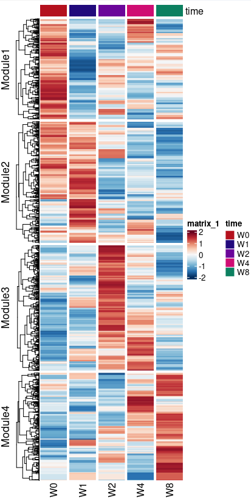
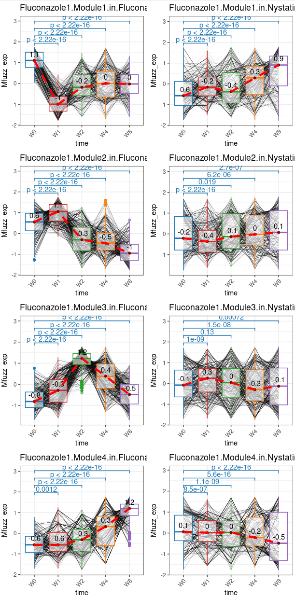
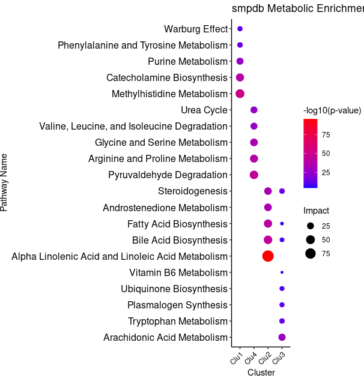
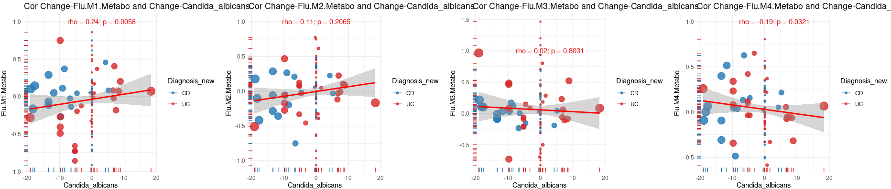
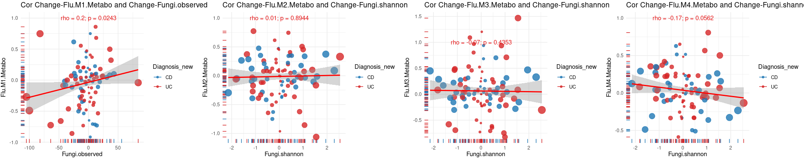
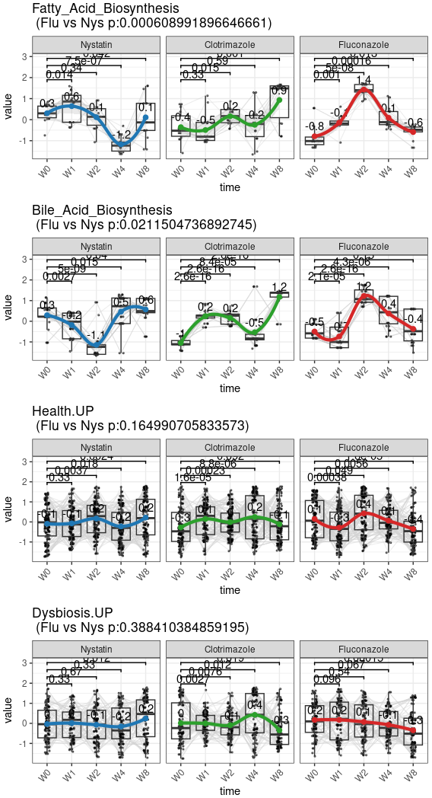
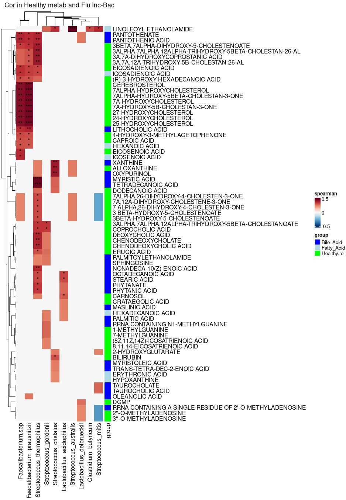
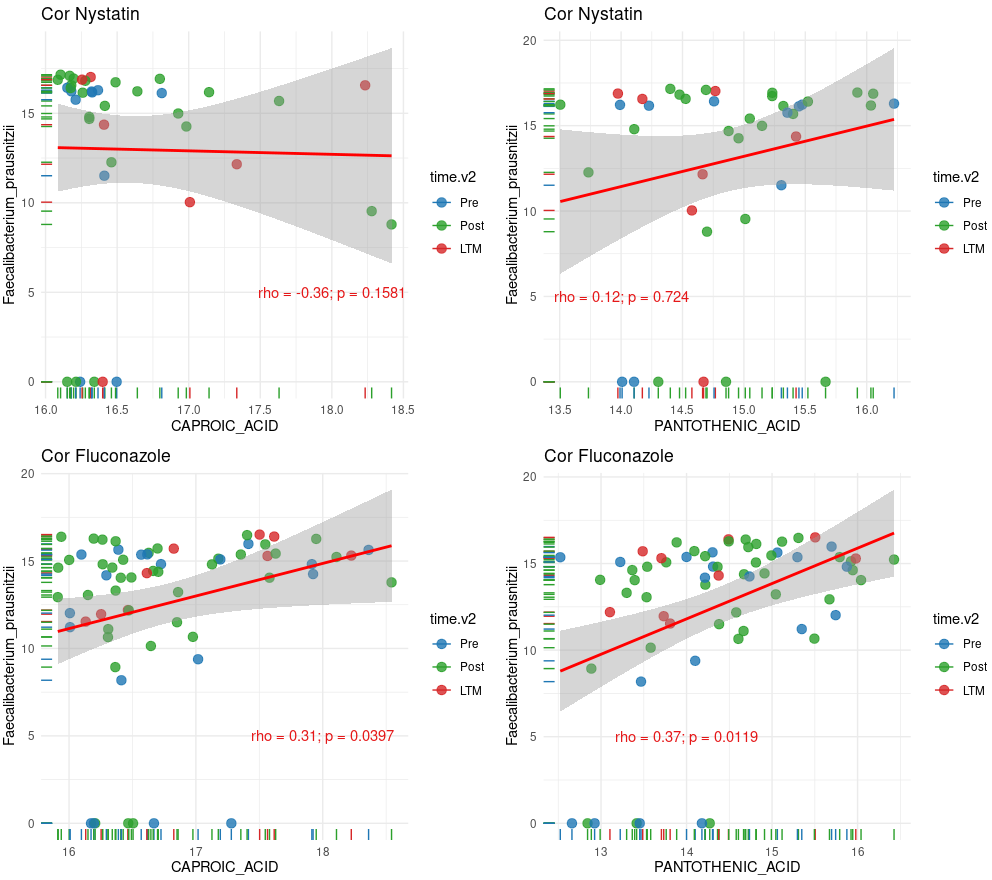
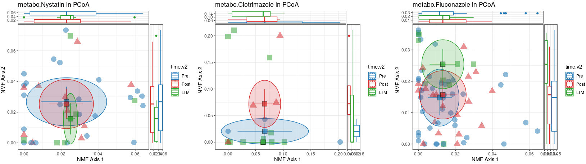

# 4.1 Main metabolomic Analysis: Data Processing, Visualization, and Statistical Testing

## Overview of Metabolomic Data Processing

This analysis focused on:

- **Clustering metabolic profiles**: Using **Mfuzz clustering** to group metabolites into functional modules.
- **Time-series trends**: Tracking metabolic changes at different treatment time points (W0, W1, W2, W4, W8).
- **Pathway enrichment analysis**: Identifying significant metabolic pathways affected by antifungal treatments.
- **Metabolite-microbiome correlations**: Assessing metabolite-bacteria associations across treatments.

## 4.1.1 Functional Metabolic Modules (Mfuzz Clustering)**

- **Figure 4.1**: **Heatmap of metabolite clusters** grouped into functional modules (Module1–Module4).
- **Figure 4.2**: **Temporal metabolomic changes in each module**, stratified by treatment.

~~~R
Mfuzz_cluster <- mcreadRDS("/mnt/d/xiangyu.ubuntu/workshop/MMC/sample_info/final_Res/Mfuzz_cluster_metabolomics.v3.rds")
bb <- colorRampPalette(jdb_palette("brewer_yes"))(101)
col_fun2 = colorRamp2(seq(-2,2, by = (4)/100), bb)
x <- 3
Mfuzz_order <- Mfuzz_cluster[[x]][[4]]
Mfuzz_order$Cluster <- gsub("Clu1","Module1",Mfuzz_order$Cluster)
Mfuzz_order$Cluster <- gsub("Clu4","Module2",Mfuzz_order$Cluster)
Mfuzz_order$Cluster <- gsub("Clu2","Module3",Mfuzz_order$Cluster)
Mfuzz_order$Cluster <- gsub("Clu3","Module4",Mfuzz_order$Cluster)
counts_tmp <- Mfuzz_cluster[[x]][[1]][Mfuzz_order$names,]
pdf("/mnt/d/xiangyu.ubuntu/projects/MMC/Figures/figures_making/v3/Fig4.1.pdf",width=6,height=10)
Heatmap(counts_tmp, cluster_rows = TRUE, cluster_columns = FALSE, top_annotation = Mfuzz_cluster[[x]][[2]], col = col_fun2, 
show_column_names = TRUE, show_row_names = FALSE,column_title = names(Mfuzz_cluster)[x], row_names_max_width = max_text_width(rownames(counts_tmp), gp = gpar(fontsize = 20)), 
column_split = Mfuzz_cluster[[x]][[3]]$time,row_split = factor(Mfuzz_order$Cluster,levels=c("Module1","Module2","Module3","Module4")), cluster_row_slices = FALSE, use_raster = TRUE, 
row_dend_reorder = TRUE, row_names_gp = gpar(fontsize = c(15)))
dev.off()
~~~

~~~R

All_dds <- mcreadRDS("/mnt/d/xiangyu.ubuntu/workshop/MMC/sample_info/final_Res/All_dds_metabolomics.v3.rds")
All_dds_merge <- mcreadRDS("/mnt/d/xiangyu.ubuntu/workshop/MMC/sample_info/final_Res/All_dds_merge_metabolomics.v3.rds")
library(reshape2)
names(All_dds_merge) <- c("Nystatin","Clotrimazole","Fluconazole")
Mfuzz_exp_quantify_scale_ <- lapply(1:length(All_dds_merge),function(x) {
    tmp <- All_dds_merge[[x]]
    meta <- colData(All_dds[[x]])
    tmp1 <- tmp[abs(tmp$W1_vs_W0.log_FC) > 0.1 |abs(tmp$W2_vs_W0.log_FC) > 0.1 | abs(tmp$W4_vs_W0.log_FC) > 0.1 | abs(tmp$W8_vs_W0.log_FC) > 0.1,]
    dim(tmp1)
    HWM <- unique(rownames(tmp1))
    sel_time <- c("W0","W1","W2","W4","W8")
    counts_tmp1_ <- lapply(1:length(sel_time),function(i) {
        counts <- as.matrix(tmp[HWM,rownames(meta[meta$time %in% sel_time[i],])])
        counts <- log(counts+1,2)
        counts_tmp <- as.data.frame(t(rowMeans(counts)))
        return(counts_tmp)
        })
    counts_tmp1 <- do.call(rbind,counts_tmp1_)
    rownames(counts_tmp1) <- sel_time
    counts_tmp1 <- as.matrix(as.data.frame(t(counts_tmp1)))
    counts.ZSCORE <- sweep(counts_tmp1 - rowMeans(counts_tmp1), 1, matrixStats::rowSds(counts_tmp1),`/`)

    Mfuzz_order <- Mfuzz_cluster[[x]][[4]]
    counts_ <- lapply(1:length(unique(Mfuzz_order$Cluster)),function(num) {
        counts_tmp <- counts.ZSCORE[Mfuzz_order[Mfuzz_order$Cluster==unique(Mfuzz_order$Cluster)[num],"names"],]
        counts_tmp <- melt(counts_tmp)
        counts_tmp$Cluster <- paste0(unique(Mfuzz_order$Cluster)[num])
        return(counts_tmp)
        })
    counts1 <- do.call(rbind,counts_)
    counts1$time <- counts1$Var2
    counts1$time <- factor(counts1$time,levels=c("W0","W1","W2","W4","W8"))
    counts1$treatment <- names(All_dds_merge)[x]
    return(counts1)
    })
Mfuzz_exp_quantify_scale <- do.call(rbind,Mfuzz_exp_quantify_scale_)
Mfuzz_exp_quantify_scale$treatment <- factor(Mfuzz_exp_quantify_scale$treatment,levels=c("Nystatin","Clotrimazole","Fluconazole"))
Mfuzz_exp_quantify_scale$Cluster <- gsub("Clu1","Module1",Mfuzz_exp_quantify_scale$Cluster)
Mfuzz_exp_quantify_scale$Cluster <- gsub("Clu4","Module2",Mfuzz_exp_quantify_scale$Cluster)
Mfuzz_exp_quantify_scale$Cluster <- gsub("Clu2","Module3",Mfuzz_exp_quantify_scale$Cluster)
Mfuzz_exp_quantify_scale$Cluster <- gsub("Clu3","Module4",Mfuzz_exp_quantify_scale$Cluster)
Fluconazole1 <- Mfuzz_exp_quantify_scale[Mfuzz_exp_quantify_scale$treatment=="Fluconazole",]
sel_Mod <- c("Module1","Module2","Module3","Module4")
plot1 <- lapply(1:length(sel_Mod),function(x) {
    Mfuzz_exp_quantify_scale1 <- Mfuzz_exp_quantify_scale[Mfuzz_exp_quantify_scale$treatment=="Fluconazole" & Mfuzz_exp_quantify_scale$Var1 %in% Fluconazole1[Fluconazole1$Cluster==sel_Mod[x],"Var1"],]
    p1 <- ggplot(Mfuzz_exp_quantify_scale1, aes(x=time, y=value, colour=time))+geom_line(aes(group = Var1),color="black",size = 0.1,alpha=0.1) + geom_boxplot(alpha=0.6) +ylab("Mfuzz_exp") +
    theme(axis.title.x=element_blank(), axis.text.x=element_text(angle=45,hjust=1,vjust=1,size=12), axis.text.y=element_text(size=12))+
    geom_signif(comparisons = comb,step_increase = 0.1,map_signif_level = F,test = wilcox.test_wrapper) + theme_bw()+ scale_color_manual(values = pal)+NoLegend()+theme(axis.text.x  = element_text(angle=45, vjust=1,hjust = 1))+
    labs(title=paste0("Fluconazole1.",sel_Mod[x],".in.Fluconazole1 group"))+stat_summary(fun.y=median, colour="black", geom="text", show_guide = FALSE,  vjust=-0.7, aes( label=round(..y.., digits=1)))+
    stat_summary(fun.y = median, geom="point",colour="darkred", size=1.5) + stat_summary(fun = median, geom = "line",aes(group = 1),col = "red",size=1.5, linetype = "dashed")
    return(p1)
    })
plot1 <- CombinePlots(c(plot1),ncol=1)
plot2 <- lapply(1:length(sel_Mod),function(x) {
    Mfuzz_exp_quantify_scale1 <- Mfuzz_exp_quantify_scale[Mfuzz_exp_quantify_scale$treatment=="Nystatin" & Mfuzz_exp_quantify_scale$Var1 %in% Fluconazole1[Fluconazole1$Cluster==sel_Mod[x],"Var1"],]
    p1 <- ggplot(Mfuzz_exp_quantify_scale1, aes(x=time, y=value, colour=time))+geom_line(aes(group = Var1),color="black",size = 0.1,alpha=0.1) + geom_boxplot(alpha=0.6) +ylab("Mfuzz_exp") +
    theme(axis.title.x=element_blank(), axis.text.x=element_text(angle=45,hjust=1,vjust=1,size=12), axis.text.y=element_text(size=12))+
    geom_signif(comparisons = comb,step_increase = 0.1,map_signif_level = F,test = wilcox.test_wrapper) + theme_bw()+ scale_color_manual(values = pal)+NoLegend()+theme(axis.text.x  = element_text(angle=45, vjust=1,hjust = 1))+
    labs(title=paste0("Fluconazole1.",sel_Mod[x],".in.Nystatin group"))+stat_summary(fun.y=median, colour="black", geom="text", show_guide = FALSE,  vjust=-0.7, aes( label=round(..y.., digits=1)))+
    stat_summary(fun.y = median, geom="point",colour="darkred", size=1.5) + stat_summary(fun = median, geom = "line",aes(group = 1),col = "red",size=1.5, linetype = "dashed")
    return(p1)
    })
plot2 <- CombinePlots(c(plot2),ncol=1)
plot <- CombinePlots(list(plot1,plot2),ncol=2)
ggsave("/mnt/d/xiangyu.ubuntu/projects/MMC/Figures/figures_making/v3/Fig4.2.svg", plot=plot,width = 4, height = 10,dpi=300)
~~~

## 4.1.3 Metabolic Pathway Enrichment Analysis

~~~R
enriche_smpdb.total1_res <- mcreadRDS("/mnt/d/xiangyu.ubuntu/workshop/MMC/sample_info/final_Res/cluster_metabolomics.smpdb.enrichment.rds")
enriche_smpdb.total1_res1 <- enriche_smpdb.total1_res[enriche_smpdb.total1_res$p_value < 0.05,]
enriche_smpdb.total1_res1 <- enriche_smpdb.total1_res1[enriche_smpdb.total1_res1$Pathway.Subject=="Metabolic",]
enriche_smpdb.total1_res1 <- enriche_smpdb.total1_res1[-grep("Phosphatidyleth",enriche_smpdb.total1_res1$pathway_name,value=FALSE),]
enriche_smpdb.total1_res1 <- enriche_smpdb.total1_res1[-grep("De Novo ",enriche_smpdb.total1_res1$pathway_name,value=FALSE),]
enriche_smpdb.total1_res1 <- enriche_smpdb.total1_res1[-grep(" PC",enriche_smpdb.total1_res1$pathway_name,value=FALSE),]
enriche_smpdb.total1_res1 <- enriche_smpdb.total1_res1[-grep(" CL",enriche_smpdb.total1_res1$pathway_name,value=FALSE),]
enriche_smpdb.total1_res1 <- enriche_smpdb.total1_res1[order(enriche_smpdb.total1_res1$Impact,decreasing=TRUE),]
# head(enriche_smpdb.total1_res1[enriche_smpdb.total1_res1$Cluster=="Clu3",])
unique(enriche_smpdb.total1_res1[enriche_smpdb.total1_res1$Cluster=="Clu1",]$pathway_name)
unique(enriche_smpdb.total1_res1[enriche_smpdb.total1_res1$Cluster=="Clu3",]$pathway_name)
Clu3 <- enriche_smpdb.total1_res1[enriche_smpdb.total1_res1$Cluster=="Clu3" & 
enriche_smpdb.total1_res1$pathway_name %in% c("Arachidonic Acid Metabolism","Tryptophan Metabolism","Bile Acid Biosynthesis","Steroidogenesis",
    "Plasmalogen Synthesis","Ubiquinone Biosynthesis","Vitamin B6 Metabolism","Fatty Acid Biosynthesis"),]
Clu1 <- enriche_smpdb.total1_res1[enriche_smpdb.total1_res1$Cluster=="Clu1" & 
enriche_smpdb.total1_res1$pathway_name %in% c("Catecholamine Biosynthesis","Methylhistidine Metabolism","Phenylalanine and Tyrosine Metabolism","Purine Metabolism",
    "Warburg Effect"),]
Clu4 <- enriche_smpdb.total1_res1[enriche_smpdb.total1_res1$Cluster=="Clu4",] %>% top_n(5, wt = Impact) %>% ungroup()
Clu2 <- enriche_smpdb.total1_res1[enriche_smpdb.total1_res1$Cluster=="Clu2",] %>% top_n(5, wt = Impact) %>% ungroup()
top_terms <- do.call(rbind,list(Clu3,Clu1,Clu4,Clu2))
# top_terms <- enriche_smpdb.total1_res1 %>% group_by(Cluster) %>% top_n(5, wt = Impact) %>% ungroup()
# top_terms <- enriche_smpdb.total1_res1[enriche_smpdb.total1_res1$pathway_name %in% unique(top_terms1$pathway_name),]
top_terms <- top_terms %>%arrange(Cluster, Impact) %>%
mutate(ordering = factor(pathway_name,levels = unique(pathway_name)[length(unique(pathway_name)):1]))
plot <- ggplot(top_terms, aes(x = Cluster,y = ordering,size = Impact,color = Impact)) +  geom_point() +
scale_color_gradient(low = "blue", high = "red", name = "-log10(p-value)") +scale_size_continuous(name = "Impact") +theme_classic() +
labs(title = "smpdb Metabolic Enrichment",x = "Cluster",y = "Pathway Name") + 
theme(axis.text.x = element_text(angle = 45, hjust = 1, color = "black", family = "Arial"),axis.text.y = element_text(size = 12, color = "black", family = "Arial"))
ggsave("/mnt/d/xiangyu.ubuntu/projects/MMC/Figures/figures_making/v3/Fig4.3.svg", plot=plot,width = 7, height = 6,dpi=300)
~~~

~~~R
enriche_smpdb.total1_res1$Cluster <- gsub("Clu1","Module1",enriche_smpdb.total1_res1$Cluster)
enriche_smpdb.total1_res1$Cluster <- gsub("Clu4","Module2",enriche_smpdb.total1_res1$Cluster)
enriche_smpdb.total1_res1$Cluster <- gsub("Clu2","Module3",enriche_smpdb.total1_res1$Cluster)
enriche_smpdb.total1_res1$Cluster <- gsub("Clu3","Module4",enriche_smpdb.total1_res1$Cluster)
write.csv(enriche_smpdb.total1_res1,"/mnt/d/xiangyu.ubuntu/projects/MMC/Figures/figures_making/v3/Metabolites.SMPDB.csv")
~~~

## 4.1.4 Correlation Between Metabolomic Changes and Candida/Fungal Dynamics

~~~R
ITS.Info.global3 <- mcreadRDS("/mnt/d/xiangyu.ubuntu/workshop/MMC/sample_info/final_Res/MMC.All.features.Info.gloibal.rds")
ITS.Info.global3$Flu.M4.Metabo <- ITS.Info.global3$Clu3
ITS.Info.global3$Flu.M2.Metabo <- ITS.Info.global3$Clu4
ITS.Info.global3$Flu.M3.Metabo <- ITS.Info.global3$Clu2
ITS.Info.global3$Flu.M1.Metabo <- ITS.Info.global3$Clu1
diease_Scores <- c("DAI","Candida","Candida_albicans","Fungi.shannon","Fungi.observed","pathogenic.fungi","pathogenic.Candida")
df1 <-ITS.Info.global3
df1$Candida_albicans <- log(df1$Candida_albicans+1,2)
sel_pa <- unique(df1$patient)
paired.df_ <- lapply(1:length(sel_pa),function(x) {
    tmp <- df1[df1$patient %in% sel_pa[x],]
    tmp[,"Flu.M4.Metabo"] <- tmp[,"Flu.M4.Metabo"]-tmp[tmp$time=="W0","Flu.M4.Metabo"]
    tmp[,"Flu.M2.Metabo"] <- tmp[,"Flu.M2.Metabo"]-tmp[tmp$time=="W0","Flu.M2.Metabo"]
    tmp[,"Flu.M3.Metabo"] <- tmp[,"Flu.M3.Metabo"]-tmp[tmp$time=="W0","Flu.M3.Metabo"]
    tmp[,"Flu.M1.Metabo"] <- tmp[,"Flu.M1.Metabo"]-tmp[tmp$time=="W0","Flu.M1.Metabo"]
    tmp[,"Candida"] <- tmp[,"Candida"]-tmp[tmp$time=="W0","Candida"]
    tmp[,"Candida_albicans"] <- tmp[,"Candida_albicans"]-tmp[tmp$time=="W0","Candida_albicans"]
    tmp[,"Fungi.shannon"] <- tmp[,"Fungi.shannon"]-tmp[tmp$time=="W0","Fungi.shannon"]
    tmp[,"Fungi.observed"] <- tmp[,"Fungi.observed"]-tmp[tmp$time=="W0","Fungi.observed"]
    tmp[,"pathogenic.fungi"] <- tmp[,"pathogenic.fungi"]-tmp[tmp$time=="W0","pathogenic.fungi"]
    tmp[,"pathogenic.Candida"] <- tmp[,"pathogenic.Candida"]-tmp[tmp$time=="W0","pathogenic.Candida"]
    return(tmp)
})
paired.df <- do.call(rbind,paired.df_)
paired.df$abs.Candida <- abs(paired.df$Candida)
paired.df$abs.Ca <- abs(paired.df$Candida_albicans)
paired.df$abs.Fungi.observed <- abs(paired.df$Fungi.observed)
paired.df$abs.Fungi.shannon <- abs(paired.df$Fungi.shannon)
pal <- jdb_palette("corona")
total.lm <- lm(Candida_albicans ~ Flu.M1.Metabo, data = paired.df)
p1 <- ggplot(paired.df, aes_string(x = "Candida_albicans",y = "Flu.M1.Metabo",  color = "Diagnosis_new",size="abs.Ca"))+ geom_rug(size=0.5)+ geom_point(alpha = 0.8) +  
geom_smooth(method = "lm", se = TRUE, color="red") + scale_color_manual(values = pal)+  theme_minimal() + theme(legend.position = "right")+
scale_size_continuous(range = c(1, 6), guide = "none") + labs(x = "Candida_albicans", y = "Flu.M1.Metabo", title = paste0("Cor Change-Flu.M1.Metabo and Change-Candida_albicans")) +  
annotate("text", x =3, y = 1, color = "#E51718", label = paste0("rho = ", round(cor(total.lm$model$Flu.M1.Metabo, total.lm$model$Candida_albicans, method = "spearman"),2),
    "; p = ", round(cor.test(total.lm$model$Flu.M1.Metabo, total.lm$model$Candida_albicans, method = "spearman")$p.value,4)))
total.lm <- lm(Candida_albicans ~ Flu.M2.Metabo, data = paired.df)
p2 <- ggplot(paired.df, aes_string(x = "Candida_albicans",y = "Flu.M2.Metabo",  color = "Diagnosis_new",size="abs.Ca"))+ geom_rug(size=0.5)+ geom_point(alpha = 0.8) +  
geom_smooth(method = "lm", se = TRUE, color="red") + scale_color_manual(values = pal)+  theme_minimal() + theme(legend.position = "right")+
scale_size_continuous(range = c(1, 6), guide = "none") + labs(x = "Candida_albicans", y = "Flu.M2.Metabo", title = paste0("Cor Change-Flu.M2.Metabo and Change-Candida_albicans")) +  
annotate("text", x = 0, y = 1, color = "#E51718", label = paste0("rho = ", round(cor(total.lm$model$Flu.M2.Metabo, total.lm$model$Candida_albicans, method = "spearman"),2),
    "; p = ", round(cor.test(total.lm$model$Flu.M2.Metabo, total.lm$model$Candida_albicans, method = "spearman")$p.value,4)))
total.lm <- lm(Candida_albicans ~ Flu.M3.Metabo, data = paired.df)
p3 <- ggplot(paired.df, aes_string(x = "Candida_albicans",y = "Flu.M3.Metabo",  color = "Diagnosis_new",size="abs.Ca"))+ geom_rug(size=0.5)+ geom_point(alpha = 0.8) +  
geom_smooth(method = "lm", se = TRUE, color="red") + scale_color_manual(values = pal)+  theme_minimal() + theme(legend.position = "right")+
scale_size_continuous(range = c(1, 6), guide = "none") + labs(x = "Candida_albicans", y = "Flu.M3.Metabo", title = paste0("Cor Change-Flu.M3.Metabo and Change-Candida_albicans")) +  
annotate("text", x =3, y = 1, color = "#E51718", label = paste0("rho = ", round(cor(total.lm$model$Flu.M3.Metabo, total.lm$model$Candida_albicans, method = "spearman"),2),
    "; p = ", round(cor.test(total.lm$model$Flu.M3.Metabo, total.lm$model$Candida_albicans, method = "spearman")$p.value,4)))
total.lm <- lm(Candida_albicans ~ Flu.M4.Metabo, data = paired.df)
p4 <- ggplot(paired.df, aes_string(x = "Candida_albicans",y = "Flu.M4.Metabo",  color = "Diagnosis_new",size="abs.Ca"))+ geom_rug(size=0.5)+ geom_point(alpha = 0.8) +  
geom_smooth(method = "lm", se = TRUE, color="red") + scale_color_manual(values = pal)+  theme_minimal() + theme(legend.position = "right")+
scale_size_continuous(range = c(1, 6), guide = "none") + labs(x = "Candida_albicans", y = "Flu.M4.Metabo", title = paste0("Cor Change-Flu.M4.Metabo and Change-Candida_albicans")) +  
annotate("text", x = 3, y = 1, color = "#E51718", label = paste0("rho = ", round(cor(total.lm$model$Flu.M4.Metabo, total.lm$model$Candida_albicans, method = "spearman"),2),
    "; p = ", round(cor.test(total.lm$model$Flu.M4.Metabo, total.lm$model$Candida_albicans, method = "spearman")$p.value,4)))
plot <- plot_grid(p1,p2,p3,p4,nrow=1)
ggsave("/mnt/d/xiangyu.ubuntu/projects/MMC/Figures/figures_making/v3/Fig4.4.svg", plot=plot,width = 27, height = 6,dpi=300)
~~~

~~~R

total.lm <- lm(Fungi.observed ~ Flu.M1.Metabo, data = paired.df)
p1 <- ggplot(paired.df, aes_string(x = "Fungi.observed",y = "Flu.M1.Metabo",  color = "Diagnosis_new",size="abs.Fungi.observed"))+ geom_rug(size=0.5)+ geom_point(alpha = 0.8) +  
geom_smooth(method = "lm", se = TRUE, color="red") + scale_color_manual(values = pal)+  theme_minimal() + theme(legend.position = "right")+
scale_size_continuous(range = c(1, 6), guide = "none") + labs(x = "Fungi.observed", y = "Flu.M1.Metabo", title = paste0("Cor Change-Flu.M1.Metabo and Change-Fungi.observed")) +  
annotate("text", x =0, y = 1, color = "#E51718", label = paste0("rho = ", round(cor(total.lm$model$Flu.M1.Metabo, total.lm$model$Fungi.observed, method = "spearman"),2),
    "; p = ", round(cor.test(total.lm$model$Flu.M1.Metabo, total.lm$model$Fungi.observed, method = "spearman")$p.value,4)))
total.lm <- lm(Fungi.shannon ~ Flu.M2.Metabo, data = paired.df)
p2 <- ggplot(paired.df, aes_string(x = "Fungi.shannon",y = "Flu.M2.Metabo",  color = "Diagnosis_new",size="abs.Fungi.shannon"))+ geom_rug(size=0.5)+ geom_point(alpha = 0.8) +  
geom_smooth(method = "lm", se = TRUE, color="red") + scale_color_manual(values = pal)+  theme_minimal() + theme(legend.position = "right")+
scale_size_continuous(range = c(1, 6), guide = "none") + labs(x = "Fungi.shannon", y = "Flu.M2.Metabo", title = paste0("Cor Change-Flu.M2.Metabo and Change-Fungi.shannon")) +  
annotate("text", x = 0, y = 1, color = "#E51718", label = paste0("rho = ", round(cor(total.lm$model$Flu.M2.Metabo, total.lm$model$Fungi.shannon, method = "spearman"),2),
    "; p = ", round(cor.test(total.lm$model$Flu.M2.Metabo, total.lm$model$Fungi.shannon, method = "spearman")$p.value,4)))
total.lm <- lm(Fungi.shannon ~ Flu.M3.Metabo, data = paired.df)
p3 <- ggplot(paired.df, aes_string(x = "Fungi.shannon",y = "Flu.M3.Metabo",  color = "Diagnosis_new",size="abs.Fungi.shannon"))+ geom_rug(size=0.5)+ geom_point(alpha = 0.8) +  
geom_smooth(method = "lm", se = TRUE, color="red") + scale_color_manual(values = pal)+  theme_minimal() + theme(legend.position = "right")+
scale_size_continuous(range = c(1, 6), guide = "none") + labs(x = "Fungi.shannon", y = "Flu.M3.Metabo", title = paste0("Cor Change-Flu.M3.Metabo and Change-Fungi.shannon")) +  
annotate("text", x =0, y = 1, color = "#E51718", label = paste0("rho = ", round(cor(total.lm$model$Flu.M3.Metabo, total.lm$model$Fungi.shannon, method = "spearman"),2),
    "; p = ", round(cor.test(total.lm$model$Flu.M3.Metabo, total.lm$model$Fungi.shannon, method = "spearman")$p.value,4)))
total.lm <- lm(Fungi.shannon ~ Flu.M4.Metabo, data = paired.df)
p4 <- ggplot(paired.df, aes_string(x = "Fungi.shannon",y = "Flu.M4.Metabo",  color = "Diagnosis_new",size="abs.Fungi.shannon"))+ geom_rug(size=0.5)+ geom_point(alpha = 0.8) +  
geom_smooth(method = "lm", se = TRUE, color="red") + scale_color_manual(values = pal)+  theme_minimal() + theme(legend.position = "right")+
scale_size_continuous(range = c(1, 6), guide = "none") + labs(x = "Fungi.shannon", y = "Flu.M4.Metabo", title = paste0("Cor Change-Flu.M4.Metabo and Change-Fungi.shannon")) +  
annotate("text", x = 0, y = 1, color = "#E51718", label = paste0("rho = ", round(cor(total.lm$model$Flu.M4.Metabo, total.lm$model$Fungi.shannon, method = "spearman"),2),
    "; p = ", round(cor.test(total.lm$model$Flu.M4.Metabo, total.lm$model$Fungi.shannon, method = "spearman")$p.value,4)))
plot <- plot_grid(p1,p2,p3,p4,nrow=1)
ggsave("/mnt/d/xiangyu.ubuntu/projects/MMC/Figures/figures_making/v3/Fig4.5.svg", plot=plot,width = 27, height = 6,dpi=300)
~~~

## 4.1.5 Host-Microbiome Metabolite Associations

~~~R
All_dds <- mcreadRDS("/mnt/d/xiangyu.ubuntu/workshop/MMC/sample_info/final_Res/All_dds_metabolomics.v3.rds")
All_dds_merge <- mcreadRDS("/mnt/d/xiangyu.ubuntu/workshop/MMC/sample_info/final_Res/All_dds_merge_metabolomics.v3.rds")
Nature.Dysbiosis.metabolomic <- read.csv("/mnt/d/xiangyu.ubuntu/workshop/MMC/nature.Dysbiosis.metabolomic.csv")
Nature.Dysbiosis.metabolomic1 <- Nature.Dysbiosis.metabolomic[!is.na(Nature.Dysbiosis.metabolomic$HMDB),]
Nature.Dysbiosis.metabolomic1 <- Nature.Dysbiosis.metabolomic1[Nature.Dysbiosis.metabolomic1$HMDB %in% rowData(All_dds[[3]])$HMDB_ID,]
Health.UP.HMDB <- Nature.Dysbiosis.metabolomic1[Nature.Dysbiosis.metabolomic1$Dysbiosis.Coefficient..non.IBD. > 0,]$HMDB
Health.UP.ChEBI <- Nature.Dysbiosis.metabolomic1[Nature.Dysbiosis.metabolomic1$Dysbiosis.Coefficient..non.IBD. > 0,]$ChEBI
Health.UP.KEGG <- Nature.Dysbiosis.metabolomic1[Nature.Dysbiosis.metabolomic1$Dysbiosis.Coefficient..non.IBD. > 0,]$KEGG
Health.UP <- setdiff(c(Health.UP.HMDB,Health.UP.ChEBI,Health.UP.KEGG),NA)
Health.UP1 <- rownames(rowData(All_dds[[3]]))[rowData(All_dds[[3]])$HMDB_ID %in% intersect(Health.UP,rowData(All_dds[[3]])$HMDB_ID)]
Health.UP2 <- rownames(rowData(All_dds[[3]]))[rowData(All_dds[[3]])$KEGG_ID %in% intersect(Health.UP,rowData(All_dds[[3]])$KEGG_ID)]
Health.UP3 <- rownames(rowData(All_dds[[3]]))[rowData(All_dds[[3]])$CHEBI_ID %in% intersect(Health.UP,rowData(All_dds[[3]])$CHEBI_ID)]
Health.UP <- sort(unique(c(Health.UP1,Health.UP2,Health.UP3)))
Dysbiosis.UP.HMDB <- Nature.Dysbiosis.metabolomic1[Nature.Dysbiosis.metabolomic1$Dysbiosis.Coefficient..non.IBD. < 0,]$HMDB
Dysbiosis.UP.ChEBI <- Nature.Dysbiosis.metabolomic1[Nature.Dysbiosis.metabolomic1$Dysbiosis.Coefficient..non.IBD. < 0,]$ChEBI
Dysbiosis.UP.KEGG <- Nature.Dysbiosis.metabolomic1[Nature.Dysbiosis.metabolomic1$Dysbiosis.Coefficient..non.IBD. < 0,]$KEGG
Dysbiosis.UP <- setdiff(c(Dysbiosis.UP.HMDB,Dysbiosis.UP.ChEBI,Dysbiosis.UP.KEGG),NA)
Dysbiosis.UP1 <- rownames(rowData(All_dds[[3]]))[rowData(All_dds[[3]])$HMDB_ID %in% intersect(Dysbiosis.UP,rowData(All_dds[[3]])$HMDB_ID)]
Dysbiosis.UP2 <- rownames(rowData(All_dds[[3]]))[rowData(All_dds[[3]])$KEGG_ID %in% intersect(Dysbiosis.UP,rowData(All_dds[[3]])$KEGG_ID)]
Dysbiosis.UP3 <- rownames(rowData(All_dds[[3]]))[rowData(All_dds[[3]])$CHEBI_ID %in% intersect(Dysbiosis.UP,rowData(All_dds[[3]])$CHEBI_ID)]
Dysbiosis.UP <- sort(unique(c(Dysbiosis.UP1,Dysbiosis.UP2,Dysbiosis.UP3)))
length(Health.UP)
length(Dysbiosis.UP)

Fatty_Acid_Biosynthesis <- c("ACETOACETATE","ACETOACETIC ACID","OCTANOIC ACID","CAPRYLIC ACID","DECANOIC ACID","CAPRIC ACID","DODECANOIC ACID","TRANS-TETRA-DEC-2-ENOIC ACID","TETRADECANOIC ACID","MYRISTIC ACID","TRANS-HEXA-DEC-2-ENOIC ACID","HEXADECANOIC ACID","PALMITIC ACID","(R)-3-HYDROXY-HEXADECANOIC ACID")
Bile_Acid_Biosynthesis <- c("HEXADECANOIC ACID","PALMITIC ACID","LITHOCHOLIC ACID","CHENODEOXYCHOLATE","CHENODEOXYCHOLIC ACID","DEOXYCHOLIC ACID","7ALPHA-HYDROXYCHOLESTEROL","7ALPHA-HYDROXY-5BETA-CHOLESTAN-3-ONE","CEREBROSTEROL","25-HYDROXYCHOLESTEROL","24-HYDROXYCHOLESTEROL","7A-HYDROXYCHOLESTEROL","27-HYDROXYCHOLESTEROL","7A-HYDROXY-5B-CHOLESTAN-3-ONE","3BETA-HYDROXY-5-CHOLESTENOATE","7ALPHA,26-DIHYDROXY-4-CHOLESTEN-3-ONE","7 ALPHA,26-DIHYDROXY-4-CHOLESTEN-3-ONE","7A,12A-DIHYDROXY-CHOLESTENE-3-ONE","3 BETA-HYDROXY-5-CHOLESTENOATE","3BETA,7ALPHA-DIHYDROXY-5-CHOLESTENOATE","3ALPHA,7ALPHA,12ALPHA-TRIHYDROXY-5BETA-CHOLESTAN-26-AL","3A,7A-DIHYDROXYCOPROSTANIC ACID","3A,7A,12A-TRIHYDROXY-5B-CHOLESTAN-26-AL","GLYCOCHENODEOXYCHOLATE","DEOXYCHOLIC ACID GLYCINE CONJUGATE","CHENODEOXYCHOLIC ACID GLYCINE CONJUGATE","3ALPHA,7ALPHA,12ALPHA-TRIHYDROXY-5BETA-CHOLESTANOATE","COPROCHOLIC ACID")
All_gene <- list(Fatty_Acid_Biosynthesis,Bile_Acid_Biosynthesis,Health.UP,Dysbiosis.UP)
names(All_gene) <- c("Fatty_Acid_Biosynthesis","Bile_Acid_Biosynthesis","Health.UP","Dysbiosis.UP")
HWM <- unique(c(Fatty_Acid_Biosynthesis,Bile_Acid_Biosynthesis,Health.UP,Dysbiosis.UP))
library(reshape2)
names(All_dds_merge) <- c("Nystatin","Clotrimazole","Fluconazole")
quantify_scale1_ <- lapply(1:length(All_dds_merge),function(x) {
    rowData <- as.data.frame(rowData(All_dds[[x]]))
    tmp <- All_dds_merge[[x]][rownames(rowData),]
    meta <- colData(All_dds[[x]])
    sel_time <- c("W0","W1","W2","W4","W8")
    counts_tmp1_ <- lapply(1:length(sel_time),function(i) {
        counts <- as.matrix(tmp[HWM,rownames(meta[meta$time %in% sel_time[i],])])
        counts <- log(counts+1,2)
        counts_tmp <- as.data.frame(t(rowMeans(counts)))
        return(counts_tmp)
        })
    counts_tmp1 <- do.call(rbind,counts_tmp1_)
    rownames(counts_tmp1) <- sel_time
    counts_tmp1 <- as.matrix(as.data.frame(t(counts_tmp1)))
    counts.ZSCORE <- sweep(counts_tmp1 - rowMeans(counts_tmp1), 1, matrixStats::rowSds(counts_tmp1),`/`)

    counts_ <- lapply(1:length(All_gene),function(num) {
        counts_tmp <- counts.ZSCORE[All_gene[[num]],]
        counts_tmp <- melt(counts_tmp)
        counts_tmp$Cluster <- names(All_gene)[num]
        return(counts_tmp)
        })
    counts1 <- do.call(rbind,counts_)
    counts1$time <- counts1$Var2
    counts1$time <- factor(counts1$time,levels=c("W0","W1","W2","W4","W8"))
    counts1$treatment <- names(All_dds_merge)[x]
    return(counts1)
    })
quantify_scale1 <- do.call(rbind,quantify_scale1_)
quantify_scale1$treatment <- factor(quantify_scale1$treatment,levels=c("Nystatin","Clotrimazole","Fluconazole"))
comb <- list(c("W0","W1"),c("W0","W2"),c("W0","W4"),c("W0","W8"))
pal <- jdb_palette("corona")[c(1,3,2)]
total_plots2 <- lapply(1:length(names(All_gene)),function(x) {
    quantify_scale2 <- quantify_scale1[quantify_scale1$Cluster==names(All_gene)[x],]
    df_paired2 <- quantify_scale2
    df_paired2$time <- as.numeric(gsub("W","",df_paired2$time))
    loess_fit_1 <- loess(value ~ time, data = df_paired2[df_paired2$treatment == "Nystatin", ])
    loess_fit_2 <- loess(value ~ time, data = df_paired2[df_paired2$treatment == "Fluconazole", ])
    x_range <- seq(min(df_paired2$time), max(df_paired2$time), length.out = 100)
    pred_1 <- predict(loess_fit_1, newdata = data.frame(time = x_range))
    pred_2 <- predict(loess_fit_2, newdata = data.frame(time = x_range))
    ks_test_result <- ks.test(pred_1, pred_2)$p.value

    rss_1 <- sum((df_paired2[df_paired2$treatment == "Nystatin", "value"] - predict(loess_fit_1))^2)
    rss_2 <- sum((df_paired2[df_paired2$treatment == "Fluconazole", "value"] - predict(loess_fit_2))^2)
    n1 <- length(df_paired2[df_paired2$treatment == "Nystatin", "value"])  # Sample size group 1
    n2 <- length(df_paired2[df_paired2$treatment == "Fluconazole", "value"])  # Sample size group 2
    f_stat <- (rss_1 / (n1 - 2)) / (rss_2 / (n2 - 2))
    Ftestp_value <- pf(f_stat, df1 = n1 - 2, df2 = n2 - 2, lower.tail = FALSE)# Perform an F-test

    plot <- ggplot(quantify_scale2, aes(x=time, y=value))+geom_line(aes(group = Var1),color="lightgrey",size = 0.4,alpha=0.4) +
    geom_jitter(color="black",width = 0.1,alpha=0.5,size=0.5) + geom_boxplot(outlier.shape = NA,alpha=0) +
    theme(axis.title.x=element_blank(), axis.text.x=element_text(angle=45,hjust=1,vjust=1,size=12), axis.text.y=element_text(size=12))+
    facet_wrap(~treatment,ncol=3,scales="free_x")+
    geom_signif(comparisons = comb,step_increase = 0.1,map_signif_level = F,test = ks.test_wrapper) + theme_bw()+ 
    scale_color_manual(values = pal)+NoLegend()+theme(axis.text.x  = element_text(angle=45, vjust=1,hjust = 1))+
    labs(title=paste0(names(All_gene)[x],"\n (Flu vs Nys p:",Ftestp_value,")"))+stat_summary(fun.y=mean, colour="black", geom="text", show_guide = FALSE,  vjust=-0.7, aes( label=round(..y.., digits=1)))+
    geom_smooth(aes(group = 1, color = treatment), method = "loess", size = 1.5, se = TRUE,alpha=0.2)+
    stat_summary(fun = mean, geom = "point",aes(group = 1,color = treatment),size=2)
    return(plot)
    })
plot <- CombinePlots(c(total_plots2),ncol=1)
ggsave("/mnt/d/xiangyu.ubuntu/projects/MMC/Figures/figures_making/v3/Fig4.6.svg", plot=plot,width = 6, height = 12,dpi=300)
~~~

## 4.1.6 Treatment-Specific Correlation Between Probiotic Bacteria and Metabolites

~~~R
metabolomics.samples_info1 <- mcreadRDS("/mnt/d/xiangyu.ubuntu/workshop/MMC/sample_info/final_Res/metabolomics.samples_info1.v3.rds")
dds_counts <- mcreadRDS("/mnt/d/xiangyu.ubuntu/workshop/MMC/sample_info/final_Res/metabolomics_hits.counts.v3.rds")
All_dds <- mcreadRDS("/mnt/d/xiangyu.ubuntu/workshop/MMC/sample_info/final_Res/All_dds_metabolomics.v2.rds")
relativeAb_all <- mcreadRDS("/mnt/d/xiangyu.ubuntu/workshop/MMC/sample_info/final_Res/MMC.METAG.relativeAb_all.v2.rds")
colnames(relativeAb_all) <- gsub("F","",colnames(relativeAb_all))
relativeAb_all <- relativeAb_all[,!duplicated(colnames(relativeAb_all))]
relativeAb_all[grep("Leuconostoc.spp",relativeAb_all$names,value=FALSE),]
relativeAb_all1 <- relativeAb_all[relativeAb_all$type=="Species",]
relativeAb_all1$names <- gsub("_1","",relativeAb_all1$names)
Type <- unique(relativeAb_all1$names)
relativeAb_all1_ <- lapply(1:length(Type),function(x) {
    tmp_counts <- relativeAb_all1[relativeAb_all1$names==Type[x],grep("MMC",colnames(relativeAb_all1),value=FALSE)]
    if (nrow(tmp_counts)==1){tmp_counts <- tmp_counts} else {
        tmp_counts <- as.data.frame(t(colSums(tmp_counts)))
    }
    tmp_counts
    })
relativeAb_all1 <- do.call(rbind,relativeAb_all1_)
rownames(relativeAb_all1) <- Type
Mfuzz_cluster <- mcreadRDS("/mnt/d/xiangyu.ubuntu/workshop/MMC/sample_info/final_Res/Mfuzz_cluster_metabolomics.v3.rds")
Flu_dyn <- Mfuzz_cluster[[3]][[4]]
HVMetab.Flu <- Flu_dyn[Flu_dyn$Cluster %in% c("Clu2","Clu3"),"names"]
Inc_Bac <- mcreadRDS("/mnt/d/xiangyu.ubuntu/workshop/MMC/sample_info/final_Res/MMC.METAG.inc_all.lefser.v2.rds")
Inc_Bac.Flu <- unique(gsub("_1","",Inc_Bac[[3]]))
Inc_Bac <- mcreadRDS("/mnt/d/xiangyu.ubuntu/workshop/MMC/sample_info/final_Res/MMC.METAG.inc_all.raw.rds")
Inc_Bac.Flu <- unique(gsub("_1","",Inc_Bac[[3]]))
both_id <- intersect(colnames(dds_counts),colnames(relativeAb_all1))
dds_counts1 <- dds_counts[,both_id]
relativeAb_all2 <- relativeAb_all1[,both_id]
metabolomics.samples_info2 <- metabolomics.samples_info1[both_id,]
dds_counts1 <- log(dds_counts1+1,2)
relativeAb_all2 <- log(relativeAb_all2+1,2)
metabolomics.samples_info2$time <- as.character(metabolomics.samples_info2$time)
table(metabolomics.samples_info2$treatment,metabolomics.samples_info2$time)
library("data.table")
library(psych)
library("Hmisc")
flattenCorrMatrix <- function(cormat, pmat, padjmat) {
  ut <- upper.tri(cormat)
  data.frame(
    row = rownames(cormat)[row(cormat)[ut]],
    column = rownames(cormat)[col(cormat)[ut]],
    cor  =(cormat)[ut],
    p  =pmat[ut],
    p.adj = padjmat[ut]
    )
}

metabolomics.samples_info.Nystatin <- metabolomics.samples_info2[metabolomics.samples_info2$treatment=="Nystatin",]
Nystatin.merge_obj <- rbind(dds_counts1[,rownames(metabolomics.samples_info.Nystatin)],relativeAb_all2[,rownames(metabolomics.samples_info.Nystatin)])
metabolomics.samples_info.Fluconazole <- metabolomics.samples_info2[metabolomics.samples_info2$treatment=="Fluconazole",]
Fluconazole.merge_obj <- rbind(dds_counts1[,rownames(metabolomics.samples_info.Fluconazole)],relativeAb_all2[,rownames(metabolomics.samples_info.Fluconazole)])
Nystatin <- mcreadRDS("/mnt/d/xiangyu.ubuntu/workshop/MMC/sample_info/final_Res/Nystatin.cor_all.rds")
Nystatin.p_adjusted.ma<-Nystatin[[1]]
Nystatin.cor_all<-Nystatin[[2]]
Fluconazole <- mcreadRDS("/mnt/d/xiangyu.ubuntu/workshop/MMC/sample_info/final_Res/Fluconazole.cor_all.rds")
Fluconazole.p_adjusted.ma<-Fluconazole[[1]]
Fluconazole.cor_all<-Fluconazole[[2]]
probiotic <- c(grep("Clostridium",Inc_Bac.Flu,value=TRUE),"Lactobacillus","Lactobacillus_acidophilus","Bifidobacteriales","Streptococcus_thermophilus","Bacillus",
    grep("Streptococcus",Inc_Bac.Flu,value=TRUE),grep("Lactobacillus",Inc_Bac.Flu,value=TRUE),grep("Bifidobacteriales",Inc_Bac.Flu,value=TRUE),
    grep("Faecalibacterium",Inc_Bac.Flu,value=TRUE),grep("Bacillus",Inc_Bac.Flu,value=TRUE))
Fatty_Acid_Biosynthesis <- c(c("BUTYRIC ACID","PROPIONIC ACID","VALERIC ACID"),"ACETOACETATE","ACETOACETIC ACID","OCTANOIC ACID","CAPRYLIC ACID","DECANOIC ACID","CAPRIC ACID","DODECANOIC ACID","TRANS-TETRA-DEC-2-ENOIC ACID","TETRADECANOIC ACID","MYRISTIC ACID","TRANS-HEXA-DEC-2-ENOIC ACID","HEXADECANOIC ACID","PALMITIC ACID","(R)-3-HYDROXY-HEXADECANOIC ACID")
Bile_Acid_Biosynthesis <- c("LITHOCHOLIC ACID","CHENODEOXYCHOLATE","CHENODEOXYCHOLIC ACID","DEOXYCHOLIC ACID","7ALPHA-HYDROXYCHOLESTEROL","7ALPHA-HYDROXY-5BETA-CHOLESTAN-3-ONE","CEREBROSTEROL","25-HYDROXYCHOLESTEROL","24-HYDROXYCHOLESTEROL","7A-HYDROXYCHOLESTEROL","27-HYDROXYCHOLESTEROL","7A-HYDROXY-5B-CHOLESTAN-3-ONE","3BETA-HYDROXY-5-CHOLESTENOATE","7ALPHA,26-DIHYDROXY-4-CHOLESTEN-3-ONE","7 ALPHA,26-DIHYDROXY-4-CHOLESTEN-3-ONE","7A,12A-DIHYDROXY-CHOLESTENE-3-ONE","3 BETA-HYDROXY-5-CHOLESTENOATE","3BETA,7ALPHA-DIHYDROXY-5-CHOLESTENOATE","3ALPHA,7ALPHA,12ALPHA-TRIHYDROXY-5BETA-CHOLESTAN-26-AL","3A,7A-DIHYDROXYCOPROSTANIC ACID","3A,7A,12A-TRIHYDROXY-5B-CHOLESTAN-26-AL","GLYCOCHENODEOXYCHOLATE","DEOXYCHOLIC ACID GLYCINE CONJUGATE","CHENODEOXYCHOLIC ACID GLYCINE CONJUGATE","3ALPHA,7ALPHA,12ALPHA-TRIHYDROXY-5BETA-CHOLESTANOATE","COPROCHOLIC ACID")
Health.UP1 <- intersect(HVMetab.Flu,Health.UP)
Fatty_Acid <- intersect(Fatty_Acid_Biosynthesis,HVMetab.Flu)
Bile_Acid <- intersect(Bile_Acid_Biosynthesis,HVMetab.Flu)
intersect(Fatty_Acid,Bile_Acid)
Health.UP2 <- setdiff(Health.UP1,c(Fatty_Acid,Bile_Acid))
metabolites2 <- data.frame(row.names=c(Health.UP2,Fatty_Acid,Bile_Acid),group=c(rep("Healthy.rel",length(Health.UP2)),rep("Fatty_Acid",length(Fatty_Acid)),rep("Bile_Acid",length(Bile_Acid))))

Nystatin.cor_all1 <- Nystatin.cor_all[Nystatin.cor_all$row %in% rownames(metabolites2),]
Nystatin.cor_all1 <- Nystatin.cor_all1[Nystatin.cor_all1$column %in% probiotic,]
rownames(Nystatin.cor_all1) <- paste0(Nystatin.cor_all1$row,"_",Nystatin.cor_all1$column)
Nystatin.cor_all1$cor[is.na(Nystatin.cor_all1$cor)] <- 0
Fluconazole.cor_all1 <- Fluconazole.cor_all[Fluconazole.cor_all$row %in% rownames(metabolites2),]
Fluconazole.cor_all1 <- Fluconazole.cor_all1[Fluconazole.cor_all1$column %in% probiotic,]
rownames(Fluconazole.cor_all1) <- paste0(Fluconazole.cor_all1$row,"_",Fluconazole.cor_all1$column)
Fluconazole.cor_all1$cor.Flu.vs.Nys <- Fluconazole.cor_all1$cor-Nystatin.cor_all1[rownames(Fluconazole.cor_all1),]$cor
setdiff(rownames(Nystatin.cor_all1),rownames(Fluconazole.cor_all1))
setdiff(rownames(Fluconazole.cor_all1),rownames(Nystatin.cor_all1))
Fluconazole.cor_all2 <- Fluconazole.cor_all1[Fluconazole.cor_all1$cor.Flu.vs.Nys > 0 & Fluconazole.cor_all1$p < 0.05,]
Fluconazole.cor_all2[Fluconazole.cor_all2$column=="LITHOCHOLIC_ACID" &Fluconazole.cor_all2$row=="Faecalibacterium_prausnitzii", ]
Fluconazole.cor_all.total <- reshape2::dcast(Fluconazole.cor_all2,row~column,value.var = "cor", fill=0)
rownames(Fluconazole.cor_all.total) <- Fluconazole.cor_all.total$row
cor_all.total <- Fluconazole.cor_all.total[,-1]
cor_all.total[cor_all.total>0.5] <- 0.5
cor_all.total[cor_all.total< -0.5] <- -0.5
bb <- colorRampPalette(jdb_palette("brewer_yes"))(101)
col_fun2 = colorRamp2(seq(-0.5,0.5, by = (1)/100), bb)
metabolites3 <- data.frame(row.names=rownames(metabolites2)[rownames(metabolites2) %in% rownames(cor_all.total)],
    group=metabolites2[rownames(metabolites2) %in% rownames(cor_all.total),])
row_add = rowAnnotation(group = metabolites3$group,col = list(group = c("Healthy.rel"="green", "Fatty_Acid"="lightblue", "Bile_Acid"="blue")))
Fluconazole.p_adjusted.ma1 <- Fluconazole.p_adjusted.ma[rownames(cor_all.total),colnames(cor_all.total)]
Fluconazole.p_adjusted.ma1[abs(cor_all.total)<0.1]<-1
pdf("/mnt/d/xiangyu.ubuntu/projects/MMC/Figures/figures_making/v3/Fig4.8.pdf",width=25,height=15)
Heatmap(cor_all.total, cluster_rows = TRUE, cluster_columns = TRUE, col = col_fun2, show_column_names = TRUE, 
    clustering_method_rows  = "mcquitty", clustering_method_columns = "mcquitty",
show_row_names = TRUE, name="spearman",column_title = paste0("Cor in Healthy metab and Flu.Inc-Bac"), 
row_names_max_width = max_text_width(rownames(cor_all.total), gp = gpar(fontsize = 12)),right_annotation  =row_add,
cluster_row_slices = FALSE, cluster_column_slices = FALSE,
row_dend_reorder = TRUE,column_dend_reorder = TRUE, row_names_gp = gpar(col = metabolites3$color,fontsize = 12),cell_fun = function(j, i, x, y, w, h, fill) {
    if(Fluconazole.p_adjusted.ma1[i, j] < 0.001) {
        grid.text("***", x, y)
    } else if(Fluconazole.p_adjusted.ma1[i, j] < 0.01) {
        grid.text("**", x, y)
    } else if(Fluconazole.p_adjusted.ma1[i, j] < 0.05) {
        grid.text("*", x, y)
    }
})
dev.off()
~~~

~~~R
Nystatin.cor_all.total <- reshape2::dcast(Nystatin.cor_all1,row~column,value.var = "cor", fill=0)
rownames(Nystatin.cor_all.total) <- Nystatin.cor_all.total$row
Nystatin.cor_all.total <- Nystatin.cor_all.total[rownames(Fluconazole.cor_all.total),colnames(Fluconazole.cor_all.total)]
Nystatin.p_adjusted.ma1 <- Nystatin.p_adjusted.ma
rownames(Nystatin.p_adjusted.ma1) <- gsub("-","_",rownames(Nystatin.p_adjusted.ma1))
rownames(Nystatin.p_adjusted.ma1) <- gsub(" ","_",rownames(Nystatin.p_adjusted.ma1))
Nystatin.cor_all.total1 <- Nystatin.cor_all.total
rownames(Nystatin.cor_all.total1) <- gsub("-","_",rownames(Nystatin.cor_all.total1))
Nystatin.cor_all.total1 <- Nystatin.cor_all.total1[!duplicated(gsub(" ","_",rownames(Nystatin.cor_all.total1))),]
rownames(Nystatin.cor_all.total1) <- gsub(" ","_",rownames(Nystatin.cor_all.total1))
Nystatin.merge_obj1 <- as.data.frame(t(Nystatin.merge_obj))
Nystatin.merge_obj2 <- as.data.frame(cbind(metabolomics.samples_info2[rownames(Nystatin.merge_obj1),],Nystatin.merge_obj1))
colnames(Nystatin.merge_obj2) <- gsub("-","_",colnames(Nystatin.merge_obj2))
colnames(Nystatin.merge_obj2) <- gsub(" ","_",colnames(Nystatin.merge_obj2))
Nystatin.merge_obj2$time.v2 <- as.character(Nystatin.merge_obj2$time)
Nystatin.merge_obj2$time.v2[Nystatin.merge_obj2$time.v2 %in% c("W0")] <- "Pre"
Nystatin.merge_obj2$time.v2[Nystatin.merge_obj2$time.v2 %in% c("W1","W2","W4")] <- "Post"
Nystatin.merge_obj2$time.v2[Nystatin.merge_obj2$time.v2 %in% c("W8")] <- "LTM"
Nystatin.merge_obj2$time.v2 <- factor(Nystatin.merge_obj2$time.v2,levels=c("Pre","Post","LTM"))
Nystatin.merge_obj2 <- Nystatin.merge_obj2[!is.na(Nystatin.merge_obj2$time.v2),]
colnames(Nystatin.merge_obj2)[duplicated(colnames(Nystatin.merge_obj2))]
Nystatin.merge_obj2 <- Nystatin.merge_obj2[,!duplicated(colnames(Nystatin.merge_obj2))]

Fluconazole.p_adjusted.ma1 <- Fluconazole.p_adjusted.ma
rownames(Fluconazole.p_adjusted.ma1) <- gsub("-","_",rownames(Fluconazole.p_adjusted.ma1))
rownames(Fluconazole.p_adjusted.ma1) <- gsub(" ","_",rownames(Fluconazole.p_adjusted.ma1))
Fluconazole.cor_all.total1 <- Fluconazole.cor_all.total
rownames(Fluconazole.cor_all.total1) <- gsub("-","_",rownames(Fluconazole.cor_all.total1))
Fluconazole.cor_all.total1 <- Fluconazole.cor_all.total1[!duplicated(gsub(" ","_",rownames(Fluconazole.cor_all.total1))),]
rownames(Fluconazole.cor_all.total1) <- gsub(" ","_",rownames(Fluconazole.cor_all.total1))
Fluconazole.merge_obj1 <- as.data.frame(t(Fluconazole.merge_obj))
Fluconazole.merge_obj2 <- as.data.frame(cbind(metabolomics.samples_info2[rownames(Fluconazole.merge_obj1),],Fluconazole.merge_obj1))
colnames(Fluconazole.merge_obj2) <- gsub("-","_",colnames(Fluconazole.merge_obj2))
colnames(Fluconazole.merge_obj2) <- gsub(" ","_",colnames(Fluconazole.merge_obj2))
Fluconazole.merge_obj2$time.v2 <- as.character(Fluconazole.merge_obj2$time)
Fluconazole.merge_obj2$time.v2[Fluconazole.merge_obj2$time.v2 %in% c("W0")] <- "Pre"
Fluconazole.merge_obj2$time.v2[Fluconazole.merge_obj2$time.v2 %in% c("W1","W2","W4")] <- "Post"
Fluconazole.merge_obj2$time.v2[Fluconazole.merge_obj2$time.v2 %in% c("W8")] <- "LTM"
Fluconazole.merge_obj2$time.v2 <- factor(Fluconazole.merge_obj2$time.v2,levels=c("Pre","Post","LTM"))
Fluconazole.merge_obj2 <- Fluconazole.merge_obj2[!is.na(Fluconazole.merge_obj2$time.v2),]
colnames(Fluconazole.merge_obj2)[duplicated(colnames(Fluconazole.merge_obj2))]
Fluconazole.merge_obj2 <- Fluconazole.merge_obj2[,!duplicated(colnames(Fluconazole.merge_obj2))]

p1 <- ggplot(Nystatin.merge_obj2, aes_string(x = "CAPROIC_ACID", y = "Faecalibacterium_prausnitzii", color = "time.v2"))+ geom_rug(size=0.5)+ geom_point(alpha = 0.8,size=3) +  
geom_smooth(method = "lm", se = TRUE, color="red") + scale_color_manual(values = pal)+  theme_minimal() + theme(legend.position = "right")+
scale_size_continuous(range = c(1, 6), guide = "none") + labs(x = "CAPROIC_ACID", y = "Faecalibacterium_prausnitzii", title = paste0("Cor Nystatin")) +  
annotate("text", x = 18, y = 5, color = "#E51718", label = paste0("rho = ", round(Nystatin.cor_all.total1["CAPROIC_ACID","Faecalibacterium_prausnitzii"],2),
    "; p = ", round(Nystatin.p_adjusted.ma1["CAPROIC_ACID","Faecalibacterium_prausnitzii"],4)))
p2 <- ggplot(Nystatin.merge_obj2, aes_string(x = "PANTOTHENIC_ACID", y = "Faecalibacterium_prausnitzii", color = "time.v2"))+ geom_rug(size=0.5)+ geom_point(alpha = 0.8,size=3) +  
geom_smooth(method = "lm", se = TRUE, color="red") + scale_color_manual(values = pal)+  theme_minimal() + theme(legend.position = "right")+
scale_size_continuous(range = c(1, 6), guide = "none") + labs(x = "PANTOTHENIC_ACID", y = "Faecalibacterium_prausnitzii", title = paste0("Cor Nystatin")) +  
annotate("text", x = 14, y = 5, color = "#E51718", label = paste0("rho = ", round(Nystatin.cor_all.total1["PANTOTHENIC_ACID","Faecalibacterium_prausnitzii"],2),
    "; p = ", round(Nystatin.p_adjusted.ma1["PANTOTHENIC_ACID","Faecalibacterium_prausnitzii"],4)))
p3 <- ggplot(Fluconazole.merge_obj2, aes_string(x = "CAPROIC_ACID", y = "Faecalibacterium_prausnitzii", color = "time.v2"))+ geom_rug(size=0.5)+ geom_point(alpha = 0.8,size=3) +  
geom_smooth(method = "lm", se = TRUE, color="red") + scale_color_manual(values = pal)+  theme_minimal() + theme(legend.position = "right")+
scale_size_continuous(range = c(1, 6), guide = "none") + labs(x = "CAPROIC_ACID", y = "Faecalibacterium_prausnitzii", title = paste0("Cor Fluconazole")) +  
annotate("text", x = 18, y = 5, color = "#E51718", label = paste0("rho = ", round(Fluconazole.cor_all.total1["CAPROIC_ACID","Faecalibacterium_prausnitzii"],2),
    "; p = ", round(Fluconazole.p_adjusted.ma1["CAPROIC_ACID","Faecalibacterium_prausnitzii"],4)))
p4 <- ggplot(Fluconazole.merge_obj2, aes_string(x = "PANTOTHENIC_ACID", y = "Faecalibacterium_prausnitzii", color = "time.v2"))+ geom_rug(size=0.5)+ geom_point(alpha = 0.8,size=3) +  
geom_smooth(method = "lm", se = TRUE, color="red") + scale_color_manual(values = pal)+  theme_minimal() + theme(legend.position = "right")+
scale_size_continuous(range = c(1, 6), guide = "none") + labs(x = "PANTOTHENIC_ACID", y = "Faecalibacterium_prausnitzii", title = paste0("Cor Fluconazole")) +  
annotate("text", x = 14, y = 5, color = "#E51718", label = paste0("rho = ", round(Fluconazole.cor_all.total1["PANTOTHENIC_ACID","Faecalibacterium_prausnitzii"],2),
    "; p = ", round(Fluconazole.p_adjusted.ma1["PANTOTHENIC_ACID","Faecalibacterium_prausnitzii"],4)))
plot <- plot_grid(p1,p2,p3,p4,nrow=2)
ggsave("/mnt/d/xiangyu.ubuntu/projects/MMC/Figures/figures_making/v3/Fig4.9.svg", plot=plot,width = 12, height = 12,dpi=300)
~~~

# 4.2 Supplementary Figures: Metabolomic Analysis 

## 4.2.1 Dimensional Reduction Analysis of Metabolomic Data

~~~R
Dimension <- mcreadRDS("/mnt/d/xiangyu.ubuntu/workshop/MMC/sample_info/final_Res/metabolomics.seurat.v3.rds")
library(ggside)
generate_ellipse <- function(median_x, mad_x, median_y, mad_y, n = 500, factor) {
  t <- seq(0, 2*pi, length.out = n)
  a <- mad_x * factor  # Semi-major axis length
  b <- mad_y * factor  # Semi-minor axis length
  x <- median_x + a * cos(t)
  y <- median_y + b * sin(t)
  return(data.frame(x = x, y = y))
}
treatment <- c("Nystatin", "Clotrimazole", "Fluconazole")
pal <- jdb_palette("corona")
ALL_PLOTS <- lapply(1:length(Dimension), function(x) {
    p <- DimPlot(object = Dimension[[x]], reduction = "nmf",label=TRUE,repel=TRUE,group.by="time.v2",cols=jdb_palette("corona"),pt.size=5)+labs(title=names(Dimension)[x])
    NMF <- ggplot_build(p)$data[[1]]
    NMF$time.v2 <- unique(Dimension[[x]]$time.v2)[NMF$group]
    sbg <- NMF %>% dplyr::group_by(time.v2) %>% dplyr::summarise(median_x = median(x),mad_x = mad(x),median_y = median(y),mad_y = mad(y),.groups = 'drop')
    ellipse_data <- do.call(rbind, lapply(1:nrow(sbg), function(i) {
        df <- generate_ellipse(sbg$median_x[i], sbg$mad_x[i], sbg$median_y[i], sbg$mad_y[i], factor = 0.8)
        df$time.v2 <- sbg$time.v2[i]
        df
    }))
    p <- ggplot(NMF, aes(x = x, y = y, color = time.v2)) +
    geom_point(aes(shape = time.v2, fill = time.v2), size = 5, alpha = 0.5) +
    geom_polygon(data = ellipse_data, aes(x = x, y = y, fill = time.v2), alpha = 0.2) +
    geom_errorbar(data = sbg, aes(x = median_x, y = median_y, ymin = median_y - 0.5 * mad_y, ymax = median_y + 0.5 * mad_y), width = 0) +
    geom_errorbarh(data = sbg, aes(x = median_x, y = median_y, xmin = median_x - 0.5 * mad_x, xmax = median_x + 0.5 * mad_x), height = 0) +
    geom_point(data = sbg, aes(x = median_x, y = median_y, fill = time.v2), color = "black", shape = 22, size = 5, alpha = 0.7, show.legend = FALSE) +
    theme_bw() + scale_fill_manual(values = pal) + scale_color_manual(values = pal) + labs(x = "NMF Axis 1", y = "NMF Axis 2", title = paste0("metabo.",names(Dimension)[x], " in PCoA")) +
    geom_xsideboxplot(orientation = "y") + geom_ysideboxplot(orientation = "x")
    message(names(Dimension)[x])
    return(p)
})
plot <- CombinePlots(ALL_PLOTS,nrow=1)
ggsave("/mnt/d/xiangyu.ubuntu/projects/MMC/Figures/figures_making/v3/S4.1.svg", plot=plot,width = 15, height = 4,dpi=300)
~~~

