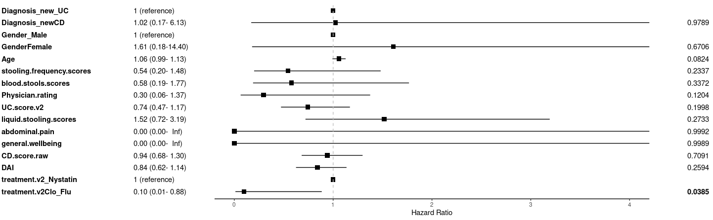
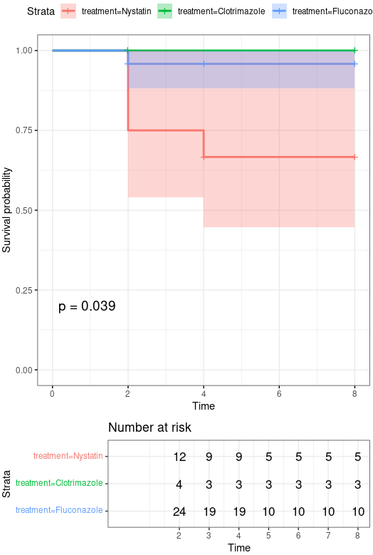

# 5.1 clincal feature Analysis: Data Processing, Visualization, and Statistical Testing

Key methodologies include:

- **Cox proportional hazards modeling** for survival analysis.
- **Kaplan-Meier survival curves** for treatment response comparison.
- **Statistical modeling** (ANOVA, Kruskal-Wallis, linear mixed models) to compare changes in disease activity across treatments.
- **Correlation analysis** between fungal/bacterial taxa and disease scores.

## 5.1.1 Survival Analysis & Clinical Features

~~~R
ReadCap.20241115_v2 <- mcreadRDS("/mnt/d/xiangyu.ubuntu/workshop/MMC/Aidan_info/v2/ReadCap.210241118.v2.rds")
ReadCap.20241115_v2 <- ReadCap.20241115_v2[ReadCap.20241115_v2$time %in% c("W0","W1","W2","W4","W8"),]
write.csv(ReadCap.20241115_v2,"/mnt/d/xiangyu.ubuntu/projects/MMC/Figures/figures_making/v3/patient.total.clincal.csv")

tmp.Age <- ReadCap.20241115_v2[ReadCap.20241115_v2$time=="W0",]
rownames(tmp.Age) <- tmp.Age$Omics_patient_Names
total_times_tmp <- mcreadRDS("/mnt/d/xiangyu.ubuntu/workshop/MMC/Aidan_info/v2/patientInfo.210241118.rds")
rownames(total_times_tmp) <- total_times_tmp$Omics_patient_Names
total_times_tmp <- as.data.frame(cbind(total_times_tmp,tmp.Age[rownames(total_times_tmp),c("Diagnosis_new","Gender","Age","Race",
    c("DAI","UC.score.raw","UC.score.v2","CD.score.raw","stooling.frequency.scores","stooling.frequency","blood.stools.scores",
    "Mucosal.Appearance","Physician.rating","liquid.stooling.scores","abdominal.pain","general.wellbeing","Abdominal.mass"))]))
total_times_tmp$Diagnosis_new[total_times_tmp$Diagnosis_new=="MC"] <- "CD"
total_times_tmp$Gender[total_times_tmp$Gender=="FEMALE"] <- "Female"
total_times_tmp$Gender[total_times_tmp$Gender=="female"] <- "Female"
total_times_tmp$Gender[total_times_tmp$Gender=="male"] <- "Male"
total_times_tmp$Gender[total_times_tmp$Gender=="MALE"] <- "Male"
total_times_tmp$Race[total_times_tmp$Race=="declined"] <- "Declined"
total_times_tmp$Race[total_times_tmp$Race=="Not listed; not hispanic/latino"] <- "Declined"
total_times_tmp$Race[total_times_tmp$Race=="other"] <- "Declined"
total_times_tmp$Race[total_times_tmp$Race=="white"] <- "White"
total_times_tmp$Race[total_times_tmp$Race=="WHITE"] <- "White"
total_times_tmp$Diagnosis_new <- factor(total_times_tmp$Diagnosis_new,levels=c("UC","CD"))
total_times_tmp$Gender <- factor(total_times_tmp$Gender,levels=c("Male","Female"))
write.csv(total_times_tmp,"/mnt/d/xiangyu.ubuntu/projects/MMC/Figures/figures_making/v3/patient.PFS.csv")

library(survival)
library(survminer)
library(ggplot2)
library(dplyr)
library(purrr)
predictors <- c("Diagnosis_new", "Gender", "Age", "DAI", "treatment.v2","UC.score.raw", "UC.score.v2", "CD.score.raw","stooling.frequency.scores", "blood.stools.scores","Physician.rating", "liquid.stooling.scores", "abdominal.pain", "general.wellbeing")
results <- lapply(predictors, function(var) {
  formula <- as.formula(paste("Surv(max.DAI.dates, status) ~", var))
  model <- coxph(formula, data = total_times_tmp)
  summary(model)
})
plot_data <- purrr::map_df(seq_along(results), function(i) {
  x <- results[[i]]
  var <- predictors[i]
  coeff_data <- data.frame(Term = rownames(x$coefficients),HR = exp(x$coefficients[, "coef"]),
    lower = exp(x$coefficients[, "coef"] - 1.96 * x$coefficients[, "se(coef)"]),upper = exp(x$coefficients[, "coef"] + 1.96 * x$coefficients[, "se(coef)"]),
    p.value = x$coefficients[, "Pr(>|z|)"])
  if (is.factor(total_times_tmp[[var]])) {
    levels_var <- levels(total_times_tmp[[var]])
    reference <- levels_var[1]
    ref_row <- data.frame(Term = paste(var, reference, sep = "_"),HR = 1,lower = NA, upper = NA,p.value = NA)
    coeff_data <- bind_rows(ref_row, coeff_data)
  }
  coeff_data
})
rownames(plot_data) <- plot_data$Term
o <- c("Diagnosis_new_UC","Diagnosis_newCD","Gender_Male","GenderFemale","Age",
  "stooling.frequency.scores","blood.stools.scores","Physician.rating","UC.score.v2",
  "liquid.stooling.scores","abdominal.pain","general.wellbeing","CD.score.raw",
  "DAI","treatment.v2_Nystatin","treatment.v2Clo_Flu")
plot_data <- plot_data[o,]
plot_data$Term <- factor(plot_data$Term,levels=o[length(o):1])

library(tidyverse)
library(gt)
library(patchwork)
p_mid <- plot_data |> ggplot(aes(y = Term)) + theme_classic() + geom_point(aes(x = HR), shape = 15, size = 3, na.rm = TRUE) + 
geom_linerange(aes(xmin = lower, xmax = upper), na.rm = TRUE) + geom_point(data = plot_data[is.na(plot_data$lower), ], aes(x = HR), shape = 18, size = 3, color = "black") + labs(x = "Hazard Ratio") + coord_cartesian(xlim = c(0, 4)) +
  geom_vline(xintercept = 1, linetype = "dashed", color = "gray") +
  theme(axis.line.y = element_blank(),axis.ticks.y = element_blank(),axis.text.y = element_blank(),axis.title.y = element_blank())
res <- plot_data %>%dplyr::rename(estimate = HR, conf.low = lower, conf.high = upper)
res_plot <- res |>
  mutate(across(c(estimate, conf.low, conf.high), ~ round(.x, 2))) |>
  mutate(across(c(estimate, conf.low, conf.high), as.character)) |>
  mutate(estimate_lab = ifelse(is.na(conf.low) & is.na(conf.high),"1 (reference)",
    paste0(
      format(round(as.numeric(estimate), 2), nsmall = 2), " (",
      format(round(as.numeric(conf.low), 2), nsmall = 2), "-",
      format(round(as.numeric(conf.high), 2), nsmall = 2), ")"
    )),color = rep(c("gray", "white"), length.out = nrow(res))) |>
  mutate(p.value = case_when(as.numeric(p.value) < 0.01 ~ "<0.01",TRUE ~ format(round(as.numeric(p.value), 4), nsmall = 2)))
res_plot$p.value <- as.numeric(as.character(res_plot$p.value))
p_left <- res_plot |>
  ggplot(aes(y = Term)) +
  geom_text(aes(x = 0, label = Term), hjust = 0, fontface = "bold") +
  geom_text(aes(x = 1, label = estimate_lab), hjust = 0, fontface = "plain") +
  theme_void() + coord_cartesian(xlim = c(0, 1.5))

p_right <- res_plot |> 
ggplot() + geom_text(aes(x = 0, y = Term, label = p.value), hjust = 0, fontface = ifelse(is.na(res_plot$p.value), "plain", ifelse(res_plot$p.value <= 0.05, "bold", "plain"))) + theme_void()
layout <- c(area(t = 0, l = 0, b = 30, r = 3),area(t = 1, l = 4, b = 30, r = 9),area(t = 0, l = 9, b = 30, r = 11))
plot <- p_left + p_mid + p_right + plot_layout(design = layout)
ggsave("/mnt/d/xiangyu.ubuntu/projects/MMC/Figures/figures_making/v3/Fig6.1.clincal.svg", plot=plot,width = 10, height = 7,dpi=300)
~~~

~~~R
pdf("/mnt/d/xiangyu.ubuntu/projects/MMC/Figures/figures_making/v3/Fig6.2.PFS.pdf",width=5,height=8)
fit <- survfit(Surv(max.DAI.dates, status) ~ treatment, data = total_times_tmp)
ggsurvplot(fit, data = total_times_tmp,surv.median.line = "hv",pval = TRUE,ggtheme = theme_bw(),risk.table=TRUE, conf.int = TRUE)
dev.off()
~~~

~~~R
total_times_tmp1 <- total_times_tmp[total_times_tmp$W0,]
total_times_tmp1$W8.new <- total_times_tmp1$W8
total_times_tmp1[is.na(total_times_tmp1$W8) & is.na(total_times_tmp1$W8.new),"W8.new"] <- total_times_tmp1[is.na(total_times_tmp1$W8) & is.na(total_times_tmp1$W8.new),"W4"]
total_times_tmp1[is.na(total_times_tmp1$W4) & is.na(total_times_tmp1$W8.new),"W8.new"] <- total_times_tmp1[is.na(total_times_tmp1$W4) & is.na(total_times_tmp1$W8.new),"W2"]
total_times_tmp1[is.na(total_times_tmp1$W2) & is.na(total_times_tmp1$W8.new),"W8.new"] <- total_times_tmp1[is.na(total_times_tmp1$W2) & is.na(total_times_tmp1$W8.new),"W1"]
total_times_tmp1[is.na(total_times_tmp1$W1) & is.na(total_times_tmp1$W8.new),"W8.new"] <- total_times_tmp1[is.na(total_times_tmp1$W1) & is.na(total_times_tmp1$W8.new),"W0"]
total_times_tmp1[is.na(total_times_tmp1$W8.new),]
total_times_tmp1[total_times_tmp1$W8.new==0,]

pdf("/mnt/d/xiangyu.ubuntu/projects/MMC/Figures/figures_making/v3/Fig6.3.PFS.pdf",width=5,height=8)
fit <- survfit(Surv(max.DAI.dates, status) ~ treatment.v2, data = total_times_tmp)
ggsurvplot(fit, data = total_times_tmp,surv.median.line = "hv",pval = TRUE,ggtheme = theme_bw(),risk.table=TRUE, conf.int = TRUE)
dev.off()
~~~

## 5.1.2 Longitudinal Disease Score Trends

~~~R
total_times_tmp <- total_times_tmp[order(total_times_tmp$DAI_diff,decreasing=TRUE),]
total_times_tmp$Omics_patient_Names <- factor(total_times_tmp$Omics_patient_Names,levels=as.character(total_times_tmp$Omics_patient_Names))
p1 <- ggplot(total_times_tmp, aes(x=Omics_patient_Names, y=DAI_diff, fill=Diagnosis_new, color=Diagnosis_new)) +
scale_color_manual(name="Diagnosis_new",values = pal)+ scale_fill_manual(name="Diagnosis_new",values = pal)+theme_classic()+
theme(axis.text.x  = element_text(angle=90, vjust=1,hjust = 1))+
labs(title = "Waterfall for changes in anti-fungal treatment (>2-timepoints)", x = NULL, y = "Disease scores Change from baseline") +
coord_cartesian(ylim = c(-5,3)) + geom_bar(stat="identity", width=0.7, position = position_dodge(width=0.4))+facet_wrap(~treatment,scales="free")
p2 <- ggplot(total_times_tmp, aes(x=Omics_patient_Names, y=DAI_diff, fill=group, color=group)) +
scale_color_manual(name="group",values = pal[c(1,3,2)])+ scale_fill_manual(name="group",values = pal[c(1,3,2)])+theme_classic()+
theme(axis.text.x  = element_text(angle=90, vjust=1,hjust = 1))+
labs(title = "Waterfall for changes in anti-fungal treatment (>2-timepoints)", x = NULL, y = "Disease scores Change from baseline") +
coord_cartesian(ylim = c(-5,3)) + geom_bar(stat="identity", width=0.7, position = position_dodge(width=0.4))+facet_wrap(~treatment,scales="free")
plot <- plot_grid(p1,p2,ncol=1)
ggsave("/mnt/d/xiangyu.ubuntu/projects/MMC/Figures/figures_making/v3/Fig6.4.clincal.svg", plot=plot,width = 10, height = 12,dpi=300)
~~~

~~~r
library(lme4)
library(ARTool)
library(coin)

ReadCap.20241115_v2 <- mcreadRDS("/mnt/d/xiangyu.ubuntu/workshop/MMC/Aidan_info/v2/ReadCap.210241118.v2.rds")
ReadCap.20241115_final2 <- ReadCap.20241115_v2[!is.na(ReadCap.20241115_v2$DAI),]
ReadCap.20241115_final2 <- ReadCap.20241115_final2[ReadCap.20241115_final2$time %in% c("W0","W1","W2","W4","W8"),]
rownames(ReadCap.20241115_final2) <- ReadCap.20241115_final2$Omics_samples_Names
patientInfo <- mcreadRDS("/mnt/d/xiangyu.ubuntu/workshop/MMC/Aidan_info/v2/patientInfo.210241118.rds")
rownames(patientInfo) <- patientInfo$Omics_patient_Names
ReadCap.20241115_final2$group.v2 <- patientInfo[as.character(ReadCap.20241115_final2$Omics_patient_Names),"diease_status"]
df_paired <- ReadCap.20241115_final2[!is.na(ReadCap.20241115_final2$group.v2),]
df_paired <- df_paired[df_paired$treatment %in% c("Nystatin","Fluconazole"),]
df_paired$treatment <- factor(df_paired$treatment,levels=c("Nystatin","Fluconazole"))
colnames(df_paired)[colnames(df_paired)=="DAI"] <- "value"
uniq_patient1 <- unique(df_paired$Omics_patient_Names)
df_paired1_ <- lapply(1:length(uniq_patient1),function(i) {
    tmp <- df_paired[df_paired$Omics_patient_Names %in% uniq_patient1[i],]
    tmp[,"value"] <- tmp[,"value"]-tmp[tmp$time=="W0","value"]
    return(tmp)
})
df_paired2 <- do.call(rbind,df_paired1_)
df_paired2 <- df_paired2[!is.na(df_paired2$value),]
df_paired2$time_numeric <- as.numeric(gsub("W", "", df_paired2$time))
art_model <- art(value ~ treatment, data = df_paired2)
anova_art <- anova(art_model)
art_p_value <- anova_art$`Pr(>F)`[1]
art.pvalue0 <- ifelse(art_p_value < 0.001, "< 0.001", format(art_p_value, digits = 3))

kruskal_result <- kruskal.test(value ~ treatment, data = df_paired2)
kruskal_pvalue <- kruskal_result$p.value
kruskal.pvalue0 <- ifelse(kruskal_pvalue < 0.001, "< 0.001", format(kruskal_pvalue, digits = 3))

perm_test_result <- oneway_test(value ~ treatment, data = df_paired2, distribution = "approximate")
perm_pvalue <- pvalue(perm_test_result)
LocationTests.pvalue0 <- ifelse(perm_pvalue < 0.001, "< 0.001", format(perm_pvalue, digits = 3))

lm_result <- lm(value ~ treatment, data = df_paired2)
tukey_result <- TukeyHSD(aov(lm_result))
tukey_pvalues <- tukey_result$treatment
TukeyHSD.pvalue1 <- ifelse(tukey_pvalues["Fluconazole-Nystatin", "p adj"] < 0.001, "< 0.001", format(tukey_pvalues["Fluconazole-Nystatin", "p adj"], digits = 3))

pairwise_t_result <- pairwise.t.test(df_paired2$value, df_paired2$treatment, p.adjust.method = "bonferroni")
pairwise_t_pvalues <- pairwise_t_result$p.value
pairwise.t.pvalue1 <- ifelse(pairwise_t_pvalues["Fluconazole","Nystatin"] < 0.001, "< 0.001", format(pairwise_t_pvalues["Fluconazole","Nystatin"], digits = 3))

lmm_result <- lmerTest::lmer(value ~ treatment + (1 | Omics_patient_Names), data = df_paired2)
summary_lmm <- summary(lmm_result)
p_value_mixed <- coef(summary_lmm)["treatmentFluconazole", "Pr(>|t|)"]
LMM.pvalue1 <- ifelse(is.na(p_value_mixed) | p_value_mixed < 0.001, "< 0.001", format(p_value_mixed, digits = 3))

anova_result <- aov(value ~ treatment, data = df_paired2)
p_value <- summary(anova_result)[[1]]["treatment", "Pr(>F)"]
anova.pvalue0 <- ifelse(p_value < 0.001, "< 0.001", format(p_value, digits = 3))

loess_fit_1 <- loess(value ~ time_numeric, data = df_paired2[df_paired2$treatment == "Nystatin", ])
loess_fit_2 <- loess(value ~ time_numeric, data = df_paired2[df_paired2$treatment == "Fluconazole", ])
x_range <- seq(min(df_paired2$time_numeric), max(df_paired2$time_numeric), length.out = 100)
pred_1 <- predict(loess_fit_1, newdata = data.frame(time_numeric = x_range))
pred_2 <- predict(loess_fit_2, newdata = data.frame(time_numeric = x_range))
ks_test_result <- ks.test(pred_1, pred_2)$p.value

rss_1 <- sum((df_paired2[df_paired2$treatment == "Nystatin", "value"] - predict(loess_fit_1))^2)
rss_2 <- sum((df_paired2[df_paired2$treatment == "Fluconazole", "value"] - predict(loess_fit_2))^2)
n1 <- length(df_paired2[df_paired2$treatment == "Nystatin", "value"])  # Sample size group 1
n2 <- length(df_paired2[df_paired2$treatment == "Fluconazole", "value"])  # Sample size group 2
f_stat <- (rss_1 / (n1 - 2)) / (rss_2 / (n2 - 2))
Ftestp_value <- pf(f_stat, df1 = n1 - 2, df2 = n2 - 2, lower.tail = FALSE)# Perform an F-test

df_paired <- ReadCap.20241115_final2[!is.na(ReadCap.20241115_final2$group.v2),]
colnames(df_paired)[colnames(df_paired)=="DAI"] <- "value"
uniq_patient1 <- unique(df_paired$Omics_patient_Names)
df_paired1_ <- lapply(1:length(uniq_patient1),function(i) {
    tmp <- df_paired[df_paired$Omics_patient_Names %in% uniq_patient1[i],]
    tmp[,"value"] <- tmp[,"value"]-tmp[tmp$time=="W0","value"]
    return(tmp)
})
df_paired2 <- do.call(rbind,df_paired1_)
df_paired2 <- df_paired2[!is.na(df_paired2$value),]
df_paired2$time_numeric <- as.numeric(gsub("W", "", df_paired2$time))
df_paired2$treatment <- factor(df_paired2$treatment,levels=c("Nystatin","Clotrimazole","Fluconazole"))
pal <- jdb_palette("corona")[1:5]
names(pal) <- c("Resp","NR","Nystatin","Clotrimazole","Fluconazole")
plot <- ggplot(df_paired2, aes_string(x = "time_numeric", y = "value")) + 
geom_line(aes(color=group.v2,group=Omics_patient_Names),size = 1,alpha=1)+facet_wrap(~treatment)+
stat_summary(fun.y = mean, geom="point",colour="darkred", size=1.5) + 
stat_summary(fun = mean, geom = "line",aes(group = 1),col = "red",size=1.5, linetype = "dashed")+
theme_bw()+ scale_color_manual(values = pal)+scale_fill_manual(values = pal)+
labs(title = paste0("DAI","\n", "Flu vs Nystatin (ANOVA p: ", anova.pvalue0," | ","art p: ",art.pvalue0,
    "|\n","kruskal p: ", kruskal.pvalue0," | ","LocationTests p: ",LocationTests.pvalue0,
    "|\n","TukeyHSD p: ",TukeyHSD.pvalue1," | ","loess p: ",Ftestp_value,"|\n","pairwise. p: ",pairwise.t.pvalue1," | ",
    "LMM p: ",LMM.pvalue1,")"),y = "Δ")
ggsave("/mnt/d/xiangyu.ubuntu/projects/MMC/Figures/figures_making/v3/Fig6.5.svg", plot=plot,width = 10, height = 6,dpi=300)
~~~

## 5.1.3 Microbiome & Clinical Correlation

~~~R
MMC.ITS.counts <- mcreadRDS("/mnt/d/xiangyu.ubuntu/workshop/MMC/sample_info/final_Res/MMC.ITS.counts.v3.rds")
MMC.ITS.taxa1 <- mcreadRDS("/mnt/d/xiangyu.ubuntu/workshop/MMC/sample_info/final_Res/MMC.ITS.taxa1.v2.rds")
MMC.ITS.samples <- mcreadRDS("/mnt/d/xiangyu.ubuntu/workshop/MMC/sample_info/final_Res/ITS.samples_info1.v2.rds")
library(microeco)
library(mecodev)
MMC.ITS.counts1 <- MMC.ITS.counts[rowSums(MMC.ITS.counts)>0,colSums(MMC.ITS.counts)>0]
MMC.ITS.taxa1 <- MMC.ITS.taxa1[!is.na(MMC.ITS.taxa1$Genus),]
if (length(grep("Incertae",MMC.ITS.taxa1$Genus,value=TRUE))>0){MMC.ITS.taxa1 <- MMC.ITS.taxa1[-grep("Incertae",MMC.ITS.taxa1$Genus,value=FALSE),]} else {MMC.ITS.taxa1 <- MMC.ITS.taxa1}
MMC.ITS.counts1 <- MMC.ITS.counts1[intersect(rownames(MMC.ITS.taxa1),rownames(MMC.ITS.counts1)),]
MMC.ITS.taxa11 <- MMC.ITS.taxa1[rownames(MMC.ITS.counts1),]
MMC.ITS.samples <- MMC.ITS.samples[colnames(MMC.ITS.counts1),]
Fungal.tse_taxa <- TreeSummarizedExperiment(assays =  SimpleList(counts = as.matrix(MMC.ITS.counts1)),colData = DataFrame(MMC.ITS.samples),rowData = DataFrame(MMC.ITS.taxa11))
Fungal.tse <- transformAssay(Fungal.tse_taxa, MARGIN = "samples", method = "relabundance")
Fungal.tse <- addPerCellQC(Fungal.tse)
Fungal.tse <- mia::estimateRichness(Fungal.tse, assay.type = "counts", index = "observed", name="observed")
Fungal.tse <- mia::estimateDiversity(Fungal.tse, assay.type = "counts",index = "coverage", name = "coverage")
Fungal.tse <- mia::estimateDiversity(Fungal.tse, assay.type = "counts",index = "gini_simpson", name = "gini_simpson")
Fungal.tse <- mia::estimateDiversity(Fungal.tse, assay.type = "counts",index = "inverse_simpson", name = "inverse_simpson")
Fungal.tse <- mia::estimateDiversity(Fungal.tse, assay.type = "counts",index = "log_modulo_skewness", name = "Rarity")
Fungal.tse <- mia::estimateDiversity(Fungal.tse, assay.type = "counts",index = "shannon", name = "shannon")
Fungal.tse <- estimateDominance(Fungal.tse, assay.type = "counts", index="relative", name = "Dominance")
Fungal.tse <- mia::estimateDivergence(Fungal.tse,assay.type = "counts",reference = "median",FUN = vegan::vegdist)
colData(Fungal.tse)$total_raw_counts <- colSums(assay(Fungal.tse, "counts"))
library(lefser)
pal <- c(jdb_palette("corona"),jdb_palette(c("lawhoops")),jdb_palette(c("brewer_spectra")))
Sel_type <- c("Genus","Species")
relativeAb_all_ <- future_lapply(1:length(Sel_type),function(x) {
    tse_tmp <- subsetByPrevalentFeatures(Fungal.tse,rank = Sel_type[x],detection = 0,prevalence = 0,as_relative = FALSE)
    se_total <- SummarizedExperiment(assays = list(counts = assays(tse_tmp)[["counts"]]),rowData = rowData(tse_tmp),colData = colData(tse_tmp))
    se_total <- relativeAb(se_total)
    relativeAb <- as.data.frame(assays(se_total)[["rel_abs"]])
    relativeAb <- log(relativeAb+1,2)
    relativeAb$names <- rownames(relativeAb)
    relativeAb$type <- Sel_type[x]
    return(relativeAb)
    })
relativeAb_all <- do.call(rbind,relativeAb_all_)

ITS.Info.global3 <- mcreadRDS("/mnt/d/xiangyu.ubuntu/workshop/MMC/sample_info/final_Res/MMC.All.features.Info.gloibal.rds")
tmp_projects2 <- mcreadRDS("/mnt/d/xiangyu.ubuntu/workshop/MMC/sample_info/final_Res/MMC.ITS.All.Info.gloibal.groups.rds")
tmp_projects2 <- tmp_projects2[,c("DAI","UC.score.v2","CD.score.raw","time","time.v2","treatment","patient")]
tmp_projects2 <- as.data.frame(cbind(tmp_projects2,ITS.Info.global3[rownames(tmp_projects2),
    c("Fungi.observed","Fungi.shannon","Bac.shannon","Bac.observed","probiotic.bac","Butyrate_producing_bac",
        "Propionate_producing_bac","Valeric_producing_bac","Candida","Candida_albicans","Fatty_Acid_Biosynthesis",
        "Bile_Acid_Biosynthesis","Dysbiosis.UP")]))
tmp_projects2$Flu.M4.Metabo <- ITS.Info.global3[rownames(tmp_projects2),"Clu3"]
tmp_projects2$Flu.M2.Metabo <- ITS.Info.global3[rownames(tmp_projects2),"Clu4"]
tmp_projects2$Flu.M3.Metabo <- ITS.Info.global3[rownames(tmp_projects2),"Clu2"]
tmp_projects2$Flu.M1.Metabo <- ITS.Info.global3[rownames(tmp_projects2),"Clu1"]

relabundance_total_Species <- relativeAb_all
aa <- jdb_palette("brewer_spectra")
treatment <- c("Nystatin","Clotrimazole","Fluconazole")
relabundance_all_ <- lapply(1:length(treatment),function(x) {
    tmp_projects <- MMC.ITS.samples[MMC.ITS.samples$treatment==treatment[x],]
    relabundance_tmp <- relabundance_total_Species[,rownames(tmp_projects)]
    relabundance <-  data.frame(W0=rowMeans(relabundance_tmp[,rownames(tmp_projects[tmp_projects$time=="W0",])]),
        W2=rowMeans(relabundance_tmp[,rownames(tmp_projects[tmp_projects$time=="W2",])]),
        W4=rowMeans(relabundance_tmp[,rownames(tmp_projects[tmp_projects$time=="W4",])]),
        W8=rowMeans(relabundance_tmp[,rownames(tmp_projects[tmp_projects$time=="W8",])]),
        group=treatment[x],
        names=relabundance_total_Species$names)
    relabundance$W2_W0 <- relabundance$W2-relabundance$W0
    relabundance$W4_W0 <- relabundance$W4-relabundance$W0
    return(relabundance)
    })
relabundance_all <- do.call(rbind,relabundance_all_)
relabundance_all_W2_W0 <- relabundance_all[relabundance_all$W2_W0<0,]
library(xlsx)
pathogenic.Fungi <- read.xlsx("/mnt/d/xiangyu.ubuntu/projects/MMC/Human.associated.Fungi.xlsx", sheetName = "raw")
pathogenic.Fungi <- pathogenic.Fungi[pathogenic.Fungi$group=="Fungal Pathogens",]
Genus <- unique(unlist(lapply(strsplit(unique(pathogenic.Fungi$names),split=" "),function(x) {x[1]})))
relabundance_sel.fungi1_ <- lapply(1:length(Genus),function(x) {
    relativeAb_Genus <- relativeAb_all[relativeAb_all$names %in% grep(Genus[x],relativeAb_all$names,value=TRUE),]
    return(relativeAb_Genus)
    })
relabundance_sel.fungi1 <- do.call(rbind,relabundance_sel.fungi1_)
relabundance_sel.fungi1 <- relabundance_sel.fungi1[-grep(" NA",relabundance_sel.fungi1$names,value=FALSE),]
pathogenic.Fungi.v2 <- unique(relabundance_sel.fungi1$names)
pathogenic.Fungi.v21 <- pathogenic.Fungi.v2[unlist(lapply(strsplit(pathogenic.Fungi.v2,split=" "),function(x) {x[2]})) %in% unlist(lapply(strsplit(unique(pathogenic.Fungi$names),split=" "),function(x) {x[2]}))]
pathogenic.Fungi.v2 <- setdiff(pathogenic.Fungi.v21,c("Beauveria", "Trichoderma", "Penicillium", "Geotrichum", "Kluyveromyces", "Pichia"))
pathogenic.Fungi.v2 <- intersect(pathogenic.Fungi.v2,relabundance_all_W2_W0$names)
relabundance_pathogenic.Fungi.v2 <- relativeAb_all[relativeAb_all$names %in% pathogenic.Fungi.v2,]
relabundance_tmp <- relabundance_pathogenic.Fungi.v2[,rownames(tmp_projects2)]
tmp_projects2$pathogenic.Fungi.v2 <- 100*colMeans(relabundance_tmp)[rownames(tmp_projects2)]
tmp_projects2$Candida_albicans <- 100*as.numeric(as.character(t(relativeAb_all)[rownames(tmp_projects2),"Candida albicans"]))

as.numeric(relativeAb_all["Candida albicans",grep("MMC",colnames(relativeAb_all),value=TRUE)])

diease_Scores <- c("pathogenic.Fungi.v2","Fungi.observed","Fungi.shannon","Bac.shannon","Bac.observed","probiotic.bac","Butyrate_producing_bac",
        "Candida","Candida_albicans","Bile_Acid_Biosynthesis","Dysbiosis.UP","Flu.M4.Metabo","Flu.M2.Metabo","Flu.M3.Metabo","Flu.M1.Metabo")
df1 <-tmp_projects2
df1$DAI[df1$DAI>15] <- 15
df1$Candida_albicans <- log(df1$Candida_albicans+1,2)
sel_pa <- unique(df1$patient)
paired.df_ <- lapply(1:length(sel_pa),function(x) {
    tmp <- df1[df1$patient %in% sel_pa[x],]
    tmp[,"DAI"] <- tmp[,"DAI"]-tmp[tmp$time=="W0","DAI"]
    tmp[,"Flu.M4.Metabo"] <- tmp[,"Flu.M4.Metabo"]-tmp[tmp$time=="W0","Flu.M4.Metabo"]
    tmp[,"Flu.M2.Metabo"] <- tmp[,"Flu.M2.Metabo"]-tmp[tmp$time=="W0","Flu.M2.Metabo"]
    tmp[,"Flu.M3.Metabo"] <- tmp[,"Flu.M3.Metabo"]-tmp[tmp$time=="W0","Flu.M3.Metabo"]
    tmp[,"Flu.M1.Metabo"] <- tmp[,"Flu.M1.Metabo"]-tmp[tmp$time=="W0","Flu.M1.Metabo"]
    tmp[,"Dysbiosis.UP"] <- tmp[,"Dysbiosis.UP"]-tmp[tmp$time=="W0","Dysbiosis.UP"]
    tmp[,"probiotic.bac"] <- tmp[,"probiotic.bac"]-tmp[tmp$time=="W0","probiotic.bac"]
    tmp[,"Butyrate_producing_bac"] <- tmp[,"Butyrate_producing_bac"]-tmp[tmp$time=="W0","Butyrate_producing_bac"]
    tmp[,"Bile_Acid_Biosynthesis"] <- tmp[,"Bile_Acid_Biosynthesis"]-tmp[tmp$time=="W0","Bile_Acid_Biosynthesis"]
    tmp[,"Bac.shannon"] <- tmp[,"Bac.shannon"]-tmp[tmp$time=="W0","Bac.shannon"]
    tmp[,"Bac.observed"] <- tmp[,"Bac.observed"]-tmp[tmp$time=="W0","Bac.observed"]
    tmp[,"pathogenic.Fungi.v2"] <- tmp[,"pathogenic.Fungi.v2"]-tmp[tmp$time=="W0","pathogenic.Fungi.v2"]
    tmp[,"Candida"] <- tmp[,"Candida"]-tmp[tmp$time=="W0","Candida"]
    tmp[,"Candida_albicans"] <- tmp[,"Candida_albicans"]-tmp[tmp$time=="W0","Candida_albicans"]
    tmp[,"Fungi.shannon"] <- tmp[,"Fungi.shannon"]-tmp[tmp$time=="W0","Fungi.shannon"]
    tmp[,"Fungi.observed"] <- tmp[,"Fungi.observed"]-tmp[tmp$time=="W0","Fungi.observed"]
    return(tmp)
})
paired.df <- do.call(rbind,paired.df_)
pal <- jdb_palette("corona")[c(2,3,1)]
names(pal) <- c("Nystatin","Clotrimazole","Fluconazole")
paired.df$treatment <- factor(paired.df$treatment,levels=c("Nystatin","Clotrimazole","Fluconazole"))
paired.df$abs_pathogenic.Fungi.v2 <- abs(paired.df$pathogenic.Fungi.v2)
total.lm <- lm(DAI ~ pathogenic.Fungi.v2, data = paired.df)
p1 <- ggplot(paired.df, aes_string(x = "pathogenic.Fungi.v2", y = "DAI", color = "treatment",size = "abs_pathogenic.Fungi.v2"))+ geom_rug(size=0.5)+ geom_point(alpha = 0.8) +  
geom_smooth(method = "lm", se = TRUE, color="red") + scale_color_manual(values = pal)+  theme_minimal() + theme(legend.position = "right")+
scale_size_continuous(range = c(1, 6), guide = "none") + labs(x = "delta_pathogenic.Fungi.v2.", y = "delta_DAI", title = paste0("Cor delta_pathogenic.Fungi.v2. and DAI")) +  
annotate("text", x = 50, y =2, color = "#E51718", label = paste0("rho = ", round(cor(total.lm$model$pathogenic.Fungi.v2, total.lm$model$DAI, method = "spearman"),2),
    "; p = ", round(cor.test(total.lm$model$pathogenic.Fungi.v2, total.lm$model$DAI, method = "spearman")$p.value,4)))+ scale_size(range = c(0,5))
paired.df$abs_Candida_albicans <- abs(paired.df$Candida_albicans)
total.lm <- lm(DAI ~ Candida_albicans, data = paired.df)
p2 <- ggplot(paired.df, aes_string(x = "Candida_albicans", y = "DAI", color = "treatment",size = "abs_Candida_albicans"))+ geom_rug(size=0.5)+ geom_point(alpha = 0.8) +  
geom_smooth(method = "lm", se = TRUE, color="red") + scale_color_manual(values = pal)+  theme_minimal() + theme(legend.position = "right")+
scale_size_continuous(range = c(1, 6), guide = "none") + labs(x = "delta_Candida_albicans.", y = "delta_DAI", title = paste0("Cor delta_Candida_albicans. and DAI")) +  
annotate("text", x = 5, y =2, color = "#E51718", label = paste0("rho = ", round(cor(total.lm$model$Candida_albicans, total.lm$model$DAI, method = "spearman"),2),
    "; p = ", round(cor.test(total.lm$model$Candida_albicans, total.lm$model$DAI, method = "spearman")$p.value,4)))+ scale_size(range = c(0,5))
plot_grid(p1,p2,nrow=1)
~~~

~~~R
df1$treatment <- factor(df1$treatment,levels=c("Nystatin","Clotrimazole","Fluconazole"))
pal <- jdb_palette("corona")[c(2,3,1)]
names(pal) <- c("Nystatin","Clotrimazole","Fluconazole")
total.lm <- lm(DAI ~ Bac.shannon, data = df1)
p1 <- ggplot(df1, aes_string(x = "Bac.shannon", y = "DAI", color = "treatment",size = "Bac.shannon"))+ geom_rug(size=0.5)+ geom_point(alpha = 0.8) +  
geom_smooth(method = "lm", se = TRUE, color="red") + scale_color_manual(values = pal)+  theme_minimal() + theme(legend.position = "right")+
scale_size_continuous(range = c(1, 6), guide = "none") + labs(x = "delta_Bac.shannon.", y = "delta_DAI", title = paste0("Cor delta_Bac.shannon. and DAI")) +  
annotate("text", x = 2, y =2, color = "#E51718", label = paste0("rho = ", round(cor(total.lm$model$Bac.shannon, total.lm$model$DAI, method = "pearson"),2),
    "; p = ", round(cor.test(total.lm$model$Bac.shannon, total.lm$model$DAI, method = "pearson")$p.value,4)))+ scale_size(range = c(0,5))
total.lm <- lm(DAI ~ Butyrate_producing_bac, data = df1)
p2 <- ggplot(df1, aes_string(x = "Butyrate_producing_bac", y = "DAI", color = "treatment",size = "Butyrate_producing_bac"))+ geom_rug(size=0.5)+ geom_point(alpha = 0.8) +  
geom_smooth(method = "lm", se = TRUE, color="red") + scale_color_manual(values = pal)+  theme_minimal() + theme(legend.position = "right")+
scale_size_continuous(range = c(1, 6), guide = "none") + labs(x = "delta_Butyrate_producing_bac.", y = "delta_DAI", title = paste0("Cor delta_Butyrate_producing_bac. and DAI")) +  
annotate("text", x = 100, y =2, color = "#E51718", label = paste0("rho = ", round(cor(total.lm$model$Butyrate_producing_bac, total.lm$model$DAI, method = "pearson"),2),
    "; p = ", round(cor.test(total.lm$model$Butyrate_producing_bac, total.lm$model$DAI, method = "pearson")$p.value,4)))+ scale_size(range = c(0,5))
df1$Candida_albicans <- log(df1$Candida_albicans+1,2)
total.lm <- lm(DAI ~ Candida_albicans, data = df1)
p3 <- ggplot(df1, aes_string(x = "Candida_albicans", y = "DAI", color = "treatment",size = "Candida_albicans"))+ geom_rug(size=0.5)+ geom_point(alpha = 0.8) +  
geom_smooth(method = "lm", se = TRUE, color="red") + scale_color_manual(values = pal)+  theme_minimal() + theme(legend.position = "right")+
scale_size_continuous(range = c(1, 6), guide = "none") + labs(x = "delta_Candida_albicans.", y = "delta_DAI", title = paste0("Cor delta_Candida_albicans. and DAI")) +  
annotate("text", x = 3, y =2, color = "#E51718", label = paste0("rho = ", round(cor(total.lm$model$Candida_albicans, total.lm$model$DAI, method = "pearson"),2),
    "; p = ", round(cor.test(total.lm$model$Candida_albicans, total.lm$model$DAI, method = "pearson")$p.value,4)))+ scale_size(range = c(0,5))
total.lm <- lm(DAI ~ Dysbiosis.UP, data = df1)
p4 <- ggplot(df1, aes_string(x = "Dysbiosis.UP", y = "DAI", color = "treatment",size = "Dysbiosis.UP"))+ geom_rug(size=0.5)+ geom_point(alpha = 0.8) +  
geom_smooth(method = "lm", se = TRUE, color="red") + scale_color_manual(values = pal)+  theme_minimal() + theme(legend.position = "right")+
scale_size_continuous(range = c(1, 6), guide = "none") + labs(x = "delta_Dysbiosis.UP.", y = "delta_DAI", title = paste0("Cor delta_Dysbiosis.UP. and DAI")) +  
annotate("text", x = 0, y =10, color = "#E51718", label = paste0("rho = ", round(cor(total.lm$model$Dysbiosis.UP, total.lm$model$DAI, method = "pearson"),2),
    "; p = ", round(cor.test(total.lm$model$Dysbiosis.UP, total.lm$model$DAI, method = "pearson")$p.value,4)))+ scale_size(range = c(0,5))
plot_grid(p1,p2,p3,p4,nrow=1)
~~~

~~~R
diease_Scores <- c("DAI","pathogenic.Fungi.v2","Candida_albicans","Bac.shannon","Butyrate_producing_bac","Dysbiosis.UP")
comb <- list(c("Pre","Post"),c("Pre","LTM"))
pal <- jdb_palette("corona")[c(1,3,2)]
total_plots2 <- lapply(1:length(diease_Scores),function(dis) {
    df_paired <- tmp_projects2[!is.na(tmp_projects2$treatment),]
    df_paired <- df_paired[df_paired$time.v2 %in% c("Pre","Post","LTM"),]
    if (diease_Scores[dis] %in% c("pathogenic.Fungi.v2","Butyrate_producing_bac")) {cutoff <- 450}
    if (diease_Scores[dis] %in% c("Candida_albicans","Bac.shannon","Dysbiosis.UP","DAI")) {cutoff <- 500}
    uniq_patient1 <- unique(df_paired$patient)
    df_paired1_ <- lapply(1:length(uniq_patient1),function(i) {
        tmp <- df_paired[df_paired$patient %in% uniq_patient1[i],]
        tmp[,"value"] <- tmp[,diease_Scores[dis]]-tmp[tmp$time.v2=="Pre",diease_Scores[dis]]
        tmp$value[tmp$value > 450] <- 450
        tmp$value[tmp$value < -450] <- -450
        return(tmp)
    })
    df_paired1 <- do.call(rbind,df_paired1_)
    df_paired1$treatment <- factor(df_paired1$treatment,levels=c("Nystatin","Clotrimazole","Fluconazole"))
    if (diease_Scores[dis]=="Fungi.observed") {test <- t.test_wrapper} else {test <- wilcox.test_wrapper}
    df_paired2 <- df_paired1
    time.ne <- c(0,1,2)
    names(time.ne) <- c("Pre","Post","LTM")
    df_paired2$time.v2 <- as.numeric(time.ne[df_paired2$time.v2])
    loess_fit_1 <- loess(value ~ time.v2, data = df_paired2[df_paired2$treatment == "Nystatin", ])
    loess_fit_2 <- loess(value ~ time.v2, data = df_paired2[df_paired2$treatment == "Fluconazole", ])
    x_range <- seq(min(df_paired2$time.v2), max(df_paired2$time.v2), length.out = 100)
    pred_1 <- predict(loess_fit_1, newdata = data.frame(time.v2 = x_range))
    pred_2 <- predict(loess_fit_2, newdata = data.frame(time.v2 = x_range))

    rss_1 <- sum((df_paired2[df_paired2$treatment == "Nystatin", "value"] - predict(loess_fit_1))^2)
    rss_2 <- sum((df_paired2[df_paired2$treatment == "Fluconazole", "value"] - predict(loess_fit_2))^2)
    n1 <- length(df_paired2[df_paired2$treatment == "Nystatin", "value"])  # Sample size group 1
    n2 <- length(df_paired2[df_paired2$treatment == "Fluconazole", "value"])  # Sample size group 2
    f_stat <- (rss_1 / (n1 - 2)) / (rss_2 / (n2 - 2))
    Ftestp_value <- pf(f_stat, df1 = n1 - 2, df2 = n2 - 2, lower.tail = FALSE)# Perform an F-test
    if (diease_Scores[dis] %in% c("pathogenic.Fungi.v2","DAI")) {test <- wilcox.test_wrapper} else {test <- t.test_wrapper}

    p1 <- ggplot(df_paired1, aes_string(x = "time.v2", y = "value")) + 
        geom_line(aes(group=patient),size = 0.6,alpha=0.8,color="lightgrey") +
        geom_jitter(color="black",width = 0.1,alpha=0.5,size=1)+
        geom_boxplot(outlier.shape = NA,alpha=0)+
        theme_bw()+ scale_fill_manual(values = pal,guide="none")+scale_color_manual(values = pal,guide="none")+theme(axis.text.x  = element_text(angle=45, vjust=1,hjust = 1))+
        stat_summary(fun.y=mean, colour="black", geom="text", show_guide = FALSE,  vjust=-0.7, aes( label=round(..y.., digits=2)))+facet_wrap(~treatment,ncol=3)+
        labs(title=paste0(diease_Scores[dis],"\n (Flu vs Nys p:",Ftestp_value,")"),y = paste("Δ")) +NoLegend()+
        geom_signif(comparisons = comb,step_increase = 0.1,map_signif_level = FALSE,test = test)+
        geom_smooth(aes(group = 1, color = treatment), method = "loess", size = 1.5, se = TRUE,alpha=0.5)+
        stat_summary(fun = mean, geom = "point",aes(group = 1,color = treatment),size=2)
    plot <- plot_grid(p1,ncol=1)
    return(plot)
    })
plot <- CombinePlots(c(total_plots2),nrow=1)
ggsave("/mnt/d/xiangyu.ubuntu/projects/MMC/Figures/figures_making/v3/Fig6.8.svg", plot=plot,width = 20, height = 3,dpi=300)
~~~

~~~R
pal <- c(jdb_palette("corona"),jdb_palette(c("lawhoops")),jdb_palette(c("brewer_celsius")),jdb_palette(c("brewer_spectra")))
library(lme4)
library(ARTool)
library(coin)
diease_Scores <- c("pathogenic.Fungi.v2","Candida_albicans","Bac.shannon","Butyrate_producing_bac","Dysbiosis.UP")
total_plots2 <- lapply(1:length(diease_Scores),function(dis) {
    df_paired <- tmp_projects2[tmp_projects2$treatment %in% c("Nystatin","Fluconazole"),]
    df_paired <- df_paired[!is.na(df_paired[,diease_Scores[dis]]),]
    # df_paired$Butyrate_producing_bac <- log(df_paired$Butyrate_producing_bac+1,2)
    # df_paired$pathogenic.Fungi.v2 <- log(df_paired$pathogenic.Fungi.v2+1,2)
    df_paired$treatment <- factor(df_paired$treatment,levels=c("Nystatin","Fluconazole"))
    colnames(df_paired)[colnames(df_paired)==diease_Scores[dis]] <- "value"
    uniq_patient1 <- unique(df_paired$patient)
    if (diease_Scores[dis] %in% c("Dysbiosis.UP","DAI")) {cutoff <- 1}
    if (diease_Scores[dis] %in% c("pathogenic.Fungi.v2","Butyrate_producing_bac")) {cutoff <- 450}
    if (diease_Scores[dis] %in% c("Candida_albicans","Bac.shannon")) {cutoff <- 500}
    df_paired1_ <- lapply(1:length(uniq_patient1),function(i) {
        tmp <- df_paired[df_paired$patient %in% uniq_patient1[i],]
        tmp[,"value"] <- tmp[,"value"]-tmp[tmp$time=="W0","value"]
        tmp[,"value"][tmp[,"value"]>cutoff] <- cutoff
        tmp[,"value"][tmp[,"value"] < -cutoff] <- -cutoff
        return(tmp)
    })
    df_paired2 <- do.call(rbind,df_paired1_)
    df_paired2 <- df_paired2[!is.na(df_paired2$value),]
    df_paired2$time_numeric <- as.numeric(gsub("W", "", df_paired2$time))
    # df_paired2[,"value"] <- scales::rescale(df_paired2[,"value"], to = c(0, 1))

    art_model <- art(value ~ treatment, data = df_paired2)
    anova_art <- anova(art_model)
    art_p_value <- anova_art$`Pr(>F)`[1]
    art.pvalue0 <- ifelse(art_p_value < 0.001, "< 0.001", format(art_p_value, digits = 3))

    kruskal_result <- kruskal.test(value ~ treatment, data = df_paired2)
    kruskal_pvalue <- kruskal_result$p.value
    kruskal.pvalue0 <- ifelse(kruskal_pvalue < 0.001, "< 0.001", format(kruskal_pvalue, digits = 3))

    perm_test_result <- oneway_test(value ~ treatment, data = df_paired2, distribution = "approximate")
    perm_pvalue <- pvalue(perm_test_result)
    LocationTests.pvalue0 <- ifelse(perm_pvalue < 0.001, "< 0.001", format(perm_pvalue, digits = 3))

    lm_result <- lm(value ~ treatment, data = df_paired2)
    tukey_result <- TukeyHSD(aov(lm_result))
    tukey_pvalues <- tukey_result$treatment
    TukeyHSD.pvalue1 <- ifelse(tukey_pvalues["Fluconazole-Nystatin", "p adj"] < 0.001, "< 0.001", format(tukey_pvalues["Fluconazole-Nystatin", "p adj"], digits = 3))
    
    pairwise_t_result <- pairwise.t.test(df_paired2$value, df_paired2$treatment, p.adjust.method = "bonferroni")
    pairwise_t_pvalues <- pairwise_t_result$p.value
    pairwise.t.pvalue1 <- ifelse(pairwise_t_pvalues["Fluconazole","Nystatin"] < 0.001, "< 0.001", format(pairwise_t_pvalues["Fluconazole","Nystatin"], digits = 3))

    lmm_result <- lmerTest::lmer(value ~ treatment + (1 | patient), data = df_paired2)
    summary_lmm <- summary(lmm_result)
    p_value_mixed <- coef(summary_lmm)["treatmentFluconazole", "Pr(>|t|)"]
    LMM.pvalue1 <- ifelse(is.na(p_value_mixed) | p_value_mixed < 0.001, "< 0.001", format(p_value_mixed, digits = 3))

    anova_result <- aov(value ~ treatment, data = df_paired2)
    p_value <- summary(anova_result)[[1]]["treatment", "Pr(>F)"]
    anova.pvalue0 <- ifelse(p_value < 0.001, "< 0.001", format(p_value, digits = 3))

    loess_fit_1 <- loess(value ~ time_numeric, data = df_paired2[df_paired2$treatment == "Nystatin", ])
    loess_fit_2 <- loess(value ~ time_numeric, data = df_paired2[df_paired2$treatment == "Fluconazole", ])
    x_range <- seq(min(df_paired2$time_numeric), max(df_paired2$time_numeric), length.out = 100)
    pred_1 <- predict(loess_fit_1, newdata = data.frame(time_numeric = x_range))
    pred_2 <- predict(loess_fit_2, newdata = data.frame(time_numeric = x_range))
    ks_test_result <- ks.test(pred_1, pred_2)$p.value

    rss_1 <- sum((df_paired2[df_paired2$treatment == "Nystatin", "value"] - predict(loess_fit_1))^2)
    rss_2 <- sum((df_paired2[df_paired2$treatment == "Fluconazole", "value"] - predict(loess_fit_2))^2)
    n1 <- length(df_paired2[df_paired2$treatment == "Nystatin", "value"])  # Sample size group 1
    n2 <- length(df_paired2[df_paired2$treatment == "Fluconazole", "value"])  # Sample size group 2
    f_stat <- (rss_1 / (n1 - 2)) / (rss_2 / (n2 - 2))
    Ftestp_value <- pf(f_stat, df1 = n1 - 2, df2 = n2 - 2, lower.tail = FALSE)# Perform an F-test

    p2 <- ggplot(df_paired2, aes_string(x = "time_numeric", y = "value")) + geom_jitter(aes(color=treatment),size = 1)+ 
    geom_smooth(aes(color=treatment,fill=treatment),size = 2,alpha=0.2,method = "loess", method.args = list(degree=1),se=TRUE, level = 0.5)+
    # geom_smooth(aes(color=treatment,fill=treatment),size = 2,alpha=0.2,method = lm, formula = y ~ splines::bs(x, 1), se = TRUE, level = 0.5)+
    stat_compare_means(aes(group = treatment), method = "wilcox.test", label.y = c(0),label = "p.format") +
    theme_bw()+ scale_color_manual(values = pal[c(2,1)])+scale_fill_manual(values = pal[c(2,1)])+
    labs(title = paste0(diease_Scores[dis],"\n", "Flu vs Nystatin (ANOVA p: ", anova.pvalue0," | ","art p: ",art.pvalue0,
        "|\n","kruskal p: ", kruskal.pvalue0," | ","LocationTests p: ",LocationTests.pvalue0,
        "|\n","TukeyHSD p: ",TukeyHSD.pvalue1," | ","loess p: ",Ftestp_value,"|\n","pairwise. p: ",pairwise.t.pvalue1," | ",
        "LMM p: ",LMM.pvalue1,")"),y = "Δ")
    message(dis)
    return(p2)
    })
plot <- CombinePlots(c(total_plots2),ncol=6)
ggsave("/mnt/d/xiangyu.ubuntu/projects/MMC/Figures/figures_making/v3/Fig6.6.svg", plot=plot,width = 25, height = 3,dpi=300)
~~~

~~~R

pal <- c(jdb_palette("corona"),jdb_palette(c("lawhoops")),jdb_palette(c("brewer_celsius")),jdb_palette(c("brewer_spectra")))
library(mgcv)
library(boot)
library(pracma)
library(fda)
diease_Scores <- c("DAI","UC.score.v2","CD.score.raw")
total_plots2 <- lapply(1:length(diease_Scores),function(dis) {
    df_paired <- tmp_projects2[tmp_projects2$treatment %in% c("Nystatin","Fluconazole"),]
    df_paired$treatment <- factor(df_paired$treatment,levels=c("Nystatin","Fluconazole"))
    colnames(df_paired)[colnames(df_paired)==diease_Scores[dis]] <- "value"
    uniq_patient1 <- unique(df_paired$patient)
    if (diease_Scores[dis] %in% c("DAI","UC.score.v2","CD.score.raw")) {cutoff <- 1}
    df_paired1_ <- lapply(1:length(uniq_patient1),function(i) {
        tmp <- df_paired[df_paired$patient %in% uniq_patient1[i],]
        tmp[,"value"] <- tmp[,"value"]-tmp[tmp$time=="W0","value"]
        tmp[,"value"][tmp[,"value"]>cutoff] <- cutoff
        tmp[,"value"][tmp[,"value"] < -cutoff] <- -cutoff
        return(tmp)
    })
    df_paired2 <- do.call(rbind,df_paired1_)
    df_paired2 <- df_paired2[!is.na(df_paired2$value),]
    df_paired2$time_numeric <- as.numeric(gsub("W", "", df_paired2$time))
    # df_paired2[,"value"] <- scales::rescale(df_paired2[,"value"], to = c(0, 1))

    loess_fit_1 <- loess(value ~ time_numeric, data = df_paired2[df_paired2$treatment == "Nystatin", ])
    loess_fit_2 <- loess(value ~ time_numeric, data = df_paired2[df_paired2$treatment == "Fluconazole", ])
    x_range <- seq(min(df_paired2$time_numeric), max(df_paired2$time_numeric), length.out = 100)
    pred_1 <- predict(loess_fit_1, newdata = data.frame(time_numeric = x_range))
    pred_2 <- predict(loess_fit_2, newdata = data.frame(time_numeric = x_range))

    rss_1 <- sum((df_paired2[df_paired2$treatment == "Nystatin", "value"] - predict(loess_fit_1))^2)
    rss_2 <- sum((df_paired2[df_paired2$treatment == "Fluconazole", "value"] - predict(loess_fit_2))^2)
    n1 <- length(df_paired2[df_paired2$treatment == "Nystatin", "value"])  # Sample size group 1
    n2 <- length(df_paired2[df_paired2$treatment == "Fluconazole", "value"])  # Sample size group 2
    f_stat <- (rss_1 / (n1 - 2)) / (rss_2 / (n2 - 2))
    Ftestp_value <- pf(f_stat, df1 = n1 - 2, df2 = n2 - 2, lower.tail = FALSE)# Perform an F-test

    # Perform t-tests for each point in x_range
    ks_tests <- sapply(seq_along(x_range), function(i) {
      t.test(
        df_paired2$value[df_paired2$treatment == "Nystatin"],
        df_paired2$value[df_paired2$treatment == "Fluconazole"]
      )$p.value
    })
    p_values_adjusted <- p.adjust(ks_tests, method = "bonferroni")

    gam_model <- gam(value ~s(time_numeric, k = 2) + treatment + s(time_numeric, by = treatment, k = 2), data = df_paired2)
    p_value_gam <- summary(gam_model)$s.table[3, 4]

    ks_test <- ks.test(pred_1, pred_2)
    ks_p_value <- ks_test$p.value

    wilcox_test <- wilcox.test(pred_1, pred_2)
    wilcox_p_value <- wilcox_test$p.value

    p2 <- ggplot(df_paired2, aes_string(x = "time_numeric", y = "value")) + geom_jitter(aes(color=treatment),size = 1)+ 
    geom_smooth(aes(color=treatment,fill=treatment),size = 2,alpha=0.2,method = "loess", method.args = list(degree=1),se=TRUE, level = 0.5)+
    stat_compare_means(aes(group = treatment), method = "wilcox.test", label.y = c(0),label = "p.format") +
    theme_bw()+ scale_color_manual(values = pal[c(2,1)])+scale_fill_manual(values = pal[c(2,1)])+
    labs(title = paste0(diease_Scores[dis],"\n", "Flu vs Nystatin (bonferroni: ", p_values_adjusted," | ",
        "|\n","F-test: ",Ftestp_value," | ","GAM p: ",p_value_gam,
        "|\n","KS-test p: ", ks_p_value,")"),y = "Δ")
    message(dis)
    return(p2)
    })
plot <- CombinePlots(c(total_plots2),ncol=3)
ggsave("/mnt/d/xiangyu.ubuntu/projects/MMC/Figures/figures_making/v3/Fig6.6.1.svg", plot=plot,width = 25, height = 3,dpi=300)
~~~

