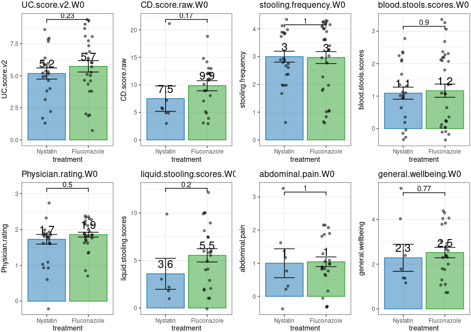
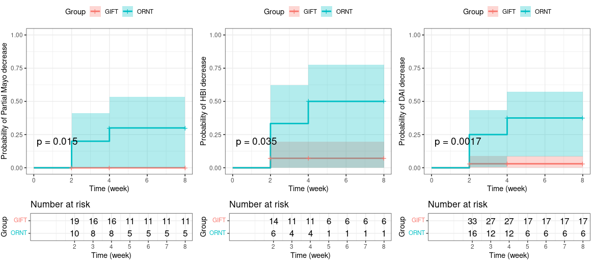
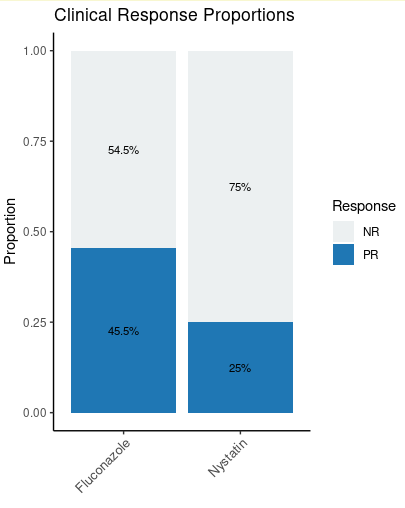
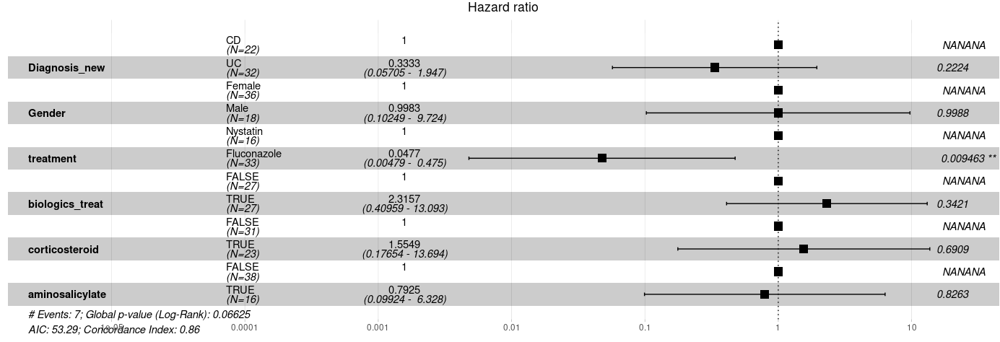
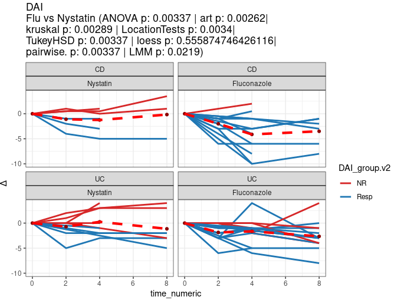
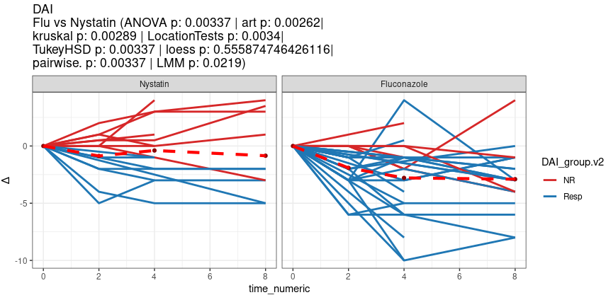

# 5.1 Clinical Feature Analysis: Data Processing, Visualization, and Statistical Testing

This chapter analyzes clinical outcomes in the MMC cohort: baseline disease activity, longitudinal score trajectories under antifungal treatment, patient demographics and concomitant medications, clinical response classification, and survival/Cox modeling of disease progression. Key methodologies include paired baseline-corrected comparisons, a multi-test statistical battery (ANOVA, ART, Kruskal–Wallis, permutation, Tukey, pairwise t, LMM, LOESS), Kaplan–Meier survival analysis, and Cox proportional-hazards modeling.

## 4.1.1 Baseline (W0) Disease Scores: Nystatin vs Fluconazole

Selects W0 (pre-treatment) records for the Nystatin and Fluconazole arms and compares baseline clinical scores (UC/CD scores, stooling frequency, bleeding, etc.) between the two groups with a permutation test, exported as `Clincal_feature_com_W0.svg`.

~~~R
ReadCap.20251215 <- mcreadRDS("./workshop/MMC/Aidan_info/v2/ReadCap.20251215.rds")
total_times_tmp <- read.csv("./projects/MMC/Figures/figures_making/v3/patient.PFS.20251215.csv")
total_times_tmp <- total_times_tmp[total_times_tmp$treatment!="Clotrimazole",]
ReadCap.20251215 <- ReadCap.20251215[ReadCap.20251215$Omics_patient_Names %in% total_times_tmp$Omics_patient_Names,]
write.csv(ReadCap.20251215,"./workshop/MMC/Aidan_info/v2/ReadCap.20251215.v3.csv")

ReadCap.20251215 <- mcreadRDS("./workshop/MMC/Aidan_info/v2/ReadCap.20251215.rds")
total_times_tmp <- read.csv("./projects/MMC/Figures/figures_making/v3/patient.PFS.20251215.csv")
Nys_CD <- ReadCap.20251215[ReadCap.20251215$Omics_patient_Names %in% 
    setdiff(ReadCap.20251215$Omics_patient_Names,total_times_tmp$Omics_patient_Names),]
Flu_CD <- ReadCap.20251215[ReadCap.20251215$Omics_patient_Names %in% 
    setdiff(ReadCap.20251215$Omics_patient_Names,total_times_tmp$Omics_patient_Names) &
    ReadCap.20251215$Diagnosis_new=="CD" & ReadCap.20251215$treatment=="Fluconazole" &
    ReadCap.20251215$CD.score.raw<=5 ,]
Flu_CD <- Flu_CD[!is.na(Flu_CD$treatment),]
c("MMC114",Flu_CD$Omics_patient_Names,Nys_CD$Omics_patient_Names)
ReadCap.20251215 <- ReadCap.20251215[ReadCap.20251215$Omics_patient_Names %in% c("MMC114",Flu_CD$Omics_patient_Names,Nys_CD$Omics_patient_Names,total_times_tmp$Omics_patient_Names),]
ReadCap.20251215$time.v2 <- as.character(ReadCap.20251215$time)
ReadCap.20251215$time.v2[ReadCap.20251215$time.v2 %in% c("W0")] <- "Pre"
ReadCap.20251215$time.v2[ReadCap.20251215$time.v2 %in% c("W1","W2","W4")] <- "Post"
ReadCap.20251215$time.v2[ReadCap.20251215$time.v2 %in% c("W8")] <- "LTM"
ReadCap.20251215$time.v2 <- factor(ReadCap.20251215$time.v2,levels=c("Pre","Post","LTM"))
ReadCap.20251215_1 <- ReadCap.20251215[ReadCap.20251215$time=="W0",]
ReadCap.20251215_1 <- ReadCap.20251215_1[ReadCap.20251215_1$treatment %in% c("Nystatin","Fluconazole"),]
ReadCap.20251215_1$treatment <- factor(ReadCap.20251215_1$treatment,levels=c("Nystatin","Fluconazole"))
ReadCap.20251215_1$Diagnosis_new[ReadCap.20251215_1$Diagnosis_new=="Mix"] <- "CD"
ReadCap.20251215_1$UC.score.v2[ReadCap.20251215_1$UC.score.v2 > 9 & ReadCap.20251215_1$Diagnosis_new=="UC"] <- 9

CD <- ReadCap.20251215_1[ReadCap.20251215_1$Diagnosis_new=="CD",]
UC <- ReadCap.20251215_1[ReadCap.20251215_1$Diagnosis_new=="UC",]
UC[UC$UC.score.v2>=11 | UC$UC.score.v2<=1,]$Omics_samples_Names
CD[CD$CD.score.raw>=12 | CD$CD.score.raw<=4,]$Omics_samples_Names
sort(UC[UC$time=="W0","UC.score.v2"])
sort(CD[CD$time=="W0","CD.score.raw"])
tmp <- UC[,c("UC.score.v2","treatment","Omics_patient_Names")]
tmp[order(tmp$UC.score.v2),]
tmp <- CD[,c("CD.score.raw","treatment","Omics_patient_Names")]
tmp[order(tmp$CD.score.raw),]

# UC <- UC[UC$UC.score.v2<11 & UC$UC.score.v2>1,]
# CD <- CD[CD$CD.score.raw<12 & CD$CD.score.raw>4,]
# ReadCap.20251215_1 <- rbind(UC,CD)
table(ReadCap.20251215_1$Diagnosis_new)
table(ReadCap.20251215_1$treatment,ReadCap.20251215_1$Diagnosis_new)
sort(unique(ReadCap.20251215$Omics_patient_Names))
# diease_Scores <- c("DAI","UC.score.v2","CD.score.raw","stooling.frequency.scores","stooling.frequency","blood.stools.scores",
#     "Mucosal.Appearance","Physician.rating","liquid.stooling.scores","abdominal.pain","general.wellbeing","Abdominal.mass")
diease_Scores <- c("UC.score.v2","CD.score.raw","stooling.frequency","blood.stools.scores",
    "Physician.rating","liquid.stooling.scores","abdominal.pain","general.wellbeing")
comb <- list(c("Nystatin","Fluconazole"))
pal <- jdb_palette("corona")[c(1,3,2)]
library(coin)
table(ReadCap.20251215_1$treatment,ReadCap.20251215_1$Diagnosis_new)
perm_test_wrapper <- function(a, b) {
  df <- data.frame(value = c(a, b),group = factor(c(rep("A", length(a)), rep("B", length(b)))))
  df <- df[is.finite(df$value), ]
  out <- coin::pvalue(coin::oneway_test(value ~ group, data = df,distribution = coin::approximate(B = 30)))
  list(p.value = out)
}
total_plots2 <- lapply(1:length(diease_Scores),function(dis) {
    df_paired <- ReadCap.20251215_1[ReadCap.20251215_1$treatment!="Clotrimazole",]
    colnames(df_paired)[which(colnames(df_paired)==diease_Scores[dis])] <- "value"
    bar_data <- df_paired %>%dplyr::group_by(treatment) %>%  dplyr::summarise(value = mean(value, na.rm = TRUE), .groups = "drop")
    p1 <- ggplot(df_paired, aes_string(x = "treatment", y = "value")) +
        theme_bw()+ scale_color_manual(values = pal)+scale_fill_manual(values = pal)+ 
        geom_bar(data=bar_data,aes(fill=treatment,color=treatment),alpha=0.5,stat="identity", position=position_dodge())+
        NoLegend()+labs(title = paste0(diease_Scores[dis],".W0"),y =diease_Scores[dis])+
        geom_jitter(color="black",width = 0.1,alpha=0.5)+ stat_summary(fun.data = mean_se, geom = "errorbar", width = 0.5) + 
        geom_signif(comparisons = comb,step_increase = 0.1,map_signif_level = FALSE,test = perm_test_wrapper)+
        stat_summary(fun.y=mean, colour="black", geom="text", size=6,show_guide = FALSE,  vjust=-0.7, aes( label=round(..y.., digits=1)))
    return(p1)
    })
plot <- CombinePlots(c(total_plots2),nrow=2)
plot
ggsave("./projects/MMC/Figures/v2_figures/Clincal_feature_com_W0.svg", plot=plot,width = 15, height = 7,dpi=300)
~~~

## 4.1.2 Longitudinal Clinical Scores Over Weeks (Multi-test)

Plots each clinical score across weeks (W0–W8) as raw bars and per-patient baseline-corrected (delta) trajectories, annotating Fluconazole-vs-Nystatin differences with the full statistical battery (ANOVA, ART, Kruskal–Wallis, permutation, Tukey, pairwise t, LMM, LOESS F-test), exported as `Fig4.1.clincal_outcomes.svg`.

~~~R
ReadCap.20251215 <- mcreadRDS("./workshop/MMC/Aidan_info/v2/ReadCap.20251215.rds")
total_times_tmp <- read.csv("./projects/MMC/Figures/figures_making/v3/patient.PFS.20251215.csv")
sample_info_total5 <- ReadCap.20251215[ReadCap.20251215$Omics_patient_Names %in% total_times_tmp$Omics_patient_Names,]
diease_Scores <- c("DAI","UC.score.v2","CD.score.raw","stooling.frequency","blood.stools.scores",
    "Physician.rating","liquid.stooling.scores","abdominal.pain","general.wellbeing")
comb <- list(c("W0","W1"),c("W0","W2"),c("W0","W4"),c("W0","W8"))
pal <- jdb_palette("corona")
ReadCap.20251215_1 <- sample_info_total5[sample_info_total5$treatment!="Clotrimazole",]
ReadCap.20251215_1 <- ReadCap.20251215_1[ReadCap.20251215_1$time!="W6",]
ReadCap.20251215_1$treatment <- factor(ReadCap.20251215_1$treatment,levels=c("Nystatin","Fluconazole"))
ReadCap.20251215_1$UC.score.v2[ReadCap.20251215_1$UC.score.v2 > 9 & ReadCap.20251215_1$Diagnosis_new=="UC"] <- 9
total_plots1 <- lapply(1:length(diease_Scores),function(dis) {
    df_paired <- ReadCap.20251215_1
    colnames(df_paired)[which(colnames(df_paired)==diease_Scores[dis])] <- "value"
    bar_data <- df_paired %>%dplyr::group_by(time, treatment) %>%  dplyr::summarise(value = mean(value, na.rm = TRUE), .groups = "drop")
    p1 <- ggplot(df_paired, aes_string(x = "time", y = "value")) +
        theme_bw()+ scale_color_manual(values = pal)+scale_fill_manual(values = pal)+ 
        geom_bar(data=bar_data,aes(fill=time,color=time),alpha=0.5,stat="identity", position=position_dodge())+
        NoLegend()+labs(title = paste0(diease_Scores[dis]),y ="raw")+
        geom_jitter(color="black",width = 0.1,alpha=0.5)+ stat_summary(fun.data = mean_se, geom = "errorbar", width = 0.5) +facet_wrap(~treatment,ncol=3)+
        stat_summary(fun.y=mean, colour="black", geom="text", size=6,show_guide = FALSE,  vjust=-0.7, aes( label=round(..y.., digits=1)))
    return(p1)
    })
total_plots2 <- lapply(1:length(diease_Scores),function(dis) {
    df_paired <- ReadCap.20251215_1
    uniq_patient1 <- unique(df_paired$Omics_patient_Names)
    df_paired1_ <- lapply(1:length(uniq_patient1),function(i) {
        tmp <- df_paired[df_paired$Omics_patient_Names %in% uniq_patient1[i],]
        tmp[,"value"] <- tmp[,diease_Scores[dis]]-tmp[tmp$time=="W0",diease_Scores[dis]]
        tmp$value[tmp$value > 500] <- 500
        tmp$value[tmp$value < -500] <- -500
        return(tmp)
    })
    df_paired1 <- do.call(rbind,df_paired1_)
    bar_data <- df_paired1 %>%dplyr::group_by(time, treatment) %>%  dplyr::summarise(value = mean(value, na.rm = TRUE), .groups = "drop")
    p1 <- ggplot(df_paired1, aes_string(x = "time", y = "value")) +
        theme_bw()+ scale_color_manual(values = pal)+scale_fill_manual(values = pal)+ 
        geom_bar(data=bar_data,alpha=0.5,stat="identity", position=position_dodge())+
        NoLegend()+labs(title = paste0(diease_Scores[dis]," changes"),y ="Δ")+
        geom_smooth(aes(group = 1, color = treatment), method = "loess", size = 1.5, se = TRUE,alpha=0.2)+
        geom_jitter(color="black",width = 0.1,alpha=0.5)+ stat_summary(fun.data = mean_se, geom = "errorbar", width = 0.5) + facet_wrap(~treatment,ncol=3)+
        geom_signif(comparisons = comb,step_increase = 0.1,map_signif_level = FALSE,test = wilcox.test_wrapper)+facet_wrap(~treatment,ncol=3)+
        stat_summary(fun.y=mean, colour="black", geom="text", size=6,show_guide = FALSE,  vjust=-0.7, aes( label=round(..y.., digits=1)))
    return(p1)
    })
library(lme4)
library(ARTool)
library(coin)
total_plots3 <- lapply(1:length(diease_Scores),function(dis) {
    df_paired <- ReadCap.20251215_1
    uniq_patient1 <- unique(df_paired$Omics_patient_Names)
    df_paired1_ <- lapply(1:length(uniq_patient1),function(i) {
        tmp <- df_paired[df_paired$Omics_patient_Names %in% uniq_patient1[i],]
        tmp[,"value"] <- tmp[,diease_Scores[dis]]-tmp[tmp$time=="W0",diease_Scores[dis]]
        tmp$value[tmp$value > 500] <- 500
        tmp$value[tmp$value < -500] <- -500
        return(tmp)
    })
    df_paired2 <- do.call(rbind,df_paired1_)
    df_paired2 <- df_paired2[!is.na(df_paired2$value),]
    df_paired2$time_numeric <- as.numeric(gsub("W", "", df_paired2$time))

    art_model <- art(value ~ treatment, data = df_paired2)
    anova_art <- anova(art_model)
    art_p_value <- anova_art$`Pr(>F)`[1]
    art.pvalue0 <- ifelse(art_p_value < 0.001, "< 0.001", format(art_p_value, digits = 3))

    kruskal_result <- kruskal.test(value ~ treatment, data = df_paired2)
    kruskal_pvalue <- kruskal_result$p.value
    kruskal.pvalue0 <- ifelse(kruskal_pvalue < 0.001, "< 0.001", format(kruskal_pvalue, digits = 3))

    perm_test_result <- oneway_test(value ~ treatment, data = df_paired2, distribution = "approximate")
    perm_pvalue <- pvalue(perm_test_result)
    LocationTests.pvalue0 <- ifelse(perm_pvalue < 0.001, "< 0.001", format(perm_pvalue, digits = 3))

    lm_result <- lm(value ~ treatment, data = df_paired2)
    tukey_result <- TukeyHSD(aov(lm_result))
    tukey_pvalues <- tukey_result$treatment
    TukeyHSD.pvalue1 <- ifelse(tukey_pvalues["Fluconazole-Nystatin", "p adj"] < 0.001, "< 0.001", format(tukey_pvalues["Fluconazole-Nystatin", "p adj"], digits = 3))
    
    pairwise_t_result <- pairwise.t.test(df_paired2$value, df_paired2$treatment, p.adjust.method = "bonferroni")
    pairwise_t_pvalues <- pairwise_t_result$p.value
    pairwise.t.pvalue1 <- ifelse(pairwise_t_pvalues["Fluconazole","Nystatin"] < 0.001, "< 0.001", format(pairwise_t_pvalues["Fluconazole","Nystatin"], digits = 3))

    lmm_result <- lmerTest::lmer(value ~ treatment + (1 | Omics_patient_Names), data = df_paired2)
    summary_lmm <- summary(lmm_result)
    p_value_mixed <- coef(summary_lmm)["treatmentFluconazole", "Pr(>|t|)"]
    LMM.pvalue1 <- ifelse(is.na(p_value_mixed) | p_value_mixed < 0.001, "< 0.001", format(p_value_mixed, digits = 3))

    anova_result <- aov(value ~ treatment, data = df_paired2)
    p_value <- summary(anova_result)[[1]]["treatment", "Pr(>F)"]
    anova.pvalue0 <- ifelse(p_value < 0.001, "< 0.001", format(p_value, digits = 3))

    # # Fit mixed-effects model
    # model <- lmer(value ~ treatment * time_numeric + (1|Omics_patient_Names), data = df_paired2)
    # summary(model)
    # # Extract p-value for treatment effect
    # p_value <- summary(model)$coefficients["treatmentFluconazole", "Pr(>|t|)"]
    # anova.pvalue0 <- ifelse(p_value < 0.001, "< 0.001", format(p_value, digits = 3))

    loess_fit_1 <- loess(value ~ time_numeric, data = df_paired2[df_paired2$treatment == "Nystatin", ])
    loess_fit_2 <- loess(value ~ time_numeric, data = df_paired2[df_paired2$treatment == "Fluconazole", ])
    x_range <- seq(min(df_paired2$time_numeric), max(df_paired2$time_numeric), length.out = 100)
    pred_1 <- predict(loess_fit_1, newdata = data.frame(time_numeric = x_range))
    pred_2 <- predict(loess_fit_2, newdata = data.frame(time_numeric = x_range))
    ks_test_result <- formatC(ks.test(pred_1, pred_2)$p.value, format = "e", digits = 3)

    rss_1 <- sum((df_paired2[df_paired2$treatment == "Nystatin", "value"] - predict(loess_fit_1))^2)
    rss_2 <- sum((df_paired2[df_paired2$treatment == "Fluconazole", "value"] - predict(loess_fit_2))^2)
    n1 <- length(df_paired2[df_paired2$treatment == "Nystatin", "value"])  # Sample size group 1
    n2 <- length(df_paired2[df_paired2$treatment == "Fluconazole", "value"])  # Sample size group 2
    f_stat <- (rss_1 / (n1 - 2)) / (rss_2 / (n2 - 2))
    Ftestp_value <- pf(f_stat, df1 = n1 - 2, df2 = n2 - 2, lower.tail = FALSE)# Perform an F-test

    p2 <- ggplot(df_paired2, aes_string(x = "time_numeric", y = "value")) + geom_jitter(aes(color=treatment),size = 1)+ 
    geom_smooth(aes(color=treatment,fill=treatment),size = 2,alpha=0.2,method = "loess", method.args = list(degree=1),se=TRUE, level = 0.5)+
    stat_compare_means(aes(group = treatment), method = "wilcox.test", label.y = c(0),label = "p.format") +
    theme_bw()+ scale_color_manual(values = pal[c(2,1)])+scale_fill_manual(values = pal[c(2,1)])+
    labs(title = paste0(diease_Scores[dis],"\n", "Flu vs Nystatin (ANOVA p: ", anova.pvalue0," | ","art p: ",art.pvalue0,
        "|\n","kruskal p: ", kruskal.pvalue0," | ","LocationTests p: ",LocationTests.pvalue0,
        "|\n","TukeyHSD p: ",TukeyHSD.pvalue1," | ","loess p: ",Ftestp_value,"|\n","pairwise. p: ",pairwise.t.pvalue1," | ",
        "LMM p: ",LMM.pvalue1,")"),y = "Δ")+  NoLegend()
    message(dis)
    return(p2)
    })
plot <- CombinePlots(c(total_plots1,total_plots3),nrow=2)
plot
ggsave("./projects/MMC/Figures/v2_figures/Fig4.1.clincal_outcomes.svg", plot=plot,width = 30, height = 8,dpi=300)
~~~

## 4.1.3 Clinical Scores by Treatment Phase (Pre/Post/LTM)

Collapses time into Pre (W0), Post (W1–W4), and LTM (W8) phases and plots raw and delta clinical scores per phase for each treatment arm, exported as `Fig4.1.clincal_outcomes2`.

~~~R
ReadCap.20251215 <- mcreadRDS("./workshop/MMC/Aidan_info/v2/ReadCap.20251215.rds")
total_times_tmp <- read.csv("./projects/MMC/Figures/figures_making/v3/patient.PFS.20251215.csv")
sample_info_total5 <- ReadCap.20251215[ReadCap.20251215$Omics_patient_Names %in% total_times_tmp$Omics_patient_Names,]
diease_Scores <- c("UC.score.v2","CD.score.raw","stooling.frequency","blood.stools.scores",
    "Physician.rating","liquid.stooling.scores","abdominal.pain","general.wellbeing")
ReadCap.20251215_1 <- sample_info_total5[sample_info_total5$treatment!="Clotrimazole",]
ReadCap.20251215_1 <- ReadCap.20251215_1[ReadCap.20251215_1$time!="W6",]
ReadCap.20251215_1$treatment <- factor(ReadCap.20251215_1$treatment,levels=c("Nystatin","Fluconazole"))
ReadCap.20251215_1$UC.score.v2[ReadCap.20251215_1$UC.score.v2 > 9 & ReadCap.20251215_1$Diagnosis_new=="UC"] <- 9
ReadCap.20251215_1 <- ReadCap.20251215_1[ReadCap.20251215_1$time %in% c("W0","W1","W2","W4","W8"),]
ReadCap.20251215_1$time.v2 <- as.character(ReadCap.20251215_1$time)
ReadCap.20251215_1$time.v2[ReadCap.20251215_1$time.v2 %in% "W0"] <- "Pre"
ReadCap.20251215_1$time.v2[ReadCap.20251215_1$time.v2 %in% c("W1","W2","W4")] <- "Post"
ReadCap.20251215_1$time.v2[ReadCap.20251215_1$time.v2 %in% "W8"] <- "LTM"
ReadCap.20251215_1$time.v2 <- factor(ReadCap.20251215_1$time.v2, levels=c("Pre","Post","LTM"))

pal <- jdb_palette("corona")
comb <- list(c("Pre","Post"),c("Pre","LTM"),c("Pre","LTM"))
total_plots1 <- lapply(1:length(diease_Scores),function(dis) {
    df_paired <- ReadCap.20251215_1
    colnames(df_paired)[which(colnames(df_paired)==diease_Scores[dis])] <- "value"
    bar_data <- df_paired %>%dplyr::group_by(time.v2, treatment) %>%  dplyr::summarise(value = mean(value, na.rm = TRUE), .groups = "drop")
    p1 <- ggplot(df_paired, aes_string(x = "time.v2", y = "value")) +
        theme_bw()+ scale_color_manual(values = pal)+scale_fill_manual(values = pal)+ 
        geom_bar(data=bar_data,aes(fill=time.v2,color=time.v2),alpha=0.5,stat="identity", position=position_dodge())+
        NoLegend()+labs(title = paste0(diease_Scores[dis]),y ="raw")+
        geom_jitter(color="black",width = 0.1,alpha=0.5)+ stat_summary(fun.data = mean_se, geom = "errorbar", width = 0.5) + 
        geom_signif(comparisons = comb,step_increase = 0.1,map_signif_level = FALSE,test = wilcox.test_wrapper)+facet_wrap(~treatment,ncol=3)+
        stat_summary(fun.y=mean, colour="black", geom="text", size=6,show_guide = FALSE,  vjust=-0.7, aes( label=round(..y.., digits=1)))
    return(p1)
    })
total_plots2 <- lapply(1:length(diease_Scores),function(dis) {
    df_paired <- ReadCap.20251215_1
    uniq_patient1 <- unique(df_paired$Omics_patient_Names)
    df_paired1_ <- lapply(1:length(uniq_patient1),function(i) {
        tmp <- df_paired[df_paired$Omics_patient_Names %in% uniq_patient1[i],]
        tmp[,"value"] <- tmp[,diease_Scores[dis]]-tmp[tmp$time.v2=="Pre",diease_Scores[dis]]
        tmp$value[tmp$value > 450] <- 450
        tmp$value[tmp$value < -450] <- -450
        return(tmp)
    })
    df_paired1 <- do.call(rbind,df_paired1_)
    bar_data <- df_paired1 %>%dplyr::group_by(time.v2, treatment) %>%  dplyr::summarise(value = mean(value, na.rm = TRUE), .groups = "drop")
    p1 <- ggplot(df_paired1, aes_string(x = "time.v2", y = "value")) +
        theme_bw()+ scale_color_manual(values = pal)+scale_fill_manual(values = pal)+ 
        geom_bar(data=bar_data,alpha=0.5,stat="identity", position=position_dodge())+
        NoLegend()+labs(title = paste0(diease_Scores[dis]," changes"),y ="Δ")+
        geom_smooth(aes(group = 1, color = treatment), method = "loess", size = 1.5, se = TRUE,alpha=0.2,span=1.2)+
        geom_jitter(color="black",width = 0.1,alpha=0.5)+ stat_summary(fun.data = mean_se, geom = "errorbar", width = 0.5) + 
        geom_signif(comparisons = comb,step_increase = 0.1,map_signif_level = FALSE,test = wilcox.test_wrapper)+facet_wrap(~treatment,ncol=3)+
        stat_summary(fun.y=mean, colour="black", geom="text", size=6,show_guide = FALSE,  vjust=-0.7, aes( label=round(..y.., digits=1)))
    return(p1)
    })
plot <- CombinePlots(c(total_plots1,total_plots2),nrow=2)
plot
ggsave("./projects/MMC/Figures/v2_figures/Fig4.1.clincal_outcomes2.svg", plot=plot,width = 30, height = 8,dpi=300)
ggsave("./projects/MMC/Figures/v2_figures/Fig4.1.clincal_outcomes2.png", plot=plot,width = 30, height = 8,dpi=300)
~~~

## 4.1.4 Patient Metadata, Response Classification, and Survival Curves

Assembles the patient-level metadata table (demographics, disease severity, concomitant medications), harmonizes categorical fields, defines clinical progression (PR vs NR) separately for UC and CD, and draws Kaplan–Meier event curves (probability of score decrease) for UC, CD, and the combined cohort by treatment group.

~~~R
total_times_tmp <- read.csv("./projects/MMC/Figures/figures_making/v3/patient.PFS.20251215.csv")
total_times_tmp <- total_times_tmp[,-1]
rownames(total_times_tmp) <- total_times_tmp$Omics_patient_Names
ReadCap.20251215 <- mcreadRDS("./workshop/MMC/Aidan_info/v2/ReadCap.20251215.rds")
tmp.Age <- ReadCap.20251215[ReadCap.20251215$time=="W0",]
rownames(tmp.Age) <- tmp.Age$Omics_patient_Names
total_times_tmp <- as.data.frame(cbind(total_times_tmp[,setdiff(colnames(total_times_tmp),colnames(tmp.Age))],
  tmp.Age[rownames(total_times_tmp),c("Diagnosis_new","Gender","Age","Race","Disease.severity","Omics_patient_Names",
    c("DAI","UC.score.raw","UC.score.v2","CD.score.raw","stooling.frequency.scores","stooling.frequency","blood.stools.scores",
    "Mucosal.Appearance","Physician.rating","liquid.stooling.scores","abdominal.pain","general.wellbeing","Abdominal.mass"))]))
# total_times_tmp$Diagnosis_new[total_times_tmp$Diagnosis_new=="MC"] <- "CD"
# total_times_tmp$Diagnosis_new[total_times_tmp$Diagnosis_new=="Mix"] <- "CD"
total_times_tmp$Gender[total_times_tmp$Gender=="Female "] <- "Female"
total_times_tmp$Gender[total_times_tmp$Gender=="FEMALE"] <- "Female"
total_times_tmp$Gender[total_times_tmp$Gender=="female"] <- "Female"
total_times_tmp$Gender[total_times_tmp$Gender=="male"] <- "Male"
total_times_tmp$Gender[total_times_tmp$Gender=="MALE"] <- "Male"
total_times_tmp$Gender[total_times_tmp$Gender=="Male "] <- "Male"
total_times_tmp$Race[total_times_tmp$Race=="declined"] <- "Declined"
total_times_tmp$Race[total_times_tmp$Race=="Not listed; not hispanic/latino"] <- "Declined"
total_times_tmp$Race[total_times_tmp$Race=="other"] <- "Declined"
total_times_tmp$Race[total_times_tmp$Race=="white"] <- "White"
total_times_tmp$Race[total_times_tmp$Race=="WHITE"] <- "White"
total_times_tmp$Gender <- factor(total_times_tmp$Gender,levels=c("Male","Female"))
total_times_tmp <- total_times_tmp[total_times_tmp$treatment!="Clotrimazole",]
total_times_tmp$DAI_group <- "Resp"
total_times_tmp[total_times_tmp$DAI_diff==0,"DAI_group"] <- "SD"
total_times_tmp[total_times_tmp$DAI_diff>0,"DAI_group"] <- "PD"
total_times_tmp$DAI_group <- factor(total_times_tmp$DAI_group,levels=c("Resp","SD","PD"))
total_times_tmp$Diagnosis_new <- factor(total_times_tmp$Diagnosis_new,levels=c("UC","CD"))
total_times_tmp$treatment <- tmp.Age[as.character(total_times_tmp$Omics_patient_Names),"treatment"]
total_times_tmp$treatment <- factor(total_times_tmp$treatment,levels=c("Nystatin","Clotrimazole","Fluconazole"))
total_times_tmp$treatment.v2 <- as.character(total_times_tmp$treatment)
total_times_tmp$treatment.v2[total_times_tmp$treatment.v2 %in% c("Clotrimazole","Fluconazole")] <- "Clo_Flu"
total_times_tmp$treatment.v2 <- factor(total_times_tmp$treatment.v2,levels=c("Nystatin","Clo_Flu"))
total_times_tmp$DAI_group.v2 <- as.character(total_times_tmp$DAI_group)
total_times_tmp$DAI_group.v2[total_times_tmp$DAI_group.v2 %in% c("PD","SD")] <- "NR"
total_times_tmp$Disease.severity <- tmp.Age[as.character(total_times_tmp$Omics_patient_Names),"Disease.severity"]
total_times_tmp$Disease.severity_v2 <- tmp.Age[as.character(total_times_tmp$Omics_patient_Names),"Disease.severity"]
total_times_tmp$Disease.severity_v2 <- toupper(total_times_tmp$Disease.severity_v2)
total_times_tmp$Disease.severity_v2[grep("MODER",total_times_tmp$Disease.severity_v2,value=FALSE)] <- "Moderate"
total_times_tmp$Disease.severity_v2[grep("MILD",total_times_tmp$Disease.severity_v2,value=FALSE)] <- "Mild"
total_times_tmp$Disease.severity_v2[grep("NOT ACTIVE",total_times_tmp$Disease.severity_v2,value=FALSE)] <- "Mild"
total_times_tmp <- total_times_tmp[!is.na(total_times_tmp$treatment),]
write.csv(total_times_tmp,"./projects/MMC/Figures/figures_making/v3/patient.PFS.20251215.csv")

total_times_tmp <- read.csv("./projects/MMC/Figures/figures_making/v3/patient.PFS.20251215.csv")
rownames(total_times_tmp) <- total_times_tmp$Omics_patient_Names
medications.filter <- read.csv("./workshop/MMC/sample_info/medications.filter_20251215.csv")
rownames(medications.filter) <- medications.filter$Patient.Research.ID
medications.filter <- medications.filter[,c("anti_IL23","anti_TNF","integrin","corticosteroid","aminosalicylate","vitamin_d","antibiotic","probiotic")]
medications.filter[medications.filter=="TRUE"] <- 1
medications.filter[medications.filter=="FALSE"] <- 0
medications.filter$biologics_treat <- medications.filter$anti_IL23+medications.filter$anti_TNF+medications.filter$integrin
medications.filter$immunosuppressants <- medications.filter$corticosteroid+medications.filter$aminosalicylate
# medications.filter$vitamin_d <- medications.filter$vitamin_d+medications.filter$probiotic
medications.filter$biologics_treat <- ifelse(medications.filter$biologics_treat>0,"TRUE","FALSE")
medications.filter$biologics_treat[medications.filter$biologics_treat=="MMC014"] <- "TRUE"
medications.filter$immunosuppressants <- ifelse(medications.filter$immunosuppressants>0,"TRUE","FALSE")
medications.filter$vitamin_d <- ifelse(medications.filter$vitamin_d>0,"TRUE","FALSE")
medications.filter$corticosteroid <- ifelse(medications.filter$corticosteroid>0,"TRUE","FALSE")
medications.filter$aminosalicylate <- ifelse(medications.filter$aminosalicylate>0,"TRUE","FALSE")

total_times_tmp <- as.data.frame(cbind(total_times_tmp,medications.filter[rownames(total_times_tmp),]))
total_times_tmp$treatment <- factor(total_times_tmp$treatment,levels=c("Nystatin","Fluconazole"))
total_times_tmp$biologics_treat <- factor(total_times_tmp$biologics_treat,levels=c("FALSE","TRUE"))
total_times_tmp$vitamin_d <- factor(total_times_tmp$vitamin_d,levels=c("FALSE","TRUE"))
total_times_tmp$corticosteroid <- factor(total_times_tmp$corticosteroid,levels=c("FALSE","TRUE"))
total_times_tmp$aminosalicylate <- factor(total_times_tmp$aminosalicylate,levels=c("FALSE","TRUE"))
write.csv(total_times_tmp,"./projects/MMC/Figures/figures_making/v3/patient.PFS.20251215_new.csv")

patient.PFS.20251215 <- read.csv("./projects/MMC/Figures/figures_making/v3/patient.PFS.20251215_new.csv")
patient.blood.stools.scores <- read.csv("./projects/MMC/Figures/figures_making/v3/patient.blood.stools.scores.20251215.csv")
rownames(patient.PFS.20251215) <- patient.PFS.20251215$Omics_patient_Names
rownames(patient.blood.stools.scores) <- patient.blood.stools.scores$Omics_patient_Names
patient.PFS.20251215$blood.stools.scores_diff <- patient.blood.stools.scores[rownames(patient.PFS.20251215),"blood.stools.scores_diff"]
patient.PFS.20251215$W0_blood.stools.scores <- patient.blood.stools.scores[rownames(patient.PFS.20251215),"W0"]
patient.PFS.20251215$W2_blood.stools.scores <- patient.blood.stools.scores[rownames(patient.PFS.20251215),"W0"]+patient.blood.stools.scores[rownames(patient.PFS.20251215),"blood.stools.scores_diff"]
patient.PFS.20251215$W2_DAI <- patient.PFS.20251215$W0+patient.PFS.20251215$DAI_diff
patient.PFS.20251215$DAI_per_baseline <- -100 * patient.PFS.20251215$DAI_diff / patient.PFS.20251215$W0
UC <- patient.PFS.20251215[patient.PFS.20251215$Diagnosis_new=="UC",]
UC$Clincal_progression <- "NR"
UC$Clincal_progression[UC$DAI_diff <= -2 & UC$DAI_per_baseline >= 30 &
 (UC$blood.stools.scores_diff <= -1 | UC$W2_blood.stools.scores %in% c(0, 1))] <- "PR"

CD <- patient.PFS.20251215[patient.PFS.20251215$Diagnosis_new!="UC",]
CD$Clincal_progression <- "NR"
CD$Clincal_progression[CD$DAI_diff <= -3] <- "PR"
# CD$Clincal_progression[CD$W2_DAI <= 4 | CD$DAI_diff <= -3] <- "PR"
total_times_tmp <- rbind(UC,CD)
rownames(total_times_tmp) <- total_times_tmp$Omics_patient_Names
total_times_tmp$Clincal_progression <- total_times_tmp[total_times_tmp$Omics_patient_Names,"Clincal_progression"]
table(total_times_tmp$treatment,total_times_tmp$Clincal_progression)
total_times_tmp <- total_times_tmp[total_times_tmp$treatment!="Clotrimazole",]
library(survival)
library(survminer)
fit1 <- survfit(Surv(max.DAI.dates, status) ~ treatment,
  data = total_times_tmp[total_times_tmp$Diagnosis_new == "UC", ])
p1 <- ggsurvplot(
  fit1,
  data = total_times_tmp[total_times_tmp$Diagnosis_new == "UC", ],
  fun = "event",
  pval = TRUE,
  conf.int = TRUE,
  risk.table = TRUE,ylim = c(0, 1),
  ggtheme = theme_bw(),
  xlab = "Time (week)",
  ylab = "Probability of Partial Mayo decrease",
  legend.title = "Group",
  legend.labs = c("GIFT", "ORNT"))

fit2 <- survfit(Surv(max.DAI.dates, status) ~ treatment,
 data = total_times_tmp[total_times_tmp$Diagnosis_new == "CD", ])
p2 <- ggsurvplot(
  fit2,
  data = total_times_tmp[total_times_tmp$Diagnosis_new == "CD", ],
  fun = "event",
  pval = TRUE,
  conf.int = TRUE,
  risk.table = TRUE,
  ggtheme = theme_bw(),ylim = c(0, 1),
  xlab = "Time (week)",
  ylab = "Probability of HBI decrease",
  legend.title = "Group",
  legend.labs = c("GIFT", "ORNT"))

fit3 <- survfit(Surv(max.DAI.dates, status) ~ treatment,
 data = total_times_tmp)
p3 <- ggsurvplot(
  fit3,
  data = total_times_tmp,
  fun = "event",
  pval = TRUE,
  conf.int = TRUE,
  risk.table = TRUE,
  ggtheme = theme_bw(),ylim = c(0, 1),
  xlab = "Time (week)",
  ylab = "Probability of DAI decrease",
  legend.title = "Group",
  legend.labs = c("GIFT", "ORNT"))
arrange_ggsurvplots(list(p1,p2,p3),ncol = 3,nrow = 1,risk.table.height = 0.25)
~~~

## 4.1.5 Clinical Response Proportions

Tabulates partial-response (PR) vs non-response (NR) proportions per treatment group and draws a stacked proportion bar chart, exported as `Fig5.Clincal_progression.svg`.

~~~R
df <- as.data.frame(table(total_times_tmp$treatment, total_times_tmp$Clincal_progression))
df <- df[df$Var1 != "Clotrimazole", ]
colnames(df) <- c("Group", "Response", "Count")
df$Proportion <- ""
df$Proportion[df$Group == "Nystatin"] <- df$Count[df$Group == "Nystatin"]/sum(df$Count[df$Group == "Nystatin"])
df$Proportion[df$Group == "Fluconazole"] <- df$Count[df$Group == "Fluconazole"]/sum(df$Count[df$Group == "Fluconazole"])
df$Proportion <- as.numeric(df$Proportion)
df$Label  <- paste0(round(100*df$Proportion,1),"%")
plot <- ggplot(df, aes(x = Group, y = Proportion, fill = Response)) +
  geom_bar(stat = "identity", position = "fill") +
  geom_text(aes(label = Label),  position = position_stack(vjust = 0.5), size = 3, color = "black") +
  scale_fill_manual(values = pal) +
  theme_classic() +
  labs(x = '', y = 'Proportion', title = "Clinical Response Proportions") +
  theme(axis.text.x = element_text(angle = 45, vjust = 1, size = 10, hjust = 1))
plot
ggsave("./projects/MMC/Figures/v2_figures/Fig5.Clincal_progression.svg", plot=plot,width = 5, height = 5,dpi=300)
~~~

## 4.1.6 Cox Proportional-Hazards Model

Fits a multivariable Cox model for time-to-response adjusting for medications, treatment, gender, and diagnosis, and renders the hazard-ratio forest plot, exported as `Fig4.1.cox.pdf`.

~~~r
library("survival")
library("survminer")
total_times_tmp$treatment <- factor(total_times_tmp$treatment,levels=c("Nystatin","Fluconazole"))
total_times_tmp$biologics_treat <- factor(total_times_tmp$biologics_treat,levels=c("FALSE","TRUE"))
total_times_tmp$vitamin_d <- factor(total_times_tmp$vitamin_d,levels=c("FALSE","TRUE"))
total_times_tmp$corticosteroid <- factor(total_times_tmp$corticosteroid,levels=c("FALSE","TRUE"))
total_times_tmp$aminosalicylate <- factor(total_times_tmp$aminosalicylate,levels=c("FALSE","TRUE"))
coxph_result <- coxph(formula = Surv(max.DAI.dates, status) ~ aminosalicylate+corticosteroid+biologics_treat+treatment+Gender+Diagnosis_new, data = total_times_tmp)
summary(coxph_result,data=total_times_tmp)
source("./code/log-summery/MyBestFunction_scRNA.R.v4.R")
XY_ggforest_MMC(coxph_result, data =total_times_tmp, main = "Hazard ratio",fontsize = 1.0, refLabel = "1", noDigits = 3)

pdf("./projects/MMC/Figures/v2_figures/Fig4.1.cox.pdf",width=8,height=5)
XY_ggforest_MMC(coxph_result, data =total_times_tmp, main = "Hazard ratio",fontsize = 1.0, refLabel = "1", noDigits = 3)
dev.off()
~~~

## 4.1.7 DAI Trajectory Spider Plot (by Diagnosis and Treatment)

Builds per-patient DAI change trajectories, runs the full statistical battery, and draws spider/line plots of individual patients (colored by response) with the cohort mean, faceted by diagnosis and treatment, exported as `Fig4.1.spider.improvments.svg`.

~~~R
ReadCap.20251215 <- mcreadRDS("./workshop/MMC/Aidan_info/v2/ReadCap.20251215.rds")
total_times_tmp <- read.csv("./projects/MMC/Figures/figures_making/v3/patient.PFS.20251215.csv")
rownames(total_times_tmp) <- total_times_tmp$Omics_patient_Names
ReadCap.20251215 <- ReadCap.20251215[ReadCap.20251215$Omics_patient_Names %in% total_times_tmp$Omics_patient_Names,]
ReadCap.20251215_final2 <- ReadCap.20251215[ReadCap.20251215$time %in% c("W0","W2","W4","W8"),]
ReadCap.20251215_final2 <- ReadCap.20251215_final2[ReadCap.20251215_final2$treatment %in% c("Nystatin","Fluconazole"),]
ReadCap.20251215_final2$group.v2 <- total_times_tmp[as.character(ReadCap.20251215_final2$Omics_patient_Names),"diease_status"]
ReadCap.20251215_final2$DAI_group.v2 <- total_times_tmp[as.character(ReadCap.20251215_final2$Omics_patient_Names),"DAI_group.v2"]
ReadCap.20251215_final2$DAI_group <- total_times_tmp[as.character(ReadCap.20251215_final2$Omics_patient_Names),"DAI_group"]
ReadCap.20251215_final2[ReadCap.20251215_final2$Omics_patient_Names=="MMC093",]
total_times_tmp[total_times_tmp$Omics_patient_Names=="MMC093",]

patient.PFS.20251215 <- read.csv("./projects/MMC/Figures/figures_making/v3/patient.PFS.20251215_new.csv")
patient.blood.stools.scores <- read.csv("./projects/MMC/Figures/figures_making/v3/patient.blood.stools.scores.20251215.csv")
rownames(patient.PFS.20251215) <- patient.PFS.20251215$Omics_patient_Names
rownames(patient.blood.stools.scores) <- patient.blood.stools.scores$Omics_patient_Names
patient.PFS.20251215$blood.stools.scores_diff <- patient.blood.stools.scores[rownames(patient.PFS.20251215),"blood.stools.scores_diff"]
patient.PFS.20251215$W0_blood.stools.scores <- patient.blood.stools.scores[rownames(patient.PFS.20251215),"W0"]
patient.PFS.20251215$W2_blood.stools.scores <- patient.blood.stools.scores[rownames(patient.PFS.20251215),"W0"]+patient.blood.stools.scores[rownames(patient.PFS.20251215),"blood.stools.scores_diff"]
patient.PFS.20251215$W2_DAI <- patient.PFS.20251215$W0+patient.PFS.20251215$DAI_diff
patient.PFS.20251215$DAI_per_baseline <- -100 * patient.PFS.20251215$DAI_diff / patient.PFS.20251215$W0
UC <- patient.PFS.20251215[patient.PFS.20251215$Diagnosis_new=="UC",]
UC$Clincal_progression <- "NR"
UC$Clincal_progression[UC$DAI_diff <= -2 & UC$DAI_per_baseline >= 30 &
 (UC$blood.stools.scores_diff <= -1 | UC$W2_blood.stools.scores %in% c(0, 1))] <- "PR"

CD <- patient.PFS.20251215[patient.PFS.20251215$Diagnosis_new!="UC",]
CD$Clincal_progression <- "NR"
CD$Clincal_progression[CD$DAI_diff <= -3] <- "PR"
# CD$Clincal_progression[CD$W2_DAI <= 4 | CD$DAI_diff <= -3] <- "PR"
total_times_tmp <- rbind(UC,CD)

library(lme4)
library(ARTool)
library(coin)
ReadCap.20251215_final2$Clincal_progression <- total_times_tmp[as.character(ReadCap.20251215_final2$Omics_patient_Names),"Clincal_progression"]
df_paired <- ReadCap.20251215_final2
df_paired$treatment <- factor(df_paired$treatment,levels=c("Nystatin","Fluconazole"))
df_paired <- df_paired[!is.na(df_paired$treatment),]
colnames(df_paired)[colnames(df_paired)=="DAI"] <- "value"
uniq_patient1 <- unique(df_paired$Omics_patient_Names)
df_paired1_ <- lapply(1:length(uniq_patient1),function(i) {
    tmp <- df_paired[df_paired$Omics_patient_Names %in% uniq_patient1[i],]
    tmp[,"value"] <- tmp[,"value"]-tmp[tmp$time=="W0","value"]
    return(tmp)
})
df_paired2 <- do.call(rbind,df_paired1_)
df_paired2 <- df_paired2[!is.na(df_paired2$value),]
df_paired2$time_numeric <- as.numeric(gsub("W", "", df_paired2$time))
art_model <- art(value ~ treatment, data = df_paired2)
anova_art <- anova(art_model)
art_p_value <- anova_art$`Pr(>F)`[1]
art.pvalue0 <- ifelse(art_p_value < 0.001, "< 0.001", format(art_p_value, digits = 3))

kruskal_result <- kruskal.test(value ~ treatment, data = df_paired2)
kruskal_pvalue <- kruskal_result$p.value
kruskal.pvalue0 <- ifelse(kruskal_pvalue < 0.001, "< 0.001", format(kruskal_pvalue, digits = 3))

perm_test_result <- oneway_test(value ~ treatment, data = df_paired2, distribution = "approximate")
perm_pvalue <- pvalue(perm_test_result)
LocationTests.pvalue0 <- ifelse(perm_pvalue < 0.001, "< 0.001", format(perm_pvalue, digits = 3))

lm_result <- lm(value ~ treatment, data = df_paired2)
tukey_result <- TukeyHSD(aov(lm_result))
tukey_pvalues <- tukey_result$treatment
TukeyHSD.pvalue1 <- ifelse(tukey_pvalues["Fluconazole-Nystatin", "p adj"] < 0.001, "< 0.001", format(tukey_pvalues["Fluconazole-Nystatin", "p adj"], digits = 3))

pairwise_t_result <- pairwise.t.test(df_paired2$value, df_paired2$treatment, p.adjust.method = "bonferroni")
pairwise_t_pvalues <- pairwise_t_result$p.value
pairwise.t.pvalue1 <- ifelse(pairwise_t_pvalues["Fluconazole","Nystatin"] < 0.001, "< 0.001", format(pairwise_t_pvalues["Fluconazole","Nystatin"], digits = 3))

lmm_result <- lmerTest::lmer(value ~ treatment + (1 | Omics_patient_Names), data = df_paired2)
summary_lmm <- summary(lmm_result)
p_value_mixed <- coef(summary_lmm)["treatmentFluconazole", "Pr(>|t|)"]
LMM.pvalue1 <- ifelse(is.na(p_value_mixed) | p_value_mixed < 0.001, "< 0.001", format(p_value_mixed, digits = 3))

anova_result <- aov(value ~ treatment, data = df_paired2)
p_value <- summary(anova_result)[[1]]["treatment", "Pr(>F)"]
anova.pvalue0 <- ifelse(p_value < 0.001, "< 0.001", format(p_value, digits = 3))

loess_fit_1 <- loess(value ~ time_numeric, data = df_paired2[df_paired2$treatment == "Nystatin", ])
loess_fit_2 <- loess(value ~ time_numeric, data = df_paired2[df_paired2$treatment == "Fluconazole", ])
x_range <- seq(min(df_paired2$time_numeric), max(df_paired2$time_numeric), length.out = 100)
pred_1 <- predict(loess_fit_1, newdata = data.frame(time_numeric = x_range))
pred_2 <- predict(loess_fit_2, newdata = data.frame(time_numeric = x_range))
ks_test_result <- ks.test(pred_1, pred_2)$p.value

rss_1 <- sum((df_paired2[df_paired2$treatment == "Nystatin", "value"] - predict(loess_fit_1))^2)
rss_2 <- sum((df_paired2[df_paired2$treatment == "Fluconazole", "value"] - predict(loess_fit_2))^2)
n1 <- length(df_paired2[df_paired2$treatment == "Nystatin", "value"])  # Sample size group 1
n2 <- length(df_paired2[df_paired2$treatment == "Fluconazole", "value"])  # Sample size group 2
f_stat <- (rss_1 / (n1 - 2)) / (rss_2 / (n2 - 2))
Ftestp_value <- pf(f_stat, df1 = n1 - 2, df2 = n2 - 2, lower.tail = FALSE)# Perform an F-test
df_paired2$treatment <- factor(df_paired2$treatment,levels=c("Nystatin","Fluconazole"))

pal <- jdb_palette("corona")[1:5]
names(pal) <- c("Resp","NR","Nystatin","Clotrimazole","Fluconazole")
plot <- ggplot(df_paired2, aes_string(x = "time_numeric", y = "value")) + 
geom_line(aes(color=DAI_group.v2,group=Omics_patient_Names),size = 1,alpha=1)+facet_wrap(~Diagnosis_new+treatment)+
stat_summary(fun.y = mean, geom="point",colour="darkred", size=1.5) + 
stat_summary(fun = mean, geom = "line",aes(group = 1),col = "red",size=1.5, linetype = "dashed")+
theme_bw()+ scale_color_manual(values = pal)+scale_fill_manual(values = pal)+
labs(title = paste0("DAI","\n", "Flu vs Nystatin (ANOVA p: ", anova.pvalue0," | ","art p: ",art.pvalue0,
    "|\n","kruskal p: ", kruskal.pvalue0," | ","LocationTests p: ",LocationTests.pvalue0,
    "|\n","TukeyHSD p: ",TukeyHSD.pvalue1," | ","loess p: ",Ftestp_value,"|\n","pairwise. p: ",pairwise.t.pvalue1," | ",
    "LMM p: ",LMM.pvalue1,")"),y = "Δ")
plot
ggsave("./projects/MMC/Figures/v2_figures/Fig4.1.spider.improvments.svg", plot=plot,width = 10, height = 8,dpi=300)
~~~

## 4.1.8 DAI Trajectory Spider Plot (by Treatment Only)

Re-draws the DAI trajectory spider plot faceted by treatment only (pooling diagnoses), exported as `Fig4.1.spider.improvments1.svg`.

~~~R
plot <- ggplot(df_paired2, aes_string(x = "time_numeric", y = "value")) + 
geom_line(aes(color=DAI_group.v2,group=Omics_patient_Names),size = 1,alpha=1)+facet_wrap(~treatment)+
stat_summary(fun.y = mean, geom="point",colour="darkred", size=1.5) + 
stat_summary(fun = mean, geom = "line",aes(group = 1),col = "red",size=1.5, linetype = "dashed")+
theme_bw()+ scale_color_manual(values = pal)+scale_fill_manual(values = pal)+
labs(title = paste0("DAI","\n", "Flu vs Nystatin (ANOVA p: ", anova.pvalue0," | ","art p: ",art.pvalue0,
    "|\n","kruskal p: ", kruskal.pvalue0," | ","LocationTests p: ",LocationTests.pvalue0,
    "|\n","TukeyHSD p: ",TukeyHSD.pvalue1," | ","loess p: ",Ftestp_value,"|\n","pairwise. p: ",pairwise.t.pvalue1," | ",
    "LMM p: ",LMM.pvalue1,")"),y = "Δ")
plot
ggsave("./projects/MMC/Figures/v2_figures/Fig4.1.spider.improvments1.svg", plot=plot,width = 10, height = 8,dpi=300)
~~~

