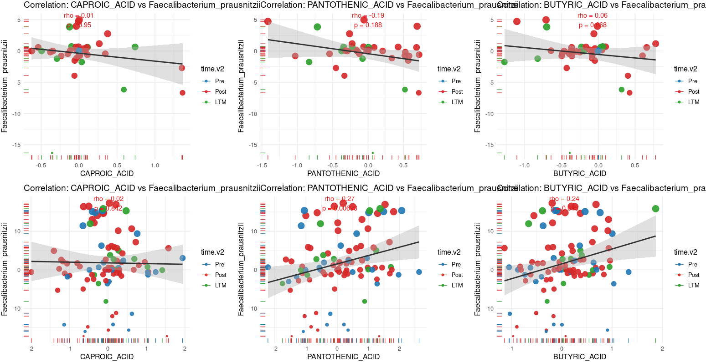
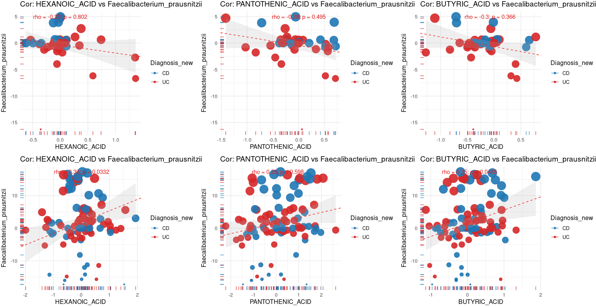
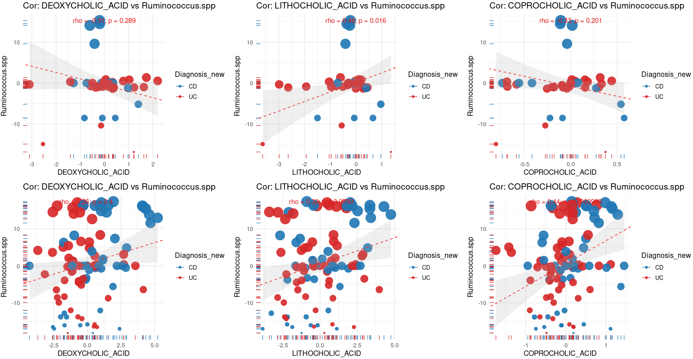
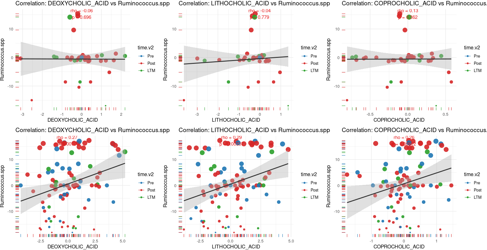
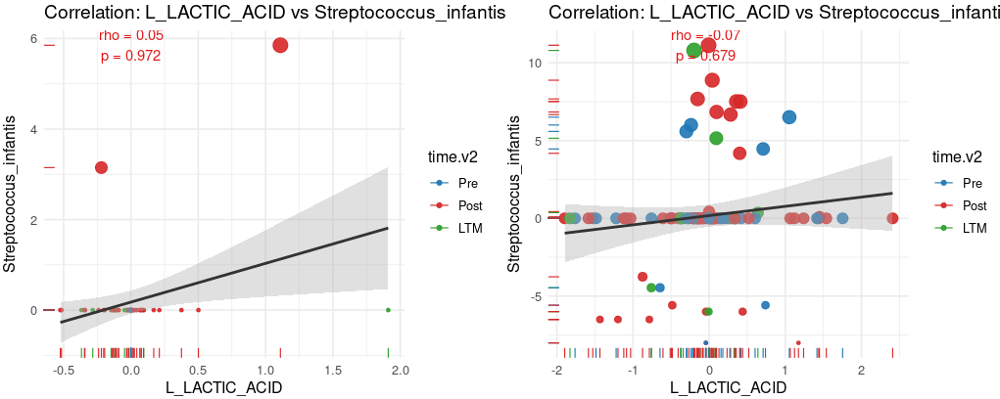

# 6.2 Cross-kingdom Correlation: Bacterial Taxa vs Metabolite Modules

This script correlates the relative abundance of Fluconazole-responsive bacterial species with metabolite levels, separately for the Nystatin (ORNT) and Fluconazole (GIFT) groups. It computes both raw and baseline-corrected (W0-delta) Spearman correlation matrices and visualizes key bacteria–metabolite pairs (e.g. *Faecalibacterium prausnitzii* vs SCFAs, *Ruminococcus* vs bile acids).

## 6.2.1 Align Bacterial Abundance and Metabolite Tables

Loads species-level metagenomic relative abundances, restricts to Fluconazole-responsive taxa, aligns samples with the metabolite matrix and the merged multi-omics metadata, and saves the matched tables (`Metabolites_exp1`, `relativeAb_all.Bac_FluInc1`, `microbiota4`).

~~~R
relativeAb_all.Bac <- mcreadRDS("./workshop/MMC/sample_info/final_Res/v2/MMC.metagenomic.relativeAb_all.rds")
relativeAb_all.Bac <- relativeAb_all.Bac[relativeAb_all.Bac$type=="Species",]
write.csv(relativeAb_all.Bac,"./workshop/MMC/sample_info/final_Res/v2/MMC.metagenomic.relativeAb_all.csv")
# relativeAb_all.Bac_FluInc <- relativeAb_all.Bac[intersect(rownames(relativeAb_all.Bac),inc_all[[2]]),]
MMC.METAG.inc_all <- mcreadRDS("./projects/ITS_Others/Lib40/MMC_ITS/MMC.METAG.inc_all.rds")
relativeAb_all.Bac_FluInc <- relativeAb_all.Bac[intersect(rownames(relativeAb_all.Bac),MMC.METAG.inc_all[[2]]$Names),]

Mfuzz_cluster <- mcreadRDS("./workshop/MMC/sample_info/final_Res/v2/metabolomics.Mfuzz_cluster_metabolomics.v3.rds")
Mfuzz_order <- Mfuzz_cluster[[2]][[4]]
Mfuzz_order$Cluster <- gsub("Clu1","Module1",Mfuzz_order$Cluster)
Mfuzz_order$Cluster <- gsub("Clu2","Module2",Mfuzz_order$Cluster)
Mfuzz_order$Cluster <- gsub("Clu3","Module3",Mfuzz_order$Cluster)
Mfuzz_order$Cluster <- gsub("Clu4","Module4",Mfuzz_order$Cluster)
Flu_Inc_Metabolites <- Mfuzz_order[Mfuzz_order$Cluster=="Module2" | Mfuzz_order$Cluster=="Module4" | Mfuzz_order$Cluster=="Module3",]
grep("COPROCHOLIC",Mfuzz_order$name,value=TRUE)

DM_all <- mcreadRDS("./workshop/MMC/sample_info/final_Res/v2/metabolomics.DM_all_metabolomics.v3.rds")
# Flu_Inc_Metabolites_exp <- DM_all[[2]][intersect(rownames(DM_all[[2]]),Flu_Inc_Metabolites$name),]
# Nys_Inc_Metabolites_exp <- DM_all[[1]][intersect(rownames(DM_all[[1]]),Flu_Inc_Metabolites$name),]
# Metabolites_exp <- as.data.frame(cbind(Flu_Inc_Metabolites_exp,Nys_Inc_Metabolites_exp))

Flu_Inc_Metabolites_exp <- DM_all[[2]][rownames(DM_all[[2]]),]
Nys_Inc_Metabolites_exp <- DM_all[[1]][rownames(DM_all[[2]]),]
Metabolites_exp <- as.data.frame(cbind(Flu_Inc_Metabolites_exp,Nys_Inc_Metabolites_exp))

microbiota3 <- mcreadRDS("./workshop/MMC/sample_info/final_Res/v2/All_omics_values.rds")
microbiota3 <- microbiota3[intersect(rownames(microbiota3),colnames(relativeAb_all.Bac_FluInc)),]
microbiota4 <- microbiota3[!duplicated(microbiota3$sample),]
rownames(microbiota4) <- microbiota4$sample
setdiff(colnames(relativeAb_all.Bac_FluInc),microbiota4$MGX_names)
setdiff(microbiota4$MGX_names,colnames(relativeAb_all.Bac_FluInc))
relativeAb_all.Bac_FluInc1 <- relativeAb_all.Bac_FluInc[,microbiota4$MGX_names]
colnames(relativeAb_all.Bac_FluInc1) <- rownames(microbiota4)
setdiff(colnames(Metabolites_exp),colnames(relativeAb_all.Bac_FluInc1))
both_samples <- intersect(colnames(Metabolites_exp),colnames(relativeAb_all.Bac_FluInc1))
Metabolites_exp1 <- Metabolites_exp[,both_samples]
relativeAb_all.Bac_FluInc1 <- relativeAb_all.Bac_FluInc1[,both_samples]
microbiota4 <- microbiota4[both_samples,]
mcsaveRDS(Metabolites_exp1,"./workshop/MMC/sample_info/final_Res/v2/Metabolites_exp1.rds")
mcsaveRDS(relativeAb_all.Bac_FluInc1,"./workshop/MMC/sample_info/final_Res/v2/relativeAb_all.Bac_FluInc1.rds")
mcsaveRDS(microbiota4,"./workshop/MMC/sample_info/final_Res/v2/microbiota4.rds")
~~~

## 6.2.2 Compute Metabolite–Bacteria Correlation Matrices (Raw and W0-delta)

Defines `flattenCorrMatrix()` and computes BH-adjusted Spearman correlations between metabolites and bacterial taxa for each treatment group, on both the raw abundances and the per-patient W0-baseline-subtracted (delta) values, saving each correlation table for downstream plotting.

~~~R
Metabolites_exp1 <- mcreadRDS("./workshop/MMC/sample_info/final_Res/v2/Metabolites_exp1.rds")
relativeAb_all.Bac_FluInc1 <- mcreadRDS("./workshop/MMC/sample_info/final_Res/v2/relativeAb_all.Bac_FluInc1.rds")
microbiota4 <- mcreadRDS("./workshop/MMC/sample_info/final_Res/v2/microbiota4.rds")
new_patient <- c("MMC095","MMC097","MMC098","MMC099","MMC101","MMC103","MMC104","MMC109")
microbiota4_new <- microbiota4[microbiota4$patient %in% new_patient,]
microbiota4_pre <- microbiota4[!microbiota4$patient %in% new_patient,]
microbiota4_new[microbiota4_new$treatment=="Nystatin",]

table(microbiota4_new$treatment)
table(microbiota4_pre$treatment)
library("data.table")
library(psych)
library("Hmisc")
flattenCorrMatrix <- function(cormat, pmat, padjmat) {
  ut <- upper.tri(cormat)
  data.frame(
    row = rownames(cormat)[row(cormat)[ut]],
    column = rownames(cormat)[col(cormat)[ut]],
    cor  =(cormat)[ut],
    p  =pmat[ut],
    p.adj = padjmat[ut]
    )
}
microbiota4.Nystatin <- microbiota4[microbiota4$treatment=="Nystatin",]
Nystatin.merge_obj <- rbind(Metabolites_exp1[,rownames(microbiota4.Nystatin)],relativeAb_all.Bac_FluInc1[,rownames(microbiota4.Nystatin)])
Nystatin.cor_res <- rcorr(as.matrix(t(Nystatin.merge_obj)),type="spearman")
Nystatin.p_adjusted <- p.adjust(Nystatin.cor_res$P, method = "BH")
Nystatin.p_adjusted.ma <- matrix(Nystatin.p_adjusted, nrow = dim(Nystatin.cor_res$P)[1], ncol = dim(Nystatin.cor_res$P)[2])
rownames(Nystatin.p_adjusted.ma) <- rownames(Nystatin.cor_res$r)
colnames(Nystatin.p_adjusted.ma) <- colnames(Nystatin.cor_res$r)
Nystatin.cor_all <- flattenCorrMatrix(Nystatin.cor_res$r,Nystatin.cor_res$P, Nystatin.p_adjusted.ma)
Nystatin.cor_all <- Nystatin.cor_all[Nystatin.cor_all$row %in% rownames(Nystatin.merge_obj),]
Nystatin.cor_all <- Nystatin.cor_all[Nystatin.cor_all$column %in% rownames(relativeAb_all.Bac_FluInc1),]
Nystatin <- list(Nystatin.p_adjusted.ma,Nystatin.cor_all)
mcsaveRDS(Nystatin,"./workshop/MMC/sample_info/final_Res/v2/Nystatin.cor_all.rds")

microbiota4.Fluconazole <- microbiota4[microbiota4$treatment=="Fluconazole",]
Fluconazole.merge_obj <- rbind(Metabolites_exp1[,rownames(microbiota4.Fluconazole)],relativeAb_all.Bac_FluInc1[,rownames(microbiota4.Fluconazole)])
Fluconazole.cor_res <- rcorr(as.matrix(t(Fluconazole.merge_obj)),type="spearman")
Fluconazole.p_adjusted <- p.adjust(Fluconazole.cor_res$P, method = "BH")
Fluconazole.p_adjusted.ma <- matrix(Fluconazole.p_adjusted, nrow = dim(Fluconazole.cor_res$P)[1], ncol = dim(Fluconazole.cor_res$P)[2])
rownames(Fluconazole.p_adjusted.ma) <- rownames(Fluconazole.cor_res$r)
colnames(Fluconazole.p_adjusted.ma) <- colnames(Fluconazole.cor_res$r)
Fluconazole.cor_all <- flattenCorrMatrix(Fluconazole.cor_res$r,Fluconazole.cor_res$P, Fluconazole.p_adjusted.ma)
Fluconazole.cor_all <- Fluconazole.cor_all[Fluconazole.cor_all$row %in% rownames(Fluconazole.merge_obj),]
Fluconazole.cor_all <- Fluconazole.cor_all[Fluconazole.cor_all$column %in% rownames(relativeAb_all.Bac_FluInc1),]
Fluconazole <- list(Fluconazole.p_adjusted.ma,Fluconazole.cor_all)
mcsaveRDS(Fluconazole,"./workshop/MMC/sample_info/final_Res/v2/Fluconazole.cor_all.rds")

microbiota4.Nystatin <- microbiota4[microbiota4$treatment=="Nystatin",]
Nystatin.merge_obj <- rbind(Metabolites_exp1[,rownames(microbiota4.Nystatin)],relativeAb_all.Bac_FluInc1[,rownames(microbiota4.Nystatin)])
Nystatin.merge_obj$feature <- rownames(Nystatin.merge_obj)
Nystatin.merge_obj_melt <- reshape2::melt(Nystatin.merge_obj)
Nystatin.merge_obj_melt$variable <- as.character(Nystatin.merge_obj_melt$variable)
Nystatin.merge_obj_melt$patient <- sub("W.*", "", as.character(Nystatin.merge_obj_melt$variable))
Nystatin.merge_obj_melt$time <- sub(".*W", "W", as.character(Nystatin.merge_obj_melt$variable))
# 针对每个 patient + feature 做 W0 baseline 减法
Nystatin.paired.df <- Nystatin.merge_obj_melt %>% group_by(patient, feature) %>% 
  mutate(value_delta = value - value[time == "W0"]) %>% ungroup()
Nystatin.paired.df1 <- reshape2::dcast(Nystatin.paired.df,feature~variable,value.var = "value_delta", fill=0)
rownames(Nystatin.paired.df1) <- Nystatin.paired.df1$feature
Nystatin.paired.df1 <- Nystatin.paired.df1[,-1]
Nystatin.cor_res <- rcorr(as.matrix(t(Nystatin.paired.df1)),type="spearman")
Nystatin.p_adjusted <- p.adjust(Nystatin.cor_res$P, method = "BH")
Nystatin.p_adjusted.ma <- matrix(Nystatin.p_adjusted, nrow = dim(Nystatin.cor_res$P)[1], ncol = dim(Nystatin.cor_res$P)[2])
rownames(Nystatin.p_adjusted.ma) <- rownames(Nystatin.cor_res$r)
colnames(Nystatin.p_adjusted.ma) <- colnames(Nystatin.cor_res$r)
Nystatin.cor_all <- flattenCorrMatrix(Nystatin.cor_res$r,Nystatin.cor_res$P, Nystatin.p_adjusted.ma)
Nystatin.cor_all <- Nystatin.cor_all[Nystatin.cor_all$row %in% rownames(Nystatin.paired.df1),]
Nystatin.cor_all <- Nystatin.cor_all[Nystatin.cor_all$column %in% rownames(relativeAb_all.Bac_FluInc1),]
Nystatin <- list(Nystatin.p_adjusted.ma,Nystatin.cor_all)
mcsaveRDS(Nystatin,"./workshop/MMC/sample_info/final_Res/v2/Nystatin.cor_all_delta.rds")
mcsaveRDS(Nystatin.paired.df1,"./workshop/MMC/sample_info/final_Res/v2/Nystatin.paired.df.cor_all_delta.rds")

microbiota4.Fluconazole <- microbiota4[microbiota4$treatment=="Fluconazole",]
Fluconazole.merge_obj <- rbind(Metabolites_exp1[,rownames(microbiota4.Fluconazole)],relativeAb_all.Bac_FluInc1[,rownames(microbiota4.Fluconazole)])
Fluconazole.merge_obj$feature <- rownames(Fluconazole.merge_obj)
Fluconazole.merge_obj_melt <- reshape2::melt(Fluconazole.merge_obj)
Fluconazole.merge_obj_melt$variable <- as.character(Fluconazole.merge_obj_melt$variable)
Fluconazole.merge_obj_melt$patient <- sub("W.*", "", as.character(Fluconazole.merge_obj_melt$variable))
Fluconazole.merge_obj_melt$time <- sub(".*W", "W", as.character(Fluconazole.merge_obj_melt$variable))
# 针对每个 patient + feature 做 W0 baseline 减法
Fluconazole.paired.df <- Fluconazole.merge_obj_melt %>% group_by(patient, feature) %>% 
  mutate(value_delta = value - value[time == "W0"]) %>% ungroup()
Fluconazole.paired.df1 <- reshape2::dcast(Fluconazole.paired.df,feature~variable,value.var = "value_delta", fill=0)
rownames(Fluconazole.paired.df1) <- Fluconazole.paired.df1$feature
Fluconazole.paired.df1 <- Fluconazole.paired.df1[,-1]
Fluconazole.cor_res <- rcorr(as.matrix(t(Fluconazole.paired.df1)),type="spearman")
Fluconazole.p_adjusted <- p.adjust(Fluconazole.cor_res$P, method = "BH")
Fluconazole.p_adjusted.ma <- matrix(Fluconazole.p_adjusted, nrow = dim(Fluconazole.cor_res$P)[1], ncol = dim(Fluconazole.cor_res$P)[2])
rownames(Fluconazole.p_adjusted.ma) <- rownames(Fluconazole.cor_res$r)
colnames(Fluconazole.p_adjusted.ma) <- colnames(Fluconazole.cor_res$r)
Fluconazole.cor_all <- flattenCorrMatrix(Fluconazole.cor_res$r,Fluconazole.cor_res$P, Fluconazole.p_adjusted.ma)
Fluconazole.cor_all <- Fluconazole.cor_all[Fluconazole.cor_all$row %in% rownames(Fluconazole.paired.df1),]
Fluconazole.cor_all <- Fluconazole.cor_all[Fluconazole.cor_all$column %in% rownames(relativeAb_all.Bac_FluInc1),]
Fluconazole <- list(Fluconazole.p_adjusted.ma,Fluconazole.cor_all)
mcsaveRDS(Fluconazole,"./workshop/MMC/sample_info/final_Res/v2/Fluconazole.cor_all_delta.rds")
mcsaveRDS(Fluconazole.paired.df1,"./workshop/MMC/sample_info/final_Res/v2/Fluconazole.paired.df.cor_all_delta.rds")
~~~

## 6.2.3 Reshape Correlations into Wide Matrices and Build Plotting Objects

Reloads the raw and delta correlation results, reshapes them into wide correlation/adjusted-p matrices with harmonized feature names, and assembles per-treatment merged objects (abundances + metadata) used for the scatter plots below.

~~~R
Metabolites_exp1 <- mcreadRDS("./workshop/MMC/sample_info/final_Res/v2/Metabolites_exp1.rds")
relativeAb_all.Bac_FluInc1 <- mcreadRDS("./workshop/MMC/sample_info/final_Res/v2/relativeAb_all.Bac_FluInc1.rds")
microbiota4 <- mcreadRDS("./workshop/MMC/sample_info/final_Res/v2/microbiota4.rds")
microbiota4.Nystatin <- microbiota4[microbiota4$treatment=="Nystatin",]
Nystatin.merge_obj <- rbind(Metabolites_exp1[,rownames(microbiota4.Nystatin)],relativeAb_all.Bac_FluInc1[,rownames(microbiota4.Nystatin)])
microbiota4.Fluconazole <- microbiota4[microbiota4$treatment=="Fluconazole",]
Fluconazole.merge_obj <- rbind(Metabolites_exp1[,rownames(microbiota4.Fluconazole)],relativeAb_all.Bac_FluInc1[,rownames(microbiota4.Fluconazole)])

Nystatin <- mcreadRDS("./workshop/MMC/sample_info/final_Res/v2/Nystatin.cor_all.rds")
Fluconazole <- mcreadRDS("./workshop/MMC/sample_info/final_Res/v2/Fluconazole.cor_all.rds")
Nystatin.p_adjusted.ma<-Nystatin[[1]]
Nystatin.cor_all<-Nystatin[[2]]
Fluconazole.p_adjusted.ma<-Fluconazole[[1]]
Fluconazole.cor_all<-Fluconazole[[2]]

Nystatin <- mcreadRDS("./workshop/MMC/sample_info/final_Res/v2/Nystatin.cor_all_delta.rds")
Fluconazole <- mcreadRDS("./workshop/MMC/sample_info/final_Res/v2/Fluconazole.cor_all_delta.rds")
Nystatin.p_adjusted.ma<-Nystatin[[1]]
Nystatin.cor_all<-Nystatin[[2]]
Fluconazole.p_adjusted.ma<-Fluconazole[[1]]
Fluconazole.cor_all<-Fluconazole[[2]]
Nystatin.merge_obj <- mcreadRDS("./workshop/MMC/sample_info/final_Res/v2/Nystatin.paired.df.cor_all_delta.rds")
Fluconazole.merge_obj <- mcreadRDS("./workshop/MMC/sample_info/final_Res/v2/Fluconazole.paired.df.cor_all_delta.rds")

Fluconazole.cor_all.total <- reshape2::dcast(Fluconazole.cor_all,row~column,value.var = "cor", fill=0)
rownames(Fluconazole.cor_all.total) <- Fluconazole.cor_all.total$row
Fluconazole.cor_all.total <- Fluconazole.cor_all.total[,-1]
rownames(Fluconazole.cor_all.total) <- gsub(" ","_",rownames(Fluconazole.cor_all.total))
dup_row <- rownames(Fluconazole.cor_all.total)[!duplicated(gsub("-","_",rownames(Fluconazole.cor_all.total)))]
Fluconazole.cor_all.total <- Fluconazole.cor_all.total[dup_row,]
rownames(Fluconazole.cor_all.total) <- gsub("-","_",rownames(Fluconazole.cor_all.total))
rownames(Fluconazole.p_adjusted.ma) <- gsub(" ","_",rownames(Fluconazole.p_adjusted.ma))
Fluconazole.p_adjusted.ma <- Fluconazole.p_adjusted.ma[dup_row,]
rownames(Fluconazole.p_adjusted.ma) <- gsub("-","_",rownames(Fluconazole.p_adjusted.ma))
setdiff(rownames(Fluconazole.cor_all.total),rownames(Fluconazole.p_adjusted.ma))
Fluconazole.p_adjusted.ma1 <- Fluconazole.p_adjusted.ma[rownames(Fluconazole.cor_all.total),colnames(Fluconazole.cor_all.total)]

Nystatin.cor_all.total <- reshape2::dcast(Nystatin.cor_all,row~column,value.var = "cor", fill=0)
rownames(Nystatin.cor_all.total) <- Nystatin.cor_all.total$row
rownames(Nystatin.cor_all.total) <- gsub(" ","_",rownames(Nystatin.cor_all.total))
dup_row <- rownames(Nystatin.cor_all.total)[!duplicated(gsub("-","_",rownames(Nystatin.cor_all.total)))]
Nystatin.cor_all.total <- Nystatin.cor_all.total[dup_row,]
rownames(Nystatin.cor_all.total) <- gsub("-","_",rownames(Nystatin.cor_all.total))
Nystatin.cor_all.total <- Nystatin.cor_all.total[rownames(Fluconazole.cor_all.total),colnames(Fluconazole.cor_all.total)]
rownames(Nystatin.p_adjusted.ma) <- gsub(" ","_",rownames(Nystatin.p_adjusted.ma))
Nystatin.p_adjusted.ma <- Nystatin.p_adjusted.ma[dup_row,]
rownames(Nystatin.p_adjusted.ma) <- gsub("-","_",rownames(Nystatin.p_adjusted.ma))
Nystatin.p_adjusted.ma1 <- Nystatin.p_adjusted.ma[rownames(Fluconazole.cor_all.total),colnames(Fluconazole.cor_all.total)]
rownames(Nystatin.cor_all.total) <- gsub(" ","_",rownames(Nystatin.cor_all.total))
rownames(Nystatin.p_adjusted.ma1) <- gsub(" ","_",rownames(Nystatin.p_adjusted.ma1))

Nystatin.merge_obj2 <- as.data.frame(cbind(microbiota4[rownames(t(Nystatin.merge_obj)),],t(Nystatin.merge_obj)))
colnames(Nystatin.merge_obj2) <- gsub("-","_",colnames(Nystatin.merge_obj2))
colnames(Nystatin.merge_obj2) <- gsub(" ","_",colnames(Nystatin.merge_obj2))
Nystatin.merge_obj2 <- Nystatin.merge_obj2[!is.na(Nystatin.merge_obj2$time.v2),]
colnames(Nystatin.merge_obj2)[duplicated(colnames(Nystatin.merge_obj2))]
Nystatin.merge_obj2 <- Nystatin.merge_obj2[,!duplicated(colnames(Nystatin.merge_obj2))]

Fluconazole.merge_obj2 <- as.data.frame(cbind(microbiota4[rownames(t(Fluconazole.merge_obj)),],t(Fluconazole.merge_obj)))
colnames(Fluconazole.merge_obj2) <- gsub("-","_",colnames(Fluconazole.merge_obj2))
colnames(Fluconazole.merge_obj2) <- gsub(" ","_",colnames(Fluconazole.merge_obj2))
Fluconazole.merge_obj2 <- Fluconazole.merge_obj2[!is.na(Fluconazole.merge_obj2$time.v2),]
colnames(Fluconazole.merge_obj2)[duplicated(colnames(Fluconazole.merge_obj2))]
Fluconazole.merge_obj2 <- Fluconazole.merge_obj2[,!duplicated(colnames(Fluconazole.merge_obj2))]
~~~

## 6.2.4 Scatter Plot Helper (lm-based)

Defines `plot_module_cor_metebo_Bac()`, which draws a metabolite-vs-bacterium scatter with a linear fit and annotates the correlation coefficient and p-value (optionally taken from a precomputed correlation/p-value table).

~~~R
plot_module_cor_metebo_Bac <- function(df, module, xvar = "Candida_albicans",MIC=NULL,p_table=NULL,cor_table=NULL,
 dot_size = "abs.Ca", color="Diagnosis_new", size_range=c(1, 8), method = "pearson") {
  pal <- jdb_palette("corona")
  f <- as.formula(paste(xvar, "~", module))
  total.lm <- lm(f, data = df)
  if (is.null(MIC)) {
    rho <- cor(total.lm$model[[module]], total.lm$model[[xvar]], method = method)
    pval <- cor.test(total.lm$model[[module]], total.lm$model[[xvar]], method = method)$p.value
  } else {
    rho <- MIC[[module]][["sMIC"]]
    pval <- MIC[[module]][["p_MIC"]]
  }
  if (!is.null(p_table)) {
    rho <- cor_table[module,xvar]
    pval <- p_table[module,xvar]
  }
  xpos <- median(df[[module]], na.rm = TRUE)
  ypos <- max(df[[xvar]], na.rm = TRUE)
  p <- ggplot(df, aes_string(module,xvar,  color = color, size = dot_size)) + geom_point(alpha = 0.9) +
    geom_rug(size = 0.4) + geom_smooth(aes_string(x = module,y = xvar), method = "lm", se = TRUE,color = "grey20", fill = "grey70", inherit.aes = FALSE) +
    scale_color_manual(values = pal) +scale_size_continuous(range = size_range, guide = "none") + theme_minimal(base_size = 12) +
    labs(x = module,y = xvar,title = paste0("Correlation: ", module, " vs ", xvar)) +
    annotate("text", x = xpos, y = ypos, color = "#E51718",
      label = paste0("rho = ", round(rho, 2), "\np = ", signif(pval, 3)))
  p
  return(p)
}
~~~

## 6.2.5 *Faecalibacterium prausnitzii* vs SCFA Metabolites (Raw)

Plots *F. prausnitzii* abundance against caproic, pantothenic, and butyric acid in both treatment groups using raw values, exported as `Fig4.Faecalibacterium_prausnitzii.cor.svg`.

~~~R
plots1 <- lapply(c("CAPROIC_ACID","PANTOTHENIC_ACID","BUTYRIC_ACID"), function(m) 
  plot_module_cor_metebo_Bac(Nystatin.merge_obj2, m, xvar = "Faecalibacterium_prausnitzii",MIC=NULL,
    dot_size="Faecalibacterium_prausnitzii",color="time.v2",size_range=c(1, 5), method = "spearman"))
plots2 <- lapply(c("CAPROIC_ACID","PANTOTHENIC_ACID","BUTYRIC_ACID"), function(m) 
  plot_module_cor_metebo_Bac(Fluconazole.merge_obj2, m, xvar = "Faecalibacterium_prausnitzii",MIC=NULL,
    dot_size="Faecalibacterium_prausnitzii",color="time.v2",size_range=c(1, 5), method = "spearman"))
plot <- CombinePlots(c(plots1,plots2),nrow=2)
plot
ggsave("./projects/MMC/Figures/v2_figures/Fig4.Faecalibacterium_prausnitzii.cor.svg", plot=plot,width = 14, height = 8,dpi=300)
~~~

## 6.2.6 MIC-based Correlation Helpers

Defines `plot_module_cor_newx()` (scatter with either an `lm` fit or a fixed MIC-based slope plus 95% confidence band) and `sMIC_new()` (signed, permutation-tested maximal information coefficient), used for the delta-based plots that follow.

~~~R

plot_module_cor_newx <- function(df, module, yvar = "Candida_albicans",MIC = NULL, size = "abs.Ca",color_by = "Diagnosis_new",line_mode = c("lm", "mic"),mic_ci = TRUE,scale_factor = 1) {   # 新增参数
  line_mode <- match.arg(line_mode)
  pal <- jdb_palette("corona")
  f <- as.formula(paste(yvar, "~", module))
  total.lm <- lm(f, data = df)

  # Pearson or MIC
  if (is.null(MIC)) {
    rho <- cor(total.lm$model[[module]], total.lm$model[[yvar]], method = "pearson")
    pval <- cor.test(total.lm$model[[module]], total.lm$model[[yvar]], method = "pearson")$p.value
  } else {
    rho <- MIC[[module]][["sMIC"]]
    pval <- MIC[[module]][["p_MIC"]]
  }

  # 文本位置
  ypos <- max(df[[yvar]], na.rm = TRUE)
  xpos <- median(df[[module]], na.rm = TRUE)

  # MIC-based 斜率: rho × sd(y)/sd(x)，再乘以 scale_factor
  slope_mic <- rho * (sd(df[[yvar]], na.rm = TRUE) / sd(df[[module]], na.rm = TRUE)) * scale_factor
  intercept_mic <- mean(df[[yvar]], na.rm = TRUE) - slope_mic * mean(df[[module]], na.rm = TRUE)

  # 点大小
  if (is.list(size)) {
    size1 <- size[[module]]
  } else {
    size1 <- size
  }

  # 基础图
  p <- ggplot(df, aes_string(module, yvar, color = color_by, size = size1)) +
    geom_point(alpha = 0.9) +
    geom_rug(size = 0.4) +
    scale_color_manual(values = pal) +
    scale_size_continuous(range = c(1, 8), guide = "none") +
    theme_minimal(base_size = 12) +
    labs(x = module, y = yvar, title = paste0("Cor: ", module, " vs ", yvar)) +
    annotate("text", x = xpos, y = ypos, color = "#E51718",
             label = paste0("rho = ", round(rho, 2),
                            "; p = ", signif(pval, 3)))

  if (line_mode == "lm") {
    p <- p + geom_smooth(aes_string(x = module, y = yvar),method = "lm", se = TRUE,color = "grey20", fill = "grey70", inherit.aes = FALSE)
  } else if (line_mode == "mic") {
    # 固定斜率直线
    p <- p + geom_abline(slope = slope_mic, intercept = intercept_mic,color = "red", linetype = "dashed")
    # 95% CI 阴影
    if (mic_ci) {
      x_seq <- seq(min(df[[module]], na.rm = TRUE),
                   max(df[[module]], na.rm = TRUE), length.out = 200)
      y_pred <- intercept_mic + slope_mic * x_seq
      
      # 用残差标准差生成随 x 变化的置信区间（更像真实回归带）
      resid_sd <- sd(df[[yvar]] - (intercept_mic + slope_mic * df[[module]]), na.rm = TRUE)
      n <- nrow(df)
      se_fit <- resid_sd * sqrt(1/n + (x_seq - mean(df[[module]], na.rm = TRUE))^2 /
                                   sum((df[[module]] - mean(df[[module]], na.rm = TRUE))^2, na.rm = TRUE))
      
      df_ribbon <- data.frame(
        x = x_seq,
        y = y_pred,
        ymin = y_pred - 1.96 * se_fit,
        ymax = y_pred + 1.96 * se_fit
      )
      
      p <- p + geom_ribbon(data = df_ribbon,
                           aes(x = x, ymin = ymin, ymax = ymax),
                           inherit.aes = FALSE, alpha = 0.2, fill = "grey70")
    }
  }
  return(p)
}

sMIC_new <- function(x, y, nperm = 2e4, seed = NULL, method = "spearman",
                 return_null = FALSE) {
  if (!is.null(seed)) set.seed(seed)
  ok <- is.finite(x) & is.finite(y); x <- x[ok]; y <- y[ok]
  rho  <- suppressWarnings(cor(x, y, method = method))
  mic0 <- mine(x, y)$MIC
  if(length(nperm)>1){nperm=sample(nperm,1)}
  null_mic <- vapply(seq_len(nperm), function(i) mine(x, sample(y))$MIC, 0.0)
  k <- sum(null_mic >= mic0)
  p_mic <- (k + 1) / (nperm + 1)   # 永不为 0 的置换 p

  sign_rho <- if (is.na(rho) || rho == 0) 0 else sign(rho)
  out <- c(sMIC = sign_rho * mic0, MIC = mic0, rho = unname(rho),
           p_MIC = p_mic, k = k, B = nperm)
  if (return_null) attr(out, "null_mic") <- null_mic
  out
}
~~~

## 6.2.7 *Faecalibacterium prausnitzii* vs SCFAs (W0-delta, MIC)

Computes MIC statistics and plots baseline-corrected *F. prausnitzii* vs hexanoic/pantothenic/butyric acid for both groups, exported as `Fig4.Faecalibacterium_prausnitzii.cor_Delta.svg`.

~~~r
diease_Scores <- c("HEXANOIC_ACID","PANTOTHENIC_ACID","BUTYRIC_ACID")
ORNT_MIC_res <- future_lapply(1:length(diease_Scores),function(x) {
  tmp <- Nystatin.merge_obj2[!is.na(Nystatin.merge_obj2[[diease_Scores[x]]]),]
  tmp <- tmp[tmp$time!="W0",]
  res <- sMIC_new(tmp[[diease_Scores[x]]], tmp$Faecalibacterium_prausnitzii,method = "pearson", nperm = 1e2)
  res
  })
names(ORNT_MIC_res) <- diease_Scores
GIFT_MIC_res <- future_lapply(1:length(diease_Scores),function(x) {
  tmp <- Fluconazole.merge_obj2[!is.na(Fluconazole.merge_obj2[[diease_Scores[x]]]),]
  tmp <- tmp[tmp$time!="W0",]
  res <- sMIC_new(tmp[[diease_Scores[x]]], tmp$Faecalibacterium_prausnitzii,method = "pearson", nperm = 3e2)
  res
  })
names(GIFT_MIC_res) <- diease_Scores
plots1 <- lapply(diease_Scores, function(m) 
  plot_module_cor_newx(Nystatin.merge_obj2,m,yvar ="Faecalibacterium_prausnitzii" , MIC=ORNT_MIC_res,size="Faecalibacterium_prausnitzii",color_by="Diagnosis_new", line_mode="mic", scale_factor=0.8))
plots2 <- lapply(diease_Scores, function(m) 
  plot_module_cor_newx(Fluconazole.merge_obj2,m,yvar ="Faecalibacterium_prausnitzii" , MIC=GIFT_MIC_res,size="Faecalibacterium_prausnitzii",color_by="Diagnosis_new", line_mode="mic", scale_factor=0.8))
plot <- CombinePlots(c(plots1,plots2),nrow=2)
plot
ggsave("./projects/MMC/Figures/v2_figures/Fig4.Faecalibacterium_prausnitzii.cor_Delta.svg", plot=plot,width = 18, height = 8,dpi=300)
~~~

## 6.2.8 *Ruminococcus* vs Bile Acids (W0-delta, MIC)

Computes MIC statistics and plots baseline-corrected *Ruminococcus* vs deoxycholic/lithocholic/coprocholic acid for both groups, exported as `Fig4.Ruminococcus.spp.cor.delta.svg`.

~~~R
diease_Scores <- c("DEOXYCHOLIC_ACID","LITHOCHOLIC_ACID","COPROCHOLIC_ACID")
ORNT_MIC_res <- future_lapply(1:length(diease_Scores),function(x) {
  tmp <- Nystatin.merge_obj2[!is.na(Nystatin.merge_obj2[[diease_Scores[x]]]),]
  tmp <- tmp[tmp$time!="W0",]
  res <- sMIC_new(tmp[[diease_Scores[x]]], tmp$Ruminococcus.spp,method = "pearson", nperm = 1e3)
  res
  })
names(ORNT_MIC_res) <- diease_Scores
GIFT_MIC_res <- future_lapply(1:length(diease_Scores),function(x) {
  tmp <- Fluconazole.merge_obj2[!is.na(Fluconazole.merge_obj2[[diease_Scores[x]]]),]
  tmp <- tmp[tmp$time!="W0",]
  res <- sMIC_new(tmp[[diease_Scores[x]]], tmp$Ruminococcus.spp,method = "pearson", nperm = 1e3)
  res
  })
names(GIFT_MIC_res) <- diease_Scores
plots1 <- lapply(diease_Scores, function(m) 
  plot_module_cor_newx(Nystatin.merge_obj2,m,yvar ="Ruminococcus.spp" , MIC=ORNT_MIC_res,size="Ruminococcus.spp",color_by="Diagnosis_new", line_mode="mic", scale_factor=0.8))
plots2 <- lapply(diease_Scores, function(m) 
  plot_module_cor_newx(Fluconazole.merge_obj2,m,yvar ="Ruminococcus.spp" , MIC=GIFT_MIC_res,size="Ruminococcus.spp",color_by="Diagnosis_new", line_mode="mic", scale_factor=0.8))
plot <- CombinePlots(c(plots1,plots2),nrow=2)
plot
ggsave("./projects/MMC/Figures/v2_figures/Fig4.Ruminococcus.spp.cor.delta.svg", plot=plot,width = 18, height = 8,dpi=300)
~~~

## 6.2.9 *Ruminococcus* vs Bile Acids (Raw)

Plots raw *Ruminococcus* abundance against the same bile acids in both groups, exported as `Fig4.Ruminococcus.spp.cor.svg`.

~~~R
plots1 <- lapply(c("DEOXYCHOLIC_ACID","LITHOCHOLIC_ACID","COPROCHOLIC_ACID"), function(m) 
  plot_module_cor_metebo_Bac(Nystatin.merge_obj2, m, xvar = "Ruminococcus.spp",MIC=NULL,
    dot_size="Ruminococcus.spp",color="time.v2",size_range=c(1, 5), method = "spearman"))
plots2 <- lapply(c("DEOXYCHOLIC_ACID","LITHOCHOLIC_ACID","COPROCHOLIC_ACID"), function(m) 
  plot_module_cor_metebo_Bac(Fluconazole.merge_obj2, m, xvar = "Ruminococcus.spp",MIC=NULL,
    dot_size="Ruminococcus.spp",color="time.v2",size_range=c(1, 5), method = "spearman"))
plot <- CombinePlots(c(plots1,plots2),nrow=2)
plot
ggsave("./projects/MMC/Figures/v2_figures/Fig4.Ruminococcus.spp.cor.svg", plot=plot,width = 14, height = 8,dpi=300)
~~~

## 6.2.10 *Streptococcus infantis* vs L-Lactic Acid

Plots *S. infantis* against L-lactic acid in both groups (using the precomputed adjusted-p/correlation tables) and reports the permutation-based signed MIC, exported as `Fig4.Streptococcus_infantis.cor.svg`.

~~~r
plots1 <- lapply(c("L_LACTIC_ACID"), function(m) 
  plot_module_cor_metebo_Bac(Nystatin.merge_obj2, m, xvar = "Streptococcus_infantis",MIC=NULL,
    dot_size="Streptococcus_infantis",color="time.v2",size_range=c(1, 5), method = "spearman",
    p_table=Nystatin.p_adjusted.ma1,cor_table=Nystatin.cor_all.total))
plots2 <- lapply(c("L_LACTIC_ACID"), function(m) 
  plot_module_cor_metebo_Bac(Fluconazole.merge_obj2, m, xvar = "Streptococcus_infantis",MIC=NULL,
    dot_size="Streptococcus_infantis",color="time.v2",size_range=c(1, 5), method = "spearman",
    p_table=Fluconazole.p_adjusted.ma1,cor_table=Fluconazole.cor_all.total))
plot <- CombinePlots(c(plots1,plots2),nrow=1)
plot
out1 <- sMIC(Nystatin.merge_obj2$Streptococcus_infantis, Nystatin.merge_obj2$L_LACTIC_ACID,nperm = 20000)
out2 <- sMIC(Fluconazole.merge_obj2$Streptococcus_infantis, Fluconazole.merge_obj2$L_LACTIC_ACID,nperm = 20000)
out1;out2
ggsave("./projects/MMC/Figures/v2_figures/Fig4.Streptococcus_infantis.cor.svg", plot=plot,width = 8, height = 4,dpi=300)
~~~

