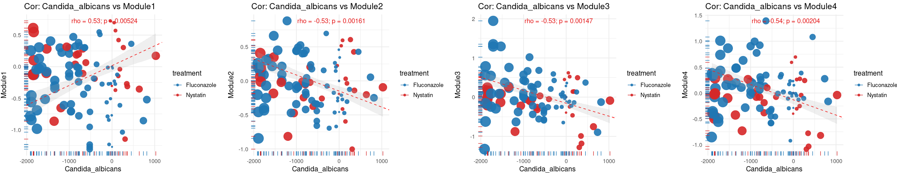
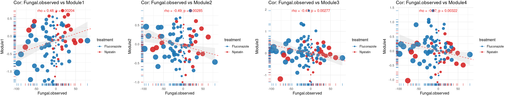

# 5.1 Cross-kingdom Correlation: Fungal Features vs Metabolite Modules

This script correlates fungal community features (diversity, *Candida* burden, pathogenic load) with metabolomic modules under antifungal treatment. It builds a unified multi-omics table, computes per-patient changes relative to the W0 baseline, and visualizes the associations using both linear regression and a permutation-based maximal information coefficient (MIC).

## 5.1.1 Build the Integrated Multi-omics Value Table

Loads metabolite differential-abundance results and the Mfuzz temporal modules, annotates health- vs dysbiosis-associated metabolites (from the *Nature* dysbiosis reference), summarizes module-level z-scores, and merges fungal/bacterial diversity, *Candida* burden, clinical scores, and metabolite modules into a single per-sample table (`All_omics_values.rds`).

~~~R
DM_all <- mcreadRDS("./workshop/MMC/sample_info/final_Res/v2/metabolomics.DM_all_metabolomics.v3.rds")
All.trasnfer.anno <- mcreadRDS("./workshop/MMC/sample_info/final_Res/v2/All.trasnfer.anno.all.rds")
All.trasnfer.anno[All.trasnfer.anno$CompoundName.v2=="COPROCHOLIC ACID",]
All.trasnfer.anno[All.trasnfer.anno$ionMz==449.3266,]$CompoundName.v2
Nature.Dysbiosis.metabolomic <- read.csv("./workshop/MMC/nature.Dysbiosis.metabolomic.csv")
Nature.Dysbiosis.metabolomic1 <- Nature.Dysbiosis.metabolomic[!is.na(Nature.Dysbiosis.metabolomic$HMDB),]
Nature.Dysbiosis.metabolomic1 <- Nature.Dysbiosis.metabolomic1[Nature.Dysbiosis.metabolomic1$HMDB %in% All.trasnfer.anno$HMDB_ID,]
Health.UP.HMDB <- Nature.Dysbiosis.metabolomic1[Nature.Dysbiosis.metabolomic1$Dysbiosis.Coefficient..non.IBD. > 0,]$HMDB
Health.UP.ChEBI <- Nature.Dysbiosis.metabolomic1[Nature.Dysbiosis.metabolomic1$Dysbiosis.Coefficient..non.IBD. > 0,]$ChEBI
Health.UP.KEGG <- Nature.Dysbiosis.metabolomic1[Nature.Dysbiosis.metabolomic1$Dysbiosis.Coefficient..non.IBD. > 0,]$KEGG
Health.UP <- setdiff(c(Health.UP.HMDB,Health.UP.ChEBI,Health.UP.KEGG),NA)
Health.UP1 <- rownames(All.trasnfer.anno)[All.trasnfer.anno$HMDB_ID %in% intersect(Health.UP,All.trasnfer.anno$HMDB_ID)]
Health.UP2 <- rownames(All.trasnfer.anno)[All.trasnfer.anno$KEGG_ID %in% intersect(Health.UP,All.trasnfer.anno$KEGG_ID)]
Health.UP3 <- rownames(All.trasnfer.anno)[All.trasnfer.anno$CHEBI_ID %in% intersect(Health.UP,All.trasnfer.anno$CHEBI_ID)]
Health.UP <- sort(unique(c(Health.UP1,Health.UP2,Health.UP3)))
Dysbiosis.UP.HMDB <- Nature.Dysbiosis.metabolomic1[Nature.Dysbiosis.metabolomic1$Dysbiosis.Coefficient..non.IBD. < 0,]$HMDB
Dysbiosis.UP.ChEBI <- Nature.Dysbiosis.metabolomic1[Nature.Dysbiosis.metabolomic1$Dysbiosis.Coefficient..non.IBD. < 0,]$ChEBI
Dysbiosis.UP.KEGG <- Nature.Dysbiosis.metabolomic1[Nature.Dysbiosis.metabolomic1$Dysbiosis.Coefficient..non.IBD. < 0,]$KEGG
Dysbiosis.UP <- setdiff(c(Dysbiosis.UP.HMDB,Dysbiosis.UP.ChEBI,Dysbiosis.UP.KEGG),NA)
Dysbiosis.UP1 <- rownames(All.trasnfer.anno)[All.trasnfer.anno$HMDB_ID %in% intersect(Dysbiosis.UP,All.trasnfer.anno$HMDB_ID)]
Dysbiosis.UP2 <- rownames(All.trasnfer.anno)[All.trasnfer.anno$KEGG_ID %in% intersect(Dysbiosis.UP,All.trasnfer.anno$KEGG_ID)]
Dysbiosis.UP3 <- rownames(All.trasnfer.anno)[All.trasnfer.anno$CHEBI_ID %in% intersect(Dysbiosis.UP,All.trasnfer.anno$CHEBI_ID)]
Dysbiosis.UP <- sort(unique(c(Dysbiosis.UP1,Dysbiosis.UP2,Dysbiosis.UP3)))
length(Health.UP)
length(Dysbiosis.UP)
Mfuzz_cluster <- mcreadRDS("./workshop/MMC/sample_info/final_Res/v2/metabolomics.Mfuzz_cluster_metabolomics.v3.rds")
Mfuzz_order <- Mfuzz_cluster[[2]][[4]]
Mfuzz_order$Cluster <- gsub("Clu1","Module1",Mfuzz_order$Cluster)
Mfuzz_order$Cluster <- gsub("Clu2","Module2",Mfuzz_order$Cluster)
Mfuzz_order$Cluster <- gsub("Clu3","Module3",Mfuzz_order$Cluster)
Mfuzz_order$Cluster <- gsub("Clu4","Module4",Mfuzz_order$Cluster)
Flu_Inc_Metabolites <- Mfuzz_order[Mfuzz_order$Cluster=="Module2" |Mfuzz_order$Cluster=="Module4" | Mfuzz_order$Cluster=="Module3",]
Flu_Dec_Metabolites <- Mfuzz_order[Mfuzz_order$Cluster=="Module1",]
Health.UP <- intersect(Flu_Inc_Metabolites$names,Health.UP)
Dysbiosis.UP <- intersect(Dysbiosis.UP,Flu_Dec_Metabolites$names)
length(Health.UP)
length(Dysbiosis.UP)

corrected <- mcreadRDS("./workshop/MMC/sample_info/final_Res/v2/metabolomics.counts.corrected.rds")
metabolomics.samples_info <- mcreadRDS("./workshop/MMC/sample_info/final_Res/v2/metabolomics.samples_info1.v4.rds")
metabolomics.samples_info <- metabolomics.samples_info[colnames(corrected),]
Fatty_Acid_Biosynthesis <- c("ACETOACETATE","ACETOACETIC ACID","OCTANOIC ACID","CAPRYLIC ACID","DECANOIC ACID","CAPRIC ACID","DODECANOIC ACID","TRANS-TETRA-DEC-2-ENOIC ACID","TETRADECANOIC ACID","MYRISTIC ACID","TRANS-HEXA-DEC-2-ENOIC ACID","HEXADECANOIC ACID","PALMITIC ACID","(R)-3-HYDROXY-HEXADECANOIC ACID")
Bile_Acid_Biosynthesis <- c("HEXADECANOIC ACID","PALMITIC ACID","LITHOCHOLIC ACID","CHENODEOXYCHOLATE","CHENODEOXYCHOLIC ACID","DEOXYCHOLIC ACID","7ALPHA-HYDROXYCHOLESTEROL","7ALPHA-HYDROXY-5BETA-CHOLESTAN-3-ONE","CEREBROSTEROL","25-HYDROXYCHOLESTEROL","24-HYDROXYCHOLESTEROL","7A-HYDROXYCHOLESTEROL","27-HYDROXYCHOLESTEROL","7A-HYDROXY-5B-CHOLESTAN-3-ONE","3BETA-HYDROXY-5-CHOLESTENOATE","7ALPHA,26-DIHYDROXY-4-CHOLESTEN-3-ONE","7 ALPHA,26-DIHYDROXY-4-CHOLESTEN-3-ONE","7A,12A-DIHYDROXY-CHOLESTENE-3-ONE","3 BETA-HYDROXY-5-CHOLESTENOATE","3BETA,7ALPHA-DIHYDROXY-5-CHOLESTENOATE","3ALPHA,7ALPHA,12ALPHA-TRIHYDROXY-5BETA-CHOLESTAN-26-AL","3A,7A-DIHYDROXYCOPROSTANIC ACID","3A,7A,12A-TRIHYDROXY-5B-CHOLESTAN-26-AL","GLYCOCHENODEOXYCHOLATE","DEOXYCHOLIC ACID GLYCINE CONJUGATE","CHENODEOXYCHOLIC ACID GLYCINE CONJUGATE","3ALPHA,7ALPHA,12ALPHA-TRIHYDROXY-5BETA-CHOLESTANOATE","COPROCHOLIC ACID")
All_gene <- list(Fatty_Acid_Biosynthesis,Bile_Acid_Biosynthesis,Health.UP,Dysbiosis.UP)
names(All_gene) <- c("Fatty_Acid_Biosynthesis","Bile_Acid_Biosynthesis","Health.UP","Dysbiosis.UP")
HWM <- unique(c(Fatty_Acid_Biosynthesis,Bile_Acid_Biosynthesis,Health.UP,Dysbiosis.UP))
names(DM_all) <- c("Nystatin","Fluconazole")
Modules_all_ <- lapply(1:length(DM_all),function(x) {
    tmp <- DM_all[[x]]
    meta <- metabolomics.samples_info[metabolomics.samples_info$treatment==names(DM_all)[x],]
    counts <- as.matrix(tmp[HWM,])
    counts_tmp1 <- counts[,rownames(meta)]
    counts.ZSCORE <- sweep(counts_tmp1 - rowMeans(counts_tmp1), 1, matrixStats::rowSds(counts_tmp1),`/`)
    counts_ <- lapply(1:length(All_gene),function(num) {
        counts_tmp <- as.data.frame(t(colMeans(counts.ZSCORE[intersect(rownames(counts.ZSCORE),All_gene[[num]]),])))
        return(counts_tmp)
        })
    counts1 <- do.call(rbind,counts_)
    counts1 <- as.data.frame(t(counts1))
    colnames(counts1) <- names(All_gene)
    return(counts1)
    })
Modules_all <- do.call(rbind,Modules_all_)

library(Mfuzz)
names(DM_all) <- c("Nystatin","Fluconazole")
Mfuzz_exp_quantify_scale.ind.order.Flu_ <- lapply(1:length(DM_all),function(x) {
  tmp <- DM_all[[x]]
  meta <- metabolomics.samples_info[metabolomics.samples_info$treatment==names(DM_all)[x],]
  tmp1 <- tmp[abs(tmp$W1_vs_W0) > 0.1 |abs(tmp$W2_vs_W0) > 0.1 | abs(tmp$W4_vs_W0) > 0.1 | abs(tmp$W8_vs_W0) > 0.1,]
  HWM <- unique(rownames(tmp1))
  counts <- as.matrix(tmp[HWM,])
  counts_tmp1 <- counts[,rownames(meta)]
  counts.ZSCORE <- sweep(counts_tmp1 - rowMeans(counts_tmp1), 1, matrixStats::rowSds(counts_tmp1),`/`)
  Mfuzz_order1 <- Mfuzz_order[Mfuzz_order$names %in% rownames(counts.ZSCORE),]
  counts_ <- lapply(1:length(unique(Mfuzz_order1$Cluster)),function(num) {
      counts_tmp <- as.data.frame(t(colMeans(counts.ZSCORE[Mfuzz_order1[Mfuzz_order1$Cluster==unique(Mfuzz_order1$Cluster)[num],"names"],])))
      return(counts_tmp)
      })
  counts1 <- do.call(rbind,counts_)
  counts1 <- as.data.frame(t(counts1))
  colnames(counts1) <- unique(Mfuzz_order1$Cluster)
  return(counts1)
})
Mfuzz_exp_quantify_scale.ind.order.Flu <- do.call(rbind,Mfuzz_exp_quantify_scale.ind.order.Flu_)
Modules_all1 <- as.data.frame(cbind(Modules_all,Mfuzz_exp_quantify_scale.ind.order.Flu[rownames(Modules_all),]))
mcsaveRDS(Modules_all1,"./workshop/MMC/sample_info/final_Res/v2/metabolomics.Modules_all.rds")

Bac_tmp_projects2 <- mcreadRDS("./projects/ITS_Others/Lib40/MMC_ITS/Bac.tmp_projects2.rds")
Fungal_tmp_projects2 <- mcreadRDS("./projects/ITS_Others/Lib40/MMC_ITS/Fungal_tmp_projects2.rds")
setdiff(rownames(Fungal_tmp_projects2),rownames(Bac_tmp_projects2))
sample_uniq <- unique(c(rownames(Bac_tmp_projects2),rownames(Fungal_tmp_projects2)))
microbiota <- Bac_tmp_projects2[sample_uniq,]
rownames(microbiota) <- sample_uniq
microbiota$Fungal.observed <- Fungal_tmp_projects2[rownames(microbiota),"Fungal.observed"]
microbiota$Fungal.shannon <- Fungal_tmp_projects2[rownames(microbiota),"Fungal.shannon"]
microbiota$Candida_albicans <- Fungal_tmp_projects2[rownames(microbiota),"Candida_albicans"]*100
microbiota$Candida <- Fungal_tmp_projects2[rownames(microbiota),"Candida"]
microbiota$pathogenic.Fungi.v2 <- Fungal_tmp_projects2[rownames(microbiota),"pathogenic.Fungi.v2"]
microbiota1 <- microbiota[,c("Fungal.observed","Fungal.shannon","Candida_albicans","Candida","pathogenic.Fungi.v2",
  "gut_associated_bac","Bac.observed","Bac.shannon")]

sample_names <- strsplit(rownames(microbiota1),split="W")
sample_names_info_new_ <- lapply(1:length(sample_names),function(x) {
    tmp <- data.frame(MGX_names=rownames(microbiota1)[x],patient=sample_names[[x]][1],time=paste0("W",sample_names[[x]][2]))
    return(tmp)
    })
sample_names_info_new <- do.call(rbind,sample_names_info_new_)
sample_names_info_new$sample <- gsub("F","",sample_names_info_new$MGX_names)
rownames(sample_names_info_new) <- rownames(microbiota1)
microbiota2 <- as.data.frame(cbind(sample_names_info_new,microbiota1))

ReadCap.20251215 <- mcreadRDS("./workshop/MMC/Aidan_info/v2/ReadCap.20251215.rds")
total_times_tmp <- read.csv("./projects/MMC/Figures/figures_making/v3/patient.PFS.20251215.csv")
total_times_tmp <- total_times_tmp[total_times_tmp$treatment!="Clotrimazole",]
ReadCap.20251215_final2 <- ReadCap.20251215[ReadCap.20251215$Omics_patient_Names %in% total_times_tmp$Omics_patient_Names,]
rownames(ReadCap.20251215_final2) <- ReadCap.20251215_final2$Omics_samples_Names
patient_info <- ReadCap.20251215_final2[!duplicated(ReadCap.20251215_final2$Omics_patient_Names),]
rownames(patient_info) <- patient_info$Omics_patient_Names
microbiota2 <- as.data.frame(cbind(microbiota2,patient_info[as.character(microbiota2$patient),c("treatment","Diagnosis_new")]))
setdiff(microbiota2$sample,ReadCap.20251215_final2$Omics_samples_Names)
patient.PFS.20251215 <- read.csv("./projects/MMC/Figures/figures_making/v3/patient.PFS.20251215.csv")
rownames(patient.PFS.20251215) <- patient.PFS.20251215$Omics_patient_Names
microbiota2 <- as.data.frame(cbind(microbiota2,patient.PFS.20251215[as.character(microbiota2$patient),c("max.DAI.dates","status")]))
microbiota2 <- as.data.frame(cbind(microbiota2,ReadCap.20251215_final2[as.character(microbiota2$sample),
    c("DAI","UC.score.v2","CD.score.raw","stooling.frequency.scores","stooling.frequency","blood.stools.scores",
    "Mucosal.Appearance","Physician.rating","liquid.stooling.scores","abdominal.pain","general.wellbeing","Abdominal.mass")]))

Modules_all1 <- mcreadRDS("./workshop/MMC/sample_info/final_Res/v2/metabolomics.Modules_all.rds")
setdiff(rownames(Modules_all1),microbiota2$sample)
setdiff(microbiota2$sample,rownames(Modules_all1))
microbiota3 <- as.data.frame(cbind(microbiota2,Modules_all1[microbiota2$sample,]))
microbiota3$time.v2 <- as.character(microbiota3$time)
microbiota3$time.v2[microbiota3$time.v2 %in% "W0"] <- "Pre"
microbiota3$time.v2[microbiota3$time.v2 %in% c("W1","W2","W4")] <- "Post"
microbiota3$time.v2[microbiota3$time.v2 %in% "W8"] <- "LTM"
microbiota3$time.v2 <- factor(microbiota3$time.v2, levels=c("Pre","Post","LTM"))
mcsaveRDS(microbiota3,"./workshop/MMC/sample_info/final_Res/v2/All_omics_values.rds")
~~~

## 5.1.2 Compute Per-patient Changes Relative to W0 Baseline

For each patient, subtracts the W0 (pre-treatment) value from every later time point so that all features (fungal, bacterial, metabolite modules, DAI) are expressed as paired changes from baseline, and adds absolute-change columns used later for point sizing.

~~~R
microbiota3 <- mcreadRDS("./workshop/MMC/sample_info/final_Res/v2/All_omics_values.rds")
diease_Scores <- c("pathogenic.Fungi.v2","Fungal.observed","Fungal.shannon","Bac.shannon","Bac.observed","gut_associated_bac",
        "Candida","Candida_albicans","Bile_Acid_Biosynthesis","Dysbiosis.UP","Module1","Module2","Module3","Module4")
df1 <- microbiota3[microbiota3$treatment!="Clotrimazole",]
# df1$Candida_albicans <- log(df1$Candida_albicans+1,2)
sel_pa <- unique(df1$patient)
paired.df_ <- lapply(1:length(sel_pa),function(x) {
    tmp <- df1[df1$patient %in% sel_pa[x],]
    tmp[,"DAI"] <- tmp[,"DAI"]-tmp[tmp$time=="W0","DAI"]
    tmp[,"Module1"] <- tmp[,"Module1"]-tmp[tmp$time=="W0","Module1"]
    tmp[,"Module2"] <- tmp[,"Module2"]-tmp[tmp$time=="W0","Module2"]
    tmp[,"Module3"] <- tmp[,"Module3"]-tmp[tmp$time=="W0","Module3"]
    tmp[,"Module4"] <- tmp[,"Module4"]-tmp[tmp$time=="W0","Module4"]
    tmp[,"Dysbiosis.UP"] <- tmp[,"Dysbiosis.UP"]-tmp[tmp$time=="W0","Dysbiosis.UP"]
    tmp[,"gut_associated_bac"] <- tmp[,"gut_associated_bac"]-tmp[tmp$time=="W0","gut_associated_bac"]
    tmp[,"Bile_Acid_Biosynthesis"] <- tmp[,"Bile_Acid_Biosynthesis"]-tmp[tmp$time=="W0","Bile_Acid_Biosynthesis"]
    tmp[,"Bac.shannon"] <- tmp[,"Bac.shannon"]-tmp[tmp$time=="W0","Bac.shannon"]
    tmp[,"Bac.observed"] <- tmp[,"Bac.observed"]-tmp[tmp$time=="W0","Bac.observed"]
    tmp[,"pathogenic.Fungi.v2"] <- tmp[,"pathogenic.Fungi.v2"]-tmp[tmp$time=="W0","pathogenic.Fungi.v2"]
    tmp[,"Candida"] <- tmp[,"Candida"]-tmp[tmp$time=="W0","Candida"]
    tmp[,"Candida_albicans"] <- tmp[,"Candida_albicans"]-tmp[tmp$time=="W0","Candida_albicans"]
    tmp[,"Fungal.shannon"] <- tmp[,"Fungal.shannon"]-tmp[tmp$time=="W0","Fungal.shannon"]
    tmp[,"Fungal.observed"] <- tmp[,"Fungal.observed"]-tmp[tmp$time=="W0","Fungal.observed"]
    return(tmp)
})
paired.df <- do.call(rbind,paired.df_)
paired.df$abs.Candida <- abs(paired.df$Candida)
paired.df$abs.Ca <- abs(paired.df$Candida_albicans)
paired.df$abs.Fungal.observed <- abs(paired.df$Fungal.observed)
paired.df$abs.Fungal.shannon <- abs(paired.df$Fungal.shannon)
paired.df$abs.pathogenic.Fungi.v2 <- abs(paired.df$Fungal.shannon)
paired.df <- paired.df[!is.na(paired.df$Candida_albicans),]
paired.df <- paired.df[!is.na(paired.df$Module1),]
table(paired.df$treatment)
~~~

## 5.1.3 Correlation Helpers and *Candida albicans* vs Metabolite Modules

Defines `plot_module_cor_new()` (a scatter plot with either an `lm` fit or a fixed MIC-based slope and 95% confidence band) and `sMIC_new()` (a signed, permutation-tested maximal information coefficient). These are then applied to correlate each metabolite module (Module1–4) against *Candida albicans* change, exported as `Fig4.Ca_modules.svg`.

~~~R
plot_module_cor_new <- function(df, module, yvar = "Candida_albicans",
                                 MIC = NULL, size = "abs.Ca",
                                 color_by = "Diagnosis_new",
                                 line_mode = c("lm", "mic"),
                                 mic_ci = TRUE,
                                 scale_factor = 1) {   # 新增参数
  line_mode <- match.arg(line_mode)
  pal <- jdb_palette("corona")
  f <- as.formula(paste(yvar, "~", module))
  total.lm <- lm(f, data = df)

  # Pearson or MIC
  if (is.null(MIC)) {
    rho <- cor(total.lm$model[[yvar]], total.lm$model[[module]], method = "pearson")
    pval <- cor.test(total.lm$model[[yvar]], total.lm$model[[module]], method = "pearson")$p.value
  } else {
    rho <- MIC[[yvar]][["sMIC"]]
    pval <- MIC[[yvar]][["p_MIC"]]
  }

  # 文本位置
  ypos <- max(df[[yvar]], na.rm = TRUE)
  xpos <- median(df[[module]], na.rm = TRUE)

  # MIC-based 斜率: rho × sd(y)/sd(x)，再乘以 scale_factor
  slope_mic <- rho * (sd(df[[yvar]], na.rm = TRUE) / sd(df[[module]], na.rm = TRUE)) * scale_factor
  intercept_mic <- mean(df[[yvar]], na.rm = TRUE) - slope_mic * mean(df[[module]], na.rm = TRUE)

  # 点大小
  if (is.list(size)) {
    size1 <- size[[module]]
  } else {
    size1 <- size
  }

  # 基础图
  p <- ggplot(df, aes_string(module, yvar, color = color_by, size = size1)) +
    geom_point(alpha = 0.9) +
    geom_rug(size = 0.4) +
    scale_color_manual(values = pal) +
    scale_size_continuous(range = c(1, 8), guide = "none") +
    theme_minimal(base_size = 12) +
    labs(x = module, y = yvar, title = paste0("Cor: ", module, " vs ", yvar)) +
    annotate("text", x = xpos, y = ypos, color = "#E51718",
             label = paste0("rho = ", round(rho, 2),
                            "; p = ", signif(pval, 3)))

  if (line_mode == "lm") {
    p <- p + geom_smooth(aes_string(x = module, y = yvar),method = "lm", se = TRUE,color = "grey20", fill = "grey70", inherit.aes = FALSE)
  } else if (line_mode == "mic") {
    # 固定斜率直线
    p <- p + geom_abline(slope = slope_mic, intercept = intercept_mic,color = "red", linetype = "dashed")
    # 95% CI 阴影
    if (mic_ci) {
      x_seq <- seq(min(df[[module]], na.rm = TRUE),
                   max(df[[module]], na.rm = TRUE), length.out = 200)
      y_pred <- intercept_mic + slope_mic * x_seq
      
      # 用残差标准差生成随 x 变化的置信区间（更像真实回归带）
      resid_sd <- sd(df[[yvar]] - (intercept_mic + slope_mic * df[[module]]), na.rm = TRUE)
      n <- nrow(df)
      se_fit <- resid_sd * sqrt(1/n + (x_seq - mean(df[[module]], na.rm = TRUE))^2 /
                                   sum((df[[module]] - mean(df[[module]], na.rm = TRUE))^2, na.rm = TRUE))
      
      df_ribbon <- data.frame(
        x = x_seq,
        y = y_pred,
        ymin = y_pred - 1.96 * se_fit,
        ymax = y_pred + 1.96 * se_fit
      )
      
      p <- p + geom_ribbon(data = df_ribbon,
                           aes(x = x, ymin = ymin, ymax = ymax),
                           inherit.aes = FALSE, alpha = 0.2, fill = "grey70")
    }
  }
  return(p)
}

sMIC_new <- function(x, y, nperm = 2e4, seed = NULL, method = "spearman",
                 return_null = FALSE) {
  if (!is.null(seed)) set.seed(seed)
  ok <- is.finite(x) & is.finite(y); x <- x[ok]; y <- y[ok]
  rho  <- suppressWarnings(cor(x, y, method = method))
  mic0 <- mine(x, y)$MIC
  if(length(nperm)>1){nperm=sample(nperm,1)}
  null_mic <- vapply(seq_len(nperm), function(i) mine(x, sample(y))$MIC, 0.0)
  k <- sum(null_mic >= mic0)
  p_mic <- (k + 1) / (nperm + 1)   # 永不为 0 的置换 p

  sign_rho <- if (is.na(rho) || rho == 0) 0 else sign(rho)
  out <- c(sMIC = sign_rho * mic0, MIC = mic0, rho = unname(rho),
           p_MIC = p_mic, k = k, B = nperm)
  if (return_null) attr(out, "null_mic") <- null_mic
  out
}

diease_Scores <- c("Module1","Module2","Module3","Module4")
MIC_res <- future_lapply(1:length(diease_Scores),function(x) {
  tmp <- paired.df[!is.na(paired.df[[diease_Scores[x]]]),]
  res <- sMIC_new(tmp[[diease_Scores[x]]], tmp$Candida_albicans,method = "spearman", nperm = seq(1e2,8e2,by=10))
  res
  })
names(MIC_res) <- diease_Scores

# MIC_res <- list(MIC_Module1_Ca,MIC_Module2_Ca,MIC_Module3_Ca,MIC_Module4_Ca)
# names(MIC_res) <- c("Module1","Module2","Module3","Module4")
plots <- lapply(c("Module1","Module2","Module3","Module4"), function(m) {
    paired.df$size <- abs(paired.df[[m]])-abs(paired.df$Candida_albicans+1)
  plot_module_cor_new(paired.df, "Candida_albicans",yvar =m , MIC=MIC_res,size="abs.Ca",color_by="treatment", 
    line_mode="mic", scale_factor=1)
  })
plot <- CombinePlots(c(plots),nrow=1)
plot
ggsave("./projects/MMC/Figures/v2_figures/Fig4.Ca_modules.svg", plot=plot,width = 27, height = 6,dpi=300)
~~~

## 5.1.4 Fungal Richness vs Metabolite Modules

Repeats the MIC-based correlation, this time relating each metabolite module to fungal observed richness (`Fungal.observed`), exported as `Fig4.Fungal.shannon_modules.svg`.

~~~R
diease_Scores <- c("Module1","Module2","Module3","Module4")
MIC_res <- future_lapply(1:length(diease_Scores),function(x) {
  tmp <- paired.df[!is.na(paired.df[[diease_Scores[x]]]),]
  res <- sMIC_new(tmp[[diease_Scores[x]]], tmp$Fungal.observed,method = "spearman", nperm = seq(1e2,5e2,by=10))
  res
  })
names(MIC_res) <- diease_Scores
plots <- lapply(c("Module1","Module2","Module3","Module4"), function(m) 
  plot_module_cor_new(paired.df, "Fungal.observed",yvar =m , MIC=MIC_res,size="abs.Fungal.observed",color_by="treatment", line_mode="mic", scale_factor=0.5))
plot <- CombinePlots(c(plots),nrow=1)
plot
ggsave("./projects/MMC/Figures/v2_figures/Fig4.Fungal.shannon_modules.svg", plot=plot,width = 27, height = 6,dpi=300)
~~~

