# 3.1 Main Metabolomic Analysis: Data Processing, Visualization, and Statistical Testing

## Overview of Metabolomic Data Processing

This chapter analyzes the fecal metabolome under antifungal treatment. It covers DESeq2 normalization, batch-corrected ordination (NMF/UMAP), longitudinal short-chain fatty acid (SCFA) and bile-acid trajectories, health- vs dysbiosis-associated metabolite sets, Mfuzz temporal clustering into modules, and SMPDB pathway enrichment. Statistical comparisons between treatment groups use a multi-test battery (ANOVA, ART, Kruskal–Wallis, permutation, Tukey, pairwise t, LMM, LOESS/KS).

## 3.1.1 DESeq2 Normalization vs log1p

Builds the DESeq2 dataset from raw metabolite counts (annotating batch), produces normalized counts, and compares DESeq2-normalized values against simple log1p normalization, exported as `Fig4.Comparison of normalization methods.svg`.

~~~R
ReadCap.20251215 <- mcreadRDS("./workshop/MMC/Aidan_info/v2/ReadCap.20251215.rds")
total_times_tmp <- read.csv("./projects/MMC/Figures/figures_making/v3/patient.PFS.20251215.csv")
sample_info_total5 <- ReadCap.20251215[ReadCap.20251215$Omics_patient_Names %in% total_times_tmp$Omics_patient_Names,]
# sample_info_total5 <- sample_info_total5[sample_info_total5$time!="W6",]
sample_info_total5 <- sample_info_total5[sample_info_total5$treatment!="Clotrimazole",]
metabolomics.samples_info <- mcreadRDS("./workshop/MMC/sample_info/final_Res/v2/metabolomics.samples_info1.v4.rds")
metabolomics_counts <- mcreadRDS("./workshop/MMC/sample_info/final_Res/v2/metabolomics_counts1.v4.rds")
All.trasnfer.anno <- mcreadRDS("./workshop/MMC/sample_info/final_Res/v2/All.trasnfer.anno.all.rds")

metabolomics.samples_info1 <- metabolomics.samples_info[metabolomics.samples_info$metabolomics_names %in% sample_info_total5$Omics_samples_Names,]
metabolomics.samples_info.v1 <- mcreadRDS("./workshop/MMC/sample_info/final_Res/v2/MMC.metabolomics.samples_info.v1.rds")
metabolomics.samples_info.v2 <- mcreadRDS("./workshop/MMC/sample_info/final_Res/v2/MMC.metabolomics.samples_info.v2.rds")
metabolomics.samples_info.v3 <- mcreadRDS("./workshop/MMC/sample_info/final_Res/v2/MMC.metabolomics.samples_info.v3.rds")
metabolomics.samples_info1$batch <- "1st"
metabolomics.samples_info1[intersect(rownames(metabolomics.samples_info1),rownames(metabolomics.samples_info.v2)),"batch"] <- "2ed"
metabolomics.samples_info1[intersect(rownames(metabolomics.samples_info1),rownames(metabolomics.samples_info.v3)),"batch"] <- "3rd"
table(metabolomics.samples_info1$batch)
metabolomics_counts1 <- metabolomics_counts[,rownames(metabolomics.samples_info1)]

rowData1 <- All.trasnfer.anno[rownames(metabolomics_counts1),]
dds <- DESeqDataSetFromMatrix(countData = metabolomics_counts1, colData = metabolomics.samples_info1, rowData=rowData1,design = ~ time)
dds <- DESeq(dds,parallel=TRUE)
dds_counts <- counts(dds, normalized = TRUE)
mcsaveRDS(dds_counts,"./workshop/MMC/sample_info/final_Res/v2/metabolomics_hits.counts.v3.rds")

metabolomics_counts_log <- log1p(metabolomics_counts1[,intersect(rownames(metabolomics.samples_info.v1),colnames(metabolomics_counts1))])
dds_counts1 <- dds_counts[,colnames(metabolomics_counts_log)]
# df_plot <- data.frame(DESeq2_norm = as.numeric(log1p(dds_counts[,1])),
#   log1p_norm  = as.numeric(metabolomics_counts_log[,1]))
df_plot <- data.frame(sample = colnames(dds_counts1),DESeq2_norm = colMeans(log1p(dds_counts1)),
  log1p_norm  = colMeans(metabolomics_counts_log))
cor_val <- cor(df_plot$DESeq2_norm, df_plot$log1p_norm, method = "spearman")
mae  <- mean(abs(df_plot$DESeq2_norm - df_plot$log1p_norm))
rmse <- sqrt(mean((df_plot$DESeq2_norm - df_plot$log1p_norm)^2))
plot <- ggplot(df_plot, aes_string(x="DESeq2_norm", y="log1p_norm")) + geom_point(size = 1) + geom_rug()+
annotate("text",x = 6.3,y = 6.3,label = paste0("Pearson r = ", round(cor_val, 3),
  "\nMAE = ", round(mae, 3),"\nRMSE = ", round(rmse, 3)),
           size = 5, hjust = 0) +labs(x = "DESeq2 normalized + log1p",y = "log1p raw counts",
       title = "Comparison of normalization methods")+
    stat_cor(method = c("spearman"))+geom_smooth(method = "lm",se=TRUE)+theme_classic()
plot
ggsave("./projects/MMC/Figures/v2_figures/Fig4.Comparison of normalization methods.svg", plot=plot,width = 5, height = 4,dpi=300)
~~~

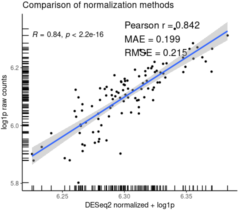

## 3.1.2 NMF/UMAP Ordination of the Metabolome

Runs NMF (top-variance features) plus UMAP on the batch-corrected metabolome separately for the Nystatin and Fluconazole arms, and plots the NMF ordination with median/MAD ellipses per treatment phase, exported as `Fig3.1.svg`.

~~~R
corrected <- mcreadRDS("./workshop/MMC/sample_info/final_Res/v2/metabolomics.counts.corrected.rds")
metabolomics.samples_info1 <- metabolomics.samples_info[metabolomics.samples_info$metabolomics_names %in% sample_info_total5$Omics_samples_Names,]
metabolomics.samples_info1 <- metabolomics.samples_info1[colnames(corrected),]
generate_ellipse <- function(median_x, mad_x, median_y, mad_y, n = 500, factor) {
  t <- seq(0, 2*pi, length.out = n)
  a <- mad_x * factor  # Semi-major axis length
  b <- mad_y * factor  # Semi-minor axis length
  x <- median_x + a * cos(t)
  y <- median_y + b * sin(t)
  return(data.frame(x = x, y = y))
}
metabolomics.samples_info1$time.v2 <- as.character(metabolomics.samples_info1$time)
metabolomics.samples_info1$time.v2[metabolomics.samples_info1$time.v2 %in% c("W0")] <- "Pre"
metabolomics.samples_info1$time.v2[metabolomics.samples_info1$time.v2 %in% c("W1","W2","W4")] <- "Post"
metabolomics.samples_info1$time.v2[metabolomics.samples_info1$time.v2 %in% c("W8")] <- "LTM"
metabolomics.samples_info1$time.v2 <- factor(metabolomics.samples_info1$time.v2,levels=c("Pre","Post","LTM"))
library(NMF)
set.seed(20250903)
Nystatin_s <- metabolomics.samples_info1[metabolomics.samples_info1$treatment=="Nystatin",]
Nystatin_corrected <- corrected[,rownames(Nystatin_s)]
vars <- apply(Nystatin_corrected, 1, var)
top_features <- names(sort(vars, decreasing = TRUE))[1:500]
Nystatin_corrected <- Nystatin_corrected[top_features, ]
Nystatin_nmf_res <- nmf(Nystatin_corrected, rank = 50, .opt = "v")  
Nystatin_H <- coef(Nystatin_nmf_res)
Nystatin_umap_res <- uwot::umap(t(Nystatin_H), scale = FALSE)
Nystatin_comp_var <- apply(Nystatin_H, 1, function(h) sum(h^2))
Nystatin_explained <- Nystatin_comp_var / sum(Nystatin_comp_var) * 100
Nystatin_df <- data.frame(Sample = rownames(Nystatin_s),batch = Nystatin_s$batch,time.v2 = Nystatin_s$time.v2,
  UMAP1 = Nystatin_umap_res[,1],UMAP2 = Nystatin_umap_res[,2], NMF1 = Nystatin_H[1, ],NMF2 = Nystatin_H[2, ])
mcsaveRDS(Nystatin_df,"./workshop/MMC/sample_info/final_Res/v2/metabolomics.Nystatin_df.rds")

Fluconazole_s <- metabolomics.samples_info1[metabolomics.samples_info1$treatment=="Fluconazole",]
Fluconazole_corrected <- corrected[,rownames(Fluconazole_s)]
vars <- apply(Fluconazole_corrected, 1, var)
top_features <- names(sort(vars, decreasing = TRUE))[1:500]
Fluconazole_corrected <- Fluconazole_corrected[top_features, ]
Fluconazole_nmf_res <- nmf(Fluconazole_corrected, rank = 50, .opt = "v")  
Fluconazole_H <- coef(Fluconazole_nmf_res)
Fluconazole_umap_res <- uwot::umap(t(Fluconazole_H), scale = FALSE)
Fluconazole_comp_var <- apply(Fluconazole_H, 1, function(h) sum(h^2))
Fluconazole_explained <- Fluconazole_comp_var / sum(Fluconazole_comp_var) * 100
Fluconazole_df <- data.frame(Sample = rownames(Fluconazole_s),batch = Fluconazole_s$batch,time.v2 = Fluconazole_s$time.v2,
  UMAP1 = Fluconazole_umap_res[,1],UMAP2 = Fluconazole_umap_res[,2], NMF1 = Fluconazole_H[1, ],NMF2 = Fluconazole_H[2, ])
mcsaveRDS(Fluconazole_df,"./workshop/MMC/sample_info/final_Res/v2/metabolomics.Fluconazole_df.rds")

Nystatin_df <- mcreadRDS("./workshop/MMC/sample_info/final_Res/v2/metabolomics.Nystatin_df.rds")
Fluconazole_df <- mcreadRDS("./workshop/MMC/sample_info/final_Res/v2/metabolomics.Fluconazole_df.rds")
Nystatin_sbg <- Nystatin_df %>% group_by(time.v2) %>%
  summarise(median_x = median(NMF1), mad_x = mad(NMF1),median_y = median(NMF2), mad_y = mad(NMF2), .groups = "drop")
Nystatin_ellipse_data <- do.call(rbind, lapply(1:nrow(Nystatin_sbg), function(i) {
  generate_ellipse(Nystatin_sbg$median_x[i], Nystatin_sbg$mad_x[i],Nystatin_sbg$median_y[i], Nystatin_sbg$mad_y[i], factor = 0.8) %>%
    transform(time.v2 = Nystatin_sbg$time.v2[i])
}))
Fluconazole_sbg <- Fluconazole_df %>% group_by(time.v2) %>%
  summarise(median_x = median(NMF1), mad_x = mad(NMF1),median_y = median(NMF2), mad_y = mad(NMF2), .groups = "drop")
Fluconazole_ellipse_data <- do.call(rbind, lapply(1:nrow(Fluconazole_sbg), function(i) {
  generate_ellipse(Fluconazole_sbg$median_x[i], Fluconazole_sbg$mad_x[i],Fluconazole_sbg$median_y[i], Fluconazole_sbg$mad_y[i], factor = 0.8) %>%
    transform(time.v2 = Fluconazole_sbg$time.v2[i])
}))
pal <- jdb_palette("corona")
library(ggside)
p1 <- ggplot(Nystatin_df, aes(x = NMF1, y = NMF2, color = time.v2, shape = time.v2)) +
  geom_point(size = 3, alpha = 0.6) +
  geom_polygon(data = Nystatin_ellipse_data, aes(x = x, y = y, fill = time.v2), alpha = 0.2) +
  geom_point(data = Nystatin_sbg, aes(x = median_x, y = median_y, fill = time.v2),
             color = "black", shape = 22, size = 5, alpha = 0.7, show.legend = FALSE) +
  geom_errorbar(data = Nystatin_sbg, aes(x = median_x, y = median_y, ymin = median_y - 0.5 * mad_y, ymax = median_y + 0.5 * mad_y), width = 0) +
  geom_errorbarh(data = Nystatin_sbg, aes(x = median_x, y = median_y, xmin = median_x - 0.5 * mad_x, xmax = median_x + 0.5 * mad_x), height = 0) +
  geom_xsideboxplot(aes(y = time.v2), orientation = "y") + geom_ysideboxplot(aes(x = time.v2), orientation = "x") +
  scale_fill_manual(values = pal) + scale_color_manual(values = pal)+
  labs(x = paste0("NMF1 (", round(Nystatin_comp_var[1],1), "%)"),y = paste0("NMF2 (", round(Nystatin_comp_var[2],1), "%)"),
       title = "NMF of metabolomics Nystatin") +theme_bw()
p2 <- ggplot(Fluconazole_df, aes(x = NMF1, y = NMF2, color = time.v2, shape = time.v2)) +
  geom_point(size = 3, alpha = 0.6) +
  geom_polygon(data = Fluconazole_ellipse_data, aes(x = x, y = y, fill = time.v2), alpha = 0.2) +
  geom_point(data = Fluconazole_sbg, aes(x = median_x, y = median_y, fill = time.v2),
             color = "black", shape = 22, size = 5, alpha = 0.7, show.legend = FALSE) +
  geom_errorbar(data = Fluconazole_sbg, aes(x = median_x, y = median_y, ymin = median_y - 0.5 * mad_y, ymax = median_y + 0.5 * mad_y), width = 0) +
  geom_errorbarh(data = Fluconazole_sbg, aes(x = median_x, y = median_y, xmin = median_x - 0.5 * mad_x, xmax = median_x + 0.5 * mad_x), height = 0) +
  geom_xsideboxplot(aes(y = time.v2), orientation = "y") + geom_ysideboxplot(aes(x = time.v2), orientation = "x") +
  scale_fill_manual(values = pal) + scale_color_manual(values = pal)+
  labs(x = paste0("NMF1 (", round(Fluconazole_comp_var[1],1), "%)"),y = paste0("NMF2 (", round(Fluconazole_comp_var[2],1), "%)"),
       title = "NMF of metabolomics Fluconazole") +theme_bw()
plot <- plot_grid(p1,p2)
plot
ggsave("./projects/MMC/Figures/v2_figures/Fig3.1.svg", plot=plot,width = 10, height = 4,dpi=300)
~~~

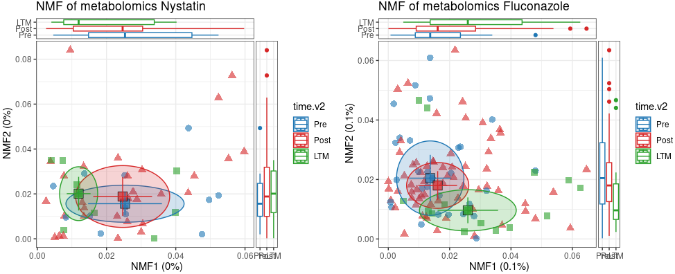

## 3.1.3 SCFA Density Ridgelines by Phase (Exploratory)

Assembles SCFA levels (butyric/propionic/valeric acid) with sample metadata and plots log2 density ridgelines by treatment phase (Pre/Post/LTM), with the pre-treatment median marked, as an exploratory view.

~~~r
corrected <- mcreadRDS("./workshop/MMC/sample_info/final_Res/v2/metabolomics.counts.corrected.rds")
sort(colSums(corrected))
metabolomics.samples_info <- mcreadRDS("./workshop/MMC/sample_info/final_Res/v2/metabolomics.samples_info1.v4.rds")
Healthy <- c("BUTYRIC ACID","PROPIONIC ACID","VALERIC ACID")
Metab_data <- as.data.frame(cbind(metabolomics.samples_info[colnames(corrected),],t(corrected[Healthy,])))
Metab_data <- Metab_data[Metab_data$treatment!="Clotrimazole",]
colnames(Metab_data) <- gsub(" ","_",colnames(Metab_data))
Healthy <- gsub(" ","_",Healthy)
pal <- jdb_palette("brewer_blue")[6:2]

Metab_data$time.v2 <- as.character(Metab_data$time)
Metab_data$time.v2[Metab_data$time.v2 %in% c("W0")] <- "Pre"
Metab_data$time.v2[Metab_data$time.v2 %in% c("W1","W2","W4")] <- "Post"
Metab_data$time.v2[Metab_data$time.v2 %in% c("W8")] <- "LTM"
Metab_data$time.v2 <- factor(Metab_data$time.v2,levels=c("Pre","Post","LTM"))
total_plots2 <- lapply(1:length(Healthy),function(dis) {
    df_paired <- Metab_data
    df_paired$treatment <- factor(df_paired$treatment,levels=c("Nystatin","Fluconazole"))
    colnames(df_paired)[colnames(df_paired)==Healthy[dis]] <- "value"
    df_paired$value <- log(df_paired$value+1,2)
    df_paired[order(df_paired$value,decreasing=FALSE),c("treatment","sample","value")]
    p1 <- ggplot(df_paired, aes_string(x="value", y="time.v2", fill="time.v2")) + ggridges::geom_density_ridges() +
    theme_bw()+ scale_color_manual(values = pal)+scale_fill_manual(values = pal)+NoLegend()+facet_wrap(~treatment,ncol=3,scales="free_x")+
    labs(title = paste0(Healthy[dis]," raw"),y = paste(Healthy[dis]))+
    geom_vline(xintercept = median(df_paired[df_paired$time.v2=="Pre","value"]), color = 'lightgrey', size = 0.8)
    return(plot_grid(p1,nrow=1))
    })
CombinePlots(c(total_plots2),ncol=1)
~~~

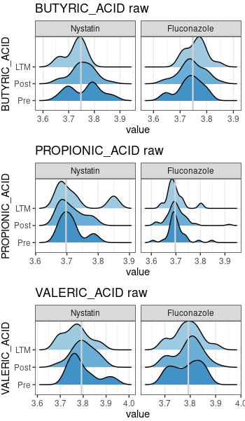

## 3.1.4 SCFA Density Ridgelines (Final Figure)

Re-draws the SCFA ridgelines with scaled densities for the final figure, exported as `Fig4.BUTYRIC.svg`.

~~~R
pal <- jdb_palette("brewer_blue")[6:2]
total_plots2 <- lapply(1:length(Healthy),function(dis) {
    df_paired <- Metab_data
    df_paired$treatment <- factor(df_paired$treatment,levels=c("Nystatin","Fluconazole"))
    colnames(df_paired)[colnames(df_paired)==Healthy[dis]] <- "value"
    ggplot(df_paired, aes_string(x="value", y="time.v2", fill="time.v2")) + ggridges::geom_density_ridges(scale = 3, rel_min_height = 0.0001) +
    theme_bw()+ scale_color_manual(values = pal)+scale_fill_manual(values = pal)+NoLegend()+facet_wrap(~treatment,ncol=3,scales="free_x")+
    labs(title = paste0(Healthy[dis]," raw"),y = paste(Healthy[dis]))+
    geom_vline(xintercept = median(df_paired[df_paired$time.v2=="Pre","value"]), color = 'lightgrey', size = 0.8)
    })
plot <- CombinePlots(c(total_plots2),ncol=1)
plot
ggsave("./projects/MMC/Figures/v2_figures/Fig4.BUTYRIC.svg", plot=plot,width = 4, height = 10,dpi=300)
~~~

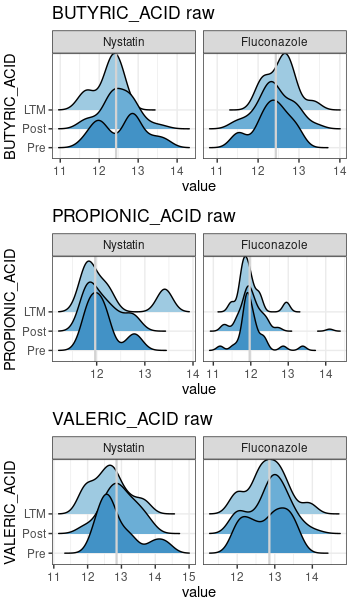

## 3.1.5 SCFA Change Trajectories (Multi-test)

Computes per-patient baseline-corrected (delta) SCFA trajectories and compares Fluconazole vs Nystatin over time with the full statistical battery (ANOVA, ART, Kruskal–Wallis, permutation, Tukey, pairwise t, LMM, LOESS F-test), exported as `Fig4.7`.

~~~r
pal <- c(jdb_palette("corona"),jdb_palette(c("lawhoops")),jdb_palette(c("brewer_celsius")),jdb_palette(c("brewer_spectra")))
library(lme4)
library(ARTool)
library(coin)
Sel.Metab <- c("BUTYRIC_ACID","PROPIONIC_ACID","VALERIC_ACID")
total_plots2 <- lapply(1:length(Sel.Metab),function(dis) {
    df_paired <- Metab_data[Metab_data$treatment %in% c("Nystatin","Fluconazole"),]
    df_paired$treatment <- factor(df_paired$treatment,levels=c("Nystatin","Fluconazole"))
    df_paired <- df_paired[df_paired$time!="W1",]
    colnames(df_paired)[colnames(df_paired)==Sel.Metab[dis]] <- "value"
    uniq_patient1 <- unique(df_paired$patient)
    # df_paired$value <- log(df_paired$value+1,2)
    df_paired1_ <- lapply(1:length(uniq_patient1),function(i) {
        tmp <- df_paired[df_paired$patient %in% uniq_patient1[i],]
        tmp[,"value"] <- tmp[,"value"]-tmp[tmp$time=="W0","value"]
        tmp[,"value"][tmp[,"value"]>2] <- 2
        tmp[,"value"][tmp[,"value"] < -2] <- -2
        return(tmp)
    })
    df_paired2 <- do.call(rbind,df_paired1_)
    df_paired2 <- df_paired2[!is.na(df_paired2$value),]
    df_paired2$time_numeric <- as.numeric(gsub("W", "", df_paired2$time))
    # df_paired2[,"value"] <- scales::rescale(df_paired2[,"value"], to = c(0, 1))

    art_model <- art(value ~ treatment, data = df_paired2)
    anova_art <- anova(art_model)
    art_p_value <- anova_art$`Pr(>F)`[1]
    art.pvalue0 <- ifelse(art_p_value < 0.001, "< 0.001", format(art_p_value, digits = 3))

    kruskal_result <- kruskal.test(value ~ treatment, data = df_paired2)
    kruskal_pvalue <- kruskal_result$p.value
    kruskal.pvalue0 <- ifelse(kruskal_pvalue < 0.001, "< 0.001", format(kruskal_pvalue, digits = 3))

    perm_test_result <- oneway_test(value ~ treatment, data = df_paired2, distribution = "approximate")
    perm_pvalue <- pvalue(perm_test_result)
    LocationTests.pvalue0 <- ifelse(perm_pvalue < 0.001, "< 0.001", format(perm_pvalue, digits = 3))

    lm_result <- lm(value ~ treatment, data = df_paired2)
    tukey_result <- TukeyHSD(aov(lm_result))
    tukey_pvalues <- tukey_result$treatment
    TukeyHSD.pvalue1 <- ifelse(tukey_pvalues["Fluconazole-Nystatin", "p adj"] < 0.001, "< 0.001", format(tukey_pvalues["Fluconazole-Nystatin", "p adj"], digits = 3))
    
    pairwise_t_result <- pairwise.t.test(df_paired2$value, df_paired2$treatment, p.adjust.method = "bonferroni")
    pairwise_t_pvalues <- pairwise_t_result$p.value
    pairwise.t.pvalue1 <- ifelse(pairwise_t_pvalues["Fluconazole","Nystatin"] < 0.001, "< 0.001", format(pairwise_t_pvalues["Fluconazole","Nystatin"], digits = 3))

    lmm_result <- lmerTest::lmer(value ~ treatment + (1 | patient), data = df_paired2)
    summary_lmm <- summary(lmm_result)
    p_value_mixed <- coef(summary_lmm)["treatmentFluconazole", "Pr(>|t|)"]
    LMM.pvalue1 <- ifelse(is.na(p_value_mixed) | p_value_mixed < 0.001, "< 0.001", format(p_value_mixed, digits = 3))

    anova_result <- aov(value ~ treatment, data = df_paired2)
    p_value <- summary(anova_result)[[1]]["treatment", "Pr(>F)"]
    anova.pvalue0 <- ifelse(p_value < 0.001, "< 0.001", format(p_value, digits = 3))

    loess_fit_1 <- loess(value ~ time_numeric, data = df_paired2[df_paired2$treatment == "Nystatin", ])
    loess_fit_2 <- loess(value ~ time_numeric, data = df_paired2[df_paired2$treatment == "Fluconazole", ])
    x_range <- seq(min(df_paired2$time_numeric), max(df_paired2$time_numeric), length.out = 100)
    pred_1 <- predict(loess_fit_1, newdata = data.frame(time_numeric = x_range))
    pred_2 <- predict(loess_fit_2, newdata = data.frame(time_numeric = x_range))
    ks_test_result <- ks.test(pred_1, pred_2)$p.value

    rss_1 <- sum((df_paired2[df_paired2$treatment == "Nystatin", "value"] - predict(loess_fit_1))^2)
    rss_2 <- sum((df_paired2[df_paired2$treatment == "Fluconazole", "value"] - predict(loess_fit_2))^2)
    n1 <- length(df_paired2[df_paired2$treatment == "Nystatin", "value"])  # Sample size group 1
    n2 <- length(df_paired2[df_paired2$treatment == "Fluconazole", "value"])  # Sample size group 2
    f_stat <- (rss_1 / (n1 - 2)) / (rss_2 / (n2 - 2))
    Ftestp_value <- pf(f_stat, df1 = n1 - 2, df2 = n2 - 2, lower.tail = FALSE)# Perform an F-test

    p2 <- ggplot(df_paired2, aes_string(x = "time_numeric", y = "value")) + geom_jitter(aes(color=treatment),size = 1)+ 
    # geom_smooth(aes(color=treatment,fill=treatment),size = 2,alpha=0.2,method = "loess", method.args = list(degree=0),se=TRUE, level = 0.5)+
    geom_smooth(aes(group = treatment, color = treatment), method = "loess", size = 1.5, se = TRUE,alpha=0.2,span=2)+
    # geom_smooth(aes(color=treatment,fill=treatment),size = 2,alpha=0.2,method = lm, formula = y ~ splines::bs(x, 1), se = TRUE, level = 0.5)+
    stat_compare_means(aes(group = treatment), method = "wilcox.test", label.y = c(0),label = "p.format") +
    theme_bw()+ scale_color_manual(values = pal[c(2,1)])+scale_fill_manual(values = pal[c(2,1)])+
    labs(title = paste0(Sel.Metab[dis],"\n", "Flu vs Nystatin (ANOVA p: ", anova.pvalue0," | ","art p: ",art.pvalue0,
        "|\n","kruskal p: ", kruskal.pvalue0," | ","LocationTests p: ",LocationTests.pvalue0,
        "|\n","TukeyHSD p: ",TukeyHSD.pvalue1," | ","loess p: ",Ftestp_value,"|\n","pairwise. p: ",pairwise.t.pvalue1," | ",
        "LMM p: ",LMM.pvalue1,")"),y = "Δ")+NoLegend()
    message(dis)
    return(p2)
    })
plot <- CombinePlots(c(total_plots2),ncol=4)
ggsave("./projects/MMC/Figures/v2_figures/Fig4.7.png", plot=plot,width = 20, height = 5,dpi=300)
ggsave("./projects/MMC/Figures/v2_figures/Fig4.7.svg", plot=plot,width = 20, height = 5,dpi=300)
~~~

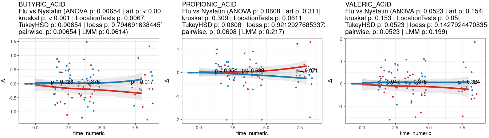

## 3.1.6 Functional Metabolite Sets and Module Trajectories

Defines health- vs dysbiosis-associated metabolite sets (from the *Nature* dysbiosis reference, intersected with Mfuzz modules) plus fatty-acid and bile-acid biosynthesis sets, then plots set-level z-score trajectories with a LOESS/KS treatment comparison, exported as `Fig4.features.svg`.

~~~r
All.trasnfer.anno <- mcreadRDS("./workshop/MMC/sample_info/final_Res/v2/All.trasnfer.anno.all.rds")
Nature.Dysbiosis.metabolomic <- read.csv("./workshop/MMC/nature.Dysbiosis.metabolomic.csv")
Nature.Dysbiosis.metabolomic1 <- Nature.Dysbiosis.metabolomic[!is.na(Nature.Dysbiosis.metabolomic$HMDB),]
Nature.Dysbiosis.metabolomic1 <- Nature.Dysbiosis.metabolomic1[Nature.Dysbiosis.metabolomic1$HMDB %in% All.trasnfer.anno$HMDB_ID,]
Health.UP.HMDB <- Nature.Dysbiosis.metabolomic1[Nature.Dysbiosis.metabolomic1$Dysbiosis.Coefficient..non.IBD. > 0,]$HMDB
Health.UP.ChEBI <- Nature.Dysbiosis.metabolomic1[Nature.Dysbiosis.metabolomic1$Dysbiosis.Coefficient..non.IBD. > 0,]$ChEBI
Health.UP.KEGG <- Nature.Dysbiosis.metabolomic1[Nature.Dysbiosis.metabolomic1$Dysbiosis.Coefficient..non.IBD. > 0,]$KEGG
Health.UP <- setdiff(c(Health.UP.HMDB,Health.UP.ChEBI,Health.UP.KEGG),NA)
Health.UP1 <- rownames(All.trasnfer.anno)[All.trasnfer.anno$HMDB_ID %in% intersect(Health.UP,All.trasnfer.anno$HMDB_ID)]
Health.UP2 <- rownames(All.trasnfer.anno)[All.trasnfer.anno$KEGG_ID %in% intersect(Health.UP,All.trasnfer.anno$KEGG_ID)]
Health.UP3 <- rownames(All.trasnfer.anno)[All.trasnfer.anno$CHEBI_ID %in% intersect(Health.UP,All.trasnfer.anno$CHEBI_ID)]
Health.UP <- sort(unique(c(Health.UP1,Health.UP2,Health.UP3)))
Dysbiosis.UP.HMDB <- Nature.Dysbiosis.metabolomic1[Nature.Dysbiosis.metabolomic1$Dysbiosis.Coefficient..non.IBD. < 0,]$HMDB
Dysbiosis.UP.ChEBI <- Nature.Dysbiosis.metabolomic1[Nature.Dysbiosis.metabolomic1$Dysbiosis.Coefficient..non.IBD. < 0,]$ChEBI
Dysbiosis.UP.KEGG <- Nature.Dysbiosis.metabolomic1[Nature.Dysbiosis.metabolomic1$Dysbiosis.Coefficient..non.IBD. < 0,]$KEGG
Dysbiosis.UP <- setdiff(c(Dysbiosis.UP.HMDB,Dysbiosis.UP.ChEBI,Dysbiosis.UP.KEGG),NA)
Dysbiosis.UP1 <- rownames(All.trasnfer.anno)[All.trasnfer.anno$HMDB_ID %in% intersect(Dysbiosis.UP,All.trasnfer.anno$HMDB_ID)]
Dysbiosis.UP2 <- rownames(All.trasnfer.anno)[All.trasnfer.anno$KEGG_ID %in% intersect(Dysbiosis.UP,All.trasnfer.anno$KEGG_ID)]
Dysbiosis.UP3 <- rownames(All.trasnfer.anno)[All.trasnfer.anno$CHEBI_ID %in% intersect(Dysbiosis.UP,All.trasnfer.anno$CHEBI_ID)]
Dysbiosis.UP <- sort(unique(c(Dysbiosis.UP1,Dysbiosis.UP2,Dysbiosis.UP3)))
length(Health.UP)
length(Dysbiosis.UP)

Mfuzz_cluster <- mcreadRDS("./workshop/MMC/sample_info/final_Res/v2/metabolomics.Mfuzz_cluster_metabolomics.v3.rds")
Mfuzz_order <- Mfuzz_cluster[[2]][[4]]
Mfuzz_order$Cluster <- gsub("Clu1","Module1",Mfuzz_order$Cluster)
Mfuzz_order$Cluster <- gsub("Clu2","Module2",Mfuzz_order$Cluster)
Mfuzz_order$Cluster <- gsub("Clu3","Module3",Mfuzz_order$Cluster)
Mfuzz_order$Cluster <- gsub("Clu4","Module4",Mfuzz_order$Cluster)
Flu_Inc_Metabolites <- Mfuzz_order[Mfuzz_order$Cluster=="Module2" |Mfuzz_order$Cluster=="Module4" | Mfuzz_order$Cluster=="Module3",]
Flu_Dec_Metabolites <- Mfuzz_order[Mfuzz_order$Cluster=="Module1",]
Health.UP <- intersect(Flu_Inc_Metabolites$names,Health.UP)
Dysbiosis.UP <- intersect(Dysbiosis.UP,Flu_Dec_Metabolites$names)
length(Health.UP)
length(Dysbiosis.UP)

Fatty_Acid_Biosynthesis <- c("ACETOACETATE","ACETOACETIC ACID","OCTANOIC ACID","CAPRYLIC ACID","DECANOIC ACID","CAPRIC ACID","DODECANOIC ACID","TRANS-TETRA-DEC-2-ENOIC ACID","TETRADECANOIC ACID","MYRISTIC ACID","TRANS-HEXA-DEC-2-ENOIC ACID","HEXADECANOIC ACID","PALMITIC ACID","(R)-3-HYDROXY-HEXADECANOIC ACID")
Bile_Acid_Biosynthesis <- c("HEXADECANOIC ACID","PALMITIC ACID","LITHOCHOLIC ACID","CHENODEOXYCHOLATE","CHENODEOXYCHOLIC ACID","DEOXYCHOLIC ACID","7ALPHA-HYDROXYCHOLESTEROL","7ALPHA-HYDROXY-5BETA-CHOLESTAN-3-ONE","CEREBROSTEROL","25-HYDROXYCHOLESTEROL","24-HYDROXYCHOLESTEROL","7A-HYDROXYCHOLESTEROL","27-HYDROXYCHOLESTEROL","7A-HYDROXY-5B-CHOLESTAN-3-ONE","3BETA-HYDROXY-5-CHOLESTENOATE","7ALPHA,26-DIHYDROXY-4-CHOLESTEN-3-ONE","7 ALPHA,26-DIHYDROXY-4-CHOLESTEN-3-ONE","7A,12A-DIHYDROXY-CHOLESTENE-3-ONE","3 BETA-HYDROXY-5-CHOLESTENOATE","3BETA,7ALPHA-DIHYDROXY-5-CHOLESTENOATE","3ALPHA,7ALPHA,12ALPHA-TRIHYDROXY-5BETA-CHOLESTAN-26-AL","3A,7A-DIHYDROXYCOPROSTANIC ACID","3A,7A,12A-TRIHYDROXY-5B-CHOLESTAN-26-AL","GLYCOCHENODEOXYCHOLATE","DEOXYCHOLIC ACID GLYCINE CONJUGATE","CHENODEOXYCHOLIC ACID GLYCINE CONJUGATE","3ALPHA,7ALPHA,12ALPHA-TRIHYDROXY-5BETA-CHOLESTANOATE","COPROCHOLIC ACID")
All_gene <- list(Fatty_Acid_Biosynthesis,Bile_Acid_Biosynthesis,Health.UP,Dysbiosis.UP)
names(All_gene) <- c("Fatty_Acid_Biosynthesis","Bile_Acid_Biosynthesis","Health.UP","Dysbiosis.UP")
HWM <- unique(c(Fatty_Acid_Biosynthesis,Bile_Acid_Biosynthesis,Health.UP,Dysbiosis.UP))

library(reshape2)
corrected <- mcreadRDS("./workshop/MMC/sample_info/final_Res/v2/metabolomics.counts.corrected.rds")
metabolomics.samples_info <- mcreadRDS("./workshop/MMC/sample_info/final_Res/v2/metabolomics.samples_info1.v4.rds")
metabolomics.samples_info <- metabolomics.samples_info[colnames(corrected),]
corrected_Nystatin <- corrected[,rownames(metabolomics.samples_info[metabolomics.samples_info$treatment=="Nystatin",])]
corrected_Fluconazole <- corrected[,rownames(metabolomics.samples_info[metabolomics.samples_info$treatment=="Fluconazole",])]
all_corrected <- list(corrected_Nystatin,corrected_Fluconazole)
names(all_corrected) <- c("Nystatin","Fluconazole")
quantify_scale1_ <- lapply(1:length(all_corrected),function(x) {
    tmp <- all_corrected[[x]]
    meta <- metabolomics.samples_info[metabolomics.samples_info$treatment==names(all_corrected)[x],]
    sel_time <- c("W0","W1","W2","W4","W8")
    counts_tmp1_ <- lapply(1:length(sel_time),function(i) {
        counts <- as.matrix(tmp[HWM,rownames(meta[meta$time %in% sel_time[i],])])
        counts_tmp <- as.data.frame(t(rowMeans(counts)))
        return(counts_tmp)
        })
    counts_tmp1 <- do.call(rbind,counts_tmp1_)
    rownames(counts_tmp1) <- sel_time
    counts_tmp1 <- as.matrix(as.data.frame(t(counts_tmp1)))
    counts.ZSCORE <- sweep(counts_tmp1 - rowMeans(counts_tmp1), 1, matrixStats::rowSds(counts_tmp1),`/`)

    counts_ <- lapply(1:length(All_gene),function(num) {
        counts_tmp <- counts.ZSCORE[All_gene[[num]],]
        counts_tmp <- melt(counts_tmp)
        counts_tmp$Cluster <- names(All_gene)[num]
        return(counts_tmp)
        })
    counts1 <- do.call(rbind,counts_)
    counts1$time <- counts1$Var2
    counts1$time <- factor(counts1$time,levels=c("W0","W1","W2","W4","W8"))
    counts1$treatment <- names(all_corrected)[x]
    return(counts1)
    })
quantify_scale1 <- do.call(rbind,quantify_scale1_)
quantify_scale1$treatment <- factor(quantify_scale1$treatment,levels=c("Nystatin","Fluconazole"))
comb <- list(c("W0","W1"),c("W0","W2"),c("W0","W4"),c("W0","W8"))
pal <- jdb_palette("corona")[c(2,1,2)]
total_plots2 <- lapply(1:length(names(All_gene)),function(x) {
    quantify_scale2 <- quantify_scale1[quantify_scale1$Cluster==names(All_gene)[x],]
    df_paired2 <- quantify_scale2
    df_paired2$time <- as.numeric(gsub("W","",df_paired2$time))
    loess_fit_1 <- loess(value ~ time, data = df_paired2[df_paired2$treatment == "Nystatin", ])
    loess_fit_2 <- loess(value ~ time, data = df_paired2[df_paired2$treatment == "Fluconazole", ])
    x_range <- seq(min(df_paired2$time), max(df_paired2$time), length.out = 100)
    pred_1 <- predict(loess_fit_1, newdata = data.frame(time = x_range))
    pred_2 <- predict(loess_fit_2, newdata = data.frame(time = x_range))
    ks_test_result <- ks.test(pred_1, pred_2)$p.value

    rss_1 <- sum((df_paired2[df_paired2$treatment == "Nystatin", "value"] - predict(loess_fit_1))^2)
    rss_2 <- sum((df_paired2[df_paired2$treatment == "Fluconazole", "value"] - predict(loess_fit_2))^2)
    n1 <- length(df_paired2[df_paired2$treatment == "Nystatin", "value"])  # Sample size group 1
    n2 <- length(df_paired2[df_paired2$treatment == "Fluconazole", "value"])  # Sample size group 2
    f_stat <- (rss_1 / (n1 - 2)) / (rss_2 / (n2 - 2))
    Ftestp_value <- pf(f_stat, df1 = n1 - 2, df2 = n2 - 2, lower.tail = FALSE)# Perform an F-test

    plot <- ggplot(quantify_scale2, aes(x=time, y=value))+geom_line(aes(group = Var1),color="lightgrey",size = 0.4,alpha=0.4) +
    geom_jitter(color="black",width = 0.1,alpha=0.5,size=0.5) + geom_boxplot(outlier.shape = NA,alpha=0) +
    theme(axis.title.x=element_blank(), axis.text.x=element_text(angle=45,hjust=1,vjust=1,size=12), axis.text.y=element_text(size=12))+
    facet_wrap(~treatment,ncol=3,scales="free_x")+
    geom_signif(comparisons = comb,step_increase = 0.1,map_signif_level = F,test = ks.test_wrapper) + theme_bw()+ 
    scale_color_manual(values = pal)+NoLegend()+theme(axis.text.x  = element_text(angle=45, vjust=1,hjust = 1))+
    labs(title=paste0(names(All_gene)[x],"\n (Flu vs Nys p:",Ftestp_value,")"))+stat_summary(fun.y=mean, colour="black", geom="text", show_guide = FALSE,  vjust=-0.7, aes( label=round(..y.., digits=1)))+
    geom_smooth(aes(group = 1, color = treatment), method = "loess", size = 1.5, se = TRUE,alpha=0.2,span=2)+
    stat_summary(fun = mean, geom = "point",aes(group = 1,color = treatment),size=2)
    return(plot)
    })
plot <- CombinePlots(c(total_plots2),ncol=1)
plot
ggsave("./projects/MMC/Figures/v2_figures/Fig4.features.svg", plot=plot,width = 5, height = 20,dpi=300)
~~~

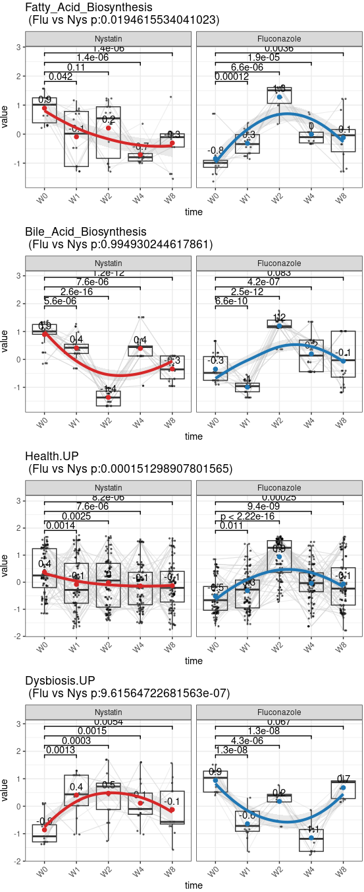

## 3.1.7 Bile-Acid Change Trajectories: W0 → W8 (Multi-test)

Computes per-patient delta trajectories for selected bile-acid and sphingolipid metabolites across the full W0–W8 window and compares treatment groups with the full statistical battery, exported as `W0_W8.new`.

~~~R
corrected <- mcreadRDS("./workshop/MMC/sample_info/final_Res/v2/metabolomics.counts.corrected.rds")
sort(colSums(corrected))
metabolomics.samples_info <- mcreadRDS("./workshop/MMC/sample_info/final_Res/v2/metabolomics.samples_info1.v4.rds")
Sel.Metab <- c("LITHOCHOLIC ACID", "CHENODEOXYCHOLATE", "CHENODEOXYCHOLIC ACID", "DEOXYCHOLIC ACID", "GLYCOCHOLATE", 
"GLYCOCHOLIC ACID", "TAUROCHOLATE", "TAUROCHOLIC ACID", "GLYCOCHENODEOXYCHOLATE", "DEOXYCHOLIC ACID GLYCINE CONJUGATE", 
"CHENODEOXYCHOLIC ACID GLYCINE CONJUGATE","N-ACYLSPHINGOSINE","N-ACYLSPHINGANINE")
Metab_data <- as.data.frame(cbind(metabolomics.samples_info[colnames(corrected),],t(corrected[Sel.Metab,])))
Metab_data <- Metab_data[Metab_data$treatment!="Clotrimazole",]
colnames(Metab_data) <- gsub(" ","_",colnames(Metab_data))
Sel.Metab <- gsub(" ","_",Sel.Metab)
pal <- c(jdb_palette("corona"),jdb_palette(c("lawhoops")),jdb_palette(c("brewer_celsius")),jdb_palette(c("brewer_spectra")))
library(lme4)
library(ARTool)
library(coin)
intersect(Sel.Metab,colnames(Metab_data))
total_plots2 <- lapply(1:length(Sel.Metab),function(dis) {
    df_paired <- Metab_data[Metab_data$treatment %in% c("Nystatin","Fluconazole"),]
    df_paired$treatment <- factor(df_paired$treatment,levels=c("Nystatin","Fluconazole"))
    colnames(df_paired)[colnames(df_paired)==Sel.Metab[dis]] <- "value"
    uniq_patient1 <- unique(df_paired$patient)
    # df_paired$value <- log(df_paired$value+1,2)
    df_paired1_ <- lapply(1:length(uniq_patient1),function(i) {
        tmp <- df_paired[df_paired$patient %in% uniq_patient1[i],]
        tmp[,"value"] <- tmp[,"value"]-tmp[tmp$time=="W0","value"]
        tmp[,"value"][tmp[,"value"]>2] <- 2
        tmp[,"value"][tmp[,"value"] < -2] <- -2
        return(tmp)
    })
    df_paired2 <- do.call(rbind,df_paired1_)
    df_paired2 <- df_paired2[!is.na(df_paired2$value),]
    df_paired2$time_numeric <- as.numeric(gsub("W", "", df_paired2$time))
    # df_paired2[,"value"] <- scales::rescale(df_paired2[,"value"], to = c(0, 1))

    art_model <- art(value ~ treatment, data = df_paired2)
    anova_art <- anova(art_model)
    art_p_value <- anova_art$`Pr(>F)`[1]
    art.pvalue0 <- ifelse(art_p_value < 0.001, "< 0.001", format(art_p_value, digits = 3))

    kruskal_result <- kruskal.test(value ~ treatment, data = df_paired2)
    kruskal_pvalue <- kruskal_result$p.value
    kruskal.pvalue0 <- ifelse(kruskal_pvalue < 0.001, "< 0.001", format(kruskal_pvalue, digits = 3))

    perm_test_result <- oneway_test(value ~ treatment, data = df_paired2, distribution = "approximate")
    perm_pvalue <- pvalue(perm_test_result)
    LocationTests.pvalue0 <- ifelse(perm_pvalue < 0.001, "< 0.001", format(perm_pvalue, digits = 3))

    lm_result <- lm(value ~ treatment, data = df_paired2)
    tukey_result <- TukeyHSD(aov(lm_result))
    tukey_pvalues <- tukey_result$treatment
    TukeyHSD.pvalue1 <- ifelse(tukey_pvalues["Fluconazole-Nystatin", "p adj"] < 0.001, "< 0.001", format(tukey_pvalues["Fluconazole-Nystatin", "p adj"], digits = 3))
    
    pairwise_t_result <- pairwise.t.test(df_paired2$value, df_paired2$treatment, p.adjust.method = "bonferroni")
    pairwise_t_pvalues <- pairwise_t_result$p.value
    pairwise.t.pvalue1 <- ifelse(pairwise_t_pvalues["Fluconazole","Nystatin"] < 0.001, "< 0.001", format(pairwise_t_pvalues["Fluconazole","Nystatin"], digits = 3))

    lmm_result <- lmerTest::lmer(value ~ treatment + (1 | patient), data = df_paired2)
    summary_lmm <- summary(lmm_result)
    p_value_mixed <- coef(summary_lmm)["treatmentFluconazole", "Pr(>|t|)"]
    LMM.pvalue1 <- ifelse(is.na(p_value_mixed) | p_value_mixed < 0.001, "< 0.001", format(p_value_mixed, digits = 3))

    anova_result <- aov(value ~ treatment, data = df_paired2)
    p_value <- summary(anova_result)[[1]]["treatment", "Pr(>F)"]
    anova.pvalue0 <- ifelse(p_value < 0.001, "< 0.001", format(p_value, digits = 3))

    loess_fit_1 <- loess(value ~ time_numeric, data = df_paired2[df_paired2$treatment == "Nystatin", ])
    loess_fit_2 <- loess(value ~ time_numeric, data = df_paired2[df_paired2$treatment == "Fluconazole", ])
    x_range <- seq(min(df_paired2$time_numeric), max(df_paired2$time_numeric), length.out = 100)
    pred_1 <- predict(loess_fit_1, newdata = data.frame(time_numeric = x_range))
    pred_2 <- predict(loess_fit_2, newdata = data.frame(time_numeric = x_range))
    ks_test_result <- ks.test(pred_1, pred_2)$p.value

    rss_1 <- sum((df_paired2[df_paired2$treatment == "Nystatin", "value"] - predict(loess_fit_1))^2)
    rss_2 <- sum((df_paired2[df_paired2$treatment == "Fluconazole", "value"] - predict(loess_fit_2))^2)
    n1 <- length(df_paired2[df_paired2$treatment == "Nystatin", "value"])  # Sample size group 1
    n2 <- length(df_paired2[df_paired2$treatment == "Fluconazole", "value"])  # Sample size group 2
    f_stat <- (rss_1 / (n1 - 2)) / (rss_2 / (n2 - 2))
    Ftestp_value <- pf(f_stat, df1 = n1 - 2, df2 = n2 - 2, lower.tail = FALSE)# Perform an F-test

    p2 <- ggplot(df_paired2, aes_string(x = "time_numeric", y = "value")) + geom_jitter(aes(color=treatment),size = 1)+ 
    # geom_smooth(aes(color=treatment,fill=treatment),size = 2,alpha=0.2,method = "loess", method.args = list(degree=0),se=TRUE, level = 0.5)+
    geom_smooth(aes(group = treatment, color = treatment), method = "loess", size = 1.5, se = TRUE,alpha=0.2,span=2)+
    # geom_smooth(aes(color=treatment,fill=treatment),size = 2,alpha=0.2,method = lm, formula = y ~ splines::bs(x, 1), se = TRUE, level = 0.5)+
    stat_compare_means(aes(group = treatment), method = "wilcox.test", label.y = c(0),label = "p.format") +
    theme_bw()+ scale_color_manual(values = pal[c(2,1)])+scale_fill_manual(values = pal[c(2,1)])+
    labs(title = paste0(Sel.Metab[dis],"\n", "Flu vs Nystatin (ANOVA p: ", anova.pvalue0," | ","art p: ",art.pvalue0,
        "|\n","kruskal p: ", kruskal.pvalue0," | ","LocationTests p: ",LocationTests.pvalue0,
        "|\n","TukeyHSD p: ",TukeyHSD.pvalue1," | ","loess p: ",Ftestp_value,"|\n","pairwise. p: ",pairwise.t.pvalue1," | ",
        "LMM p: ",LMM.pvalue1,")"),y = "Δ")
    message(dis)
    return(p2)
    })
plot <- CombinePlots(c(total_plots2),ncol=5)
ggsave("./projects/MMC/Figures/v2_figures/W0_W8.new.png", plot=plot,width = 30, height = 12,dpi=300)
~~~

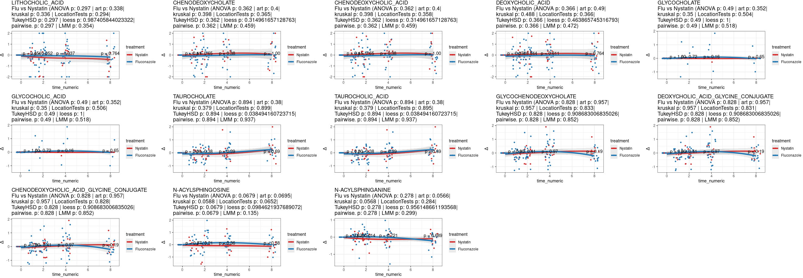

## 3.1.8 Bile-Acid Change Trajectories: W0 → W4 (Multi-test)

Repeats the bile-acid delta trajectory analysis excluding W8 (i.e. the on-treatment W0–W4 window), exported as `W0_W4.new`.

~~~R

total_plots2 <- lapply(1:length(Sel.Metab),function(dis) {
    df_paired <- Metab_data[Metab_data$treatment %in% c("Nystatin","Fluconazole"),]
    df_paired$treatment <- factor(df_paired$treatment,levels=c("Nystatin","Fluconazole"))
    df_paired <- df_paired[df_paired$time!="W8",]
    colnames(df_paired)[colnames(df_paired)==Sel.Metab[dis]] <- "value"
    uniq_patient1 <- unique(df_paired$patient)
    # df_paired$value <- log(df_paired$value+1,2)
    df_paired1_ <- lapply(1:length(uniq_patient1),function(i) {
        tmp <- df_paired[df_paired$patient %in% uniq_patient1[i],]
        tmp[,"value"] <- tmp[,"value"]-tmp[tmp$time=="W0","value"]
        tmp[,"value"][tmp[,"value"]>2] <- 2
        tmp[,"value"][tmp[,"value"] < -2] <- -2
        return(tmp)
    })
    df_paired2 <- do.call(rbind,df_paired1_)
    df_paired2 <- df_paired2[!is.na(df_paired2$value),]
    df_paired2$time_numeric <- as.numeric(gsub("W", "", df_paired2$time))
    # df_paired2[,"value"] <- scales::rescale(df_paired2[,"value"], to = c(0, 1))

    art_model <- art(value ~ treatment, data = df_paired2)
    anova_art <- anova(art_model)
    art_p_value <- anova_art$`Pr(>F)`[1]
    art.pvalue0 <- ifelse(art_p_value < 0.001, "< 0.001", format(art_p_value, digits = 3))

    kruskal_result <- kruskal.test(value ~ treatment, data = df_paired2)
    kruskal_pvalue <- kruskal_result$p.value
    kruskal.pvalue0 <- ifelse(kruskal_pvalue < 0.001, "< 0.001", format(kruskal_pvalue, digits = 3))

    perm_test_result <- oneway_test(value ~ treatment, data = df_paired2, distribution = "approximate")
    perm_pvalue <- pvalue(perm_test_result)
    LocationTests.pvalue0 <- ifelse(perm_pvalue < 0.001, "< 0.001", format(perm_pvalue, digits = 3))

    lm_result <- lm(value ~ treatment, data = df_paired2)
    tukey_result <- TukeyHSD(aov(lm_result))
    tukey_pvalues <- tukey_result$treatment
    TukeyHSD.pvalue1 <- ifelse(tukey_pvalues["Fluconazole-Nystatin", "p adj"] < 0.001, "< 0.001", format(tukey_pvalues["Fluconazole-Nystatin", "p adj"], digits = 3))
    
    pairwise_t_result <- pairwise.t.test(df_paired2$value, df_paired2$treatment, p.adjust.method = "bonferroni")
    pairwise_t_pvalues <- pairwise_t_result$p.value
    pairwise.t.pvalue1 <- ifelse(pairwise_t_pvalues["Fluconazole","Nystatin"] < 0.001, "< 0.001", format(pairwise_t_pvalues["Fluconazole","Nystatin"], digits = 3))

    lmm_result <- lmerTest::lmer(value ~ treatment + (1 | patient), data = df_paired2)
    summary_lmm <- summary(lmm_result)
    p_value_mixed <- coef(summary_lmm)["treatmentFluconazole", "Pr(>|t|)"]
    LMM.pvalue1 <- ifelse(is.na(p_value_mixed) | p_value_mixed < 0.001, "< 0.001", format(p_value_mixed, digits = 3))

    anova_result <- aov(value ~ treatment, data = df_paired2)
    p_value <- summary(anova_result)[[1]]["treatment", "Pr(>F)"]
    anova.pvalue0 <- ifelse(p_value < 0.001, "< 0.001", format(p_value, digits = 3))

    loess_fit_1 <- loess(value ~ time_numeric, data = df_paired2[df_paired2$treatment == "Nystatin", ])
    loess_fit_2 <- loess(value ~ time_numeric, data = df_paired2[df_paired2$treatment == "Fluconazole", ])
    x_range <- seq(min(df_paired2$time_numeric), max(df_paired2$time_numeric), length.out = 100)
    pred_1 <- predict(loess_fit_1, newdata = data.frame(time_numeric = x_range))
    pred_2 <- predict(loess_fit_2, newdata = data.frame(time_numeric = x_range))
    ks_test_result <- ks.test(pred_1, pred_2)$p.value

    rss_1 <- sum((df_paired2[df_paired2$treatment == "Nystatin", "value"] - predict(loess_fit_1))^2)
    rss_2 <- sum((df_paired2[df_paired2$treatment == "Fluconazole", "value"] - predict(loess_fit_2))^2)
    n1 <- length(df_paired2[df_paired2$treatment == "Nystatin", "value"])  # Sample size group 1
    n2 <- length(df_paired2[df_paired2$treatment == "Fluconazole", "value"])  # Sample size group 2
    f_stat <- (rss_1 / (n1 - 2)) / (rss_2 / (n2 - 2))
    Ftestp_value <- pf(f_stat, df1 = n1 - 2, df2 = n2 - 2, lower.tail = FALSE)# Perform an F-test

    p2 <- ggplot(df_paired2, aes_string(x = "time_numeric", y = "value")) + geom_jitter(aes(color=treatment),size = 1)+ 
    # geom_smooth(aes(color=treatment,fill=treatment),size = 2,alpha=0.2,method = "loess", method.args = list(degree=0),se=TRUE, level = 0.5)+
    geom_smooth(aes(group = treatment, color = treatment), method = "loess", size = 1.5, se = TRUE,alpha=0.2,span=2)+
    # geom_smooth(aes(color=treatment,fill=treatment),size = 2,alpha=0.2,method = lm, formula = y ~ splines::bs(x, 1), se = TRUE, level = 0.5)+
    stat_compare_means(aes(group = treatment), method = "wilcox.test", label.y = c(0),label = "p.format") +
    theme_bw()+ scale_color_manual(values = pal[c(2,1)])+scale_fill_manual(values = pal[c(2,1)])+
    labs(title = paste0(Sel.Metab[dis],"\n", "Flu vs Nystatin (ANOVA p: ", anova.pvalue0," | ","art p: ",art.pvalue0,
        "|\n","kruskal p: ", kruskal.pvalue0," | ","LocationTests p: ",LocationTests.pvalue0,
        "|\n","TukeyHSD p: ",TukeyHSD.pvalue1," | ","loess p: ",Ftestp_value,"|\n","pairwise. p: ",pairwise.t.pvalue1," | ",
        "LMM p: ",LMM.pvalue1,")"),y = "Δ")
    message(dis)
    return(p2)
    })
plot <- CombinePlots(c(total_plots2),ncol=5)
ggsave("./projects/MMC/Figures/v2_figures/W0_W4.new.png", plot=plot,width = 30, height = 12,dpi=300)
~~~

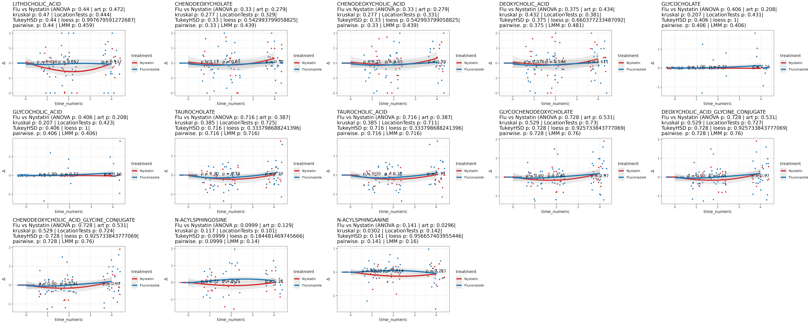

## 3.1.9 Differential Metabolites and Mfuzz Temporal Clustering

Computes per-treatment differential metabolites (each week vs W0), saves them, then runs Mfuzz soft clustering on the mean time-course to group metabolites into four temporal modules (`metabolomics.Mfuzz_cluster_metabolomics.v3.rds`).

~~~R
corrected <- mcreadRDS("./workshop/MMC/sample_info/final_Res/v2/metabolomics.counts.corrected.rds")
metabolomics.samples_info <- mcreadRDS("./workshop/MMC/sample_info/final_Res/v2/metabolomics.samples_info1.v4.rds")
metabolomics.samples_info <- metabolomics.samples_info[colnames(corrected),]
corrected_Nystatin <- corrected[,rownames(metabolomics.samples_info[metabolomics.samples_info$treatment=="Nystatin",])]
corrected_Fluconazole <- corrected[,rownames(metabolomics.samples_info[metabolomics.samples_info$treatment=="Fluconazole",])]
all_corrected <- list(corrected_Nystatin,corrected_Fluconazole)
names(all_corrected) <- c("Nystatin","Fluconazole")
DM_all <- lapply(1:length(all_corrected),function(x) {
  tmp_DM <- all_corrected[[x]]
  tmp_sample_info <- metabolomics.samples_info[metabolomics.samples_info$treatment==names(all_corrected)[x],]
  W1_vs_W0 <- rowMeans(tmp_DM[,rownames(tmp_sample_info[tmp_sample_info$time=="W1",])])-rowMeans(tmp_DM[,rownames(tmp_sample_info[tmp_sample_info$time=="W0",])])
  W2_vs_W0 <- rowMeans(tmp_DM[,rownames(tmp_sample_info[tmp_sample_info$time=="W2",])])-rowMeans(tmp_DM[,rownames(tmp_sample_info[tmp_sample_info$time=="W0",])])
  W4_vs_W0 <- rowMeans(tmp_DM[,rownames(tmp_sample_info[tmp_sample_info$time=="W4",])])-rowMeans(tmp_DM[,rownames(tmp_sample_info[tmp_sample_info$time=="W0",])])
  W8_vs_W0 <- rowMeans(tmp_DM[,rownames(tmp_sample_info[tmp_sample_info$time=="W8",])])-rowMeans(tmp_DM[,rownames(tmp_sample_info[tmp_sample_info$time=="W0",])])
  DM_tmp <- data.frame(W1_vs_W0=W1_vs_W0,W2_vs_W0=W2_vs_W0,W4_vs_W0=W4_vs_W0,W8_vs_W0=W8_vs_W0)
  rownames(DM_tmp) <- rownames(tmp_DM)
  DM_tmp <- as.data.frame(cbind(tmp_DM,DM_tmp))
  DM_tmp
  })
names(DM_all) <- c("Nystatin","Fluconazole")
mcsaveRDS(DM_all,"./workshop/MMC/sample_info/final_Res/v2/metabolomics.DM_all_metabolomics.v3.rds")

DM_all <- mcreadRDS("./workshop/MMC/sample_info/final_Res/v2/metabolomics.DM_all_metabolomics.v3.rds")
library(Mfuzz)
library(data.table)
Mfuzz_cluster <- lapply(1:length(DM_all),function(x) {
  tmp <- DM_all[[x]]
  meta <- metabolomics.samples_info[metabolomics.samples_info$treatment==names(DM_all)[x],]
  tmp1 <- tmp[abs(tmp$W1_vs_W0) > 0.1 |abs(tmp$W2_vs_W0) > 0.1 | abs(tmp$W4_vs_W0) > 0.1 | abs(tmp$W8_vs_W0) > 0.1,]
  dim(tmp1)
  HWM <- unique(rownames(tmp1))
  sel_time <- c("W0","W1","W2","W4","W8")
  counts_tmp1_ <- lapply(1:length(sel_time),function(i) {
      counts <- as.matrix(tmp[HWM,rownames(meta[meta$time %in% sel_time[i],])])
      # counts <- log(counts+1,2)
      counts_tmp <- as.data.frame(t(rowMeans(counts)))
      return(counts_tmp)
      })
  counts_tmp1 <- do.call(rbind,counts_tmp1_)
  rownames(counts_tmp1) <- sel_time
  counts_tmp1 <- as.matrix(as.data.frame(t(counts_tmp1)))

  mfuzz_class <- new("ExpressionSet", exprs = counts_tmp1)
  #预处理缺失值或者异常值
  mfuzz_class <- filter.NA(mfuzz_class, thres = 0.3)
  mfuzz_class <- fill.NA(mfuzz_class, mode = 'mean')
  mfuzz_class <- filter.std(mfuzz_class, min.std = 0.05)
  #标准化数据
  mfuzz_class <- standardise(mfuzz_class)
  mfuzz_class <- Mfuzz::standardise(mfuzz_class)
  min_fuzzification <- Mfuzz::mestimate(mfuzz_class)
  cl <- Mfuzz::mfuzz(mfuzz_class, c = 4, m = min_fuzzification)
  # mfuzz.plot(mfuzz_class,cl=cl,mfrow=c(1,6), time.labels = colnames(counts_tmp1))

  ord <- unique(cl$cluster)
  tmp_metabo_ <- lapply(1:length(ord),function(x) {
      tmp <- data.frame(Cluster=paste0("Clu",ord[x]),names=names(cl$cluster)[cl$cluster==ord[x]])
      return(tmp)
      })
  tmp_metabo <- as.data.frame(rbindlist(tmp_metabo_))

  counts.ZSCORE <- sweep(counts_tmp1 - rowMeans(counts_tmp1), 1, matrixStats::rowSds(counts_tmp1),`/`)
  counts.ZSCORE[counts.ZSCORE > 2] <- 2
  counts.ZSCORE[counts.ZSCORE < -2] <- -2
  meta <- data.frame(time=c("W0","W1","W2","W4","W8"),row.names=c("W0","W1","W2","W4","W8"))
  meta$time <- factor(meta$time,levels=c("W0","W1","W2","W4","W8"))
  ANNO_COL = HeatmapAnnotation(time=meta$time,annotation_legend_param = list(time = list(nrow = 1),direction = "horizontal"))
  message(nrow(counts.ZSCORE))
  return(list(counts.ZSCORE,ANNO_COL,meta,tmp_metabo,cl,mfuzz_class))
})
mcsaveRDS(Mfuzz_cluster,"./workshop/MMC/sample_info/final_Res/v2/metabolomics.Mfuzz_cluster_metabolomics.v3.rds")
# 0 genes excluded.
# 458 genes excluded.
# 7036
# 0 genes excluded.
# 523 genes excluded.
# 6221
~~~

## 3.1.10 Module Z-score Trajectories (All Clusters)

Quantifies the z-scored time-course of each Mfuzz module per treatment and draws boxplot/line trajectories with pairwise time comparisons across all clusters and treatments.

~~~R
metabolomics.samples_info <- mcreadRDS("./workshop/MMC/sample_info/final_Res/v2/metabolomics.samples_info1.v4.rds")
metabolomics.samples_info <- metabolomics.samples_info[colnames(corrected),]
Mfuzz_cluster <- mcreadRDS("./workshop/MMC/sample_info/final_Res/v2/metabolomics.Mfuzz_cluster_metabolomics.v3.rds")
DM_all <- mcreadRDS("./workshop/MMC/sample_info/final_Res/v2/metabolomics.DM_all_metabolomics.v3.rds")
Mfuzz_exp_quantify_scale_ <- lapply(1:length(DM_all),function(x) {
  tmp <- DM_all[[x]]
  meta <- metabolomics.samples_info[metabolomics.samples_info$treatment==names(DM_all)[x],]
  tmp1 <- tmp[abs(tmp$W1_vs_W0) > 0.1 |abs(tmp$W2_vs_W0) > 0.1 | abs(tmp$W4_vs_W0) > 0.1 | abs(tmp$W8_vs_W0) > 0.1,]
  dim(tmp1)
  HWM <- unique(rownames(tmp1))
  sel_time <- c("W0","W1","W2","W4","W8")
  counts_tmp1_ <- lapply(1:length(sel_time),function(i) {
      counts <- as.matrix(tmp[HWM,rownames(meta[meta$time %in% sel_time[i],])])
      # counts <- log(counts+1,2)
      counts_tmp <- as.data.frame(t(rowMeans(counts)))
      return(counts_tmp)
      })
  counts_tmp1 <- do.call(rbind,counts_tmp1_)
  rownames(counts_tmp1) <- sel_time
  counts_tmp1 <- as.matrix(as.data.frame(t(counts_tmp1)))
  counts.ZSCORE <- sweep(counts_tmp1 - rowMeans(counts_tmp1), 1, matrixStats::rowSds(counts_tmp1),`/`)

  Mfuzz_order <- Mfuzz_cluster[[x]][[4]]
  counts_ <- lapply(1:length(unique(Mfuzz_order$Cluster)),function(num) {
      counts_tmp <- counts.ZSCORE[Mfuzz_order[Mfuzz_order$Cluster==unique(Mfuzz_order$Cluster)[num],"names"],]
      counts_tmp <- melt(counts_tmp)
      counts_tmp$Cluster <- paste0(unique(Mfuzz_order$Cluster)[num])
      return(counts_tmp)
      })
  counts1 <- do.call(rbind,counts_)
  counts1$time <- counts1$Var2
  counts1$time <- factor(counts1$time,levels=c("W0","W1","W2","W4","W8"))
  counts1$treatment <- names(DM_all)[x]
  return(counts1)
  })
Mfuzz_exp_quantify_scale <- do.call(rbind,Mfuzz_exp_quantify_scale_)

Mfuzz_exp_quantify_scale$treatment <- factor(Mfuzz_exp_quantify_scale$treatment,levels=c("Nystatin","Clotrimazole","Fluconazole"))
comb <- list(c("W0","W1"),c("W0","W2"),c("W0","W4"),c("W0","W8"),c("W2","W4"),c("W4","W8"))
pal <- jdb_palette("corona")
ggplot(Mfuzz_exp_quantify_scale, aes(x=time, y=value, colour=time))+geom_line(aes(group = Var1),color="lightgrey",size = 0.4,alpha=0.4) +geom_jitter(size=1,alpha=0.5) + geom_boxplot(alpha=0.6) +ylab("Mfuzz_exp") +
theme(axis.title.x=element_blank(), axis.text.x=element_text(angle=45,hjust=1,vjust=1,size=12), axis.text.y=element_text(size=12))+facet_wrap(~treatment+Cluster,ncol=4,scales="free")+
geom_signif(comparisons = comb,step_increase = 0.1,map_signif_level = F,test = wilcox.test_wrapper) + theme_bw()+ scale_color_manual(values = pal)+NoLegend()+theme(axis.text.x  = element_text(angle=45, vjust=1,hjust = 1))+
labs(title=paste0("Mfuzz_exp_quantify_scale"))+stat_summary(fun.y=median, colour="black", geom="text", show_guide = FALSE,  vjust=-0.7, aes( label=round(..y.., digits=1)))+
stat_summary(fun.y = median, geom="point",colour="darkred", size=1.5) + stat_summary(fun = median, geom = "line",aes(group = 1),col = "red",size=1.5, linetype = "dashed")
~~~

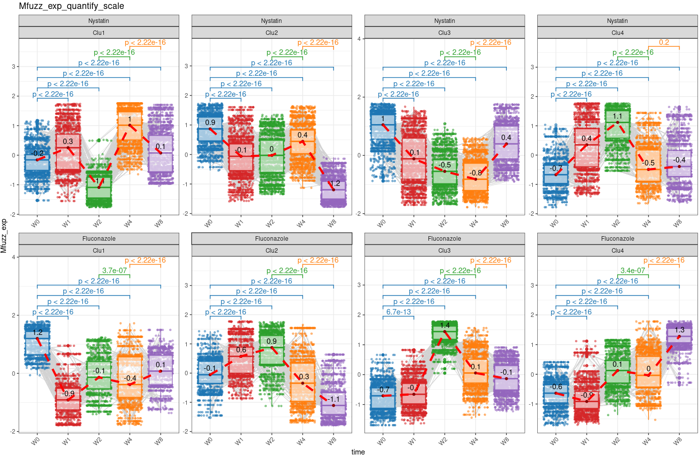

## 3.1.11 Fluconazole-defined Modules Across Both Arms

Takes the Fluconazole-defined module membership and contrasts each module's trajectory in the Fluconazole vs Nystatin group side by side, exported as `Fig4.2.svg`.

~~~R
Mfuzz_exp_quantify_scale <- do.call(rbind,Mfuzz_exp_quantify_scale_)
Mfuzz_exp_quantify_scale$treatment <- factor(Mfuzz_exp_quantify_scale$treatment,levels=c("Nystatin","Clotrimazole","Fluconazole"))
Mfuzz_exp_quantify_scale <- Mfuzz_exp_quantify_scale[Mfuzz_exp_quantify_scale$treatment!="Clotrimazole",]
Mfuzz_exp_quantify_scale$treatment <- factor(Mfuzz_exp_quantify_scale$treatment,levels=c("Nystatin","Fluconazole"))
Mfuzz_exp_quantify_scale$Cluster <- gsub("Clu1","Module1",Mfuzz_exp_quantify_scale$Cluster)
Mfuzz_exp_quantify_scale$Cluster <- gsub("Clu2","Module2",Mfuzz_exp_quantify_scale$Cluster)
Mfuzz_exp_quantify_scale$Cluster <- gsub("Clu3","Module3",Mfuzz_exp_quantify_scale$Cluster)
Mfuzz_exp_quantify_scale$Cluster <- gsub("Clu4","Module4",Mfuzz_exp_quantify_scale$Cluster)
Fluconazole1 <- Mfuzz_exp_quantify_scale[Mfuzz_exp_quantify_scale$treatment=="Fluconazole",]
pal <- jdb_palette("corona")
sel_Mod <- c("Module1","Module2","Module3","Module4")
plot1 <- lapply(1:length(sel_Mod),function(x) {
    Mfuzz_exp_quantify_scale1 <- Mfuzz_exp_quantify_scale[Mfuzz_exp_quantify_scale$treatment=="Fluconazole" & Mfuzz_exp_quantify_scale$Var1 %in% Fluconazole1[Fluconazole1$Cluster==sel_Mod[x],"Var1"],]
    p1 <- ggplot(Mfuzz_exp_quantify_scale1, aes(x=time, y=value, colour=time))+geom_line(aes(group = Var1),color="#bdc3c7",size = 0.1,alpha=0.1) + geom_boxplot(alpha=0.6) +ylab("Mfuzz_exp") +
    theme(axis.title.x=element_blank(), axis.text.x=element_text(angle=45,hjust=1,vjust=1,size=12), axis.text.y=element_text(size=12))+
    geom_signif(comparisons = comb,step_increase = 0.1,map_signif_level = F,test = wilcox.test_wrapper) + theme_bw()+ scale_color_manual(values = pal)+NoLegend()+theme(axis.text.x  = element_text(angle=45, vjust=1,hjust = 1))+
    labs(title=paste0("Fluconazole1.",sel_Mod[x],".in.Fluconazole1 group"))+stat_summary(fun.y=median, colour="black", geom="text", show_guide = FALSE,  vjust=-0.7, aes( label=round(..y.., digits=1)))+
    stat_summary(fun.y = median, geom="point",colour="darkred", size=1.5)+
    geom_smooth(aes(group = treatment, color = treatment), method = "loess", size = 1.5, se = TRUE,alpha=0.2,span=1.2)
    return(p1)
    })
plot1 <- CombinePlots(c(plot1),ncol=1)
plot2 <- lapply(1:length(sel_Mod),function(x) {
    Mfuzz_exp_quantify_scale1 <- Mfuzz_exp_quantify_scale[Mfuzz_exp_quantify_scale$treatment=="Nystatin" & Mfuzz_exp_quantify_scale$Var1 %in% Fluconazole1[Fluconazole1$Cluster==sel_Mod[x],"Var1"],]
    p1 <- ggplot(Mfuzz_exp_quantify_scale1, aes(x=time, y=value, colour=time))+geom_line(aes(group = Var1),color="#bdc3c7",size = 0.1,alpha=0.1) + geom_boxplot(alpha=0.6) +ylab("Mfuzz_exp") +
    theme(axis.title.x=element_blank(), axis.text.x=element_text(angle=45,hjust=1,vjust=1,size=12), axis.text.y=element_text(size=12))+
    geom_signif(comparisons = comb,step_increase = 0.1,map_signif_level = F,test = wilcox.test_wrapper) + theme_bw()+ scale_color_manual(values = pal)+NoLegend()+theme(axis.text.x  = element_text(angle=45, vjust=1,hjust = 1))+
    labs(title=paste0("Fluconazole1.",sel_Mod[x],".in.Nystatin group"))+stat_summary(fun.y=median, colour="black", geom="text", show_guide = FALSE,  vjust=-0.7, aes( label=round(..y.., digits=1)))+
    stat_summary(fun.y = median, geom="point",colour="darkred", size=1.5)+
    geom_smooth(aes(group = treatment, color = treatment), method = "loess", size = 1.5, se = TRUE,alpha=0.2,span=1.2)
    return(p1)
    })
plot2 <- CombinePlots(c(plot2),ncol=1)
plot <- CombinePlots(list(plot1,plot2),ncol=2)
plot
ggsave("./projects/MMC/Figures/v2_figures/Fig4.2.svg", plot=plot,width = 4, height = 10,dpi=300)
~~~

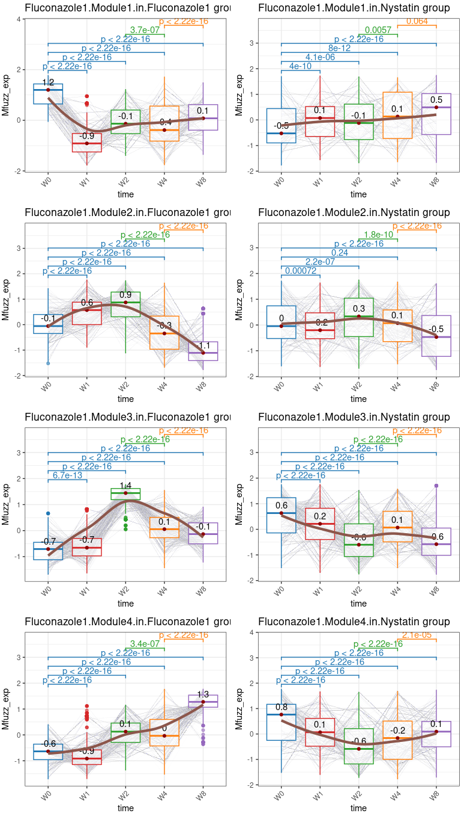

## 3.1.12 Mfuzz Module Heatmap

Draws a ComplexHeatmap of the z-scored Fluconazole metabolite modules across time points (split by module and week) and exports it as `Fig3.1.pdf` plus a module membership table.

~~~R
bb <- colorRampPalette(jdb_palette("brewer_yes"))(101)
col_fun2 = colorRamp2(seq(-2,2, by = (4)/100), bb)
x <- 2
Mfuzz_cluster <- mcreadRDS("./workshop/MMC/sample_info/final_Res/v2/metabolomics.Mfuzz_cluster_metabolomics.v3.rds")
Mfuzz_order <- Mfuzz_cluster[[x]][[4]]
Mfuzz_order$Cluster <- gsub("Clu1","Module1",Mfuzz_order$Cluster)
Mfuzz_order$Cluster <- gsub("Clu2","Module2",Mfuzz_order$Cluster)
Mfuzz_order$Cluster <- gsub("Clu3","Module3",Mfuzz_order$Cluster)
Mfuzz_order$Cluster <- gsub("Clu4","Module4",Mfuzz_order$Cluster)
counts_tmp <- Mfuzz_cluster[[x]][[1]][Mfuzz_order$names,]
Heatmap(counts_tmp, cluster_rows = TRUE, cluster_columns = FALSE, top_annotation = Mfuzz_cluster[[x]][[2]], col = col_fun2, 
show_column_names = TRUE, show_row_names = FALSE,column_title = names(Mfuzz_cluster)[x], row_names_max_width = max_text_width(rownames(counts_tmp), gp = gpar(fontsize = 20)), 
column_split = Mfuzz_cluster[[x]][[3]]$time,row_split = factor(Mfuzz_order$Cluster,levels=c("Module1","Module2","Module3","Module4")), cluster_row_slices = FALSE, use_raster = TRUE, 
row_dend_reorder = TRUE, row_names_gp = gpar(fontsize = c(15)))

pdf("./projects/MMC/Figures/v2_figures/Fig3.1.pdf",width=6,height=10)
Heatmap(counts_tmp, cluster_rows = TRUE, cluster_columns = FALSE, top_annotation = Mfuzz_cluster[[x]][[2]], col = col_fun2, 
show_column_names = TRUE, show_row_names = FALSE,column_title = names(Mfuzz_cluster)[x], row_names_max_width = max_text_width(rownames(counts_tmp), gp = gpar(fontsize = 20)), 
column_split = Mfuzz_cluster[[x]][[3]]$time,row_split = factor(Mfuzz_order$Cluster,levels=c("Module1","Module2","Module3","Module4")), cluster_row_slices = FALSE, use_raster = TRUE, 
row_dend_reorder = TRUE, row_names_gp = gpar(fontsize = c(15)))
dev.off()

write.csv(cbind(Mfuzz_order,counts_tmp),"./projects/MMC/Figures/figures_making/v4/Module_metabolomic_all.csv")
~~~

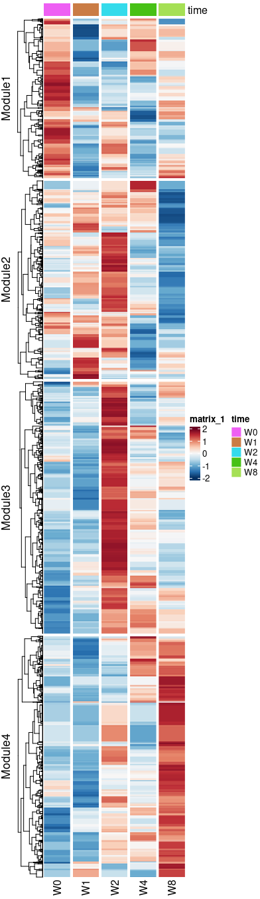

## 3.1.13 SMPDB Pathway Enrichment of Modules

Performs SMPDB pathway over-representation testing (hypergeometric) for each metabolite module, curates anti-inflammatory / pro-inflammatory pathway groups, and renders the enrichment dot plot, exported as `Fig4.Metabolic Enrichment.svg`.

~~~r
library(DESeq2)
library(trqwe)
library(future)
library(future.apply)
options(future.globals.maxSize = 120 * 1024^3)
plan("multicore", workers = 30)
plan()
All.trasnfer.anno <- mcreadRDS("/local/workdir/userdata/xiangyu/workshop/MMC/revision/All.trasnfer.anno.all.rds")
Mfuzz_cluster <- mcreadRDS("/local/workdir/userdata/xiangyu/workshop/MMC/revision/metabolomics.Mfuzz_cluster_metabolomics.v3.rds")
smpdb.all <- mcreadRDS("/local/workdir/userdata/xiangyu/workshop/MMC/smpdb_metabolites.all.rds",mc.cores=20)
uniq_path <- unique(smpdb.all$Pathway.Name)
Flu.Dyn <- Mfuzz_cluster[[2]][[4]]
rownames(Flu.Dyn) <- Flu.Dyn$names
Flu.Dyn$KEGG_ID <- All.trasnfer.anno[rownames(Flu.Dyn),"KEGG_ID"]
Flu.Dyn$HMDB_ID <- All.trasnfer.anno[rownames(Flu.Dyn),"HMDB_ID"]
Flu.Dyn$CHEBI_ID <- All.trasnfer.anno[rownames(Flu.Dyn),"CHEBI_ID"]
Flu.Dyn$Cluster <- gsub("Clu1","Module1",Flu.Dyn$Cluster)
Flu.Dyn$Cluster <- gsub("Clu2","Module2",Flu.Dyn$Cluster)
Flu.Dyn$Cluster <- gsub("Clu3","Module3",Flu.Dyn$Cluster)
Flu.Dyn$Cluster <- gsub("Clu4","Module4",Flu.Dyn$Cluster)
sel_Mod <- c("Module1","Module2","Module3","Module4")
library(stringr)
library(parallel)
enrich_pvalue <- function(N, A, B, k)
{
  require(gmp)
    m <- A + k
    n <- B + k
    i <- k:min(m,n)

    as.numeric( sum(chooseZ(m,i)*chooseZ(N-m,n-i))/chooseZ(N,n) )
}
enriche_KEGG1.total1_res_ <- mclapply(1:length(sel_Mod),function(x) {
    tmp <- Flu.Dyn[Flu.Dyn$Cluster==sel_Mod[x],]
    tmp_res1_ <- mclapply(1:length(uniq_path),function(num) {
        tmp.path <- smpdb.all[smpdb.all$Pathway.Name==uniq_path[num],]
        tmp.path1 <- tmp.path[tmp.path$KEGG.ID %in% setdiff(tmp$KEGG_ID,NA) | tmp.path$HMDB.ID %in% setdiff(tmp$HMDB_ID,NA) | tmp.path$ChEBI.ID %in% setdiff(tmp$CHEBI_ID,NA),]
        inter <- rownames(tmp[tmp$KEGG_ID %in% setdiff(tmp.path1$KEGG.ID,NA) | tmp$HMDB_ID %in% setdiff(tmp.path1$HMDB.ID,NA) | tmp$CHEBI_ID %in% setdiff(tmp.path1$ChEBI.ID,NA),])
        sel_path <- nrow(tmp.path)
        p_value <- enrich_pvalue(10215, nrow(tmp.path),nrow(tmp.path)-nrow(tmp.path1),length(inter))
        tmp_res <- data.frame(pathway_name=uniq_path[num],geneID=str_c(inter,collapse="|"),p_value=p_value,ratio.cluster=length(inter)/nrow(tmp),
            ratio.pathway=length(inter)/nrow(tmp.path),Pathway.Subject=unique(tmp.path$Pathway.Subject))
        tmp_res$Impact <- 100*(tmp_res$ratio.cluster+tmp_res$ratio.pathway)
        tmp_res <- tmp_res[tmp_res$geneID!="",]
        return(tmp_res)
        },mc.cores=20)
    tmp_res1 <- do.call(rbind,tmp_res1_)
    tmp_res1$Cluster <- sel_Mod[x]
    return(tmp_res1)
    },mc.cores=20)
enriche_KEGG1.total1_res <- do.call(rbind,enriche_KEGG1.total1_res_)
enriche_KEGG1.total1_res$log10P<- -log(enriche_KEGG1.total1_res$p_value,10)
enriche_KEGG1.total1_res$Cluster <- factor(enriche_KEGG1.total1_res$Cluster,levels=sel_Mod)
mcsaveRDS(enriche_KEGG1.total1_res,"/local/workdir/userdata/xiangyu/workshop/MMC/revision/cluster_metabolomics.smpdb.enrichment.rds")

enriche_smpdb.total1_res <- mcreadRDS("./workshop/MMC/sample_info/final_Res/v2/cluster_metabolomics.smpdb.enrichment.rds")
enriche_smpdb.total1_res1 <- enriche_smpdb.total1_res[enriche_smpdb.total1_res$p_value < 0.05,]
enriche_smpdb.total1_res1 <- enriche_smpdb.total1_res1[enriche_smpdb.total1_res1$Pathway.Subject=="Metabolic",]
enriche_smpdb.total1_res1 <- enriche_smpdb.total1_res1[-grep("Phosphatidyleth",enriche_smpdb.total1_res1$pathway_name,value=FALSE),]
enriche_smpdb.total1_res1 <- enriche_smpdb.total1_res1[-grep("De Novo ",enriche_smpdb.total1_res1$pathway_name,value=FALSE),]
enriche_smpdb.total1_res1 <- enriche_smpdb.total1_res1[-grep(" PC",enriche_smpdb.total1_res1$pathway_name,value=FALSE),]
enriche_smpdb.total1_res1 <- enriche_smpdb.total1_res1[-grep(" CL",enriche_smpdb.total1_res1$pathway_name,value=FALSE),]
enriche_smpdb.total1_res1 <- enriche_smpdb.total1_res1[order(enriche_smpdb.total1_res1$Impact,decreasing=TRUE),]

enriche_smpdb.total1_res1[grep("Fatty Acid",enriche_smpdb.total1_res1$pathway_name,value=FALSE),]
unique(enriche_smpdb.total1_res1[enriche_smpdb.total1_res1$Cluster=="Module1",]$pathway_name)
unique(enriche_smpdb.total1_res1[enriche_smpdb.total1_res1$Cluster=="Module2",]$pathway_name)
unique(enriche_smpdb.total1_res1[enriche_smpdb.total1_res1$Cluster=="Module3",]$pathway_name)
unique(enriche_smpdb.total1_res1[enriche_smpdb.total1_res1$Cluster=="Module4",]$pathway_name)
anti <- c("Fatty Acid Metabolism","Fatty Acid Biosynthesis",
  "Bile Acid Biosynthesis","Taurine and Hypotaurine Metabolism","Butyrate Metabolism",
  "Tryptophan Metabolism","Nicotinate and Nicotinamide Metabolism",
  "Alpha Linolenic Acid and Linoleic Acid Metabolism","Plasmalogen Synthesis",
  "Mitochondrial Beta-Oxidation of Short Chain Saturated Fatty Acids",
  "Mitochondrial Beta-Oxidation of Long Chain Saturated Fatty Acids",
  "Beta Oxidation of Very Long Chain Fatty Acids","Oxidation of Branched-Chain Fatty Acids",
  "Phytanic Acid Peroxisomal Oxidation","Cysteine Metabolism","Homocysteine Degradation",
  "Glycine and Serine Metabolism","Retinol Metabolism","beta-Alanine Metabolism")
context_anti <- c(
  "Arachidonic Acid Metabolism",
  "Tyrosine Metabolism","Histidine Metabolism","Purine Metabolism",
  "Inositol Metabolism","Inositol Phosphate Metabolism","Steroidogenesis",
  "Androgen and Estrogen Metabolism")
pro_infl <- c(
  "Warburg Effect","Purine Metabolism","Sphingolipid Metabolism",
  "Arginine and Proline Metabolism","Urea Cycle","Ammonia Recycling",
  "Glutamate Metabolism",
  "Amino Sugar Metabolism","Nucleotide Sugars Metabolism",
  "Phosphatidylinositol Phosphate Metabolism",
  "Starch and Sucrose Metabolism","Trehalose Degradation",
  "Galactose Metabolism","Lactose Degradation","Citric Acid Cycle",
  "Pyruvate Metabolism","Transfer of Acetyl Groups into Mitochondria")

Module2 <- enriche_smpdb.total1_res1[enriche_smpdb.total1_res1$Cluster=="Module2" & enriche_smpdb.total1_res1$pathway_name %in% c(anti),]
Module1 <- enriche_smpdb.total1_res1[enriche_smpdb.total1_res1$Cluster=="Module1" & enriche_smpdb.total1_res1$pathway_name %in% c(pro_infl[1:5]),]
Module3 <- enriche_smpdb.total1_res1[enriche_smpdb.total1_res1$Cluster=="Module3" & enriche_smpdb.total1_res1$pathway_name %in% c(anti),]
Module4 <- enriche_smpdb.total1_res1[enriche_smpdb.total1_res1$Cluster=="Module4" & enriche_smpdb.total1_res1$pathway_name %in% c(anti),]
top_terms <- do.call(rbind,list(Module1,Module2,Module3,Module4))
top_terms <- top_terms %>% group_by(Cluster) %>% top_n(5, wt = Impact) %>% ungroup()
# top_terms <- enriche_smpdb.total1_res1 %>% group_by(Cluster) %>% top_n(5, wt = Impact) %>% ungroup()
# top_terms <- enriche_smpdb.total1_res1[enriche_smpdb.total1_res1$pathway_name %in% unique(top_terms1$pathway_name),]
top_terms <- top_terms %>%arrange(Cluster, Impact) %>%
mutate(ordering = factor(pathway_name,levels = unique(pathway_name)[length(unique(pathway_name)):1]))
plot <- ggplot(top_terms, aes(x = Cluster,y = ordering,size = Impact,color = Impact)) +  geom_point() +
scale_color_gradient(low = "blue", high = "red", name = "-log10(p-value)") +scale_size_continuous(name = "Impact") +theme_classic() +
labs(title = "smpdb Metabolic Enrichment",x = "Cluster",y = "Pathway Name") + 
theme(axis.text.x = element_text(angle = 45, hjust = 1, color = "black", family = "Arial"),axis.text.y = element_text(size = 12, color = "black", family = "Arial"))
plot
ggsave("./projects/MMC/Figures/v2_figures/Fig4.Metabolic Enrichment.svg", plot=plot,width = 7, height = 6,dpi=300)
write.csv(top_terms,"./projects/MMC/Figures/figures_making/v4/Metabolites.SMPDB.csv")
~~~

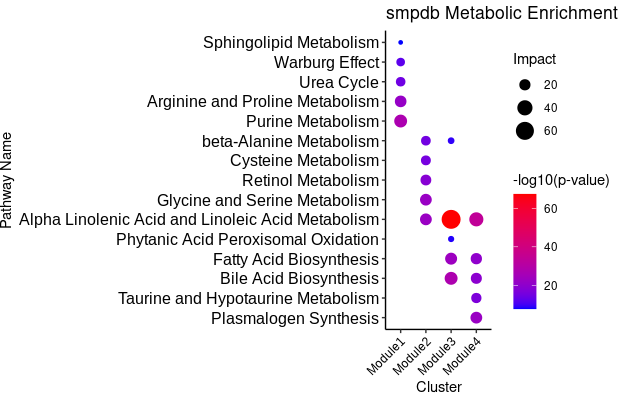

