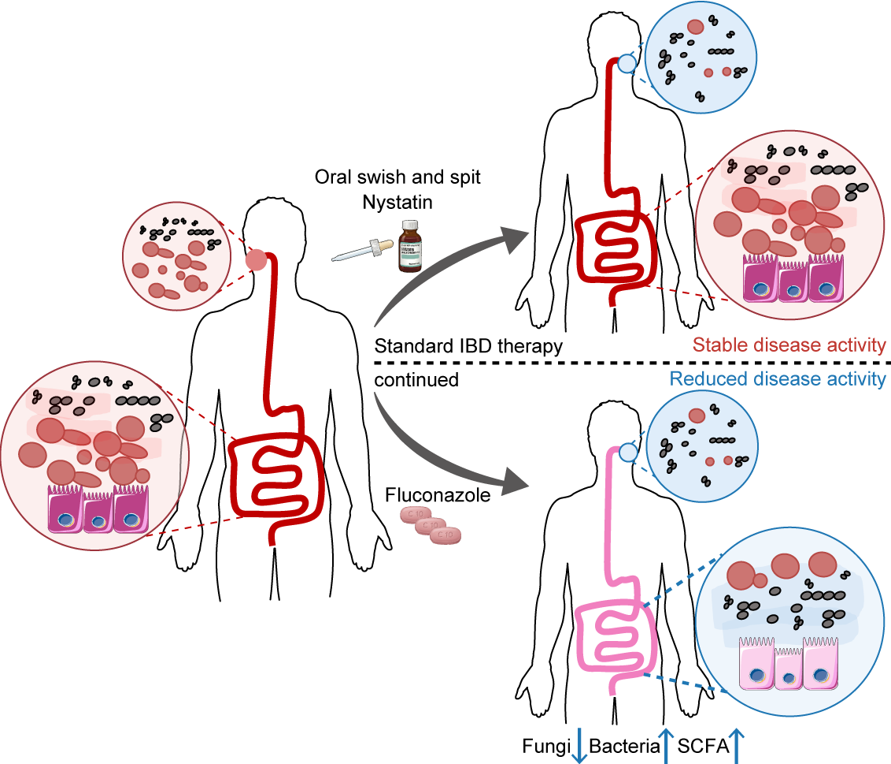

# Antifungal therapy improves microbiome dynamics in Inflammatory Bowel Disease

This is the minimal public analysis code package for the associated manuscript. It is designed for transparent review of the final analysis workflow while avoiding release of controlled clinical metadata, individual-level patient tables, exploratory notebooks, or internal work-in-progress code.

The included R scripts are intentionally compact. They define the public cohort-filtering rules, primary statistical helpers, and final-figure workflow structure without exposing hard-coded patient identifiers or exploratory analysis branches.

## What Is Included

- `analysis_plan.md`: prespecified public analysis scope, cohort rules, statistical approach, and privacy boundaries.
- `data/README.md`: data availability and controlled-data notes.
- `R/00_cohort_definition.R`: cohort filtering and sample-count reporting without hard-coded patient identifiers.
- `R/01_stats_utils.R`: primary statistical helpers for Spearman, linear models, FDR adjustment, and cohort summaries.
- `R/02_final_figure_workflow.R`: final-figure workflow skeleton using the primary analysis path.
- `release_checklist.md`: checks to run before uploading.

## What Is Intentionally Excluded

- Direct identifiers, dates of birth, medical record numbers, contact details, and individual-level clinical metadata.
- Hard-coded patient/sample IDs.
- Exploratory notebooks, abandoned sensitivity checks, and internal debugging output.
- Manual figure-editing files or image-manipulation steps.
- Nonlinear association scans from exploratory work. The public primary workflow uses rank correlation and regression models; any nonlinear sensitivity analysis should be disclosed separately as exploratory if needed.

## Public Data

Raw ITS1 FASTQ files are available from NCBI under [PRJNA1449485](https://dataview.ncbi.nlm.nih.gov/object/PRJNA1449485). Controlled clinical metadata and derived multi-omics objects are not redistributed in this public package and should be requested according to the manuscript data-availability statement and applicable IRB/data-use requirements.

## Reproducibility Notes

The scripts are written to run against de-identified derived analysis tables with stable column names. The public workflow expects the controlled workspace to provide already de-identified metadata and matrices. Each cohort-definition step reports participant/sample counts so reviewers can verify that filtering is rule-based rather than patient-specific.
